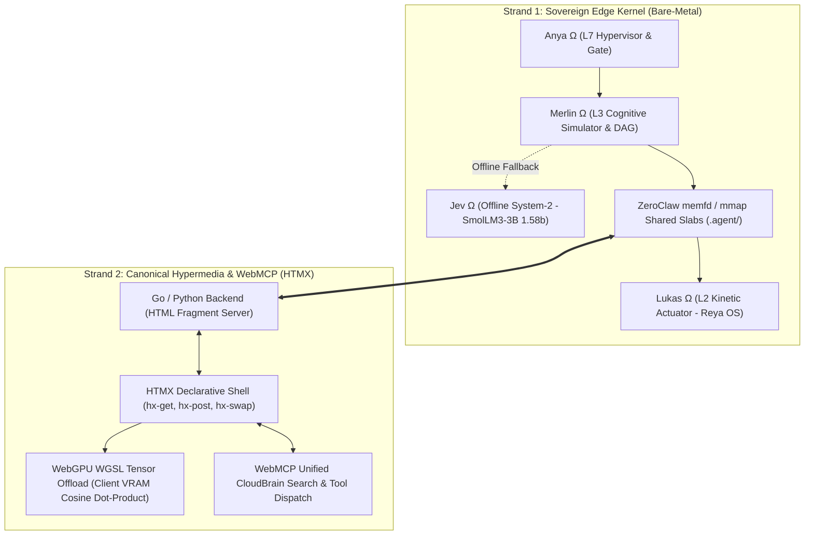

# The Master Architecture (Unified Scaffolding & Canonical 2-Strand HTMX)

---

## 1. Directory Scaffolding & Multi-Tree Topology

The Camelot-OS ecosystem across `C:\Users\vizio\` is unified into a single coherent scaffolding:

| Location | Role in Unified Topology | Governance Policy |
| :--- | :--- | :--- |
| **`C:\Users\vizio\CAMELOT_OS\`** | **Active Kinetic Edge Runtime** (`Cybertronia`) | Primary working tree; 4.0 GB RAM ceiling; 6 `.agent/` IPC slabs; native Rust/Go/Zig toolchains. |
| **`C:\Users\vizio\camelot-wt\trunk\`** | **Sovereign Main Trunk Worktree** | Git worktree tracking `main`; used for clean baseline diffs, formal verification, and release tagging. |
| **`C:\Users\vizio\CAMELOT_DefenseGrid_Quarantine\`** | **Air-Gapped Security Vault** | Isolated quarantine holding tainted telemetry, nemesis logs, and remediation history. |
| **`C:\Users\vizio\.camelot\`** | **Ephemeral Cache & Model Staging** | Local vector indices, PageKeeper cache, and temporary build staging. |

---

## 2. Canonical 2-Strand HTMX Architecture

Aligned with the canonical specification at `https://htmx-docs.vercel.app/`:

### Strand 1: Pure Hypermedia Server (Zero Client JS Bloat)
* The backend (Go `cmd/pulse` / Python `control_plane` / Rust kernel) directly renders lightweight HTML fragments.
* Frontend interactivity uses declarative HTMX attributes:
  - `hx-get="/docs/{doc}" hx-target="#content" hx-push-url="true"`: Instant sub-millisecond document swapping.
  - `hx-post="/api/cloudbrain/search" hx-trigger="keyup changed delay:400ms" hx-target="#search-results"`: Unified local & CloudBrain search.
  - `hx-post="/api/mcp" hx-target="#mcp-stream" hx-swap="innerHTML"`: Direct runic symbolect execution stream.
* **Branding & Theme**: Obsidian Void (`#050505`), Cinzel engraved headers, Luxora Gold (`#D4AF37`) highlights, and JetBrains Mono code blocks.

### Strand 2: Client WebGPU WGSL Tensor Offload
* To guarantee the host machine remains within its **4.0 GB edge RAM ceiling**, vector dot-product and cosine similarity calculations for document search are compiled to native WebGPU compute shaders (`COSINE_SIMILARITY_WGSL`).
* Workgroup size: 64 threads parallelized in client VRAM. Host CPU/RAM usage: **0 MB overhead**.

---

## 3. Septem Regna Bare-Metal Polyglot Mapping (Ω_POLYGLOT_HARDWARE_ASCENSION_v10001)

| Layer | Languages | Domain & Role | Compilation Theory & Mechanics |
| :--- | :--- | :--- | :--- |
| **L1 / L2 Substrate & Kinetic** | **Zig & C++** | ZeroClaw IPC & `bitnet.cpp` | C++ executes raw 1.58-bit ternary matrix additions. Zig manages `memfd_create` IPC slabs with explicit allocators and `comptime` (zero hidden allocations). |
| **L5 Security & Sandboxing** | **Rust** | Aegis Shield & WASM32-WASI | Wraps microVM sandboxes, Kyber-768 post-quantum cryptographic logic, and Z3 theorem validation with compile-time borrow checking. |
| **L4 Transport & Bridge** | **Go** | Bifrost mTLS & Multivoice | Handles thousands of concurrent state-sync events with lightweight goroutines (<12ms latency, WebRTC audio, HTMX SSE). |
| **L3 Cognitive Kernel** | **Mojo** | Control Plane & AI Inference | Eradicates Python GIL; compiles AI inference DAGs and System-2 pipelines down to MLIR with native hardware vectorization. |
| **L7 Ethereal & Acceleration** | **Vulkan / WebGPU** | Ouroboros SSM & 3D HUD | Low-overhead cross-platform GPU compute; accelerates SSM recurrence equations and renders 120fps 3D WorldTree in VRAM with zero host RAM overhead. |

### ⚡ Kinetic Flow DAG
1. `Step_1|LOWER_MEMORY_ARENAS|Zig` ➔ Manage absolute memory limits and ZeroClaw IPC via explicit allocators.
2. `Step_2|TENSOR_COMPUTE|C++` ➔ Execute 1.58-bit ternary matrix additions (`bitnet.cpp`).
3. `Step_3|SECURE_SANDBOXING|Rust` ➔ Compile WASM32-WASI microVMs and execute Z3 theorem validations.
4. `Step_4|CONCURRENT_ROUTING|Go` ➔ Manage Bifrost mTLS, WebSocket telemetry, and multi-agent DAG dispatch via goroutines.
5. `Step_5|AI_ORCHESTRATION|Mojo` ➔ Eradicate Python GIL; compile MLIR pipelines for System-2 cognitive tasks.
6. `Step_6|GPU_ACCELERATION|Vulkan/WebGPU` ➔ Offload SSM recurrence & render 3D WorldTree in VRAM.

---

## 4. Hardware Scarcity Invariants
* **Node RAM Ceiling**: 4096 MB (Cybertronia Edge Node / Cleveland Anchor).
* **Active Working Set Floor**: $<480$ MB.
* **Heaviside GC Trigger**: $GC_{trigger} = \mathcal{H}(U_{RAM} - 3.6\text{ GB})$ (flushes cold pages to NVMe).
