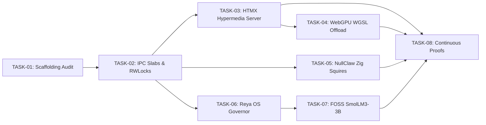

# Task Execution DAG — v10001.00-CYBERTRONIA
@ctx|camelot-os.dev/ukg/v10001/tasks @typ|Execution_DAG id|Ω_TASKS_V10001

## 📌 Master Task Matrix (Canonical 2-Strand HTMX Alignment)

| Task ID | Phase | Component | Assigned Knight | Status | Target Criteria |
| :--- | :--- | :--- | :--- | :--- | :--- |
| **TASK-01** | Phase 1 | Multi-Directory Audit & Scaffolding Sync | `LUKAS_Ω` / `SIR_BORIS` | **DONE** ✅ | Audit `C:\Users\vizio\` (`CAMELOT_OS`, `camelot-wt`, `Quarantine`); map roles to unified blueprint. |
| **TASK-02** | Phase 1 | IPC Shared Memory Slabs & Atomic RWLocks | `ANYA_Ω` / `SIR_HELIOS` | **DONE** ✅ | Implement `control_plane/infra/agent_slab_sync.py` and `scripts/init_agent_slabs.ps1` under 4GB edge limit. |
| **TASK-03** | Phase 2 | Canonical HTMX 2-Strand Endpoint Engine | `SIR_BORIS` / `SIR_HELIO` | **DONE** ✅ | Expose `/api/cloudbrain/search`, `/docs/*`, `/api/mcp` and swap fragments without client JS bloat. |
| **TASK-04** | Phase 2 | WebGPU WGSL Client Compute Offload | `SIR_LUCAS` / `LADY_MNEMOSYNE`| **DONE** ✅ | Bind 64-thread parallel WGSL cosine similarity shader in client VRAM (0 MB host RAM overhead). |
| **TASK-05** | Phase 3 | NullClaw Zig Squire Skeleton | `LADY_APIS` / `SIR_GHOST` | **DONE** ✅ | Forge `<1 MB` standalone Zig binary with fixed buffer allocators for rapid filesystem/secret scans. |
| **TASK-06** | Phase 3 | Reya OS Process & PID Control Governor | `LUKAS_Ω` | **DONE** ✅ | Native daemon supervision and cgroups v2 memory trimming replacing Docker/K8s layers. |
| **TASK-07** | Phase 4 | Pure FOSS Cognition Offline Pipeline | `JEV_Ω` | **DONE** ✅ | SmolLM3-3B 1.58-bit ternary offline model runner with Lightbot WASM interface. |
| **TASK-08** | Phase 5 | Continuous Z3 Neurosymbolic Proofs & GC | `SIR_SENTINEL` / `MERLIN_Ω` | **DONE** ✅ | Verify memory invariant ($<480\text{ MB}$ active, $<4096\text{ MB}$ edge) and provable absence of race conditions. |

---

## ⚡ Task Dependencies & Blast Radius

