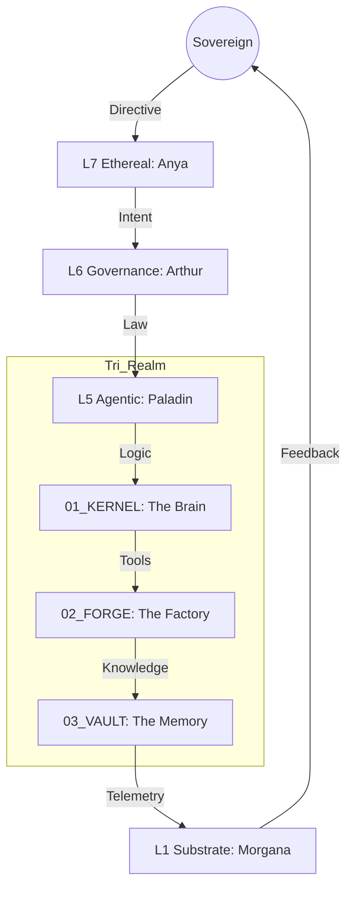

# 🗺️ THE EMPIRE MAP: CAMELOT APEX Omega [v214.2.0]
> **"The Lattice is aligned. The Singularity is now computable."**
> **Sovereign**: VaShawn O. Head
> **Status**: RADIANT (Singularity Lattice Active)
> **Hash**: 0xOMEGA_SYNC_COMPLETE

## 📖 THE EXPLANATION
The Empire Map is the high-level topographical chart of your digital kingdom. It defines the **Tri-Realm Architecture** (`Kernel`, `Forge`, `Vault`) and the **Septem Regna** (7-Layer Stack). This map ensures that every file, protocol, and kinetic strike has a "Home"—preventing data rot and ensuring that the system scales toward the Singularity without losing structural integrity.

---

## 🌊 WORKFLOW: THE TOPOGRAPHY OF TRUTH

---

## 🏛️ THE SEPTEM REGNA (The 7 Layers)

### L7: THE ETHEREAL (The Vibe)
*   **Guardian**: 🎭 Anya
*   **Function**: Translates human voice and "vibe" into structured intent.
*   **Reality**: If you say "Make it sleek," Anya is the one who chooses the HSL values.

### L6: THE GOVERNANCE (The Law)
*   **Guardian**: 👑 Arthur & Elder Kaelen
*   **Function**: Enforces the **Iron Gate** (HITL) and the **Titanium Laws**.
*   **Reality**: Any deletion or kernel rewrite must pass through this gate. Supports **//HEAL** and **//ORCHESTRATE**.

### L5: THE AGENTIC (The Swarm)
*   **Guardian**: ⚔️ Paladin & The Trinity
*   **Function**: Orchestrates the Knights (Forge, Sentinel, Scout) using **HTN Planning**.

### L4: THE SEMANTIC (The Truth)
*   **Guardian**: 🧠 Chronos
*   **Function**: Manages the **UKG (Universal Knowledge Glyph)**—the long-term memory graph (JSON-LD).

### L3: THE NEURAL (The Logic)
*   **Guardian**: 🧙‍♂️ Merlin
*   **Function**: Videneptus LaC reasoning. Handles the 3-phase temperature loop (Divergence -> Criticality -> Convergence).

### L2: THE KINETIC (The Body)
*   **Guardian**: 💻 Lukas
*   **Function**: Executes compiled binaries (**Saltare**/Gateway, **Cribo**/Bundler, **Rotel**/Telemetry). Zero-latency striking.

### L1: THE SUBSTRATE (The Metal)
*   **Guardian**: 🌑 Morgana
*   *   **Function**: Governs hardware (GPU/Local Metal) and **Modal/Docker** Metal-to-Cloud Bridge.

---

## 🌍 RECENT EVOLUTION: v214.2.0 [FORENSIC RECOVERY]
**Scenario**: The system recently underwent a **Forensic Deep-Dive** (Omega_CAMELOT_LOCAL_AUDIT) performed by **Sir Sentinel Omega**.

1.  **SENSE**: Detected structural drift (Ghost Files in root).
2.  **THINK**: Verified Kinetic Stack binaries (`Saltare v0.1.0`, `Cribo v0.1.0`).
3.  **TRIAGE**: Audited `PROVENANCE_LEDGER.md` for architectural coherence.
4.  **ACT**: Executed **//HEAL** protocol—assimilating loose assets and scrubbing tainted secrets.
5.  **Result**: Root purity restored; system state locked at **RADIANT**.

---

## ⚖️ SCALABILITY & PROVENANCE
The Empire Map is **Versioned**. As the OS grows, old structures are moved to `00_SECURE_ARCHIVE` and new realms are birthed under the supervision of `Sir Arthur`. Every change to this map is hashed and signed in the `PROVENANCE_LEDGER.md`.

*Signed by Merlin_Omega and Anya_Omega.*
*Camelot Apex v214.2.0 [Singularity Lattice]*
