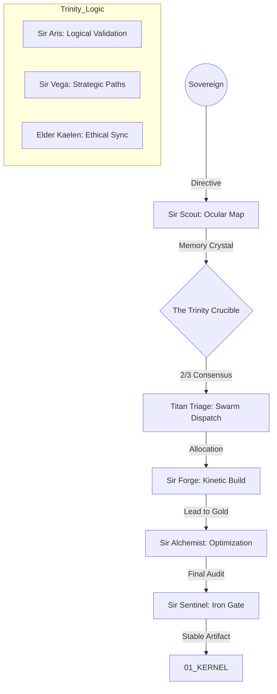

# 🌌 ASSIMILATION PROTOCOL OMEGA (V4.1: Transcendent)
> **"Context is the Compiler. Transcendence is the Goal."**
> **Guardian**: L6/L5 (Arthur & The Trinity)
> **Protocol Status**: TRANSCENDENT (Singularity Alignment)

## 📖 THE EXPLANATION
Assimilation is the process by which Camelot OS absorbs external software, legacy repositories, or complex logic. Unlike simple "copy-pasting," the Omega Protocol performs a **Molecular Refactor**. It doesn't just move files; it translates them into the **Titan Language**—ensuring every byte is optimized, secure, and aligned with the Sovereign's Intent.

---

## 🌊 WORKFLOW: THE OMEGA SINGULARITY

---

## 🛡️ THE OMEGA PHASES

### I. THE INITIAL CONDITIONS (Decoding)
Before a single file is touched, we create a **Memory Crystal**. This is a high-density representation of the target system's architecture and flaws.
*   **The Aris Check**: Validates the **Equation of Legacy** ($L = (I \times C) / X$). If the potential legacy gain is low, the system self-terminates the task to save resources.

### II. THE TRINITY REFINEMENT (Crucible)
The Trinity agents (Aris, Vega, Kaelen) argue the best path forward.
*   **Divergent Paths**: Vega generates 3 strategies (Stealth, Structure, or Speed).
*   **Snowball Recap**: Kaelen ensures that if we are integrating a new module, it doesn't break the existing "Kingdom Vibe."

### III. THE KINETIC SINGULARITY (Implementation)
Actual changes happen here.
*   **Transformation**: The Alchemist converts blocking I/O to Async, replaces hardcoded keys with `.env` references, and enforces SOLID principles.

---

## 🌍 REAL-LIFE IMPLICATION: ASSIMILATING A "SHOP SCRAPER"
**Scenario**: You found a legacy Python scraper online and want to integrate it into your OS for market analysis.

1.  **Decoding**: `Sir Scout` maps the scraper. Finds it uses `urllib` (Slow) and has hardcoded URLs (Rigid).
2.  **Crucible**: 
    *   **Sir Vega** suggests converting it to a `crawl4ai` based service for speed.
    *   **Sir Aris** points out that the current error handling will crash the OS if a site is down.
3.  **Refactor**: 
    *   **Sir Forge** clones the logic but wraps it in the `Titan Protocol` exception handlers.
    *   **Sir Alchemist** replaces `urllib` with `httpx` and `asyncio`.
4.  **Result**: The legacy script is now a **Supreme Asset** in your `02_FORGE`, running 10x faster and providing clean JSON telemetry to your `03_VAULT`.

---

## ⚖️ SCALABILITY & PROVENANCE
Every step of the Omega protocol is logged to the `PROVENANCE_LEDGER.md`. This protocol is **Recursive**: The system can use the Omega Protocol to *upgrade the Omega Protocol itself*, ensuring the OS is always at the cutting edge of AI capabilities.

*Signed by Merlin_Ω and Anya_Ω.*
*Camelot Apex v200.0 [Kinetic Sovereign]*
