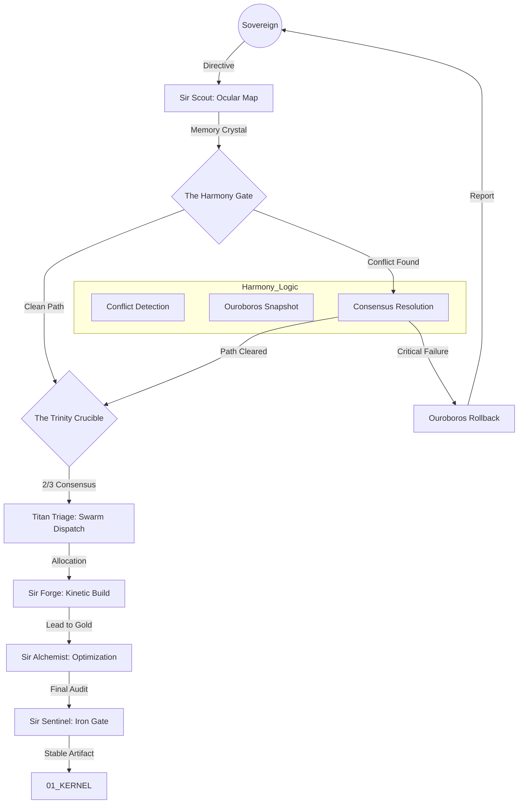

# 🌌 ASSIMILATION PROTOCOL V5: EVOLUTION (The Harmony Update)
> **"Chaos is Data without Context. Harmony is Data with Purpose."**
> **Guardian**: L6/L5 (Arthur & The Trinity)
> **Protocol Status**: EVOLUTIONARY (Self-Correcting)

## 📖 THE UPGRADE
Protocol V4 established the "Molecular Refactor." V5 introduces **Self-Preservation** and **Conflict Harmony**. We no longer just "overwrite" or "force" assimilation; we first **Resonate** with the existing environment to ensure we don't break the Lattice.

---

## 🌊 WORKFLOW: THE HARMONY LOOP

---

## 🛡️ THE NEW PHASES

### I. THE INITIAL CONDITIONS (Decoding)
*   **Memory Crystal**: High-density representation of target.
*   **The Aris Check**: Validates $L = (I \times C) / X$.

### II. THE HARMONY GATE (New)
Before Trinity debate, we perform a **Kinetic Reality Check**:
1.  **Path Resonance**: Does the target directory already exist?
2.  **Name Collision**: Is there a registered extension with this ID?
3.  **Dependency Web**: Will installing this break `npm` or `pip` trees?

*   **Action**: If conflict detected -> **Auto-Negotiate** (Rename, Backup, or Abort).

### III. THE OUROBOROS SNAPSHOT (New)
If Harmony passes but risk is non-zero:
*   Create a localized **Time Capsule** (Snapshot of touched files).
*   If Assimilation fails mid-process, **Auto-Revert** to this capsule instantly.

### IV. THE TRINITY REFINEMENT (Crucible)
*   **Vega**: Strategic Paths (Stealth/Structure/Speed).
*   **Kaelen**: Ethical Sync ("Kingdom Vibe").

### V. THE KINETIC SINGULARITY (Implementation)
*   **Alchemist**: Convert I/O to Async, enforce SOLID.

---

## 🌍 REAL-LIFE IMPLICATION: THE "GEMINI FLOW" INCIDENT
**Scenario**: Attempting to install `gemini-flow` extension when a `gemini-extension` folder already exists and is registered.

1.  **Harmony Gate**: Detects `gemini-extension` folder exists.
2.  **Conflict**: "Collision detected. Target `gemini-flow` creates ambiguity with existing `gemini-extension`."
3.  **Resolution**: 
    *   *Option A*: Rename existing to `gemini-extension.bak`.
    *   *Option B*: Uninstall old extension first.
    *   *Option C*: Abort and ask Sovereign.
4.  **Action**: System chooses Option B (Cleanup), then proceeds to Trinity.

---

## ⚖️ SCALABILITY & PROVENANCE
The **Harmony Gate** ensures that as the OS grows, it doesn't trip over its own shoelaces. Every conflict and resolution is logged to `PROVENANCE_LEDGER.md` with the tag `[⚖️Harmony]`.

*Signed by Merlin_Ω, Anya_Ω, and The Architect.*
*Camelot Apex v201.0 [Evolutionary Sovereign]*
