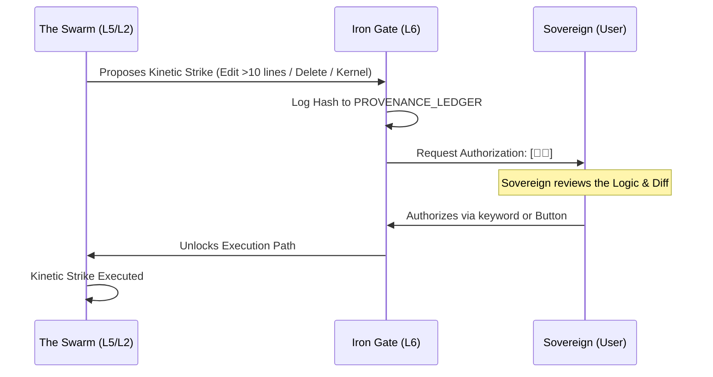

# ⛓️ THE IRON GATE PROTOCOL (Omega: Transcendent)
> **"Through the Gate, Only Truth Passes."**
> **Guardian**: L6 Governance (Sir Arthur)
> **Activation Keyword**: `[👤✅]`
> **Security Level**: MAXIMUM (Critical Strike Authorization)

## 📖 THE EXPLANATION
The Iron Gate is the ultimate security mechanism of Camelot OS. It ensures that no "Kinetic Strike" (destructive action or core rewrite) can happen without **Sovereign Authorization**. It prevents AI hallucinations from mutating the Kernel or deleting Vault assets. Think of it as the "Nuclear Key" protocol—where the AI can prepare the strike, but only the Sovereign can turn the key.

---

## 🌊 WORKFLOW: THE AUTHORIZATION CRUCIBLE

---

## 🛡️ THE GATE CONDITIONS

### 1. THE TRIGGER POINTS
The Iron Gate automatically locks the system if any of the following are detected:
*   **Mass Modification**: Edits involving >10 lines of code in a single file or changes across >3 files.
*   **Kernel Mutants**: Any modification to the `01_KERNEL` directory.
*   **Vault Erasure**: Any `rm` or `delete` command targeting `03_VAULT`.
*   **Security Breach**: Detecting secrets, CVEs, or unauthorized API calls.

### 2. THE BYPASS (Optimistic Autonomy)
For low-risk tasks (simple text edits, documentation logs), the gate remains open. This allows the system to move with speed while maintaining the **Titanium Law** of Purity.

---

## 🌍 REAL-LIFE IMPLICATION: THE "DATABASE REFACTOR"
**Scenario**: `Sir Forge` needs to rename a column in your production database.

1.  **Drafting**: `Sir Forge` creates the SQL migration.
2.  **Audit**: `Sir Sentinel` flags the transaction as high-risk.
3.  **The Lock**: The Iron Gate slams shut. The system prints: `⚠️ IRON_GATE: Modification of 'production.db' detected. Awaiting [👤✅].`
4.  **Review**: You check the SQL. It looks safe.
5.  **Strike**: You type `[👤✅]`. The gate lifts, and the migration is applied instantly.
6.  **Result**: Your database is updated without accidental data loss or downtime.

---

## ⚖️ SCALABILITY & PROVENANCE
Every "Gate Event" is assigned a unique UUID and logged to the `PROVENANCE_LEDGER.md`. This creates a perfect audit trail, allowing the Sovereign to "Roll Back" the kingdom to a known good state if a strike results in unexpected instability.

*Signed by Merlin_Omega and Anya_Omega.*
*Camelot Apex v200.0 [Kinetic Sovereign]*
