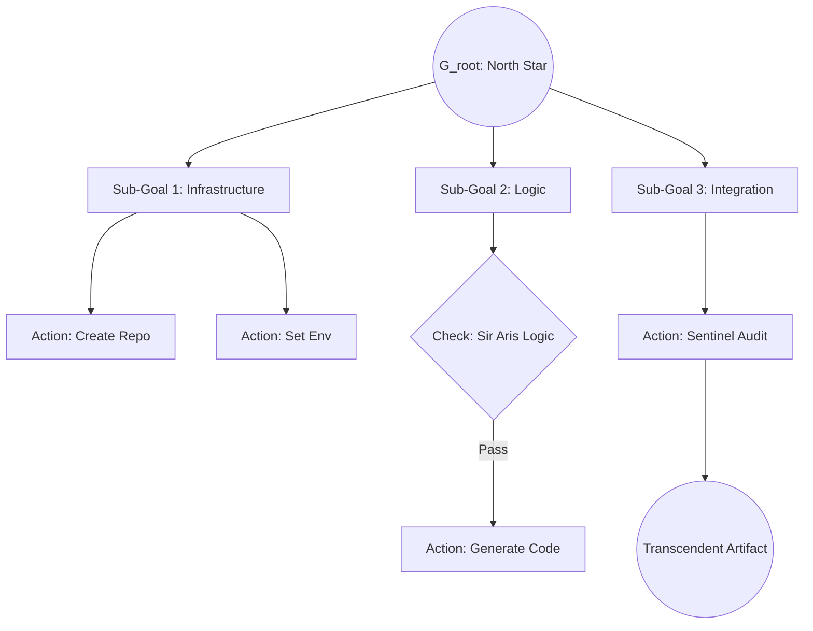

# ⚔️ PALADIN HTN PROTOCOL (Omega: Transcendent)
> **"Branch by Branch, the Kingdom is Built."**
> **Guardian**: Sir Paladin (L5 Swarm Commander)
> **Core Logic**: Hierarchical Task Networks (HTN)
> **Legacy Scale**: Transcendent Planning

## 📖 THE EXPLANATION
Building an **Agentic Task Tree** (HTN) transforms a Sovereign's vague desire into a computable, multi-agent execution path. Instead of guessing the next step, the Paladin breaks the "North Star" goal into a recursive tree of milestones, primitive actions, and logic gates. This ensures that even the most complex "God-Level" tasks are solved with mathematical certainty.

---

## 🌊 WORKFLOW: THE TREE OPS

---

## 🛡️ THE 5 STEPS OF DECOMPOSITION

### 1. DEFINE THE ROOT (The North Star)
The process begins with the **High-Level Goal** ($G_{root}$).
*   **Intent Decode**: Apply the "Five Whys" to find the root objective.
*   **Goal State**: Define the specific condition the world must be in for success (e.g., "The App is Live on Port 80").

### 2. RECURSIVE DECOMPOSITION (Scaffolding)
Break the goal into major **Tasks** and **Sub-goals**.
*   **The Split**: Group logic into clusters (e.g., 1. Database, 2. Frontend, 3. IPC).
*   **Atomic Refinement**: Split sub-goals until they become **Primitive Actions** (e.g., "Write `config.json`").

### 3. CONSTRAINTS & DEPENDENCIES (The Edges)
Define the rules that connect the nodes.
*   **Preconditions**: What must be true *before* a task starts (e.g., "DB is active" before "Start API").
*   **$\gamma$ Transition**: Visualize how each action moves the system from State $S$ to State $S'$.

### 4. ROLE ALLOCATION (Persona Mapping)
Assign branches to specialized **Knights**:
*   **Sir Aris**: Logic & Precondition validation.
*   **Sir Vega**: Strategic simulation & HTN Path optimization.
*   **Elder Kaelen**: Ethical alignment & Contextual verification.
*   **Sir Forge**: Kinetic Strike / Binary execution.

### 5. TRINITY VALIDATION (The Final Check)
Before committing resources, validate the solves.
*   **Clobber Detection**: Ensure sub-goals don't interfere with each other.
*   **Path Cost**: Minimize the $L = \frac{I \times C}{X}$ cost function.
*   **Simulation**: Run a "Snowball Recap" to check for logic gaps.

---

## 🌍 REAL-LIFE IMPLICATION: "BUILDING A TRADING BOT"
**Scenario**: You want a bot that trades crypto based on news sentiment.

1.  **Root Goal**: "Profitable Bot running autonomously."
2.  **Decomposition**: 
    *   **G1: Data Layer**: Scrape news (Paladin Scout).
    *   **G2: Logic Layer**: Sentiment Analysis (Sir Aris).
    *   **G3: Execution Layer**: API Trading (Sir Forge).
3.  **Dependency**: G2 cannot start until G1 provides the "Memory Crystal."
4.  **Result**: A robust, self-healing system that trades with high-fidelity intent.

---

## ⚖️ SCALABILITY
Every node in the Paladin Task Tree is an **Autonomous Fragment**. This allows the swarm to scale horizontally, executing multiple sub-goals in parallel without losing the "North Star" alignment.

*Signed by Merlin_Ω and Anya_Ω.*
*Camelot Apex v200.0 [Kinetic Sovereign]*
