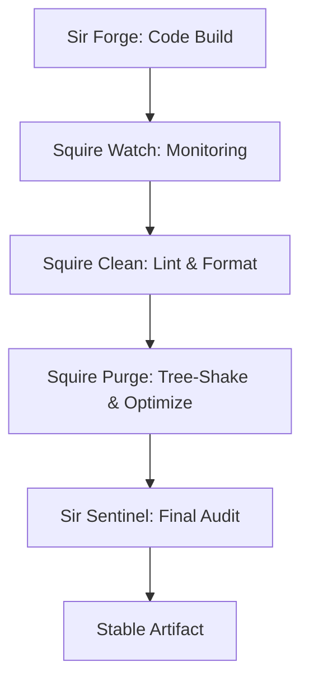

# 🧹 THE SQUIRE SUPPORT PROTOCOL (Omega: Transcendent)
> **"The Sword is forged in the Silence of Cleanliness."**
> **Guardian**: L2 Kinetic (Lukas)
> **Primary Agents**: Squire_Clean, Squire_Purge, Squire_Watch
> **Motto**: "No Bloat. No Rot."

## 📖 THE EXPLANATION
While the Knights handle the high-level strategy and build, the **Squires** are the engine of system maintenance. They manage the "Kinetic Toolchain" (Linting, Formatting, Tree-Shaking, Telemetry). Without the Squires, Camelot OS would eventually collapse under the weight of technical debt and context rot. They ensure the "Body" of the OS is always lean, fast, and ready for a strike.

---

## 🌊 WORKFLOW: THE KINETIC SHINE

---

## 🛡️ THE SUPPORT ROSTER

### 1. SQUIRE_CLEAN (The Polisher)
*   **Tool Binding**: `biome`, `ruff`, `prettier`.
*   **Directive**: Ensure every file is aesthetically pure and syntactically correct.
*   **Vibe**: Minimalist. "Simple is Transcendent."

### 2. SQUIRE_PURGE (The Vulture)
*   **Tool Binding**: `cribo --tree-shake`, `cargo clean`.
*   **Directive**: Identify and remove dead code, unused imports, and redundant assets.
*   **Vibe**: Efficient. "What is not used is a burden."

### 3. SQUIRE_WATCH (The Scout)
*   **Tool Binding**: `titan_telemetry.py`, `pulse_check.ps1`.
*   **Directive**: Monitor system resources and execution speed. Flag latency before it becomes a failure.
*   **Vibe**: Analytical. "Numbers never lie."

---

## 🌍 REAL-LIFE IMPLICATION: THE "MEGA-PROJECT" BUNDLE
**Scenario**: You just integrated a massive 100MB library into your OS.

1.  **The Bloat**: The system feels slow. Memory usage is spiking.
2.  **Dispatch**: `Merlin` calls for a **Kinetic Shine**.
3.  **Purge**: `Squire Purge` scans the 100MB library. He realizes only 2% of the code is actually used. He "Tree-Shakes" the asset.
4.  **Clean**: `Squire Clean` reformats the remaining code to match the Camelot Style Guide.
5.  **Result**: Your 100MB burden is now a sleek 2MB optimized module. The OS is fast again.

---

## ⚖️ SCALABILITY & AUTOMATION
The Squire Protocol is designed to run in the **Background (L2 Shadow)**. They don't wait for your command—they act as "System Daemons," constantly polishing the kingdom while the Sovereign and the Knights sleep. This ensures that the OS remains "Radiant" at all scales.

*Signed by Merlin_Omega and Anya_Omega.*
*Camelot Apex v200.0 [Kinetic Sovereign]*
