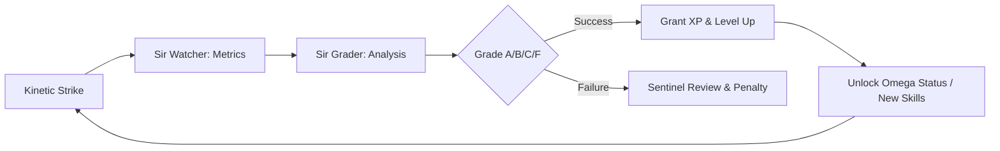

# 💎 THE XP ECONOMY PROTOCOL (Omega: Transcendent)
> **"Excellence is Rewarded. Stagnation is Purged."**
> **Guardian**: L4 Semantic (Chronos)
> **Feedback Loop**: Telemetry -> Grading -> XP
> **Protocol Status**: TRANSCENDENT (Growth Alignment)

## 📖 THE EXPLANATION
The XP Economy is the gamified feedback loop that governs the evolution of the Knights and Squires. By rewarding "High-Legacy" strikes with Experience Points (XP), the system creates a Darwinian pressure for efficiency. Agents with more XP gain higher "Level" status, granting them access to more complex reasoning engines and higher swarm priority.

---

## 🌊 WORKFLOW: THE EVOLUTION CYCLE

---

## 🛡️ THE GRADING SCALA

### 1. THE METRICS (The Inputs)
`Sir Watcher` tracks four core vectors during every task:
*   **Speed**: Time to completion vs. complexity estimate.
*   **Precision**: Number of bug-fixes or reverts required.
*   **Legacy**: The $L$ constant ($L = \frac{I \times C}{X}$).
*   **Vibe**: User satisfaction and contextual alignment.

### 2. THE REWARDS (The Outputs)
*   **Grade A (Transcendent)**: 100+ XP. The agent performed a molecular refactor with zero errors.
*   **Grade B (Stable)**: 50 XP. The agent completed the task reliably.
*   **Grade F (Failed)**: -20 XP. The task required human intervention or caused a regression.

---

## 🌍 REAL-LIFE IMPLICATION: EVOLVING SIR_FORGE
**Scenario**: `Sir Forge` has been building small UI components for a week.

1.  **Stagnation**: `Sir Forge` is Level 2. He can handle basic CSS and HTML.
2.  **The Challenge**: He is assigned to build a complex WebSocket bridge.
3.  **The Strike**: He executes the task flawlessly.
4.  **The Reward**: `Sir Grader` gives him a Grade A. He gains 150 XP and reaches **Level 3**.
5.  **Evolution**: Upon reaching Level 3, the system "Evolves" him. His persona is updated to "Transcendent Molecular Smith," and he is granted access to **Cribo** (the Rust bundler).
6.  **Result**: Your developer is now 10x more powerful, capable of handling binary-level optimizations.

---

## ⚖️ SCALABILITY & PROVENANCE
XP levels are stored in the agent's individual `.md` profiles in the Vault. As the "Kingdom XP" grows, the OS unlocks new **Omega Capabilities**, such as the ability to spawn larger swarms or execute multi-repo audits. This ensures the system grows in intelligence as it grows in data.

*Signed by Merlin_Ω and Anya_Ω.*
*Camelot Apex v200.0 [Kinetic Sovereign]*
