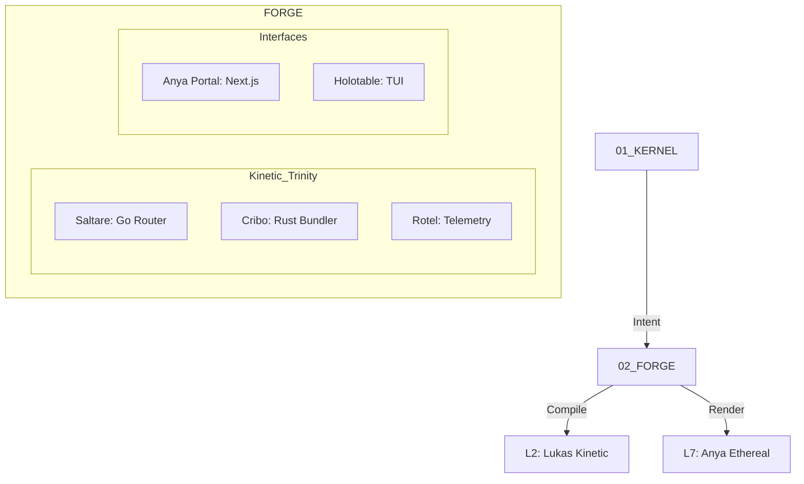

# ⚒️ ARCHITECTURE: 02_FORGE (The Factory)
**[GUARDIAN]:** Lukas (L2 Kinetic) & Anya (L7 Ethereal)
**[STATUS]:** KINETIC_DOMINANCE

## System Topology
The Forge is the kinetic heart of Camelot OS. It transmutes neural intent from the Kernel into high-performance binaries and radiant user interfaces.

## Core Components

### 1. L2: Lukas Kinetic Layer
- **Role:** High-performance systems engineering and binary execution.
- **Tech:** Rust (Cribo/Rotel), Go (Saltare), C++.
- **Mantra:** "Zero Latency. Zero Hallucination."

### 2. L7: Anya Ethereal Layer
- **Role:** The sentient interface and human-to-OS bridge.
- **Tech:** Next.js, React, Tailwind CSS v4, Framer Motion.
- **Mantra:** "Sleek. Fast. Sentient."

### 3. The Kinetic Trinity
- **Saltare:** Managing all tool routing and external MCP connections.
- **Cribo:** Compressing context trees for infinite reasoning depth.
- **Rotel:** Continuous observability and performance tracing.

---
> *Generated by Lukas_Omega & Anya_Omega - 2026-02-11*

