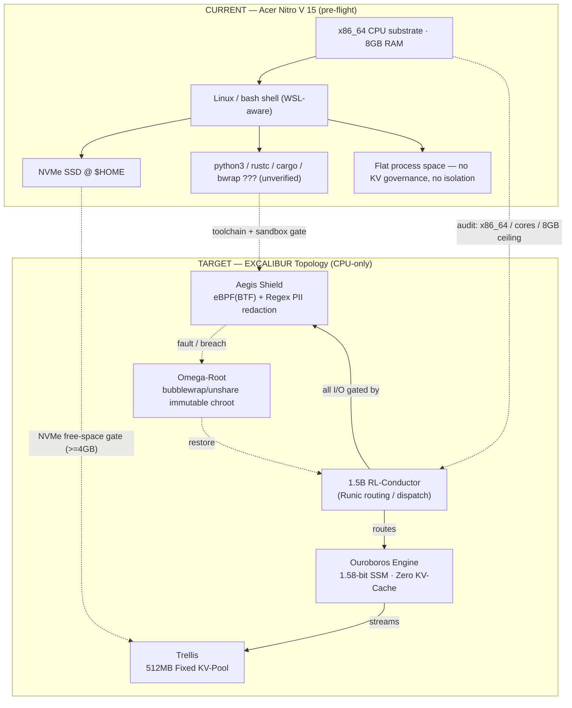

# EXCALIBUR v1000.0.0 — Topological Map :: PROFILE nitro-v15-cpu
> PRD 1 :: SIR HELIO :: CURRENT Acer Nitro V 15 substrate vs TARGET EXCALIBUR topology

## Component → Pre-flight Gate Mapping (nitro-v15-cpu)
| EXCALIBUR Component | Physical Law | Audited By |
|---|---|---|
| 1.5B RL-Conductor | `uname -m == x86_64`, cores > 0 | Codex → Boris |
| Ouroboros (1.58-bit SSM, Zero KV) | MemAvailable ≥ 1712MB headroom | Codex → Boris |
| Trellis 512MB Fixed KV-Pool | avail RAM reserves 512MB | Boris |
| Aegis Shield (eBPF/Regex PII) | `/sys/kernel/btf/vmlinux` + sandbox primitive | Boris (eBPF=soft) |
| Omega-Root (immutable chroot) | NVMe free ≥ 4096MB + bwrap/proot/unshare | Boris |
