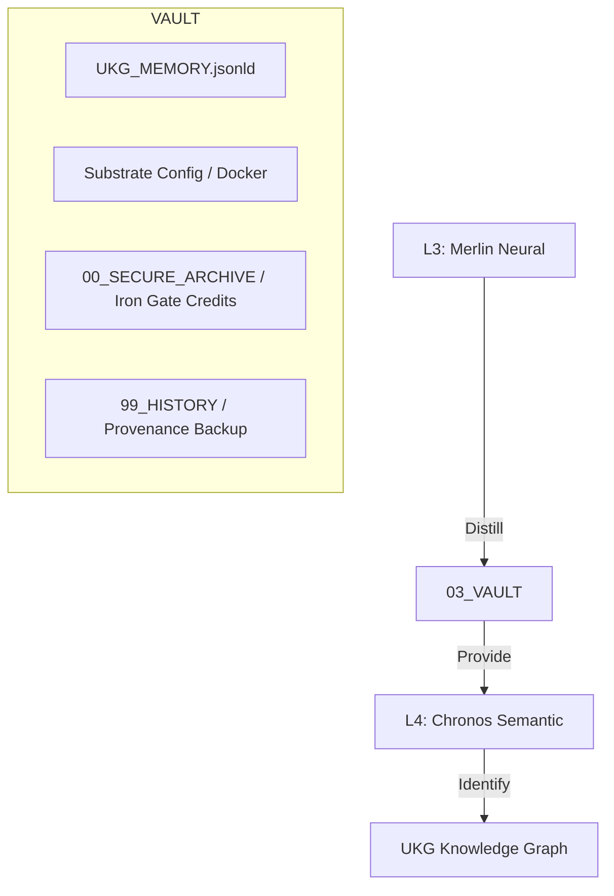

# 🧠 ARCHITECTURE: 03_VAULT (The Memory)
**[GUARDIAN]:** Chronos (L4 Semantic) & Morgana (L1 Substrate)
**[STATUS]:** SOVEREIGN_PERSISTENCE

## System Topology
The Vault is the immutable memory of the Singularity Lattice. It ensures that every logic state, truth node, and kinetic record is preserved with absolute integrity.

## Core Components

### 1. L4: Chronos Semantic Layer
- **Universal Knowledge Glyph (UKG):** The graph-first autonomous memory engine.
- **Truth Preservation:** All system "Truths" are hashed and anchored here.

### 2. L1: Morgana Substrate Layer
- **Hardware Bridge:** Modal/Docker metal configuration and resource scaling logic.
- **Data Persistence:** The physical substrate mapping for high-throughput I/O.

### 3. The Iron Vault (00_SECURE_ARCHIVE)
- **Role:** Digital Fort Knox overseen by Arthur (L6).
- **Content:** Quarantined secrets, encrypted keys, and forensic session logs.

---
> *Generated by Chronos_Omega - 2026-02-11*

