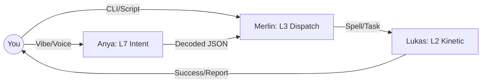

# 🏰 CAMELOT OS: CONTROL SCHEMATIC (Omega)
> **"The Lattice is aligned. You hold the Throne."**

## 📖 THE EXPLANATION
The Control Schematic is your user-facing map of the Camelot OS. While the Kernel handles the complex logic, the Schematic ensures you can command the system with absolute clarity. It translates the 7-layer stack into 3 simple interaction modes: **Visual**, **Command**, and **Strike**.

---

## 🌊 WORKFLOW: THE COMMAND FLOW

---

## 🎨 1. THE VISUAL INTERFACE (Anya: L7)
Best for: High-level creative work and "Vibe" alignment.
**Tool**: `Anya Dashboard / Dev-Portal`
*   **The Voice**: Simply speak or type your intent. Anya uses the **Manifest V3 Content Sentry** to ensure your commands are safe and lossless.
*   **The HUD**: Real-time status of the Swarm (Knights) and kinetic logs.
*   **The Vault**: Browse knowledge items and research reports generated by the swarm.

## 🧙‍♂️ 2. THE COMMAND DISPATCH (Merlin: L3)
Best for: Precise engineering and system maintenance.
**Tool**: `merlin_dispatch.py` (The CLI)
*   **Spells (Aliases)**: 
    *   **`up`**: Upgrade Knights to the latest Omega protocol.
    *   **`report`**: View the Knight efficiency grades (Sovereign Report Card).
    *   **`xp`**: Reward your agents for good work manually.
    *   **`loom`**: Set off long-running automations.

## ⚡ 3. THE QUICK STRIKE (Lukas: L2)
Best for: Instant execution and binary performance.
**Tool**: `camelot.ps1` (The Master Command)
*   **Action**: Run `./camelot.ps1` in the root for a unified control plane.
*   **Cribo**: Use the `cribo` binary for instant context compression and bundling.

---

## 🌍 REAL-LIFE IMPLICATION: "BUILDING THE FRONTEND"
**Scenario**: You want to add a "Dark Mode" toggle to your application.

1.  **Visual Command (Anya)**: "Anya, make the vault portal look like it's from the year 2077."
2.  **Command Flow**: Anya identifies the CSS files in `02_FORGE`.
3.  **Merlin Dispatch**: `Merlin` sends `Sir_Alchemist` to optimize the HSL color palette.
4.  **Quick Strike**: `Lukas` bundles the new CSS using `cribo` and pushes it to the portal.
5.  **Result**: Your UI is instantly transformed with a "Cyber-Noir" vibe, optimized for zero latency.

---

## ⚖️ SCALABLE INTERFACE
The Schematic is designed to be **Extensible**. If we add a new layer (e.g. L8: Multiverse), we simply add a new "Guardian" to the table without breaking the existing command structure.

*Made by Invisioned Marketing inc.*

