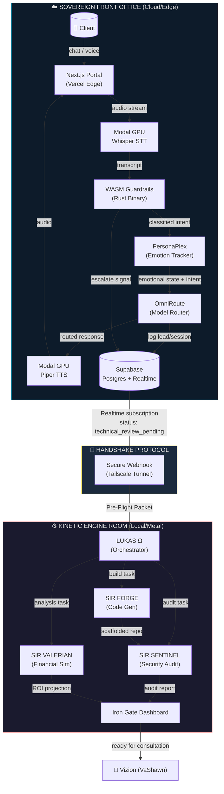

# 🏛️ BLUEPRINT.md — The Singularity Lattice

## Northstar Architecture for Invisioned Marketing

---

## 1. Goal & Why

**Business Value:** Transform Invisioned Marketing from a solo operation into a 24/7 autonomous agency that handles client intake, scheduling, onboarding, and technical project scaffolding — without hiring staff.

**Primary Objective:** Build a **Split-Brain AI Agency OS** where:

- **Cloud/Edge (Tasha)** handles all client-facing interactions: voice, chat, scheduling, lead capture, and emotional routing — running 24/7 on serverless infrastructure with zero local compute cost.
- **Local/Metal (Knights)** handles all heavy engineering: code scaffolding, security audits, financial analysis, and project prep — activated on-demand when Tasha escalates.
- **The Bridge** connects both halves through a Supabase-mediated handshake protocol, ensuring zero context loss during escalation.

**Success Metric:** A new lead can discover the agency, have a full conversation with Tasha, get scheduled, and have a technical pre-brief prepared by the Knights — all before VaShawn opens the dashboard.

---

## 2. Tech Stack & MCPs

### Cloud/Edge Layer (Tasha's Domain)

| Component         | Technology                  | Purpose                                    |
| ----------------- | --------------------------- | ------------------------------------------ |
| **Frontend**      | Next.js 14 (App Router)     | Client portal, chat UI, booking interface  |
| **Hosting**       | Vercel                      | Edge deployment, serverless functions       |
| **Voice STT**     | Modal (Whisper large-v3)    | Sub-second speech-to-text                  |
| **Voice TTS**     | Modal (Piper TTS)           | Matriarchal voice synthesis                |
| **Guardrails**    | Rust → WASM (wasm-pack)     | Intent classification, prompt-injection blocker |
| **AI Routing**    | OmniRoute / CLIProxyAPI     | Cost-optimized model selection per intent  |
| **Persona Engine**| PersonaPlex                 | Emotional state tracking (trust, urgency)  |
| **Database**      | Supabase (Postgres + Realtime + Auth) | Leads, sessions, calendar, escalation queue |
| **Scheduling**    | Google Calendar API (via MCP) | Appointment booking                       |

### Local/Metal Layer (Knights' Domain)

| Component          | Technology               | Purpose                                 |
| ------------------ | ------------------------ | --------------------------------------- |
| **Orchestrator**   | Python 3.12 (asyncio)   | Lukas Ω — swarm coordinator             |
| **Code Gen**       | Claude API (Sonnet)      | Sir Forge — project scaffolding          |
| **Security Audit** | Ruff + Bandit + custom   | Sir Sentinel — pre-commit gating         |
| **Financial Sim**  | Python (pandas/numpy)    | Sir Valerian — ROI projections           |
| **Containerization** | Docker Compose         | Isolated knight execution environments   |
| **Tunnel**         | Tailscale (or WireGuard) | Secure local ↔ cloud connectivity        |

### MCP Servers (Connected)

| MCP Server        | Role in System                                    |
| ----------------- | ------------------------------------------------- |
| **Supabase MCP**  | Direct DB operations from Knights + Tasha          |
| **Vercel MCP**    | Deployment management, preview URLs                |
| **Google Calendar MCP** | Booking slots, availability checks            |
| **Gmail MCP**     | Automated follow-up emails post-booking            |
| **Notion MCP**    | Client project briefs, internal knowledge base     |

---

## 3. System Topology

---

## 4. Sovereign Constraints

These are non-negotiable rules for the entire system.

### Architecture Constraints

1. **Split-Brain Isolation** — Cloud code NEVER runs on local hardware. Local code NEVER exposes ports to the public internet. The only bridge is the Supabase Realtime channel through an authenticated tunnel.
2. **Zero Local Compute for Front Office** — All client-facing inference runs on Modal/Vercel serverless. Local GPU/CPU is reserved exclusively for Knight operations.
3. **Stateless Edge Functions** — Every Vercel serverless function must be stateless. All state lives in Supabase.

### Technology Constraints

4. **Tailwind CSS only** — No custom CSS files. All styling via Tailwind utility classes.
5. **TypeScript strict mode** — All Next.js/frontend code must pass `tsc --strict` with zero errors.
6. **Rust stable toolchain** — WASM guardrails compile on stable Rust only. No nightly features.
7. **No deprecated libraries** — Every dependency must have had a release within the last 12 months.
8. **Python 3.12+** — All local Knight code targets 3.12 minimum. Type hints mandatory.

### Security Constraints

9. **Zero hardcoded secrets** — All API keys, tokens, and credentials via environment variables only (`.env.local` for dev, Vercel/Docker secrets for prod).
10. **WASM guardrails are non-optional** — Every inbound client message passes through the Rust/WASM classifier BEFORE reaching any LLM. No bypass path exists.
11. **Sir Sentinel gates all deployments** — No generated code reaches GitHub/Vercel without passing Sentinel's lint + security audit.
12. **Row-Level Security (RLS)** — All Supabase tables enforce RLS. No `service_role` key in client-side code.

### Operational Constraints

13. **One-command deploy** — Cloud stack deploys via a single `curl` or `npm run deploy` command.
14. **One-command local boot** — Local swarm activates via `//FLEET --activate` (Docker Compose up).
15. **Supabase is the single source of truth** — All cross-domain state (leads, sessions, escalations, schedules) lives in Supabase. No local SQLite for shared state.
