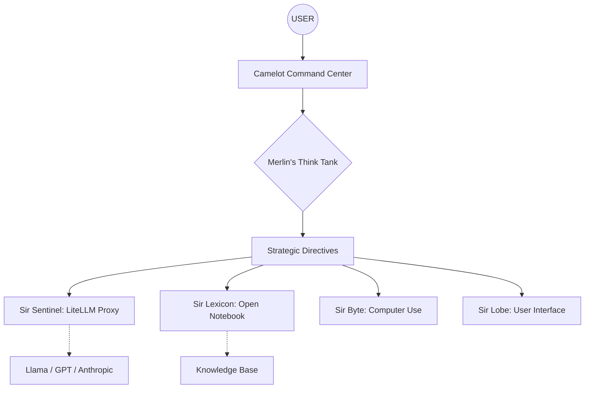

# 🏗️ Merlin's Think Tank: Architecture Blueprint

## 🔄 Cognitive Integration Map

## 🛠️ Stack Components
- **Orchestration**: Python / Node.js
- **Intelligence Gateway**: LiteLLM (Sir Sentinel)
- **Knowledge Representation**: Markdown / Mermaid / SurrealDB
- **Automation Execution**: Computer Use (Sir Byte)

## 📡 Interfaces
1. **Local CLI**: For rapid execution (Nano-CLI).
2. **Web Dashboard**: Powered by Sir Lobe.
3. **Ghost Protocol**: Background autonomous workers for maintenance.

## 🔒 Security Layers
- **Air-Gapped Logic**: Strategies are formulated locally.
- **Sentinel Guardrails**: All out-bound requests filtered via Sir Sentinel.
- **Provenience Tracking**: Every decision logged in the Provenance Ledger.
