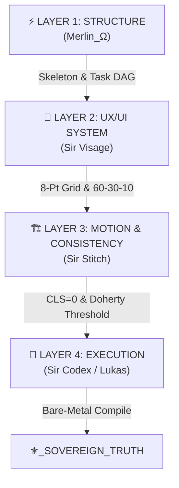

# Ω_TITAN_50K_ARCHITECTURE_FORGE_vMAX — Sovereign MetaCompiler Blueprint

**Operator:** VaShawn O. Head (Vizion) | Invisioned Marketing Inc.  
**Prime Motto:** *"Dreams don't come true, visions do."*  
**Hardware Ceiling:** `8GB_ARM64_EDGE_STRICT`  
**Mandate:** `THE_AI_IS_THE_EXECUTOR_THE_SYSTEM_IS_THE_DESIGNER`  
**Objective:** Do not build $500 generic websites. Build $50,000 enterprise sales machines. Solve the business problem first, enforce mathematical aesthetic rules second, build kinetic code third.

---

## 🏛️ The Four-Layer Kinetic Workflow

### Layer 1: Structure (`Merlin_Ω`)
- Map User Flows, Admin Logic, CMS, and SEO constraints.
- Define the Task DAG before touching UI code.
- Zero feature drift without explicit PRD anchoring.

### Layer 2: UX / UI Design System (`Sir Visage`)
- **Grid System:** Strict 8-Point baseline spacing (`8px`, `16px`, `24px`, `32px`, `48px`, `64px`).
- **Color Distribution (60-30-10 Hierarchy):**
  - `60%`: Obsidian Void (`#050505` / `#0B0B0F`)
  - `30%`: Structural Slate / Royal Ambient Depth (`#121218` / `#4B0082` subtle shadows)
  - `10%`: Luxora Gold (`#D4AF37`) for critical conversion / primary CTA.
- **Viewpoint Rule:** Exactly **ONE** primary Call-to-Action (CTA) per viewport.

### Layer 3: Consistency & Motion (`Sir Stitch`)
- State machines dictate UI behavior; motion confirms action rather than decorating.
- **Doherty Threshold:** Interactive response feedback under `<400ms`.
- **Layout Stability:** Zero Cumulative Layout Shift (`CLS = 0.00`).

### Layer 4: Kinetic Execution (`Sir Codex / Lukas`)
- Bare-metal compilation targeting Next.js 14/15, TypeScript Strict, and Tailwind v4.
- A2UI declarative JSONL schemas. No unstructured vibe-coding.

---

## 🎨 Aesthetic Mandate: Luxury Minimalist Brutalism
- **Base:** Obsidian Void (`#050505`)
- **Accents & Borders:** Luxora Gold (`#D4AF37`)
- **Ambient Glows:** Deep Royal Purple (`#4B0082`)
- **C.R.A.P. Framework:** Strict Contrast, Repetition, Alignment, and Proximity to eliminate cognitive friction.
- **Halt Trigger:** Generic AI gradient blobs without structured PRDs immediately trigger `//REZERO_CODE`.
