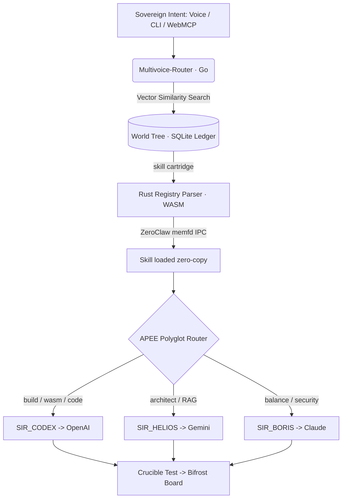

<div align="center">

# ⚔️ CAMELOT-OS

### The Sovereign Distributed Intelligence & Agent Swarm
#### *v1000.54-COSMOS*

**Your machine. Your models. Your rules. Local-first by default — cloud lanes are opt-in, never hidden.**

[](https://github.com/Cyberdad247/Camelot-Ecosystem/actions/workflows/forge-ci.yml)
[](#test-status--measured-not-asserted)
[](docs/threat-model.md)
[]()
[]()
[]()
[]()
[]()

</div>

---

## 🎙️ STOP. Are you *still* renting your intelligence?

Are you **tired** of leaking every prompt to a third party? **Exhausted** by API keys scattered across laptops and CI pipelines? **Furious** that your "AI agents" are really just someone else's servers wearing a trench coat?

**There has to be a better way.** And there is.

> ### Introducing **CAMELOT-OS** — the operating system that turns *your* 4GB box into a sovereign, self-improving, post-quantum AI factory. 🏭

A layered roundtable of **AI Knights**. An execution loop where every intent passes a **policy gate before anything runs** — declared safety invariants are checked by Z3, and destructive operations require a human. A **compile-to-binary** kinetic engine. A **4GB RAM target** for the control plane.

**Don't take our word for it — check it.** Every claim below names the module that implements it and the command that proves it. Where something is aspirational, [`docs/threat-model.md`](docs/threat-model.md) says so plainly, including the parts that are **not** enforced yet.

---

## 🤔 "But what *is* it, really?"

CAMELOT-OS is a **local-first agent control plane for constrained hardware**. It routes intents through explicit policy, bounded execution, human approval for high-risk actions, and verifiable provenance. Cloud models are optional lanes, not hidden dependencies.

It fuses four ideas most frameworks keep apart:

| Most agent frameworks | CAMELOT-OS |
|---|---|
| Wrap a cloud API | **Local-first**; cloud lanes are explicit per-Knight bindings you can read in one file |
| "Trust me, it's safe" | **Declared invariants, machine-checked.** Z3 blocks any action whose grounded effects violate a safety invariant — and blocks it whether or not the solver is installed |
| One model, one prompt | **Polyglot Matrix** routes each intent to the right Knight + right model, then RBAC checks that Knight is actually granted the domain |
| Markdown logs | **Tamper-evident, hash-chained ledger.** Mutate a row and `verify_chain()` returns `False`; a run whose ledger entry fails is not reported complete |
| Unbounded RAM | **4GB target** for the control plane, with `memfd` zero-copy leasing |

**What this is not.** The air-gapped lane is a routing preference today, not a
kernel-enforced boundary — there is no seccomp, netns, or egress rule in the tree.
Z3's guarantee is "no modelled hazard matched", not "proven safe". Both are
documented in the [threat model](docs/threat-model.md) rather than glossed here.

---

## 🏛️ THE GRAND ARCHITECTURE — A 5-Layer Omni-Nexus

```
        🎙️  SOVEREIGN INTENT  (voice · CLI · WebMCP · HTMX)
                              │
        ╔═════════════════════▼═══════════════════════════════════╗
        ║  ① GLASS — Multivoice Ingress & Bifrost Board           ║
        ║     Runic Router CLI · HTMX dashboard + SSE telemetry   ║
        ║     Aperture LLM access & spend panel                   ║
        ╠═════════════════════▼═══════════════════════════════════╣
        ║  ② COGNITIVE APEX — Anya Ω Gate (APEE pipeline)         ║
        ║     RTK noise-strip → triage → ColMAD crucible →        ║
        ║     Kinetic Loop (TRIAGE·PLAN·APPROVE·EXECUTE·VERIFY·    ║
        ║     RECORD) · Z3 patch verification · 11 Obsidian       ║
        ║     Pillars enforcement · Iron Gate v2 (HITL)           ║
        ╠═════════════════════▼═══════════════════════════════════╣
        ║  ③ MESH — Polyglot Matrix & Empire Drone Fabric         ║
        ║     soul_router → SIR_CODEX/HELIOS/BORIS → OpenAI/      ║
        ║     Gemini/Claude · Tailscale tsnet zero-port mesh ·    ║
        ║     ML-KEM-768 + ML-DSA-65 post-quantum channels        ║
        ╠═════════════════════▼═══════════════════════════════════╣
        ║  ④ SOULS — Kinetic Edge Runtime                         ║
        ║     WASM32-WASI pills · Preview Drones · Crucible       ║
        ║     ephemeral sandbox · 4GB Scarcity (ZRAM + memfd)     ║
        ╠═════════════════════▼═══════════════════════════════════╣
        ║  ⑤ VAULT — World Tree Memory & Provenance               ║
        ║     FirnFlow tiered memory (L1/L2/L3) · Shadow-SQLite   ║
        ║     atomic ledger w/ .shadow rollback · hash-chained    ║
        ║     provenance · Swarm (BZZ) content-addressed pinning  ║
        ╚═════════════════════════════════════════════════════════╝
```

Every intent flows **top to bottom and back** — sensed, planned, *adversarially debated*, mathematically verified, executed in a sandbox, and recorded immutably. Nothing dangerous reaches your disk without passing the gauntlet.

---

## ⭐ THE KNIGHTS OF THE ROUND TABLE

CAMELOT-OS dispatches work across a **Foundry Council** of typed AI Knights — each with a model binding, a privacy level, and a SkillGraph tier. The **Polyglot Matrix** ([`control_plane/core/soul_router.py`](control_plane/core/soul_router.py)) picks a candidate, and the RBAC matrix ([`03_VAULT/training/configs/config/access_matrix.json`](03_VAULT/training/configs/config/access_matrix.json)) decides whether that Knight is actually granted the mode and domain. Routing proposes; RBAC disposes:

| Knight | Domain | Engine class |
|---|---|---|
| 🧙 **MERLIN_Ω** | Grand Orchestration (the DAG) | Meta |
| 🎭 **ANYA_Ω** | The Gate — every intent enters here | APEE pipeline |
| ⚡ **SIR_CODEX** | High-velocity code / WASM | OpenAI-class |
| 🔭 **SIR_HELIOS** | 1M-context architecture & RAG | Gemini-class |
| 🛡️ **SIR_BORIS** | Architecture lead & thermodynamic oversight | Claude-class |
| 👻 **SIR_GHOST** | Zero-trust, local-only execution | Local model (privacy 1.0) |
| 🔐 **SIR_HASHIMOTO** | Cyber Aegis — alias of `sir_sentinel` | Security warden |
| 🗂️ **LADY_ALEXANDRIA** | World Tree archivist — alias of `lady_apis` | Memory routing |

*…and 17 more in the live roster* (25 knights hold access records; the alias table
in `soul_router.py` maps pantheon names like `SIR_HELIOS` onto canonical ids).

> ⚠️ **On "air-gapped".** Sir Ghost's `privacy_level = 1.0` is a **routing score
> weight** — it makes the router *prefer* him for private work and binds him to a
> local model. It is **not** a network control: no seccomp filter, network
> namespace, or egress rule exists in this tree yet. A local-only intent routed to
> Sir Ghost can still open a socket. See
> [threat model §5.2](docs/threat-model.md#52-sandbox-isolation--not-enforced) —
> this is the largest gap between the architecture and the implementation.

---

## 🔥 WHAT'S ACTUALLY SHIPPED (and verified, not vibes)

Here's what's on `main`. **Verified** means there is a test you can run; **partial**
and **unverified** are marked as such rather than rounded up.

- ✅ **Kinetic Execution Loop** — 6 deterministic stages, halts at the HITL gate for CRITICAL intents. A run whose RECORD stage cannot write its ledger entry is **not** reported complete
- ✅ **Z3 invariant checking** — 5 declared safety invariants; `git push --force origin main`, `git push -f origin main`, `push origin +main` and ledger truncation all return `Z3_BLOCK`, end to end through `pre_execute`. Fails **closed** when the solver is absent
- ✅ **11 Obsidian Pillars** — the `Pillar` enum has exactly 11 members, audited positive & negative
- ✅ **Deny-by-default RBAC** — 25 knights with explicit mode/domain grants; an unknown knight is BLOCKED, and a missing grant table raises rather than silently denying everything
- ✅ **RTK Rust DLL** — a cdylib noise-stripper loaded into Python via ctypes (4 Rust tests)
- ✅ **Post-quantum crypto** — **ML-KEM-768 + ML-DSA-65** (RustCrypto `ml-kem` 0.3 / `ml-dsa` 0.1), 3 tests incl. a real handshake round-trip. (Key establishment and signing only — key custody, rotation, and revocation are undefined)
- ✅ **Tenant-isolated L2 cache** — length-prefixed HMAC keys and per-tenant collections; refuses to start without `MEMPALACE_SECRET`
- ✅ **Tailscale tsnet mesh** — zero-port Empire Drone fabric (`01_KERNEL/mesh/node_c/`)
- 🟡 **ColMAD Crucible** — 3 adversarial personas (`stark_scaling`, `greene_strategy`, `tao_rigor`). Voting is **keyword-heuristic by default**; live LLM debate is an optional `judge=` hook
- 🟡 **WASM edge pills** — build path in `scripts/wsl_verify.sh`; the 65KB figure is **not** reproduced in CI and no artifact is committed
- 🟡 **4GB Scarcity Protocol** — `memfd_create` zero-copy IPC. The **~0.126µs/page** figure was measured once on WSL2 and is **not** a reproducible benchmark; no published workload backs the 4GB ceiling yet
- ✅ **Bifrost Intelligence Board** — HTMX + SSE live dashboard (Tailwind, Luxora Gold)
- ✅ **Aperture panel** — centralized LLM **access & spend** visibility, per-model/per-identity
- ✅ **Shadow-SQLite provenance** — atomic, hash-chained, tamper-evident, `.shadow` rollback
- ✅ **Phase-H Autonomous Framework** — optimization executor, result tracker, rollback, continuous-learning loop
- ✅ **Reforged VFS Scaffolder** — position-addressed markdown VFS under the `vfs/` namespace, isolating system paradigms, blueprint DAGs, and progressive disclosure boundaries
- ✅ **Interactive Onboarding System** — python diagnostics server and Vanilla CSS dashboard on port `8099` for system check verification
- [+] **Mamba-Firn SSM Recurrence** — Ternary quantizer logic and Mamba-Firn linear recurrence integrated into the Ouroboros reasoning engine (01_KERNEL/reasoning/ouroboros_engine).
- [+] **HMAC Cache Salting** — Tenant-isolated cache IDs over length-prefixed inputs, keyed by a required `MEMPALACE_SECRET` (tests/test_mempalace_security.py).
- [+] **Multivoice Switchboard & Bridge** — Go-native goroutine-parallel router and local KV-cache affinity telemetry bridge (control_plane/multivoice_bridge.py).
- [+] **Bifrost Triage Swarm** — Automated dispatch triage engine and service registry reconciliation loop (control_plane/dispatch/bifrost_triage_swarm.py).
- [+] **Anya Cockpit Bento Overhaul** — Excalibur PWA layout restructured as a brutalist dashboard with ChromeDevTools MCP assimilation and node mesh trackers (cartridges/system-ui).
- [+] **OxiBonsai_v2 Ternary-STDP Recurrence** — Quantization mechanics scaling to a ternary weight constraint space using integrated Hebbian Spike-Timing-Dependent Plasticity (STDP) sliding update rule on constrained 8GB ARM64 edge hardware.
- [+] **AntVortex (1M) Leech-Lattice Shell-Unions (Λ24)** — Similarity mapping coordinates indexed using 24-Dimensional Leech-Lattice shell-unions for sub-millisecond retrieval of 171 specialized agents.
- [+] **Ouroboros Adaptive Governance (APEE v7.0)** — Anya's gate determining autonomous execution dispatch thresholds based on a continuous risk-entropy triage function.

### Test status — measured, not asserted

```
python -m pytest tests/ -q          # 522 passed, 19 failed, 15 errors, 9 skipped
cargo test --workspace             # 14 passed
```

**The suite is not green, and the badge above does not cover it.** `forge-ci.yml`
runs only `cartridge/test_*.py`; the full `tests/` suite runs in `verify_os.yml`
under `continue-on-error: true`. The 19 failures and 15 errors are tracked debt —
mostly uninstalled optional dependencies (`chromadb`, `python-multipart`,
`appwrite`), plus lockbox fixtures and a taxonomy scan cap.

### Dependency advisories — now actually zero

`cargo audit` had never been run by any workflow, so "0 advisories" was an
unchecked assertion. The first run found **24**, of which 21 were in
`wasmtime` / `wasmtime-wasi` 30.0.2 — **the WASM sandbox itself** — including
five sandbox-escape and WASI permission-bypass advisories.

They were fixed rather than ignored:

| Change | Effect |
|---|---|
| wasmtime & wasmtime-wasi 30.0.2 → 47.x | clears 21 advisories; also drops the Winch backend, retiring the Winch-specific escapes by construction |
| pyo3 0.23 → 0.29 | clears `RUSTSEC-2025-0020`, `RUSTSEC-2026-0177` |
| crossbeam-epoch 0.9.18 → 0.9.20 | clears `RUSTSEC-2026-0204` |

```
cargo audit    # 0 vulnerabilities, empty ignore list
```

`cargo audit` runs as a **blocking** CI job, and
[`.cargo/audit.toml`](.cargo/audit.toml) carries an empty allowlist with a policy
note: fix the dependency, don't silence the advisory.

> This required bumping the pinned toolchain to **Rust 1.94** (wasmtime 47's
> MSRV) — see `rust-toolchain.toml`. The full workspace builds and its 14 tests
> pass on it.

Reproduce any of it yourself:

```bash
python -m pytest tests/test_path_resolution_and_failclosed.py -v   # fail-closed governance
python -m pytest tests/test_rbac_roster.py -v                      # RBAC/roster consistency
python -m pytest tests/test_mempalace_security.py -v               # tenant isolation
cargo test -p camelot-pqcrypto                                     # ML-KEM-768 / ML-DSA-65
```


---

## 🚀 BUT WAIT — THERE'S MORE: The Cybertronia Roadmap

The next ignition sequence wires the **Multivoice-Router** (a Go-native, goroutine-parallel switchboard) to the **Camelot-Ecosystem** "World Tree" skill registry:



Skills load **on demand** into a `memfd` buffer (honoring the 4GB Scarcity Protocol), so a registry of *thousands* of skills costs you near-zero idle RAM. *Status: in active fabrication — see `04_KINETIC/multivoice/`.*

---

## ⚡ ACT NOW — Quick Start

```bash
pip install -r requirements.txt   # z3-solver is required, not optional

# L2 memory keys tenant-scoped cache IDs with this; it refuses to start without one.
export MEMPALACE_SECRET="$(python -c 'import secrets; print(secrets.token_urlsafe(32))')"

# Boot the sovereign control plane
python bin/awaken.py

# Drive an intent through the Kinetic Loop
python -m control_plane.infra.kinetic_loop "build a status dashboard"

# Launch the Bifrost Intelligence Board (HTMX + SSE)
python -m control_plane.dispatch.bifrost_server --serve   # http://127.0.0.1:8080/bifrost

# See the safety gate refuse a modelled hazard — all four are Z3_BLOCK'd
python -m control_plane.infra.z3_verify "git push --force origin main"
python -m control_plane.infra.z3_verify "git push -f origin main"
python -m control_plane.infra.z3_verify "git push origin +main"
python -m control_plane.infra.z3_verify "truncate -s 0 PROVENANCE_LEDGER.md"
```

> **Module paths name their real location.** Earlier versions accepted a bare
> `control_plane.<module>` via an import redirect in `control_plane/__init__.py`.
> That redirect was removed: it decoupled import paths from filesystem paths
> (which is how governance code came to read and write phantom directories) and
> loaded every module twice under two names. See the
> [repository map](#-repository-map) for where each module lives.

**Going to production?** See [`blueprints/v9000.14/GO_LIVE.md`](blueprints/v9000.14/GO_LIVE.md) for the
tsnet mesh (tags/grants/k8s), Aperture wiring, and the one-command `scripts/wsl_verify.sh` driver.

---

## 🧱 Repository Map

| Path | What lives here |
|---|---|
| `control_plane/core/` | The gate and governance — `anya_gate`, `soul_router`, `rbac_matrix`, `soul_oversight`, `colmad` |
| `control_plane/infra/` | `kinetic_loop`, `z3_verify`, `obsidian_pillars`, `provenance`, `shadow_provenance` |
| `control_plane/dispatch/` | Routing and dispatch — `bifrost_server`, `switchboard`, `intent_router` |
| `control_plane/runes/` | CLI and TOON — `camelot_cli`, `runic_router` |
| `control_plane/_paths.py` | Canonical repo-root resolution — import `REPO_ROOT` from here, never hand-count `.parent` |
| `kinetic_edge/` | Rust crates — post-quantum crypto, WASM edge pill, swarm |
| `01_KERNEL/` | Reasoning, memory, and the tsnet mesh node |
| `02_FORGE/` | Kinetic fabrication crates |
| `03_VAULT/` | Provenance, training configs, runtime state |
| `04_KINETIC/` | Edge runtime + Multivoice switchboard (Cybertronia) |
| `blueprints/v9000.14/` | The CYBERTRONIA blueprint, tasks, verification & go-live docs |
| `vfs/` | Position-addressed virtual file system (system instructions, protocols, rosters, preflight, workflows, agents, skills) |
| `docs/threat-model.md` | Adversaries, trust boundaries, and the controls that are **not** enforced yet |


---

## 🛡️ The Sovereign Guarantees

Each of these is a property you can test. The scope is stated precisely, because a
guarantee with fuzzy scope is not a guarantee.

| Property | What is actually guaranteed | Where to check |
|---|---|---|
| **Zero-Trust by default** | A knight with no access record is BLOCKED. A missing or empty grant table raises — it never degrades to "deny everything" silently, which is indistinguishable from a real denial | `core/rbac_matrix.py` · `tests/test_rbac_roster.py` |
| **HITL-gated** | Shatterpoint intents reach `HUMAN_GATE` and require `CAMELOT_DASHBOARD_OPERATOR_TOKEN`; without it the job suspends rather than proceeding | `core/soul_oversight.py` |
| **Fails closed, not open** | Missing solver, unreadable policy, or unwritable ledger all deny or halt. None of them return "safe" | `tests/test_path_resolution_and_failclosed.py` |
| **Tamper-evident** | Mutating any ledger row makes `verify_chain()` return `False`. Exactly one ledger path resolves | `infra/shadow_provenance.py` |
| **Post-quantum key establishment** | ML-KEM-768 encapsulation + ML-DSA-65 signatures, real round-trips under test | `kinetic_edge/pqcrypto` |
| **Machine-checked invariants** | Z3 blocks any action whose grounded effects violate one of 5 declared invariants | `infra/z3_verify.py` |

**And what is *not* guaranteed** — stated here rather than buried:

- **Air-gap is not enforced.** `privacy_level` is a routing weight, not a network
  boundary. No seccomp, netns, or egress rule exists yet.
- **Z3 does not prove safety.** It proves that *modelled* hazards are absent. An
  unmodelled destructive operation yields `Z3_PASS`.
- **Prompt injection is not mitigated.** Retrieved content is not structurally
  separated from operator instructions.
- **Artifact provenance is unverified.** Dependency advisories are clean and
  gated, but there is still no SBOM, no artifact signing, and no signature check
  before a WASM pill is loaded.
- **Cross-tenant isolation is partial.** Audited for L2 cache keys and collections
  only — not for queues, object paths, logs, or metrics labels.

Full detail, including what each gap would take to close: [`docs/threat-model.md`](docs/threat-model.md).

---

<div align="center">

### CAMELOT-OS — *Made by Invisioned Marketing inc.*
**Built on private, low-resource, independent technology. Local-first by default; cloud lanes are explicit and opt-in.**

⚔️ *Anya is the Gate.* ⚔️

</div>
