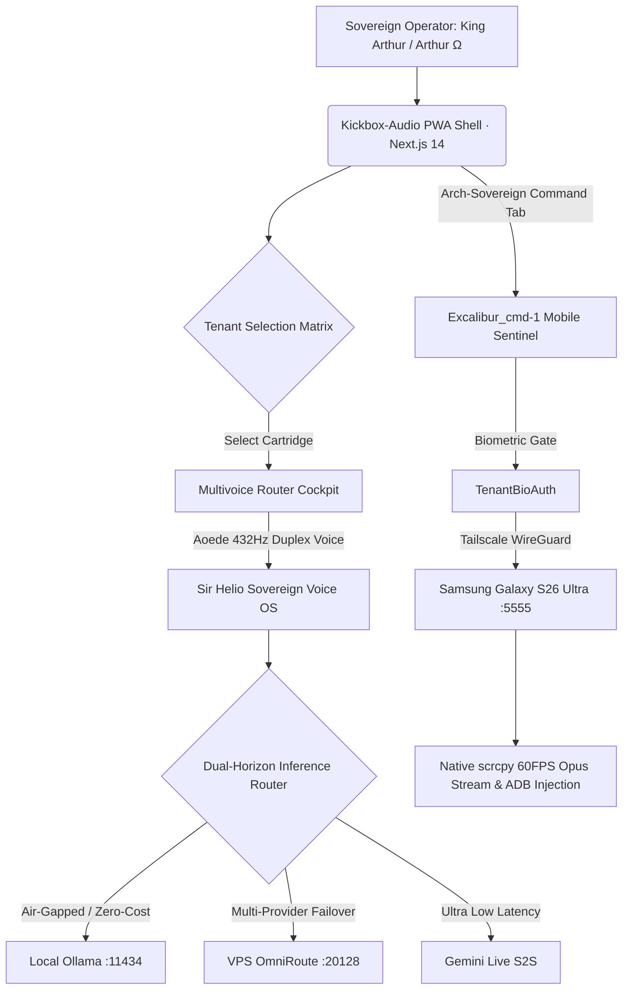

<div align="center">

# ⚔️ CAMELOT-OS

### The Sovereign Distributed Intelligence & Agent Swarm
#### *v1000.54-COSMOS*

**Your machine. Your models. Your rules. Zero cloud lock-in.**

[](https://github.com/Cyberdad247/Camelot-Ecosystem/actions/workflows/forge-ci.yml)
[]()
[]()
[]()
[]()
[]()
[]()

</div>

---

## 🎙️ STOP. Are you *still* renting your intelligence?

Are you **tired** of leaking every prompt to a third party? **Exhausted** by API keys scattered across laptops and CI pipelines? **Furious** that your "AI agents" are really just someone else's servers wearing a trench coat?

**There has to be a better way.** And there is.

> ### Introducing **CAMELOT-OS** — the operating system that turns *your* 4GB box into a sovereign, self-improving, post-quantum AI factory. 🏭

A layered roundtable of **AI Knights**. A **mathematically-verified** execution loop that *refuses* to run dangerous commands. A **compile-to-binary** kinetic engine. All inside a **4GB RAM ceiling**. No cloud required. No vendor. No leash.

**But don't take our word for it.** Keep reading. 👇

---

## 🤔 "But what *is* it, really?"

Great question. CAMELOT-OS is a **sovereign agent operating system** that runs entirely on private, memory-constrained hardware. It fuses four ideas most frameworks keep apart:

| Most agent frameworks | CAMELOT-OS |
|---|---|
| Wrap a cloud API | Runs **local-first**, air-gapped privacy lane (Sir Ghost) |
| "Trust me, it's safe" | **Z3 mathematical proof** blocks dangerous patches before they run |
| One model, one prompt | **Polyglot Matrix** routes each intent to the *right* Knight + *right* model |
| Markdown logs | **Tamper-evident, hash-chained provenance ledger** |
| Unbounded RAM | **4GB Scarcity Protocol** with `memfd` zero-copy leasing |

---

## 🏛️ THE GRAND ARCHITECTURE — A 5-Layer Omni-Nexus

```
        🎙️  SOVEREIGN INTENT  (voice · CLI · WebMCP · HTMX)
                              │
        ╔═════════════════════▼═══════════════════════════════════╗
        ║  ① GLASS — Multivoice Ingress & Bifrost Board           ║
        ║     Runic Router CLI · HTMX dashboard + SSE telemetry   ║
        ║     Aperture LLM access & spend panel                   ║
        ╠═════════════════════▼═══════════════════════════════════╣
        ║  ② COGNITIVE APEX — Anya Ω Gate (APEE pipeline)         ║
        ║     RTK noise-strip → triage → ColMAD crucible →        ║
        ║     Kinetic Loop (TRIAGE·PLAN·APPROVE·EXECUTE·VERIFY·    ║
        ║     RECORD) · Z3 patch verification · 11 Obsidian       ║
        ║     Pillars enforcement · Iron Gate v2 (HITL)           ║
        ╠═════════════════════▼═══════════════════════════════════╣
        ║  ③ MESH — Polyglot Matrix & Empire Drone Fabric         ║
        ║     soul_router → SIR_CODEX/HELIOS/BORIS → OpenAI/      ║
        ║     Gemini/Claude · Tailscale tsnet zero-port mesh ·    ║
        ║     ML-KEM-768 + ML-DSA-65 post-quantum channels        ║
        ╠═════════════════════▼═══════════════════════════════════╣
        ║  ④ SOULS — Kinetic Edge Runtime                         ║
        ║     WASM32-WASI pills · Preview Drones · Crucible       ║
        ║     ephemeral sandbox · 4GB Scarcity (ZRAM + memfd)     ║
        ╠═════════════════════▼═══════════════════════════════════╣
        ║  ⑤ VAULT — World Tree Memory & Provenance               ║
        ║     FirnFlow tiered memory (L1/L2/L3) · Shadow-SQLite   ║
        ║     atomic ledger w/ .shadow rollback · hash-chained    ║
        ║     provenance · Swarm (BZZ) content-addressed pinning  ║
        ╚═════════════════════════════════════════════════════════╝
```

Every intent flows **top to bottom and back** — sensed, planned, *adversarially debated*, mathematically verified, executed in a sandbox, and recorded immutably. Nothing dangerous reaches your disk without passing the gauntlet.

---

## ⭐ THE KNIGHTS OF THE ROUND TABLE

CAMELOT-OS dispatches work across a **Foundry Council** of typed AI Knights — each with a model binding, a privacy level, and a SkillGraph tier. The **Polyglot Matrix** (`control_plane/soul_router.py`) picks the right one for the job:

| Knight | Domain | Engine class |
|---|---|---|
| 🧙 **MERLIN_Ω** | Grand Orchestration (the DAG) | Meta |
| 🎭 **ANYA_Ω** | The Gate — every intent enters here | APEE pipeline |
| ⚡ **SIR_CODEX** | High-velocity code / WASM | OpenAI-class |
| 🔭 **SIR_HELIOS** | 1M-context architecture & RAG | Gemini-class |
| 🛡️ **SIR_BORIS** | Architecture lead & thermodynamic oversight | Claude-class |
| 👻 **SIR_GHOST** | Zero-trust, **air-gapped** execution | Local-only (privacy 1.0) |
| 🔐 **SIR_HASHIMOTO** | Cyber Aegis (Kyber/eBPF) | Security warden |
| 🗂️ **LADY_ALEXANDRIA** | World Tree archivist | Memory routing |

*…and 11 more in the live roster.* Air-gapped intents **never** leave the box — Sir Ghost guarantees it.

---

## 🔥 WHAT'S ACTUALLY SHIPPED (and verified, not vibes)

This isn't a roadmap cosplaying as a product. Here's what's **on `main`, tested, and green**:

- ✅ **Kickbox-Audio PWA Shell (`apps/pwa`)** — Next.js 14 luxury minimalist brutalist interface with dynamic tabbed navigation, Alfred Command Dock, and real-time telemetry HUD.
- ✅ **Tenant Selection & Multivoice Router Cockpit** — Dedicated tenant cartridge matrix (`ecosystem-pwa`, `excalibur-ecc`, `kba-executive`, `digital-factory`, `1vizion-rcrds`) dynamically transitioning into the Multivoice Router Cockpit with live 432Hz Canvas waveform visualizer, persona matrix, and duplex voice toggle.
- ✅ **Sir Helio Default Voice OS & Dual-Horizon Inference** — Real-time Aoede 432Hz duplex voice pipeline defaulting to **SIR_HELIO** with zero-overhead switching between Local Ollama (`:11434`), VPS OmniRoute (`:20128`), Gemini Live S2S, and CLIProxy (`:8080`).
- ✅ **Arch-Sovereign Excalibur Mobile Edge (`apps/excalibur-cmd-1`)** — Samsung Galaxy S26 Ultra converted to `Excalibur_cmd-1`, strictly gated to King Arthur (`0xCBB310BD987E4B84BF4512D37D090BEC`), with `TenantBioAuth` biometric challenges, native `scrcpy` opus 60FPS streaming, and tactile ADB coordinate injection.
- ✅ **Kinetic Execution Loop** — 6 deterministic stages, halts at the HITL gate for CRITICAL intents
- ✅ **Real Z3 verification** — PDDL-encoded safety invariants; a `git push --force origin main` gets `Z3_BLOCK`'d *mathematically*
- ✅ **11 Obsidian Pillars** enforcement — every run audited across all 11, positive & negative cases
- ✅ **ColMAD Crucible** — a 3-persona adversarial debate before any CRITICAL commit
- ✅ **RTK Rust DLL** — a cdylib noise-stripper loaded into Python via ctypes
- ✅ **Post-quantum crypto** — **ML-KEM-768 + ML-DSA-65** (RustCrypto), `cargo audit` clean, **0 advisories**
- ✅ **WASM edge pills** — a 65KB `wasm32-wasip1` artifact, Swarm-pinnable
- ✅ **Tailscale tsnet mesh** — zero-port Empire Drone fabric (tags + grants + k8s sidecar ready)
- ✅ **4GB Scarcity Protocol** — `memfd_create` zero-copy IPC verified at **~0.126µs/page** on WSL2
- ✅ **Bifrost Intelligence Board** — HTMX + SSE live dashboard (Tailwind, Luxora Gold)
- ✅ **Aperture panel** — centralized LLM **access & spend** visibility, per-model/per-identity
- ✅ **Shadow-SQLite provenance** — atomic, hash-chained, tamper-evident, `.shadow` rollback
- ✅ **Phase-H Autonomous Framework** — optimization executor, result tracker, rollback, continuous-learning loop
- ✅ **Reforged VFS Scaffolder** — position-addressed markdown VFS under the `vfs/` namespace, isolating system paradigms, blueprint DAGs, and progressive disclosure boundaries
- ✅ **Interactive Onboarding System** — python diagnostics server and Vanilla CSS dashboard on port `8099` for system check verification
- [+] **Mamba-Firn SSM Recurrence** — Ternary quantizer logic and Mamba-Firn linear recurrence integrated into the Ouroboros reasoning engine (01_KERNEL/reasoning/ouroboros_engine).
- [+] **HMAC Cache Salting** — Tenant-isolated cache safety and cryptographic verification in local cache lanes (tests/test_mempalace_security.py).
- [+] **Multivoice Switchboard & Bridge** — Go-native goroutine-parallel router and local KV-cache affinity telemetry bridge (control_plane/multivoice_bridge.py).
- [+] **Bifrost Triage Swarm** — Automated dispatch triage engine and service registry reconciliation loop (control_plane/bifrost_triage_swarm.py).
- [+] **OxiBonsai_v2 Ternary-STDP Recurrence** — Quantization mechanics scaling to a ternary weight constraint space using integrated Hebbian Spike-Timing-Dependent Plasticity (STDP) sliding update rule on constrained 8GB ARM64 edge hardware.
- [+] **AntVortex (1M) Leech-Lattice Shell-Unions (Λ24)** — Similarity mapping coordinates indexed using 24-Dimensional Leech-Lattice shell-unions for sub-millisecond retrieval of 171 specialized agents.
- [+] **Ouroboros Adaptive Governance (APEE v7.0)** — Anya's gate determining autonomous execution dispatch thresholds based on a continuous risk-entropy triage function.

> **8/8 PWA Vitest suites passed · 52 pytest · 19 module selftests · 8 Rust tests · `cargo audit` clean · WSL2 memfd verified.**

---

## 🚀 BUT WAIT — THERE'S MORE: The Cybertronia Full-Stack Convergence

The sovereign stack unites the **Kickbox-Audio PWA Shell**, **Multivoice-Router**, and **Excalibur_cmd-1**:



Skills load **on demand** into a `memfd` buffer (honoring the 4GB Scarcity Protocol), so a registry of *thousands* of skills costs you near-zero idle RAM.

---

## ⚡ ACT NOW — Quick Start

```bash
# Boot the sovereign control plane
python bin/awaken.py

# Launch the Kickbox-Audio PWA Shell (:3000)
npm --prefix apps/pwa run dev

# Run PWA TypeScript typecheck & Vitest test suites
npm --prefix apps/pwa run typecheck
npm --prefix apps/pwa test

# Drive an intent through the Kinetic Loop
python -m control_plane.kinetic_loop "build a status dashboard"

# Launch the Bifrost Intelligence Board (HTMX + SSE)
python -m control_plane.bifrost_server --serve   # http://127.0.0.1:8080/bifrost

# Prove the safety gate works — this gets Z3_BLOCK'd
python -m control_plane.z3_verify "git push --force origin main"
```

**Going to production?** See [`blueprints/v9000.14/GO_LIVE.md`](blueprints/v9000.14/GO_LIVE.md) for the
tsnet mesh (tags/grants/k8s), Aperture wiring, and the one-command `scripts/wsl_verify.sh` driver.

---

## 🧱 Repository Map

| Path | What lives here |
|---|---|
| `apps/pwa/` | Kickbox-Audio Next.js 14 PWA Shell, Tenant matrix, Multivoice Router Cockpit, Voice layer |
| `apps/excalibur-cmd-1/` | Arch-Sovereign Mobile Edge Sentinel (S26 Ultra), BioAuth, scrcpy, ADB injection |
| `apps/bifrost/` | Node.js WebSocket (:3001) & Express Gateway, microcubic worker threads |
| `control_plane/` | The cognitive apex — gate, kinetic loop, Z3, pillars, routing, Bifrost |
| `kinetic_edge/` | Rust crates — post-quantum crypto, WASM edge pill, swarm |
| `01_KERNEL/` | Reasoning, memory, and the tsnet mesh node |
| `02_FORGE/` | Kinetic fabrication crates & voice-first runtime |
| `03_VAULT/` | Provenance, training configs, runtime state |
| `04_KINETIC/` | Edge runtime + Multivoice switchboard (Cybertronia) |
| `blueprints/v9000.14/` | The CYBERTRONIA blueprint, tasks, verification & go-live docs |
| `vfs/` | Position-addressed virtual file system (system instructions, protocols, rosters, preflight, workflows, agents, skills) |


---

## 🛡️ The Sovereign Guarantees

- **Zero-Trust by default** — RBAC + deny-by-default grants everywhere
- **HITL-gated** — destructive ops require a human; never auto-approved
- **Air-gapped privacy lane** — local-only intents never touch a network
- **Post-quantum ready** — ML-KEM-768 / ML-DSA-65 on every A2A channel
- **Tamper-evident** — break the provenance chain and `verify_chain()` screams
- **Mathematically governed** — if Z3 can't prove it's safe, it doesn't run

---

<div align="center">

### CAMELOT-OS — *Made by Invisioned Marketing inc.*
**Built on private, low-resource, independent enterprise technology. Zero vendor lock-in. Forever.**

⚔️ *Anya is the Gate.* ⚔️

</div>
