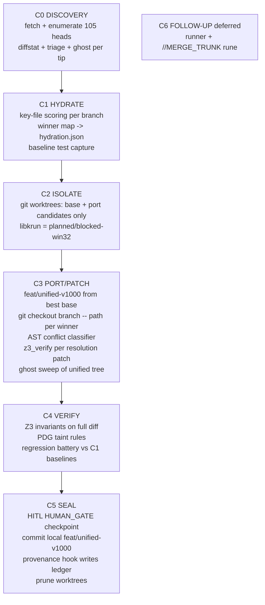

# CAMELOT-OS — Multi-Branch Consolidation Blueprint (Ω_MULTI_BRANCH_CONSOLIDATION_vMAX)

| Metadata | |
| :--- | :--- |
| **Version** | mbc-v1 |
| **Date** | 2026-09-26 |
| **Author** | SIR_BORIS / SIR_CODEX / MERLIN_Ω |
| **Baseline** | `main` @ `dadcd526` |
| **Operator** | VaShawn O. Head (Vizion) |
| **Hardware ceiling** | 8GB — scarcity protocol enforced |
| **Output** | Local `feat/unified-v1000` only — no push, no trunk merge (HUMAN_GATE, separate directive) |

## Executive Summary

Isolate all target branches (93 remote heads across 9 remotes + 12 local branches) into git
worktrees, select the best implementation per component (base + port model — NOT a linear
N-way merge), resolve conflicts via AST-classified patching, gate every resolution through
real Z3 invariant verification, run the full regression battery, and commit a unified local
branch only after an explicit HITL checkpoint.

Authority note: the source spec JSON is a plan input, not execution authority. Every claimed
write round-trips against `git status/log/branch`.

## Kinetic Flow DAG (grounded)

## Evidence-Grounded Gap Analysis

| Spec step | Claimed mechanism | Verified state | Class |
| :--- | :--- | :--- | :--- |
| HYDRATE | Lady Mnemosyne → DuckDB-WASM vector storage | `02_FORGE/kinetic/duckdb_wasm_adapter.ts` exists but **no `@duckdb/duckdb-wasm` dep installed**; live MemPalace store is JSON (`03_VAULT/runtime_state/mempalace_duckdb/`). Graft + squire indexes already provide code intelligence. → hydrate to JSON index. | 🔨 planned |
| ISOLATE | Git worktrees in libkrun/WASM32 microVMs | Worktrees **confirmed** (`.worktrees/reya-fabric` live). libkrun **BLOCKED on win32** (`blueprints/v9000.14/tasks.md` P5-T02: `BLOCKED: WSL2+KVM`; scope-review names `forkd_runner.sh` fallback). `hive_engine.py` MicroVMSandbox/Δ≤0.12 MiB telemetry is a Python simulation. | ✅ worktrees confirmed / 🔨 libkrun aspirational |
| PATCH | Sir Codex applies AST-level merge resolutions | `parallel_ast_runner.py` is a demo (hard-coded DAG, sample contracts). `tree-sitter` only in `hephaestus` Rust crate. → `git merge/checkout` + Python `ast` conflict **classification**, human/knight resolution. | 🔨 planned |
| VERIFY | Z3 proofs on consolidated PDG = zero regressions | Real: `z3-solver 4.16.0` in `.venv`; `control_plane/infra/z3_verify.py` PDDL-encodes 5 invariants (`provenance_intact`, `main_branch_protected`, `hitl_gate_enabled`, `boot_capable`, `secrets_unexposed`). Z3 proves *invariant preservation*, not functional regression — regression = test battery. PDG taint: kinetic_edge `pdg_evaluate` (4 rules). `hive_engine.Z3VerificationGate` does NOT import z3 (simulated — not used here). | ✅ z3_verify real / ⚠️ reframe claim |
| SEAL | Anya Ω commits to PROVENANCE_LEDGER.md | Hard constraint: NEVER hand-edit the ledger (4 mirrors; `provenance-mirror-sync` + PostToolUse hooks write entries). → commit triggers hook; verify by `grep`. | ✅ real, corrected mechanism |

**Gates absent from the source spec, added here:**
1. **Secret gate** — `squires.colony ghost` per branch tip (C0) and across the unified tree (C3); anything matching `secret|token|key|password` routes to SIR_GHOST, never committed.
2. **HITL gate** — merging to main trunk is `HUMAN_GATE`; `soul_oversight.pre_execute` suspends it without `CAMELOT_DASHBOARD_OPERATOR_TOKEN`. Explicit operator checkpoint before C5 commit; trunk merge stays a separate future directive.

## Knight Alignment

| Knight | Phase | Actual mechanism called |
| :--- | :--- | :--- |
| LADY_MNEMOSYNE | C1 HYDRATE | `git diff --stat`/`log` enumeration → `03_VAULT/runtime_state/consolidation/<run>/hydration.json` |
| SIR_BORIS | C2 ISOLATE | `git worktree add .worktrees/consolidation/*` (platform note: libkrun planned/blocked-win32) |
| SIR_CODEX | C3 PORT/PATCH | `git checkout <branch> -- <path>`, Python `ast` conflict classifier, `z3_verify.verify_patch` per resolution |
| SIR_SENTINEL / SIR_GHOST | C0 + C3 | `squires.colony triage` + `squires.colony ghost` (secret gate) |
| PALADIN_OCTEM | C4 VERIFY | `z3_verify.verify_patch` on full diff + kinetic_edge PDG rules + regression battery |
| ANYA_Ω | C5 SEAL | HITL checkpoint → commit → provenance hook → 4-mirror `grep` verification |

## 8GB Scarcity Protocol

1. **Ref-only analysis** — C0/C1 use `git diff main...<ref>` against remote-tracking refs; NO worktree checkout per head (105 heads would exhaust the ceiling).
2. **Worktrees only for base + port candidates** — typically ≤ 6 active worktrees.
3. **Sequential verification** — C4 battery runs one worktree at a time; workspaces share root `node_modules`.
4. **Prune per phase** — port candidates evicted after C3; all consolidated worktrees removed at C5.
5. **Memory telemetry** — free/working-set check before each phase; abort + `//REZERO` discipline if the ceiling is threatened.

## Risk Matrix

| Risk | Likelihood | Impact | Mitigation |
| :--- | :--- | :--- | :--- |
| Secrets in remote branches | High | High | C0 ghost per tip; C3 unified-tree sweep; SIR_GHOST routing; never commit findings |
| Cross-remote conflict zones | High | Medium | Base + port model (no N-way merge); conflict classification before resolution |
| 8GB ceiling breach | Medium | High | Ref-only analysis, ≤6 worktrees, sequential battery, prune rules |
| libkrun unavailable (win32) | Certain | Low | Documented `planned`/blocked; git worktree isolation is the confirmed path |
| AST auto-resolution defect | Medium | High | AST used for classification only; resolutions human/knight-reviewed; every patch z3-gated |
| Provenance drift | Low | High | Hooks only (no hand-edits); 4-mirror `grep` verification at C5 |
| Unreachable remotes at fetch | Low | Low | Analysis proceeds on last-fetched remote-tracking refs; noted in evidence |

## Success Criteria

- `feat/unified-v1000` exists locally, built from the per-component winner map, containing ported modules from the winning branches.
- `z3_verify` returns `Z3_PASS` on the full consolidation diff.
- Regression battery (canonical pytest paths, `npm run lint → typecheck → scoped test → build`, `cargo check/test`, `bin/awaken.py --status`) green vs C1 baselines.
- `squires.colony ghost` finds no committed secrets on the unified branch.
- Provenance entry written by hook across all 4 mirrors (verified by `grep`, append-only).
- All worktrees pruned; evidence JSONs archived under `03_VAULT/runtime_state/consolidation/<run>/`.
