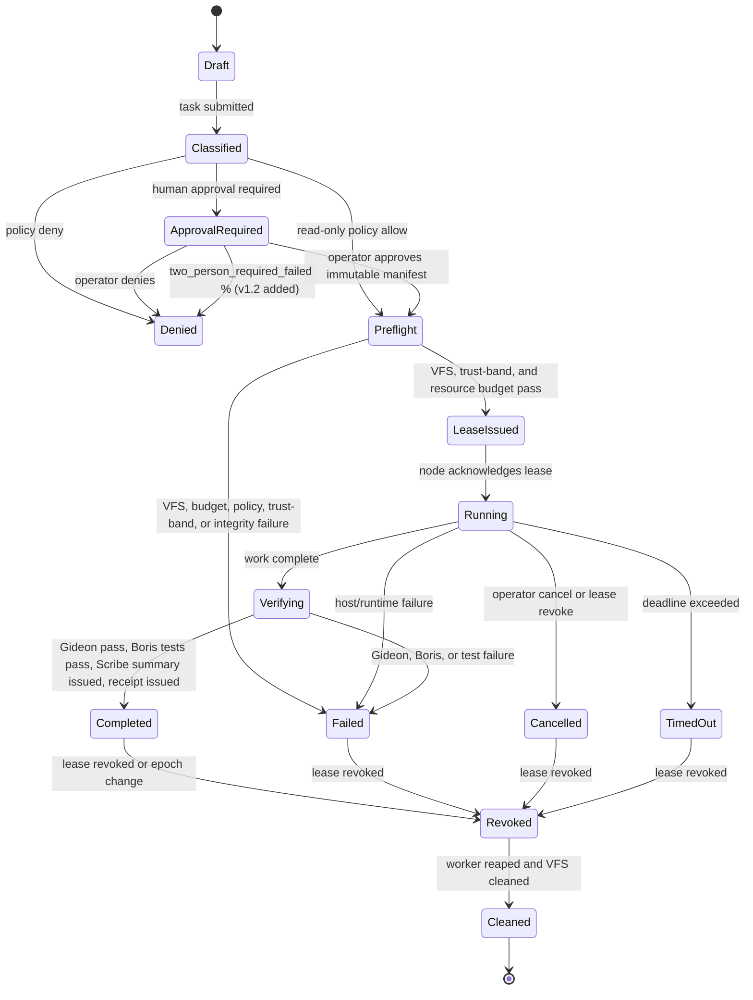
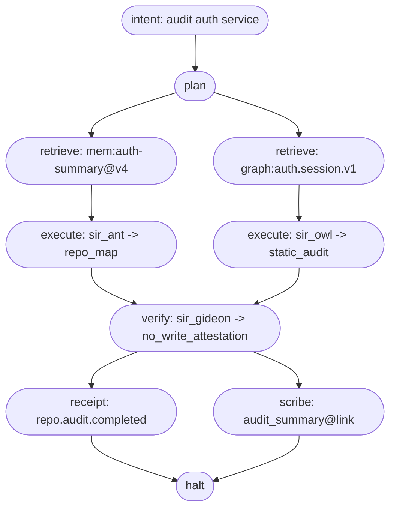

# Camelot-OS SADD + LLDD v1.2

Full System Architecture and Low-Level Design

- System: Camelot-OS / Cybertronia
- Status: Implementation Architecture v1.2 (delta on v1.1)
- Operating Model: Local-first, federated, policy-governed enterprise execution fabric
- Commercial Model: Option A — public contracts and SDKs; proprietary enforcement, control plane, premium cartridges, executive PWAs, policy packs, and evaluation harnesses
- Reference Hardware: 8 GB+ laptop/server nodes; VPS active Hub; local CPU warm-standby twin
- Northstar: A 16 MB Camelot control kernel for identity, policy, leases, scheduling, manifest verification, revocation, and evidence — not full LLM inference, browser rendering, vector databases, or large repositories. See Appendix B for the size-budget boundary.

---

## v1.2 changelog (delta on v1.1)

| # | Section | Change | Source recommendation |
|---|---------|--------|------------------------|
| 1 | Title block | Add explicit Northstar size boundary pointer | A. Northstar ambiguity |
| 2 | Glossary (new) | Pin branded names before first use | A. Glossary missing |
| 3 | §4 persona table | Rename *Effect authority* to *Direct effect authority*; add *Coordination authority*; add Scribe and Boris rows | B. Persona authority under-specified |
| 4 | §5.1 → §5.5 (new) | Publish Effect & Risk-Tier taxonomy | I. Effect classification missing |
| 5 | §6.5 (new) | Witness semantics (quorum, downtime, SLA) | H. Witness under-specified |
| 6 | §7.3 (new) | Trust-band enumeration with per-band capabilities | E. Trust bands missing |
| 7 | §10.3 (new) | Mobile authority-epoch caching window | D. Mobile offline undefined |
| 8 | §11.3 (new) | Receipt chain schema (parent_hash, algorithm, verify) | J. Receipt chain hashing weak |
| 9 | §13.3 (new) | Capability derivation algorithm with worked example | C. Capability derivation under-specified |
| 10 | §15.6 (new) | Cache namespace enforcement (HMAC key, scrub receipt) | K. Cache namespace integrity asserted |
| 11 | §17.1 (rebuilt) | Complete Symbolect glyph registry | F. Symbolect glyph set incomplete |
| 12 | §20.x (anchor callouts) | Marketing/Wellness "Never" rules anchored to Sentinel deny list and prompt guard | L. Marketing/Wellness enforcement unclear |
| 13 | §22.2 (new) | Fixture → production-gate traceability matrix | Q. Each fixture should map to gate |
| 14 | §25.1 (new) | SLOs per procedure | Smaller comments: No SLOs |
| 15 | §27 (new) | Open Questions appendix | R. No "Open Questions" |
| 16 | Appendix B | Northstar Size Budget | A |
| 17 | Appendix C | Trust Bands (canonical) | E |
| 18 | Appendix D | Effect Classification & Risk Tiers (canonical) | I |
| 19 | Phase 0 expansion | Bundle size budget and trust-band admission into Phase 0 deltas | A, E |

All other sections remain textually equivalent to v1.1 with light sub-section numbering fixes.

---

## Glossary

These terms bind this document. Drift between prose and code is a defect.

- **Camelot-OS** — the system as a whole (control + commerce + agency PWAs + mobile).
- **Cybertronia** — the authoritative control plane (VPS + twin + Sentinel + Bifrost + registries + receipts).
- **Knight** — a bounded persona compiled by Stunspot with declared prohibited capabilities.
- **Nano-Knight** — a derivative Knight compiled for short-lived, ephemeral tasks under the same authority model.
- **Cartridge** — signed, versioned, registered, admitted bounded behavior. Never an authority.
- **Manifest** — pinned, hash-bound declaration of intent (`effect_manifest`).
- **Lease** — short-lived signed permission bound to a manifest, node, workload, and authority epoch.
- **Authority epoch** — monotonic, globally observed counter that invalidates stale leases on key/policy rotation or failover.
- **Receipt** — hash-linked, signed record of a meaningful state transition.
- **Sentinel** — the sole authority-issuing service. Has the only privilege to grant leases.
- **Bifrost** — the only transport-with-identity service. It authenticates; it does not authorize.
- **VFS Guardian** — the only workspace and source-admission authority.
- **Cloudbrain** — the memory plane (MemPalace, OpenViking, Graphify, Redis, MemPalace, Open Notebook). Scopes memory; does not authorize.
- **Stunspot** — the persona compiler.
- **Symbolect** — the compact approved task-structure language.
- **Gideon** — independent verifier. Pass/block only.
- **Boris** — bounded contract-test generator and runner. Read-only / test-worktree-write under lease.
- **Scribe** — receipt-aggregator/verifier-summary Knight. Distinct from Gideon (binary verdict) and Herald (notification). Direct effect authority: None.
- **Herald** — receipt-to-user surfacing (notifications, dashboards). Direct effect authority: None.
- **Anya** — intent, planning, expression gate. Direct effect authority: None.
- **Merlin** — task-DAG compilation, adapter selection, bounded dispatch. Direct effect authority: None.
- **HiVeiDe / HiveIDE** — repository mapping, path locks, dependency graph. Direct effect authority: None.
- **Witness** — external grantor of a promotion lock that does not run agents.
- **Operator** — authenticated human with tenant-scoped role and effect-approval privileges.

**Coordination authority** ≠ **Direct effect authority**. A Knight may coordinate execution without being able to perform or grant a consequential effect; that distinction is made explicit per persona in §4.

---

## Part I — System Architecture Design Document

### 1. Architecture principles

1. Anya is the intent and expression gate.
2. Sentinel is the sole policy and lease authority.
3. Bifrost authenticates and transports; it never grants authority.
4. VFS Guardian is the only workspace and source-admission authority.
5. Cloudbrain scopes and compiles memory; it never grants authority.
6. Stunspot compiles competent Knight behavior.
7. Symbolect compiles compact approved task structure.
8. Gideon independently verifies implementation and external effects; Scribe aggregates verification summaries; Boris generates and runs bounded contract tests under lease.
9. Every consequential effect requires a pinned manifest, active lease, and receipt.
10. Connectivity never implies trust; trust never implies permission.
11. Cartridges are portable bounded behavior, never independent authority.
12. The system fails closed for new consequential effects.
13. Evidence, not model confidence, determines what may be promoted.
14. The 16 MB Northstar target applies to control, not general AI inference. See Appendix B for boundary.
15. **v1.2 — Two-person rule.** Any effect classified T3 or higher (Appendix D) requires two distinct operator approvals; no single human can self-promote a consequential effect.
16. **v1.2 — Cache is acceleration, never truth.** No cached state may be the sole basis for any effect-authorization decision.

The architecture retains the Court of Camelot's planner/executor/verifier/expresser division: Anya plans, Merlin coordinates execution, Gideon/Scribe verifies, Boris runs bounded contract tests, and Herald expresses verified outcomes.

### 2. Enterprise macro topology

```mermaid
graph TD
    U[Human Operator / Client / Member]
    PWA[Anya PWA / Executive PWA / Operator Console]
    MOB[Camelot Mobile<br/>Voice, approvals, device actions]

    subgraph HUB["Cybertronia Authority Plane"]
        VPS["Cybertronia VPS<br/>ACTIVE"]
        BH["Bifrost Hub"]
        SEN["Sentinel<br/>Policy + Lease Authority"]
        SCH["Task Scheduler"]
        NREG["Node Registry"]
        CREG["Cartridge Registry"]
        REC["Receipt/Event Service"]
        EVID["Evidence Index + Replay"]
        SEC["Secret Broker"]
        LED["Ledger Anchor Writer"]
        CBB["Knight Cloudbrain Broker"]
        LOCK["Promotion Lock<br/>(fencing)"]
        EPOCH["Authority Epoch Service"]
    end

    subgraph TWIN["Resilience Plane"]
        LOC["Local CPU Server<br/>WARM STANDBY"]
        REP["Encrypted Replication<br/>Receipts, policy, registry, config"]
        WIT["Optional Witness(s)<br/>Promotion Lock Grant"]
    end

    subgraph MEMORY["Cloudbrain Memory Plane"]
        VFS["VFS Guardian<br/>Source Quarantine"]
        MP["MemPalace<br/>Memory Lifecycle Policy"]
        OV["OpenViking<br/>viking:// Context Filesystem"]
        GR["Graphify<br/>Knowledge Graph"]
        RED["Redis<br/>TTL Scoped Cache"]
        ON["Open Notebook<br/>Private Research"]
    end

    subgraph EDGE["Private Mesh: Camelot Nodes"]
        ENG["Engineering Node<br/>HiVeiDe + Merlin Forge<br/>VFS + Gideon + Boris"]
        EXP["Experience Node<br/>Anya PWA + Kickbox Voice<br/>Operator UI"]
        MKT["Marketing Agency Node<br/>Campaign workflows"]
        COM["Commerce Agency Node<br/>Catalog and operations"]
        WEL["Wellness Node<br/>Goals and routines"]
        RES["Research Node<br/>Scout / approved retrieval"]
        INF["Inference Node<br/>Local model adapter"]
        PHN["Android Mobile Node<br/>Phone actions and approvals"]
    end

    U --> PWA
    U --> MOB
    PWA --> BH
    MOB --> BH

    BH --> SEN
    BH --> SCH
    BH --> REC
    BH --> NREG
    BH --> CREG
    BH --> EPOCH

    SEN --> SEC
    SEN --> CBB
    SEN --> REC
    SEN --> EPOCH
    SEN --> LOCK

    CBB --> VFS
    CBB --> MP
    CBB --> OV
    CBB --> GR
    CBB --> RED
    ON --> VFS
    ON --> CBB

    SCH --> NREG
    SCH --> CREG
    SCH --> ENG
    SCH --> EXP
    SCH --> MKT
    SCH --> COM
    SCH --> WEL
    SCH --> RES
    SCH --> INF
    SCH --> PHN

    ENG --> REC
    EXP --> REC
    MKT --> REC
    COM --> REC
    WEL --> REC
    RES --> REC
    INF --> REC
    PHN --> REC

    REC --> EVID
    REC --> LED
    REC --> MP

    VPS --- REP --- LOC
    WIT -. promotion lock .- LOCK
```



### 3. Plane boundaries

| Plane | Components | Owns | Cannot own |
|-------|------------|------|------------|
| Experience | Anya PWA, Operator Console, Executive PWAs, voice, mobile | Intent, drafting, approval requests, evidence display | Leases, direct writes, secrets |
| Control | Bifrost, Sentinel, scheduler, registries, authority epoch, promotion lock | Identity, policy, routing, leases, revocation, epoch, fencing | Content generation, raw source manipulation |
| Safety | VFS, process supervisor, resource governor, secret broker | Workspaces, source quarantine, quotas, tool containment | Business authorization |
| Cloudbrain Execution | Context compiler, MemPalace, OpenViking, Graphify, Redis, Open Notebook | Scoped retrieval, context budgets, memory lifecycle | Policy, VFS override, authority |
| Evidence Data | Cartridges, Knights, runtime adapters, tenant stores, connector cache, artifact storage | Bounded task execution | Cross-tenant access |
| Evidence Audit | Receipt service, Gideon, Scribe, Boris, ledger anchor, replay service | Receipt integrity, verifier decisions, audit replay | Classified storage and retention |

### 4. Core personas and Knights

| Role | System responsibility | Direct effect authority | Coordination authority |
|------|------------------------|--------------------------|-------------------------|
| Anya | Intent triage, planning, clarification, evidence expression | None | Drives the orchestration loop (§5) |
| Merlin | Task-DAG compilation, adapter selection, bounded dispatch | None | Schedules Knights across the mesh |
| HiVeiDe | Repository mapping, path locks, dependency graph | None | Provides map context to Forge and Owl |
| Sir Ant | Source inventory, symbol mapping, dependency map | Read-only (declared read scope) | None |
| Sir Owl | Static audit, complexity/risk signals | Read + declared test runner | None |
| Sir Oracle | Architecture plan, acceptance criteria | Read-only | None |
| Sir Forge | Minimal atomic patch in approved ephemeral worktree | Scoped VFS write under lease | None |
| Sir Castor | Bounded tests, benchmarks, migrations, analysis | Declared test tools only | None |
| Sir Spider | Allowlisted external research/document retrieval | Read-only (network lease required) | None |
| Sir Monkey | Fixture-only fault injection | Disposable test environment | None |
| Boris | Contract-test generation and execution | Read + bounded test-worktree write under lease | None |
| Gideon | Independent verification, pass/block decision | Verdict only — cannot grant effect | None |
| Scribe | Receipt aggregation, verification-summary compilation | None | Issues `evidence_summary` envelopes (read-only) |
| Sentinel | Policy, approval, lease issuance, revocation, epoch increment | **Sole** effect authority | None |
| Herald | Receipts, reports, notifications | None | Surfaces verified outcomes only |

> **Naming note.** "Authority" always means *Direct effect authority* unless qualified. Coordination authority is the right to schedule, sequence, or aggregate — never the right to issue a lease.

### 5. Authority model

```
Intent
-> Anya Plan
-> Symbolect Tree
-> Policy Classification
-> Approval if required
-> Retrieval / VFS / Resource Preflight
-> Manifest-Bound Lease
-> Bounded Node Execution
-> Gideon Verification, Boris Contract Tests, Scribe Summary
-> Human Promotion if consequential
-> Receipt
-> Lease Revocation
-> Process and Workspace Cleanup
```

### 5.1 Effect authorization rule

Permit effect iff:

```
authenticated_actor
AND authorized_tenant_scope
AND policy_allow
AND manifest_integrity_verified
AND authority_epoch_current
AND active_manifest_bound_lease
AND node_trust_band_permits  -- (v1.2 added, see §7.3)
AND workload_identity_valid
AND VFS_preflight_passed
AND resource_budget_available
AND required_verification_passed
AND human_approval_present_when_required
AND (effect_class_tier < T3) OR two_person_approval_present  -- (v1.2 added, see §5.5)
AND receipt_chain_healthy
```

### 5.5 Effect & Risk-Tier taxonomy (v1.2 added)

Effect classes are the canonical labels that flow from intent through to receipts. Risk tiers drive the approval/quorum required; they are not assigned freeform by individual agents.

| Effect class | Default tier | Lease required | Quorum | Examples |
|--------------|--------------|----------------|--------|----------|
| `ro.fetch` | T0 | none | n/a | source read, graph query |
| `ro.audit` | T0 | none | n/a | static audit, map |
| `internal.synth` | T1 | yes | 1 | summary, report |
| `workspace.test` | T1 | yes | 1 | run unit tests in worktree |
| `workspace.patch` | T2 | yes | 1 | ephemeral worktree patch, not promoted |
| `promote.worktree.merge` | T3 | yes | 2 | merge candidate to base |
| `promote.deploy` | T4 | yes | 2 + witness | production deploy |
| `external.publish.draft` | T1 | yes | 1 | generate draft only |
| `external.publish.publish` | T3 | yes | 2 | live send / post |
| `external.email.send` | T3 | yes | 2 | transactional outbound |
| `payment.invoice.draft` | T1 | yes | 1 | draft invoice |
| `payment.invoice.issue` | T3 | yes | 2 | collectible invoice |
| `payment.capture` | T4 | yes | 2 + witness | charge customer |
| `payment.refund` | T4 | yes | 2 + witness | reverse charge |
| `device.calendar.write` | T2 | yes | 1 | add event |
| `device.sms.send` | T3 | yes | 2 | outbound SMS |
| `device.call.initiate` | T3 | yes | 2 | outbound call |
| `promote.failover` | T4 | yes | 2 + witness | VPS→local promotion |

Tiers:
- **T0** — no effect; pure read.
- **T1** — single operator approval required.
- **T2** — single operator approval with mandatory manifest disclosure.
- **T3** — two distinct operator approvals (see Principle 15).
- **T4** — two approvals **and** witness promotion lock **or** external-confirmation token.

Risk tier is assigned by Sentinel based on the effect manifest and may not be downgraded by the operator.

### 6. Cybertronia Hub and twin architecture

#### 6.1 Active/standby model

**Cybertronia VPS**

- Active Hub.
- Normal policy/lease issuer.
- Bifrost Hub.
- Task scheduler.
- Node and cartridge registry.
- Primary receipt/event service.
- Authority epoch source under normal operation.

**Local CPU server**

- Warm standby.
- Continuously replicated state.
- Read-only under normal operation.
- May promote only through fencing, integrity checks, authority-epoch change, and operator/witness approval (§6.4, §6.5).

**Third witness**

- Recommended before automatic failover.
- Does not run agents.
- Grants an exclusive promotion lock (§6.5).

#### 6.2 Replication matrix

| State | Replicate | Exclude by default |
|-------|-----------|--------------------|
| Receipt/event journal | Hash-linked events, manifest hashes, summaries | Raw unredacted tenant content |
| Policy bundles | Signed policy version and status | Root signing private keys |
| Registries | Node, cartridge, task, revocation metadata | Local worktrees |
| Configuration | Encrypted service config | Plaintext provider tokens |
| Evidence | Redacted verification records and hashes | Raw voice/audio, payment data |
| Trust | Public keys and verification bundles | Master recovery secrets |
| Authority epoch | Last-issued epoch + monotonic increment proof | — |

#### 6.3 Authority epoch

```yaml
authority_epoch:
    properties:
        monotonic: true                  # strictly increasing
        globally_observed: true
        producer: "sentinel"            # only Sentinel issues epochs (v1.2)
        next_epoch_signature_required: true

    required_in:
        - policy_decision
        - capability_lease
        - receipt
        - node_heartbeat
        - promotion_record

    node_rule: >
        Reject leases and control messages whose authority epoch is
        lower than the currently trusted epoch or whose epoch-signature
        does not verify under the policy bundle's signing key.

    epoch_increment_triggers:           # (v1.2 added)
        - sentinel_restart
        - promotion_to_standby
        - policy_bundle_version_bump
        - key_rotation
        - incident_response
```

#### 6.4 Promotion requirements

1. Verify local receipt-chain integrity (§11.3).
2. Check replication lag ∈ SLO (see §25.1).
3. Independently test VPS availability over a fresh health probe.
4. Obtain operator MFA approval **and** (operator MFA **or** witness lock) — see §6.5.
5. Fence old VPS authority (revoke its epoch keys).
6. Increment authority epoch (§6.3).
7. Promote local control/receipt state.
8. Activate local Bifrost and Sentinel issuance.
9. Broadcast new epoch.
10. Await node acknowledgements (per trust-band quorum in §7.3).
11. Permit new leases (still two-person rule for T3+).
12. Issue promotion receipt.

#### 6.5 Witness semantics (v1.2 added)

A witness is a separate principal that signs a **promotion lock grant**. It does not run any Camelot agent and does not hold an active Bifrost session.

- **Quorum model (default).**
  - `auto_failover` requires: witness lock **AND** operator MFA, plus the quorum of `attested` nodes per §7.3.
  - `manual_failover` requires: operator MFA only; witness optional.
- **Downtime model.**
  - Witness reachable over rolling 5-minute window: grant holds, may auto-failover.
  - Witness unreachable but operator MFA + `attested`-node quorum: **manual failover** only.
  - Both witness unreachable and operator MFA absent: automatic failover denied; standby continues read-only; alert fires.
- **Witness trust band.**
  - Witness must hold an `attested-witness` trust band (§7.3) with hardware-root attestation and a publicly verifiable signing key.
  - Witness key fingerprint pinned into the policy bundle; rotation requires Sentinel epoch increment.
- **SLA (see §25.1).** Witness must respond to a `/v1/promotion-lock/request` within 60 s p99 over rolling 5 min, else downgrade to manual.

### 7. Node architecture

```
   Node OS
     -> Bifrost Node Agent
     -> Resource Governor
     -> VFS Guardian
     -> Native Process Supervisor
     -> Local Receipt Journal
     -> Approved Cartridge Runtime
     -> Optional Cloudbrain edge cache
     -> Optional local model adapter
```

#### 7.1 Node profiles

| Profile | Min RAM | Cartridges | Default worker cap |
|---------|---------|------------|--------------------|
| Hub | 4 GB VPS | Bifrost, Sentinel, receipt index, registry, epoch, promotion lock | 1 |
| Engineering | 8 GB | HiVeiDe, Merlin Forge, Gideon, Boris, Scribe | 2 |
| Experience | 8 GB | Anya PWA, Kickbox Voice, Operator Console | 1 |
| Marketing | 8 GB | Executive Marketing PWA and provider adapters | 1–2 |
| Commerce | 8 GB | Commerce PWA, catalog and order operations | 1–2 |
| Wellness | 8 GB | Wellness PWA, routines, goal tracking | 1 |
| Research | 8 GB | Scout, Open Notebook, constrained retrieval | 1–2 |
| Inference | 8 GB+ | Local model runtime | 1 |
| Mobile (Android) | device | Task/receipt client, device actions | N/A |

#### 7.2 8 GB resource budget

```yaml
edge_node_8gb:
    total_mb: 8192
    os_and_ui_reserve_mb: 4096
    camelot_base_services_mb: 1024
    worker_pool_mb: 2048
    emergency_headroom_mb: 1024

    initial_workers: 2
    max_workers_after_benchmark: 4
    worker_hard_limit_mb: 256       # (v1.2 hardened; was soft 384)
    worker_soft_limit_mb: 384
    verifier_limit_mb: 256
    task_timeout_s: 300
    queue_depth: 8
```

#### 7.3 Trust bands (v1.2 added)

A node is admitted at a trust band that gates what it may receive, run, and attest. Bands are issued by Sentinel based on hardware attestation, network class, and recent health.

| Band | Admission criteria | Capabilities |
|------|---------------------|--------------|
| `attested` | Verified TPM/SEV/TEE root + signed CSR + current epoch + healthy heartbeat | Receive leases for any effect class; participate in promotion quorum |
| `attested-witness` | Above + dedicated signing key pinned in policy bundle | Issue promotion lock grants |
| `enrolled` | Signed CSR + current epoch + healthy heartbeat | Receive T0–T2 leases only |
| `probationary` | Enrolled missing one of {fresh epoch, recent health, signed bundle} | Receive T0 leases only |
| `quarantined` | Manual or Sentinel-quarantined | No new leases; existing leases revoked at next epoch |
| `revoked` | Explicit revocation record | No Bifrost session; evidence-only |

**Promotion quorum.** A failover proceeds only if at least 3 nodes in the `attested` band have responded to epoch broadcast within the SLO budget (§25.1). Two is acceptable only for `manual_failover` with operator MFA.

### 8. Cartridge platform

#### 8.1 Cartridge lifecycle

```
Draft
-> Signed
-> Registered
-> Admitted
-> Leased
-> Running
-> Verified
-> Released
-> Revoked / Quarantined / Retired
```

#### 8.2 Manifest standard

```yaml
cartridge_manifest:
    schema_version: "camelot-cartridge/1"
    cartridge_id: "merlin-engineering-forge"
    version: "1.0.0"
    signer: "camelot-commercial"
    artifact_hash: "sha256:..."
    hash_algorithm: "sha256"                   # (v1.2 explicit)
    signature_algorithm: "ed25519"            # (v1.2 explicit)
    signature: "ed25519:..."                   # (v1.2 explicit)

    entrypoints:
        - map
        - plan
        - audit
        - forge
        - test

    supported_node_profiles:
        - engineering

    requested_capabilities:
        - vfs.read
        - vfs.worktree_write
        - process.allowlisted

    denied_capabilities:
        - lease.issue
        - policy.admin
        - secret.export
        - unrestricted.network
        - direct_main_branch_write
        - auto_merge
        - auto_deploy

    resource_profile:
        memory_mb: 512
        timeout_s: 300
        max_workers: 1

    verification:
        - contract_test        # Boris
        - VFS_attestation
        - Gideon_verdict
        - Scribe_summary       # (v1.2 added)
        - receipt_issued

    risk_tier_invariant_cap: T2                 # (v1.2 added; caps what this cartridge may do)

    rollback:
        strategy: "destroy_ephemeral_worktree"
```

#### 8.3 Signature policy (v1.2 added)

- All manifests are signed with `ed25519` over canonical JSON.
- Cartridge-registry entries include signer public key, signer attestation chain, and a "signer trust band" (one of `camelot-commercial`, `camelot-community`, `customer-controlled`).
- `customer-controlled` cartridges cannot request capabilities beyond their declared `risk_tier_invariant_cap`.

### 9. Executive PWA architecture

```
Executive PWA Shell
  -> Organization / tenant / workspace selector
  -> Domain avatar
  -> Intent composer
  -> Task work queue
  -> Evidence timeline
  -> Approval drawer
  -> Receipt viewer
  -> Offline draft queue
  -> Capability request client
```

#### 9.1 Agency cartridges

| Cartridge | May do | Requires approval | Prohibited default |
|-----------|--------|-------------------|--------------------|
| Marketing | Draft campaigns, analyze approved data, create reports | Publish, send, list sync, spend change | Unsupervised send/export |
| Commerce | Analyze catalog/orders, draft support/listings | Price/refund/fulfillment action | Raw payment data storage |
| Wellness | Goals, routine drafts, progress summaries | Device sync, sensitive-data export | Diagnosis/medication/emergency care |
| Client Operations | Briefs, reports, workflows, client-document drafts | External send, contract action, data export | Broad CRM export |
| Research | Approved research and cited synthesis | New external source scope | Unbounded crawl |
| Engineering | Map, audit, patch in worktree | Promotion, merge, deployment | Direct main-branch write |

Effect classes in §5.5 govern what each row above actually requires at runtime.

#### 9.2 Tenant customization

```yaml
tenant_profile:
    tenant_id: "tenant_..."
    agency_id: "marketing"

    branding:
        logo_ref: "asset://..."
        theme: "obsidian-gold"
        terminology:
            client: "Partner"
            campaign: "Growth Mission"

    avatar:
        persona_id: "lady-aaliyah"
        display_name: "Aaliyah"
        role: "Growth Strategist"

    enabled_modules:
        - campaign_planning
        - email_drafts
        - analytics_reports

    connector_allowlist:
        - hubspot
        - mailchimp

    policy_overrides:                       # can only narrow, never widen
        external_publish: "human_required"
        contact_export: "two_person_approval"

    retention:
        draft_days: 30
        receipt_days: 365

    max_risk_tier_allowed: T3              # (v1.2 added; tenant cannot execute T4)
```

Tenant customization cannot weaken Sentinel, VFS, lease integrity, receipt integrity, data classification, or emergency escalation rules. `policy_overrides` are validated at registration to ensure they only narrow the policy surface.

### 10. Phone and mobile architecture

```
Camelot Mobile
  -> Device-bound identity
  -> Bifrost mobile client
  -> Encrypted local queue
  -> Task/receipt viewer
  -> Approval UI
  -> Device-action broker
  -> Android permission broker
  -> Cached authority-epoch window      # (v1.2 added; §10.3)
```

#### 10.1 Mobile effect condition

```
Android OS permission
AND device identity
AND current tenant scope
AND active device-action lease
AND immutable action manifest
AND explicit user confirmation
AND cached authority epoch within §10.3 window
= permitted device action
```

#### 10.2 Supported actions

| Action | Default | Required control |
|--------|---------|------------------|
| View task/receipt | Allowed | Authenticated user and tenant scope |
| Submit intent | Allowed | Policy classification |
| Approve effect | Role-gated | Strong auth and immutable manifest |
| Calendar/reminder | Gated | Device lease + confirmation |
| Open URL/app | Gated | Allowlist + device lease |
| Send SMS | Disabled by default | Recipient/content manifest + permission + confirmation |
| Initiate call | Disabled by default | Exact number manifest + confirmation |
| Read contacts/calendar | Disabled by default | Runtime permission + scoped lease |
| Bulk calls/SMS | Prohibited | Separate enterprise policy only |

#### 10.3 Authority-epoch caching window (v1.2 added)

Mobile nodes may continue to authorize device actions while offline, only within the bounds below.

| Effect class | Cached-epoch max age | Reauth requirement |
|--------------|----------------------|--------------------|
| `device.calendar.write` | 30 min | None within window |
| `device.sms.send` | 5 min | Sentinel re-confirmation if older than 5 min |
| `device.call.initiate` | 5 min | Sentinel re-confirmation if older than 5 min |
| Read-only actions (`device.task.read`, `device.receipt.read`) | 6 hours | None within window |

- The window resets to 0 on any successful heartbeat.
- A window may not be renewed across an authority-epoch change — the device must come online to fetch the next epoch.
- A receipt must be generated for every action; if the device is offline it queues the receipt with `transport: pending` and surfaces a "delivery pending" badge until acknowledged.
- Production gate: `mobile_epoch_window_enforced` (§25).

---

## Part II — Low-Level Design Document

### 11. Contract catalog

```
packages/contracts/
    actor.schema.json
    organization.schema.json
    tenant.schema.json
    workspace.schema.json
    node.schema.json                      # trust_band, registered_band, last_epoch_ack
    workload.schema.json
    cartridge.schema.json
    task.schema.json
    task-dag.schema.json
    effect-manifest.schema.json           # declared risk_tier, effect_class
    policy-decision.schema.json
    capability-lease.schema.json
    memory-retrieval-lease.schema.json
    vfs-attestation.schema.json
    evidence-envelope.schema.json
    context-packet.schema.json
    receipt.schema.json                   # parent_hash, chain_height (§11.3)
    receipt-chain.schema.json             # (v1.2 added)
    gideon-verdict.schema.json
    boris-test-report.schema.json         # (v1.2 added)
    scribe-summary.schema.json            # (v1.2 added)
    test-run-result.schema.json
    device-action.schema.json
    promotion.schema.json                 # witness_lock_ref required (§6.5)
    persona.schema.json
    symbolect-tree.schema.json
```

JSON Schema for the document family uses **Draft 2020-12** and is published from `camelot-contracts/1` with backward-compatibility guarantees.

#### 11.1 Effect manifest

```yaml
effect_manifest:
    schema_version: "camelot-effect-manifest/1"
    manifest_id: "eff_..."
    task_id: "task_..."
    correlation_id: "cor_..."
    tenant_id: "tenant_..."
    authority_epoch: 43

    effect_class: "workspace.patch"        # (v1.2 added; see §5.5)
    declared_risk_tier: T2                 # (v1.2 added; cannot exceed Sentinel's classification)
    declaration_hash: "sha256:..."         # (v1.2 added; covers effect_class + declared_risk_tier + immutable_inputs)

    kind: "engineering.patch.promote"

    target:
        node_id: "engineering-01"
        cartridge_id: "merlin-engineering-forge"
        workload_id: "sir-forge"

    immutable_inputs:
        base_revision: "git-sha-base"
        candidate_revision: "git-sha-candidate"
        diff_sha256: "sha256:..."
        changed_paths:
            - "apps/pwa/src/components/operator_console/**"

    required_evidence:
        - "receipt://vfs/..."
        - "receipt://tests/..."
        - "receipt://gideon/..."
        - "receipt://scribe/..."           # (v1.2 added)

    constraints:
        max_actions: 1
        expires_at: "2026-08-14T17:00:00Z"
        rollback_ref: "rollback://..."
```

#### 11.2 Capability lease

```yaml
capability_lease:
    schema_version: "camelot-lease/1"
    lease_id: "lease_..."
    authority_epoch: 43
    manifest_hash: "sha256:..."

    task_id: "task_..."
    correlation_id: "cor_..."
    tenant_id: "tenant_..."

    subject:
        node_id: "engineering-01"
        workload_id: "sir-forge"
        cartridge_id: "merlin-engineering-forge"

    permissions:
        vfs:
            read:
                - "apps/pwa/**"
            write:
                - "apps/pwa/src/components/operator_console/**"
        process:
            allowlist:
                - "pnpm"
                - "git"
                - "test-runner"
        network: "disabled"
        secrets: []

    limits:
        expires_at: "2026-08-14T17:00:00Z"
        max_actions: 1
        max_memory_mb: 512
        timeout_s: 300

    properties:
        transferable: false
        renewable: false
        revocable: true
        derived_capabilities_provenance: "§13.3"   # (v1.2 added)
```

#### 11.3 Receipt chain (v1.2 added)

Every consequential state transition produces a receipt. Receipts are hash-linked into a per-tenant chain whose head is written to the ledger anchor at every Nth entry (default N=1000). N is a **per-tenant default**: a tenant may deviate from N (e.g. denser anchoring for high-value tenants), and `anchor_interval` on the chain record plus `ledger_anchor_eligible` on receipts make per-tenant intervals representable — the policy for requesting, approving (Sentinel?), and bounding (min/max N) such deviations is an open question, see §27.5.

```yaml
receipt:
    schema_version: "camelot-receipt/1"
    receipt_id: "rcp_..."
    parent_hash: "sha256:..."              # hash of preceding receipt in tenant chain
    chain_height: 12487                    # monotonic, per-tenant
    tenant_id: "tenant_..."
    correlation_id: "cor_..."
    task_id: "task_..."
    authority_epoch: 43
    effect_class: "workspace.patch"
    declared_risk_tier: T2

    timestamp: "2026-08-14T16:00:00Z"
    actor:
        id: "sir-forge"
        role: "engineering_builder"
        node_id: "engineering-01"
        node_trust_band: "attested"        # (v1.2)

    event: "patch.applied"
    refs:
        manifest_hash: "sha256:..."
        lease_id: "lease_..."

    payload_redacted:                       # clients see only what their role permits
        changed_paths_count: 1
        diff_sha256: "sha256:..."

    proof:
        hash_algorithm: "sha256"
        signature_algorithm: "ed25519"
        signer: "sentinel"
        signature: "ed25519:..."

    ledger_anchor_eligible: true
```

**Chain verification rule.** `verify(chain) iff ∀ receipt r: sha256(canonical(r, r.parent_hash)) == r.self_hash ∧ r.signature verifies under signer_trust_band AND r.chain_height == r.parent.chain_height + 1 AND r.authority_epoch ≥ trusted_epoch_at_verify_time`.

The verification function is deterministic and re-runnable from any cache or archive snapshot. The chain is **the** source of truth — Redis, Open Notebook, and the manifold UI surfaces are downstream consumers (§15.6).

### 12. Bifrost protocol

| Method | Endpoint | Caller | Purpose |
|--------|----------|--------|---------|
| POST | `/v1/nodes/enroll` | Node agent | Request node admission with declared trust band (§7.3) |
| POST | `/v1/nodes/{id}/heartbeat` | Node agent | Submit signed health |
| GET  | `/v1/tasks/{id}/snapshot` | PWA/mobile | Read task projection |
| GET  | `/v1/tasks/{id}/events` | PWA/mobile | SSE stream of verified evidence |
| POST | `/v1/tasks/{id}/dispatch-ack` | Node agent | Confirm task/lease receipt |
| POST | `/v1/receipts` | Node agent | Submit signed receipt |
| POST | `/v1/effects/{id}/decision` | Operator PWA/mobile | Approve or deny exact manifest |
| POST | `/v1/leases/{id}/revoke` | Sentinel | Revoke lease |
| POST | `/v1/nodes/{id}/quarantine` | Sentinel/operator | Stop new work |
| POST | `/v1/memory/retrieve` | Cloudbrain Broker | Request bounded context |
| POST | `/v1/memory/promotions` | Broker/verifier | Promote candidate memory |
| POST | `/v1/device-actions/{id}/decision` | Mobile/PWA | Approve device action |
| POST | `/v1/promotion-lock/request` | Standby | Request witness promotion lock (§6.5) |
| POST | `/v1/promotion-lock/grant`  | Witness | Sign promotion lock grant |

#### 12.1 Event envelope

```json
{
    "schemaVersion": "operator-evidence/1",
    "eventId": "evt_...",
    "taskId": "task_...",
    "correlationId": "cor_...",
    "timestamp": "2026-08-14T16:00:00Z",
    "kind": "lease.issued",
    "actor": {
        "id": "sentinel",
        "role": "sentinel",
        "trustBand": "attested"
    },
    "integrity": "verified",
    "receiptRef": "receipt://...",
    "parent_hash": "sha256:..."
}
```

#### 12.2 Transport rules

```yaml
transport:
    idempotency_key: "required for all state-changing requests"

    retries:
        read: "bounded exponential backoff"
        receipt_ingest: "persist locally and retry until acknowledged"
        effect_decision: "query existing decision before retrying"

    security:                              # (v1.2 added)
        tls: "TLS 1.3 only"
        node_mtls: "required for all node agents"
        replay_protection: "nonce + timestamp window 60s"
        cert_rotation: "Sentinel-issued, 30-day max age"

    offline:
        new_effectful_work: "deny"
        current_unexpired_lease: "may finish only within local limits"
        receipt_delivery: "buffer signed receipt locally"
        mobile_device_action: "may only proceed within cached epoch window (§10.3)"
```

### 13. Sentinel state machine



#### 13.1 Policy algorithm

1. Validate all schemas and signatures.
2. Confirm actor organization, tenant, workspace, and role.
3. Confirm cartridge signature, version, admission state, and node compatibility; check `risk_tier_invariant_cap` (§8.2).
4. Confirm node trust band, health, and authority epoch (§7.3).
5. Classify the requested effect per §5.5; compute `risk_tier`.
6. Apply data-classification and domain policy pack.
7. Validate approval threshold and quorum: `T0` none, `T1`/`T2` one, `T3` two (§5.5).
8. Check resource, rate, spend, and concurrency limits.
9. Return allow, deny, or approval_required.
10. Write policy-decision receipt and link into the chain (§11.3).

#### 13.2 Lease issuance algorithm

1. Fetch immutable effect manifest.
2. Verify manifest hash, approval, evidence, expiry, and authority epoch; confirm effect_class is supported by destination cartridge.
3. **Derive minimum permissions** per §13.3.
4. Bind lease to exact node, workload, cartridge, task, and manifest.
5. Set hard expiry, memory, time, and action limits.
6. Sign lease with current epoch.
7. Persist lease receipt (chain-linked).
8. Deliver through Bifrost (mTLS, replay-protected).
9. Revoke on completion, timeout, cancellation, **trust-band downgrade**, epoch change, policy change, or incident.

#### 13.3 Capability derivation algorithm (v1.2 added)

**Inputs.**

- `effect_manifest` (with `effect_class`, `declared_risk_tier`, `immutable_inputs`, `requested_capabilities`)
- `policy_decision` (from §13.1)
- `cartridge_manifest` (with `denied_capabilities`, `risk_tier_invariant_cap`)
- `persona.persona_class` (`prohibited` list from Stunspot compile)
- `node.trust_band`, `vfs_attestation`, `secrets_match`, `limits`

**Algorithm.**

```
def derive_capabilities(inputs):
    caps = empty_set()

    # 1. Start from what the effect requires.
    for c in inputs.effect_manifest.requested_capabilities:
        if c in inputs.policy_decision.allowlist:
            caps.add(c)

    # 2. Subtract what the cartridge denies by construction.
    for c in inputs.cartridge_manifest.denied_capabilities:
        caps.discard(c)

    # 3. Subtract what the persona class structurally forbids.
    for c in inputs.persona.prohibited:
        caps.discard(c)

    # 4. Subtract anything whose preflight failed.
    for c in caps:
        if preflight_failed(c, inputs):
            caps.discard(c)

    # 5. Tie capabilities to exact paths / scope from immutable_inputs.
    caps = bind_to_paths(caps, inputs.effect_manifest.immutable_inputs)

    # 6. Impose hard limits from manifest and policy.
    limits = merge_limits(inputs.effect_manifest.constraints, inputs.policy_decision.limits)

    if inputs.cartridge_manifest.risk_tier_invariant_cap < inputs.effect_manifest.declared_risk_tier:
        raise TierInvariantViolation

    return sign(caps, limits, inputs.authority_epoch)
```

**Worked example.**

`effect_manifest` declares `effect_class: workspace.patch`, `declared_risk_tier: T2`, requested capabilities `[vfs.read, vfs.worktree_write, process.allowlisted]`. `cartridge_manifest.denied_capabilities` includes `[direct_main_branch_write, auto_merge, auto_deploy]`. Persona `sir_forge` has `prohibited: [policy_decision, lease_issuance, direct_main_branch_write, secret_handling, unrestricted_network_access]`. `policy_decision.allowlist` permits `[vfs.read, vfs.worktree_write, process.allowlisted]`.

Result: `[vfs.read (scoped to apps/pwa/**), vfs.worktree_write (scoped to operator_console/**), process.allowlisted (pnpm, git, test-runner)]`. Capabilities explicitly excluded:

- `vfs.read` outside `apps/pwa/**` (path binding)
- `vfs.worktree_write` outside `operator_console/**` (path binding)
- `auto_merge`, `auto_deploy` (cartridge deny)
- `direct_main_branch_write` (cartridge + persona prohibited)
- `network:enabled` (persona prohibited → kept at `disabled`)
- `secret.export` (persona prohibited)

The derived set is signed with the current authority epoch and bound to `lease_id`, `node_id`, `cartridge_id`, `task_id`. The audit receipt records `derived_capabilities_provenance: "§13.3"` so any future investigation can re-derive the same set deterministically.

### 14. VFS Guardian

#### 14.1 Preflight checks

```yaml
vfs_preflight:
    checks:
        - pinned_repository_revision
        - normalized_allowed_paths
        - no_parent_path_escape
        - protected_paths_denied          # e.g. .git/hooks, .ssh/, secrets/
        - approved_worktree_location
        - quota_available
        - executable_allowlist_valid
        - network_mode_matches_lease
        - secrets_match_lease
        - authority_epoch_current
        - source_classification_valid
        - node_trust_band_permits          # (v1.2 added)
        - risk_tier_invariant_within_cap   # (v1.2 added)

    outputs:
        - workspace_ref
        - vfs_attestation
        - mounts
        - quotas
        - source_admission_receipt
        - access_log_ref
```

#### 14.2 Workspace layout

```
/runtime/camelot/tasks/<task-id>/
    source/        read-only pinned source snapshot
    worktree/      ephemeral allowed-write workspace
    tmp/           quota-limited temporary directory
    evidence/      reports, manifests, and artifacts
    socket/        task-local AgentBus socket
    logs/          redacted structured events
    lease.json     verified local lease copy
    chain_head.json  latest tenant-chain head this task depends on
```

#### 14.3 Denials

Deny if:

- path escapes workspace root;
- write path is absent from lease;
- executable is absent from allowlist;
- network access lacks a lease capability;
- named secret handle is absent;
- lease is expired, revoked, or stale epoch;
- task exceeds RAM, CPU, disk, or timeout budget;
- source fails classification/provenance requirements;
- node trust band does not permit the effect class (§7.3);
- `declared_risk_tier` exceeds `risk_tier_invariant_cap`.

### 15. Knight Cloudbrain

#### 15.1 Memory hierarchy

| Tier | What lives here |
|------|------------------|
| Tier 0 | Signed receipts, hashes, leases, policy bundles, attestations |
| Tier 1 | Verified knowledge, entities, skills, facts, summaries, API maps |
| Tier 2 | Active task context, plans, Context Packets, notebook artifacts |
| Tier 3 | Redis cache, temporary embeddings, locks, worker scratch state |
| Tier 4 | Untrusted external/user/connector intake under VFS quarantine |

#### 15.2 Namespace model

```
viking://
    /global/public-skills/
    /global/signed-policy-bundles/
    /org/<org>/tenant/<tenant>/workspace/<workspace>/
        /sources/
        /graphs/
        /notebooks/
        /skills/
        /memories/
        /receipts/
        /tasks/<task-id>/
    /node/<node-id>/
```

#### 15.3 Context compiler

1. Validate retrieval lease.
2. Check tenant-scoped Redis cache (§15.6).
3. Retrieve L0 summary from OpenViking.
4. Traverse Graphify under strict scope/depth constraints.
5. Retrieve verified L1 facts from MemPalace.
6. Retrieve L2 evidence only for unresolved needs.
7. Remove denied categories and untrusted instruction content; strip any untrusted instruction tokens that match a deny pattern.
8. Enforce context packet budget.
9. Sign packet and emit retrieval receipt (chain-linked).
10. Cache packet under §15.6 key.

#### 15.4 Context budget

```yaml
cloudbrain_token_policy:
    default_task:
        system_and_policy_tokens_max: 800
        L0_summary_tokens_max: 300
        L1_verified_context_tokens_max: 1500
        L2_evidence_tokens_max: 3500
        total_input_tokens_soft_max: 6000
        total_input_tokens_hard_max: 8000

    engineering_patch:
        total_input_tokens_hard_max: 8000
        max_source_files_injected: 6
        max_graph_nodes: 100
        max_graph_depth: 3

    escalation:
        max_total_input_tokens: 24000
        requires:
            - explicit_reason
            - expected_value
            - larger_context_lease
```

#### 15.5 Redis policy

Redis may cache:

- Context Packets.
- Retrieval candidates.
- Idempotency keys.
- Rate limits.
- Distributed locks.
- Session state.
- Node heartbeat projections.

Redis may never contain:

- Durable receipts (chain is canonical; §11.3).
- Policy truth.
- Permanent memories.
- Secrets.
- Raw payment data.
- Lease authority (always derive from current chain head).

#### 15.6 Cache namespace enforcement (v1.2 added)

Cache keys are content-addressable and tenant-scoped with a per-tenant HMAC derived from the current policy bundle.

```
cache_key = "cache:" + tenant_id + ":" + policy_hash + ":" + source_hash + ":" + purpose
cache_hmac = HMAC-SHA256(policy_signing_key, cache_key)
cache_signature = "cache:" + tenant_id + ":" + base64url(cache_hmac[:16])
```

- Reading a key requires verifying `cache_signature` matches a recompute under the **current** `policy_hash`. A key written under an older policy is automatically unreachable after a policy version bump.
- Every cache write emits a `cache.write` event into the receipt chain (chain-linked, payload = key signature + ttl).
- Every TTL eviction or explicit `DEL` emits a `cache.evict` event into the receipt chain.
- Cross-tenant retrieval is denied structurally — `tenant_id` is part of the key, and receipts at TTL eviction make any cross-tenant key collision auditable.
- Production gate: `cache_namespace_verified` (§25.2).

### 16. Stunspot Persona Compiler

```yaml
knight_persona:
    schema_version: "camelot-persona/1"
    persona_id: "sir_forge"
    version: "1.0.0"
    class: "engineering_builder"

    identity:
        title: "Sir Forge"
        function: "Create minimal, testable code changes in an approved worktree."
        tone: "Precise, terse, evidence-oriented."

    competence_map:
        primary:
            - code_navigation
            - atomic_patch_design
            - language_specific_implementation
            - test_driven_repair

        secondary:
            - dependency_analysis
            - performance_awareness
            - accessibility_basics

        prohibited:
            - policy_decision
            - lease_issuance
            - direct_main_branch_write
            - secret_handling
            - unrestricted_network_access

    input_contract:
        - task_contract
        - VFS_scope
        - effect_manifest
        - context_packet
        - capability_lease

    output_contract:
        - patch_manifest
        - changed_paths
        - test_request                # consumed by Boris
        - risk_notes
        - evidence_refs

    budget:
        identity_tokens_max: 180
        skills_tokens_max: 350
        constraints_tokens_max: 250
        examples_tokens_max: 400

    runtime_resource_profile:        # (v1.2 added)
        cpu_quota: "1 core"
        disk_quota_mb: 512
        ephemeral_fds_max: 64
```

### 17. Symbolect Tree

#### 17.1 Glyph registry (v1.2 complete)

Each glyph has a name, a single-line meaning, and the set of children it may have. Every glyph node MUST declare an actor/runtime, input schema, output schema, resource budget, and failure policy (§17.3).

| Glyph | Meaning | Required children | Failure default |
|-------|---------|--------------------|------------------|
| `intent` | A human or agent declaration of desired outcome | one of `plan` or `branch` | `halt` |
| `plan` | A bounded sequence of effects to fulfill the intent | `retrieve`*, `execute`* | `branch` |
| `retrieve` | Bounded context fetch under retrieval lease | `cache` (optional) | `halt` |
| `policy` | A Sentinel policy-classification step | `approve` (optional) | `halt` |
| `execute` | A bounded effect attempt under capability lease | `verify` | `branch` then `halt` on fail |
| `verify` | Heuristic or static check | `receipt` | `halt` on fail |
| `test` | Boris bounded contract-test execution | `verify` | `halt` on fail |
| `receipt` | Chain-linked evidence emission | none | cannot fail (must emit even on failure) |
| `memory` | A scoped read or write into OpenViking/MemPalace under retrieval lease | `cache` (optional) | `halt` |
| `approve` | One or more named operator approvals (count from §5.5) | none | `halt` if rejected |
| `lease` | A lease-issuance step (Sentinel only) | none | `halt` on deny |
| `cache` | A scoped cache touch (§15.6) | none | degrade |
| `escalate` | Yield to a higher-tier effect class or human | `plan` or `intent` | `halt` |
| `branch` | Conditional fork; each branch MUST end in `merge`, `halt`, or `escalate` | ≥ 2 of `merge`/`halt`/`escalate` | `halt` |
| `merge` | Joins branches into a single continuation | none | cannot fail |
| `alternate` | An optional path with explicit compensation | `branch` or `halt` | `halt` |
| `halt` | Terminates the tree with a structured stop | none | n/a |

A glyph MUST NOT appear in a tree unless the compiler can bind it to:

- a registered persona class (`knight_persona.class`),
- a registered cartridge (if it carries `requested_capabilities`),
- a registered effect class (matches `effect_manifest.effect_class`).

#### 17.2 Example

```
task:repo.audit
  objective:map_auth_service
  class:read_only
  lease:vfs.read+process.allowlisted
  scope:[services/auth/**, tests/auth/**]
  ctx:
    mem:auth-summary@v4
    graph:auth.session.v1->SessionValidator
  Ant:repo_map
  Owl:static_audit
  Gideon:no_write_attestation
  Scribe:audit_summary@link       # (v1.2 added)
  receipt:repo.audit.completed
```

Glyph form:



#### 17.3 Compiler rules

Every execution node requires:

- actor/runtime;
- input schema;
- output schema;
- resource budget;
- failure policy.

Every external effect requires:

- policy;
- lease;
- receipt.

Every consequential effect requires:

- operator approval (quorum from §5.5);
- verification evidence (Gideon and, for engineering cartriages, Boris contract tests);
- bounded expiry;
- rollback or compensation reference.

Every `branch` requires:

- `merge`, `halt`, or `escalate` for **every** sub-branch.

No tree node can self-authorize a capability.

**Compiler failure handling.** A malformed Symbolect tree (unknown glyph, unmet required child, prohibited capability requested, missing actor/runtime) is rejected at registration, the registering Knight receives a `symbolect.rejected` receipt, and the effect is denied. The fixture `malformed_symbolect_tree` (§22.1) exercises every rejection path under test.

### 18. Gideon and Boris verification

```yaml
gideon_gates:
    - contract_conformance
    - path_scope_conformance
    - diff_integrity
    - test_result_validity
    - dependency_risk
    - secret_exposure
    - security_regression
    - accessibility_baseline
    - rollback_availability
    - lifecycle_cleanup
    - memory_provenance_for_material_claims
    - declared_risk_tier_matches_observable_effect   # (v1.2 added)
    - declared_effect_class_consistent                # (v1.2 added)

boris_gates:                                            # (v1.2 added)
    - contract_schema_valid
    - contract_assertions_within_scope
    - deterministic_test_inputs_under_lease
    - test_artifacts_chain_linked
    - no_side_effects_outside_worktree
```

#### 18.1 Promotion rule

```
promotion_allowed iff:
    diff_hash_matches_manifest
    AND tests_pass
    AND Boris_pass                  # (v1.2)
    AND Gideon_pass
    AND Scribe_summary_present      # (v1.2)
    AND VFS_attestation_valid
    AND policy_allows
    AND approval_is_current
    AND quorum_satisfied_for_tier   # (v1.2)
    AND lease_is_current_epoch
    AND receipt_chain_continuous_to_head  # (v1.2)
    AND declared_risk_tier ≤ observed_actual_tier   # (v1.2)
```

### 19. Operator Console

```
apps/pwa/src/components/operator_console/
    OperatorConsole.tsx
    IntentPanel.tsx
    ApprovalPanel.tsx
    TaskGraphPanel.tsx
    DiffStreamPanel.tsx
    TestsPanel.tsx
    ReceiptsPanel.tsx
    RetrievalTracePanel.tsx
    EvidenceIntegrityBadge.tsx
    EffectManifestDialog.tsx
    ApprovalConfirmationDialog.tsx
    CancellationDialog.tsx
    EffectClassBadge.tsx               # (v1.2 added; displays effect_class + tier)
    TwoPersonConfirmPanel.tsx          # (v1.2 added; for T3/T4)
```

#### 19.1 Six-panel view

```
Intent | Approval | Task Graph | Diffs | Tests | Receipts
```

#### 19.2 Required operator evidence

Before approving an effect, the operator sees:

- **Effect class** and declared **Risk tier** (with two-person confirm if T3+) (§5.5).
- Tenant/workspace scope.
- Node trust band, cartridge, and Knight.
- Manifest hash.
- Diff/content hash.
- Changed paths, audience, recipient, or target scope.
- Policy class (`policy_decision` summary).
- VFS, test (Boris), Gideon, retrieval, and Scribe evidence.
- Lease expiry.
- Rollback/compensation reference.

### 20. Executive agency flows

#### 20.1 Marketing — anchored enforcement

```
Brief
-> Anya clarification
-> campaign plan
-> brand/claims/context retrieval
-> draft assets
-> consent and suppression validation
-> operator/client approval (quorum from §5.5)
-> single provider lease
-> provider execution
-> webhook verification
-> receipt
```

**Enforcement anchors (v1.2 added):**

- The "never" column in §9.1 is enforced by the Sentinel `external.publish.publish` deny list — any marketing cartridge requesting `external.publish.publish` for an address not passing suppression is hard-denied.
- Provider adapter cartridges declare a `risk_tier_invariant_cap: T2`; the marketing PWA cannot exceed quorum T2 for publish, so a human must promote to T3 manually.

#### 20.2 Commerce

```
Product/order signal
-> proposal
-> policy/price/refund/fulfillment gate
-> human approval (quorum per §5.5)
-> provider effect manifest
-> idempotent execution
-> signed provider webhook
-> receipt
```

#### 20.3 Wellness — anchored enforcement

```
Goal intake
-> routine draft
-> user review
-> wellness progress log
-> nonclinical adjustment
-> receipt-backed summary
```

**Never (enforced):**

- Diagnose: Sentinel deny pattern `wellness.diagnose`; agent hard halt.
- Prescribe medication: Sentinel deny pattern `wellness.prescribe`; agent hard halt.
- Provide emergency triage: Sentinel deny pattern `wellness.emergency_triage`; UIs that surface this content route to a human 911 prompt with no Camelot effect.
- Share sensitive data without explicit policy/consent: Sentinel `tenant.policy_overrides.check` for the wellness tenant; emit `wellness.share.denied` receipt on failure.

### 21. Mobile device-action flow

```mermaid
sequenceDiagram
    participant U as User
    participant M as Camelot Mobile
    participant B as Bifrost
    participant S as Sentinel
    participant D as Device Action Broker
    participant OS as Android OS
    participant R as Receipt Service

    U->>M: Request phone, SMS, calendar, or reminder action
    M->>B: Submit typed device-action request
    B->>S: Evaluate policy and scope (incl. cached-epoch window §10.3)
    S-->>M: Immutable action manifest or denial
    M->>U: Display recipient, content hash, expiry, effect_class, risk_tier
    U->>M: Explicit confirmation; second operator if T3+
    M->>OS: Request or verify required permission
    OS-->>M: Permission result
    M->>D: Execute manifest-bound action
    D->>R: Submit execution receipt (chain-linked)
    R-->>M: Verified outcome with receipt_ref
    M-->>U: Render outcome and receipt
```

If the cached-epoch window (§10.3) has expired for `device.sms.send` or `device.call.initiate`, the phone MUST consult Sentinel before proceeding; an offline action is denied.

### 22. Harness engineering

| Layer | Required tests |
|-------|----------------|
| Contract | Schema and backward compatibility |
| Unit | Policy, lease, epoch, VFS, cache-namespace HMAC, hash-link verify |
| Integration | Bifrost, Sentinel, VFS, Cloudbrain, node agent, receipt chain, witness |
| End-to-end | PWA/mobile → policy → lease → workcell → Gideon → Boris → Scribe → receipt |
| Adversarial | Prompt injection, forged lease, stale epoch, cache leak, path escape |
| Resilience | Hub partition, replication lag, promotion, failback, worker crash |
| Resource | RSS, CPU, disk, queue, token budget, worker reaping |
| Compliance | Consent, suppression, claims, tenant isolation, audit export |

#### 22.1 Mandatory fixtures

| Fixture | Exercises § |
|----------|--------------|
| `forged_operator_request` | 13.1, 19.2 |
| `expired_effect_manifest` | 13.2 |
| `stale_authority_epoch` | 6.3, 13.1 |
| `forged_node_receipt` | 11.3 |
| `receipt_parent_hash_tamper` | 11.3 |
| `VFS_path_escape` | 14.1 |
| `prohibited_process_execution` | 14.1 |
| `unauthorized_secret_handle` | 14.3 |
| `network_call_without_lease` | 13.3 |
| `cross_tenant_event_query` | 15.6 |
| `cross_tenant_cache_key` | 15.6 |
| `prompt_injection_document` | 15.3 |
| `untrusted_memory_promotion` | 15.3 |
| `malformed_symbolect_tree` | 17.3 |
| `unauthorized_persona_capability` | 16 |
| `duplicate_provider_webhook` | 20.x |
| `VPS_network_partition` | 6.4 |
| `local_twin_promotion` | 6.4 |
| `mobile_permission_denied` | 10.1 |
| `mobile_epoch_window_expired` | 10.3 |
| `cached_epoch_across_policy_bump` | 10.3 |
| `cross_policy_namespace_cache_hit` | 15.6 |
| `single_operator_t3_approval_attempt` | 5.5 |
| `cartridge_exceeding_risk_tier_invariant_cap` | 8.2 |
| `equota_promotion_with_witness_unreachable` | 6.5 |

> **Implementation note (Appendix F).** All 25 mandatory fixtures above are ported into `harness/fixtures/` in the live repo, each with a README citing its production gate and SADD section (D-3 closed, 2026-08-15). The repo additionally ships 4 §19 operator-console fixtures (`operator-console-approval`, `-cancellation`, `-integrity-failure`, `-readonly-audit`). See `docs/architecture/repo-alignment.md` §3.

#### 22.2 Fixture → production-gate traceability (v1.2 added)

The matrix below ensures that every fixture has a corresponding continuous-verification gate.

| Fixture | Production gate |
|----------|------------------|
| `forged_operator_request` | `operator_request_signature_verified` |
| `expired_effect_manifest` | `manifest_expiry_enforced` |
| `stale_authority_epoch` | `stale_epoch_rejection_tested` |
| `forged_node_receipt` | `receipt_signature_verified` |
| `receipt_parent_hash_tamper` | `tamper_detection_verified` |
| `VFS_path_escape` | `VFS_path_escape_denied` |
| `prohibited_process_execution` | `unapproved_process_denied` |
| `unauthorized_secret_handle` | `secret_handle_authorization_verified` |
| `network_call_without_lease` | `network_lease_enforced` |
| `cross_tenant_event_query` | `cross_tenant_retrieval_denied` |
| `cross_tenant_cache_key` | `cache_namespace_verified` |
| `prompt_injection_document` | `prompt_injection_fixture_denied` |
| `untrusted_memory_promotion` | `memory_promotion_verified` |
| `malformed_symbolect_tree` | `symbolect_validation_enforced` |
| `unauthorized_persona_capability` | `persona_prohibited_enforced` |
| `duplicate_provider_webhook` | `webhook_signature_verified`, `idempotent_provider_action_verified` |
| `VPS_network_partition` | `failback_verified` |
| `local_twin_promotion` | `promotion_fencing_verified`, `authority_epoch_verified` |
| `mobile_permission_denied` | `OS_permission_flow_verified` |
| `mobile_epoch_window_expired` | `mobile_epoch_window_enforced` |
| `cached_epoch_across_policy_bump` | `mobile_epoch_window_enforced` |
| `cross_policy_namespace_cache_hit` | `cache_namespace_verified` |
| `single_operator_t3_approval_attempt` | `two_person_rule_enforced` |
| `cartridge_exceeding_risk_tier_invariant_cap` | `risk_tier_invariant_enforced` |
| `equota_promotion_with_witness_unreachable` | `promotion_quorum_verified` |

### 23. Repository structure

```
camelot-os/
    apps/
        anya-pwa/
        executive-hub/
        mobile-android/
        bifrost-hub/
        bifrost-node-agent/

    services/
        sentinel-policy/
        lease-authority/
        vfs-guardian/
        cloudbrain-broker/
        task-scheduler/
        receipt-service/
        evidence-index/
        ledger-anchor/
        node-registry/
        cartridge-registry/
        secret-broker/
        replication-controller/
        promotion-controller/
        authority-epoch/                  # (v1.2 added)

    cartridges/
        digital-factory/
        hiveide/
        merlin-engineering-forge/
        gideon-validator/
        boris-contract-tests/            # (v1.2 added)
        scribe-summarizer/               # (v1.2 added)
        kickbox-voice/
        marketing-agency/
        commerce-agency/
        wellness-agency/
        research-intelligence/

    packages/
        contracts/
        cartridge-sdk/
        policy-sdk/
        receipt-sdk/
        node-agent-sdk/
        executive-pwa-shell/
        operator-console-ui/
        cloudbrain-sdk/
        prompting/
        symbolect/
        trust-bands/                     # (v1.2 added)
        design-system/

    infra/
        native/
        vps/
        twin/
        backups/

    harness/
        contracts/
        fixtures/
        integration/
        e2e/
        adversarial/
        chaos/
        benchmarks/
        golden-receipts/

    docs/
        architecture/
            glossary.md                  # (v1.2 added; canonical source of Glossary / Appendix A)
            northstar-size-budget.md     # (v1.2 added; canonical source of Appendix B)
            trust-bands.md               # (v1.2 added; canonical source of §7.3 / Appendix C)
            effect-classes.md            # (v1.2 added; canonical source of §5.5 / Appendix D)
            open-questions.md            # (v1.2 added; canonical source of §27)
            repo-alignment.md            # (v1.2 added; canonical source of Appendix F)
        adr/
        runbooks/
        threat-models/
            stride.md                    # (v1.2 added)
        compliance/
```

**Real-repository note (Appendix F).** The tree above is the Northstar target layout. The live implementation at `C:\Users\vizio\CAMELOT_OS` currently uses the `01_KERNEL`…`05_INFRASTRUCTURE` + `control_plane/` layout; `docs/architecture/repo-alignment.md` is the authoritative map between the two and tracks divergences D-1…D-5.

**Build-time constraints (v1.2 added).**

- `policy-sdk` is a singleton — only the canonical package ships as the policy source. A cartridge may import it read-only; it cannot embed a fork.
- `cartridge-sdk` cannot link dynamically against an alternative `policy-sdk`; the build pipeline rejects alternative linkages.
- `receipt-sdk` and `node-agent-sdk` are pinned to a single signature algorithm (`ed25519`) and hash (`sha256`).

### 24. Delivery roadmap

#### Phase 0 — Contracts and native foundation

- Freeze `camelot-contracts/1` including `receipt.schema.json` chain fields (§11.3) and `effect-manifest.schema.json` effect-class fields (§11.1).
- Build Bifrost Hub and Node Agent skeletons with mTLS and replay protection (§12.2).
- Add correlation IDs, receipts, and `parent_hash` chain linkage from day one.
- Establish native process lifecycle scripts.
- **v1.2:** Publish Northstar size budget and authority-epoch producer in Phase 0 (Appendix B; §6.3).
- **v1.2:** Stand up the trust-band admission flow and `attested-witness` enrollment pipeline (§7.3).
- Create core fixture/harness suite including the chain-tamper, epoch-stale, mobile-epoch-window, cross-policy-cache, and tier-quorum fixtures (§22.1).

#### Phase 1 — Read-only mesh proof

- One Hub and one engineering node.
- Node enrollment with trust band + epoch.
- Read-only VFS lease.
- Ant Mapper and Owl Auditor.
- Operator Console with real receipts.
- SLOs (§25.1) instrumented from day one for read-path latency.

#### Phase 2 — Controlled patch

- Ephemeral worktree.
- Forge patch under scoped lease.
- Boris contract tests (§18).
- Gideon verification.
- **v1.2:** Manifest-bound approval quorum (one person for T1/T2, two for T3+).
- Manifest-bound approval, receipt, revocation, cleanup.

#### Phase 3 — Cloudbrain

- VFS source admission.
- OpenViking namespaces.
- MemPalace memory lifecycle.
- Retrieval leases.
- Context Packets.
- Redis cache with HMAC-scoped namespace (§15.6).
- Graphify repository/document graph.
- Stunspot persona registry.
- Symbolect compiler with full glyph registry (§17.1).

#### Phase 4 — Hub twin

- VPS active Hub.
- Local CPU standby.
- Receipt/policy/registry replication.
- Manual promotion.
- Fencing.
- Authority epochs.
- **v1.2:** Witness enrollment and watcher (§6.5).
- Failback drills (monthly).

#### Phase 5 — Executive Marketing PWA

- Multi-tenant workspace.
- Campaign drafts.
- Claims, consent, and suppression policy pack.
- One approved provider adapter.
- Human-approved send/publish (T3 quorum).
- Webhook reconciliation.

#### Phase 6 — Mobile and enterprise readiness

- Android read-only task/receipt client.
- Strong approval flow with `TwoPersonConfirmPanel.tsx` for T3+.
- Device-action manifests.
- Calendar/reminder first.
- Gated SMS/call support after test gates.
- **v1.2:** Cached authority-epoch window enforced end-to-end (§10.3).
- SSO/MFA/RBAC/SCIM.
- **v1.2:** Witness required for `promote.failover` (T4) — manual MFA acceptable for non-critical paths.
- Security assessment, backup/restore testing, and SOC 2-aligned controls.

### 25. Production gates

```yaml
production_ready:
    identity:
        - MFA_for_operators
        - node_and_workload_identity
        - no_shared_admin_accounts

    policy:
        - policy_outside_models
        - manifest_bound_leases
        - lease_revocation_tested
        - stale_epoch_rejection_tested
        - two_person_rule_enforced                  # (v1.2 added)
        - risk_tier_invariant_enforced              # (v1.2 added)

    safety:
        - VFS_path_escape_denied
        - protected_write_denied
        - source_admission_enforced
        - unapproved_process_denied
        - resource_budget_enforced
        - worker_cleanup_verified

    cloudbrain:
        - cross_tenant_retrieval_denied
        - cache_namespace_verified                  # exercised by 15.6
        - retrieval_trajectory_receipted
        - packet_token_budget_enforced
        - memory_promotion_verified
        - prompt_injection_fixture_denied

    evidence:
        - receipt_chain_verified                    # exercised by 11.3
        - tamper_detection_verified
        - replay_verified
        - ledger_anchor_verified

    twin:
        - replication_integrity_verified
        - promotion_fencing_verified
        - authority_epoch_verified
        - promotion_quorum_verified                 # (v1.2; witness/quorum §6.5)
        - failback_verified

    mobile:
        - OS_permission_flow_verified
        - device_action_manifest_verified
        - confirmation_and_expiry_verified
        - no_offline_effect_bypass
        - mobile_epoch_window_enforced              # (v1.2 added; §10.3)

    marketing:
        - consent_and_suppression_verified
        - claims_evidence_verified
        - idempotent_provider_action_verified
        - webhook_signature_verified
```

#### 25.1 SLOs (v1.2 added)

| Procedure | Target |
|-----------|--------|
| Read fetch (`/v1/tasks/{id}/snapshot`) | p99 ≤ 500 ms over rolling 5 min |
| Lease issuance (`POST /v1/effects/{id}/decision` → lease) | p99 ≤ 1.5 s |
| Receipt ack (`POST /v1/receipts` ack) | p99 ≤ 750 ms |
| Heartbeat staleness (`POST /v1/nodes/{id}/heartbeat` receipt freshness) | ≤ 15 s p99 |
| Witness promotion-lock grant (`POST /v1/promotion-lock/request` → grant) | p99 ≤ 60 s over rolling 5 min (else degrades to manual) |
| Cross-tenant key miss after policy bump | 100% (must be unreachable until re-fetched) |
| Mobile epoch reauth (`device.sms/call`) | 100% enforced when cached-epoch exceeds 5 min |
| Failover end-to-end (`promotion_completed_at - standby_ready_at`) | p99 ≤ 5 min including epoch broadcast |

#### 25.2 Fixture-to-gate traceability

See §22.2 for the matrix. Every fixture has a corresponding production gate, and every production gate is exercised by at least one fixture.

### 26. Final operating law

> Cybertronia governs authority.
> Bifrost authenticates and transports.
> VFS admits sources and contains writes.
> Cloudbrain scopes memory.
> OpenViking organizes context.
> Graphify maps evidence relationships.
> MemPalace governs memory lifecycle.
> Redis accelerates but never decides.
> Open Notebook supports research but never self-promotes.
> NotebookLM is external and low-trust.
> Stunspot defines competent Knight behavior.
> Symbolect defines compact approved task structure.
> Anya clarifies and expresses.
> Merlin coordinates.
> HiVeiDe maps.
> Boris runs bounded contract tests.
> Nano-Knights perform bounded work.
> Sentinel authorizes and revokes.
> Gideon verifies independently.
> Scribe aggregates verification summaries.
> Humans promote consequential effects — and at T3+, a single human cannot.
> Phones request and confirm; they never bypass; they may only proceed within §10.3.
> Receipts preserve proof across every node; the chain is canonical (§11.3).

This is the consolidated Camelot-OS implementation architecture: first make the policy, lease, VFS, receipt, and read-only mesh real; then add controlled engineering writes, Cloudbrain retrieval, Hub resilience, executive agency PWAs, and mobile effects behind the same authority model.

### 27. Open Questions (v1.2 added)

Items below are unresolved architectural decisions. Each is intentionally admitted openly rather than silently resolved by prose. The canonical file lives at `docs/architecture/open-questions.md`.

1. **CRDT vs single-leader for the receipt chain.** Single-leader is assumed (`receipt-service`). Investigate CRDT-style local append + periodic anchor to reduce contention in heavy workloads.
2. **Boris determinism guarantees.** Boris is described as bounded; its determinism under flaky timers and external IO needs a written contract (`boris-determinism.md`).
3. **Witness vendor(s) and PKI.** Witness trust band assumes a hardware-attested third party. Whether this is self-hosted, a paid vendor, or both needs a procurement decision.
4. **`payment.capture` recovery semantics.** Capture may fail mid-flight; rollback is not always possible (e.g., captured-then-disputed). Compensation playbook needs authoring.
5. **Ledger anchor cadence and target.** `N=1000` is the default, but the cadence is **per-tenant**: a tenant may deviate from N (e.g. denser anchoring for high-value tenants, sparser for quiet ones). How a deviation is requested, approved (Sentinel?), bounded (min/max N), and recorded (`anchor_interval` on the chain record) is open. Choice of anchor target (public chain vs internal tamper-evident log) is also open.
6. **Mobile epoch signaling for power users.** Whether mobile nodes should optionally phone-home for new epochs more frequently than interaction allows is open.
7. **Cross-tenant policy packs.** Two tenants could in principle share a policy pack. The exact isolation rule for shared packs is open.
8. **Operator console replication.** The console today is browser-only. Whether distributed consoles (e.g., tablet) need their own lease class is open.
9. **Symbolect recursion limits.** Today tree depth is implicit. A formal max depth and a max sibling-count are not set.
10. **Inference Node admission.** Whether inference nodes may host non-control model weights is open; today the architecture treats them as opaque adapters.
11. **`graph:auth.session.v1->SessionValidator` provenance.** Graph lineage for facts asserted across the chain needs an explicit assertion format.
12. **Out-of-band operator provisioning.** Provisioning new operators requires Sentinel enrollment; the SLA and approval path for emergency operator addition is open.

---

## Appendix A — Glossary

See the Glossary block at the top of this document. The canonical glossary file lives at `docs/architecture/glossary.md`.

## Appendix B — Northstar Size Budget (v1.2)

The canonical file lives at `docs/architecture/northstar-size-budget.md`.

The 16 MB Camelot control kernel contains the following components. Sizes are upper-bound KiB estimates assuming release-mode C/Rust with `-Os` and minimal dependencies.

| Component | Estimated size (KiB) | Notes |
|-----------|----------------------|-------|
| Sentinel core (policy + lease engine) | 600 | pure logic, deterministic |
| Bifrost Hub core (transport, auth, mTLS) | 450 | includes minimal TLS |
| Receipt service (chain ledger) | 350 | hash-link ring buffer |
| Authority epoch service | 50 | monotonic counter + signer |
| Node registry | 200 | node + cartridge + revocation |
| Cartridge registry | 200 | signed manifest index |
| Secret broker (handles only) | 300 | secrets live in HSM/keystore |
| Evidence index | 250 | pointers + hashes |
| Promotion lock + fencing | 100 | |
| Authority CLI / surface | 80 | |
| Local witness stub | 100 | optional; only if hosting witness role |
| Crypto primitives (sha256, ed25519, xchacha20) | 600 | mandatory |
| Logging + structured events | 200 | |
| Bootloader + signed config loader | 150 | |
| Reserve / fault headroom | ~2,470 | ~15% of budget |
| **Total** | **~16,000 KiB (16 MB)** | |

**Boundary rule.** Everything in the table above counts toward the 16 MB control budget. The following are **explicitly non-control-plane** and have their own budgets:

- OpenViking context filesystem
- Graphify knowledge graph
- MemPalace memory lifecycle engine
- Redis TTL cache
- Open Notebook private research
- NotebookLM external integration
- Local model adapters (Inference Node)

Adjacent services may be larger than the control plane by orders of magnitude. The Northstar target is that the **control plane itself** is small enough to fit on constrained hardware and to be auditable in full.

**Verification gate.** `northstar_size_budget_enforced`: build artifacts within ±5% of table; CI rejects larger binaries.

## Appendix C — Trust Bands (v1.2)

See §7.3 for the canonical table. The canonical file lives at `docs/architecture/trust-bands.md`.

## Appendix D — Effect Classification & Risk Tiers (v1.2)

See §5.5 for the canonical table. The canonical file lives at `docs/architecture/effect-classes.md`.

---

## Appendix E — Scribe (v1.2)

Scribe is the receipt-aggregator and verifier-summary Knight.

- **Direct effect authority:** None.
- **Coordination authority:** Issues `evidence_summary` envelopes that link existing receipts without mutation.
- **Inputs:** Sets of receipts + Gideon verdicts + Boris test reports + VFS attestations.
- **Outputs:** Signed `scribe-summary` records, chain-linked, with stable content addressing (`scribe-summary@<hash>`).
- **Use cases:** Operator Console summary panel; audit replay; cross-bridge handoff.
- **Prohibited:** aggregating untrusted instruction content; rewriting chain history; asserting facts beyond what its inputs support.

Scribe does not replace Gideon (which decides pass/block); Scribe narrates the decision and its evidence. Scribe does not replace Herald (which surfaces to humans); Scribe composes structured evidence; Herald delivers.

---

## Appendix F — Repository Implementation Alignment (v1.2)

This appendix maps the **actual implementation** at `C:\Users\vizio\CAMELOT_OS` onto the conceptual architecture of this document. The canonical file lives at `docs/architecture/repo-alignment.md`; the summary table here is the flat view used by engineers.

| SADD element | Real repo path | Status |
|--------------|----------------|--------|
| §11 contract catalog | `packages/contracts/` (published, 2020-12) vs `harness/contracts/` (Draft-07 camelCase twins) | **D-1 resolved (boundary)** — camelCase is the recorded wire format for the operator slice; the published family is the 2020-12 snake_case contract; a published-family adapter bridges them |
| §11.1 effect manifest | `harness/contracts/effect-manifest.schema.json` | **D-2 resolved** — v1.2 `effectClass`/`declaredRiskTier`/`declarationHash` added to schema + `contracts.ts` + PWA mirror; tests pass |
| §22.1 mandatory fixtures (25) | `harness/fixtures/` — all 25 ported + 4 operator-console fixtures | **D-3 resolved** — all 25 §22.1 fixtures present with READMEs (2026-08-15) |
| §23 services tree | `control_plane/core/` (anya_gate, forge_law, approval_grants, knight_agent, rbac_matrix, soul_router, …) | **D-4** — target tree not yet materialized |
| §12 Bifrost protocol | `control_plane/bifrost.py` + `omniroute_policies.py` + `go_router/` + `codex_integration.py` + `04_KINETIC/multivoice/` (5-lane mesh) | **D-5** — §12 is the contract, mesh is the wiring |
| §4 personas / §16 Stunspot | `Knights/`, `Nano-Knights/`, `control_plane/runes/runic_router.py`, `symbolect_protocol.py`, `toon_encoder.py` | Aligned; repo ids are persona instances |
| §8 cartridge platform | `cartridges/` (signed registry entries) + `02_FORGE/cartridges/` | Aligned |
| §14 VFS Guardian | `vfs/` (anya_glyph_engine, cloudbrain_janitor, forge_v1000_system_instruction) | Partial |
| §15 Cloudbrain memory | `01_KERNEL/memory/` (mempalace_l2, hydration_manager, cloudbrain_connector, chunk_kv) | Partial |
| §22 harness engineering | `squires/` (CLARITY_CORE colony pipeline) + `harness/` | Aligned |
| §6 Hub/twin deployment | `05_INFRASTRUCTURE/`, `terraform/`, `ansible/`, `grafana/` | Partial |

**Reconciliation rule.** The SADD remains authoritative for *what* the system must do; this appendix records *where* the implementation lives. Divergences D-1…D-5 are tracked in the canonical file's divergence register and reviewed at each v1.2+ delivery gate. Do not edit the SADD to match the repo without an ADR.

---

*End of v1.2.*
