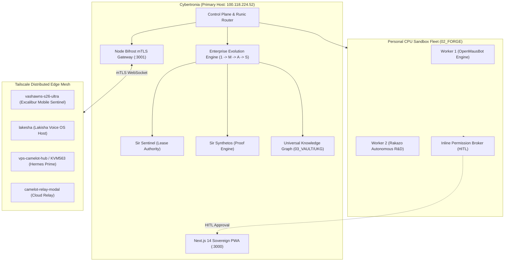
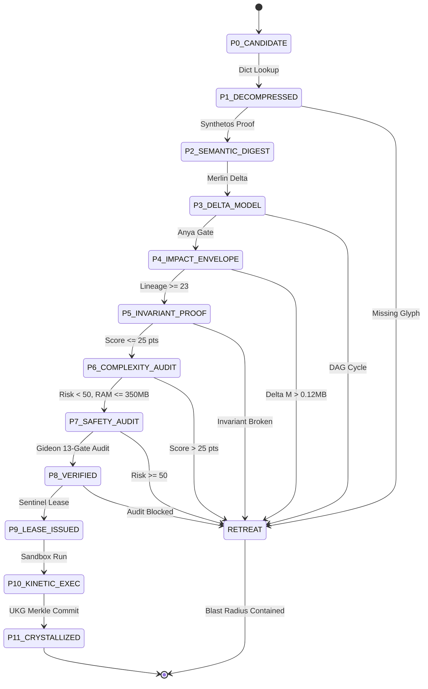
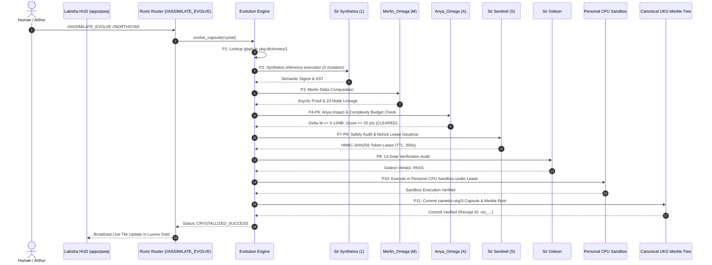

# Camelot-OS SADD + LLDD v10001.00-CYBERTRONIA
<!-- Copyright © 2026 Invisioned Marketing Inc. All Rights Reserved. -->
@ctx|camelot-os.dev/ukg/v10001/architecture @typ|Sovereign_SADD_LLDD id|Ω_SADD_LLDD_V10001

**Full Sovereign System Architecture Design Document (SADD) & Low-Level Design Document (LLDD)**

- **System**: Camelot-OS / Cybertronia Sovereign Operating System
- **Version**: `v10001.00-CYBERTRONIA` (Authoritative Evolutionary Upgrade from v1.2)
- **Status**: Living Production Specification
- **Operating Model**: Local-first, position-addressed VFS, zero hot-path bloat, dual-gate formal verification, federated Tailscale mesh
- **Cognitive Apex**: `control_plane/runes/runic_router.py` + `control_plane/pipeline/evolution_engine.py`
- **Memory Ceiling**: $\le 350\text{ MB RSS}$ per worker node; 60% CPU quota boundary; 16 MB Northstar control kernel boundary

---

## Executive Summary & Evolutionary Delta from v1.2

The `v1.2` specification documented the initial planner/executor/verifier triangle (Anya, Merlin, Gideon) and baseline lease concepts. Over subsequent execution epochs, the system underwent deep empirical evolution into `v10001.00-CYBERTRONIA`. 

This authoritative document codifies:
1. **The Dual-Helix Enterprise Evolution Engine**: The formal binding of `νKG` (Crystallized Memory) $\rightleftharpoons$ `//ASSIMILATION` (Dynamic Ingestion & Metabolism) under the constitutional **$1 \to \text{M} \to \text{A} \to \text{S}$ Doctrine**.
2. **Contract Families `camelot-ukg/3` & `ukg-dictionary/1`**: Full structural contracts containing provenance DAGs, adoption verdicts, explicit glyph semantics (`✓`, `~`, `?`, `!`, `ø`), and 23-node canonical lineage trails.
3. **Personal CPU Sandboxes & Northstar Background Workers (`Ω_NORTHSTAR_WORKER_SANDBOX`)**: Lightweight process-level and worktree-isolated execution sandboxes with resource capping ($\le 350\text{MB}$, $\le 60\%$ CPU) and Inline Permission Broker HITL approval cards.
4. **The 16 Sovereign Round Table Knights Pantheon**: Codification of all 16 specialized sovereign engines across the distributed mesh.
5. **High-Throughput Edge Routing Subsystem**: Assimilation of `OmniRoute` (multi-provider AI gateway), `BitRouter` (chunked token/audio streaming), `FreeLLMAPI` (zero-cost pool), and `Aoede/SGLang` 5-Pillar Real-Time Audio.
6. **Multi-Tier Living Memory Plane**: VFS World Tree position addressing (`vfs://worldtree/`), MemCastle Tier-2 KNN vector store, and Graphiti temporal knowledge graph (`sir_helios_graphiti.db`).

---

# PART I — SYSTEM ARCHITECTURE DESIGN DOCUMENT (SADD)

## 1. Sovereign Architecture Principles & The Titanium Laws

The execution fabric of Camelot-OS is strictly bound by the **Titanium Laws**:

1. **Anya First & Last Gate (`ANYA_IS_THE_GATE`)**: Zero unverified code commits. All architectural proposals must clear Anya Gate ($\Delta M \le 0.12\text{ MiB}$, zero taint, zero bypass).
2. **Constitutional Axiom (`IDENTITY ≠ COMPETENCE ≠ AUTHORITY`)**: Persona declarations or model outputs never constitute authority. An agent claiming to be an administrator possesses zero direct execution privileges unless holding a Sentinel-signed nonce lease.
3. **Sentinel Sole Authority**: Sentinel is the only service permitted to issue cryptographic kinetic leases. Bifrost authenticates and transports; it never authorizes.
4. **Iron Gate HITL Boundary**: Any operation changing $> 10$ lines, moving $> 50\text{MB}$, touching `01_KERNEL`, or having a calculated risk score $\ge 50$ requires human-in-the-loop authorization (`CAMELOT_DASHBOARD_OPERATOR_TOKEN`).
5. **Zero Hot-Path Bloat (Rule 7)**: Strictly 0% Python/Node in performance-critical audio, streaming, and network packet paths. All hot-paths execute in native Rust, C++, Go, and WASM.
6. **Provenance Ledger Integrity**: Every state mutation, crystal generation, or git commit must append an immutable entry to the quad-mirrored `PROVENANCE_LEDGER.md`.
7. **Cache is Acceleration, Never Truth**: No cached state or model memory may serve as the sole foundation for an effect authorization.
8. **First-Class Retreat**: When a promotion gate, invariant proof, or complexity check fails, the system executes an honorable, structured `RETREAT` with full evidence logging, rather than deadlocking or force-merging.

---

## 2. Enterprise Macro Topology & Cybertronia Mesh

Camelot-OS operates as an air-gapped or federated sovereign mesh coordinated by **Cybertronia** over Tailscale:



---

## 3. The 16 Sovereign Round Table Knights Pantheon

| Knight ID | Sovereign Domain & Specialization | Substrate / Engine | VFS Coordinate & Bound Nodes |
| :--- | :--- | :--- | :--- |
| **MERLIN_Ω** | System 2 Planning, Task-DAG & Invariance | Gemini Pro / Claude Opus | `vfs://worldtree/knights/merlin_omega/` |
| **ANYA_Ω** | Sovereign Compiler & Enterprise Impact | Sovereign Lattice | `vfs://worldtree/knights/anya_omega/` |
| **SIR_BORIS** | Lead Architect, UI/UX, Crucible Conductor | Claude Code / Gemini | `vfs://worldtree/knights/sir_boris/` |
| **SIR_CODEX** | Kinetic Implementer & Z3 Logic Prover | OpenAI Codex / GPT-5.5 | `vfs://worldtree/knights/sir_codex/` |
| **SIR_HELIOS** | Spire Sentinel, Telemetry & Antigravity CLI | Gemini 3.8 Flash (FastMCP) | `vfs://worldtree/knights/sir_helios/` |
| **SIR_HELIO** | Bifrost Guardian & Voice OS Sentinel | Gemini 3.8 Flash | `vfs://worldtree/knights/sir_helio/` |
| **SIR_SENTINEL** | Sole Lease Authority & Policy Enforcer | Gemini 3.8 Flash | `vfs://worldtree/knights/sir_sentinel/` |
| **LADY_MNEMOSYNE**| WorldTree Living Memory & 24D Leech Lattice| SQLite-VSS / Vec | `vfs://worldtree/knights/lady_mnemosyne/` |
| **LADY_APIS** | Bio-Kinetic Swarm / BASHR Forager | Gemini 3.8 Flash / NullClaw | `vfs://worldtree/knights/lady_apis/` |
| **HERMES_PRIME** | Always-on VPS Co-Pilot & Trajectory Loop | Gemini / Hermes OS | `vfs://worldtree/knights/hermes_prime/` |
| **SIR_KAY** | High Seneschal & Kinetic Direct Build | Gemini 3 Pro / GPT-5.5 | `vfs://worldtree/knights/sir_kay/` |
| **SIR_LUKAS** | Herald of Telemetry & Visual Verification | Gemini 3 Flash / GPT-5.3 | `vfs://worldtree/knights/sir_lukas/` |
| **SIR_SONUS** | Multivoice Audio Routing & Aoede S2S | Port :7680 Native Audio | `vfs://worldtree/knights/sir_sonus/` |
| **SIR_GHOST** | Local Privacy & Air-Gap Vault Sentinel | Ollama Local Container | `vfs://worldtree/knights/sir_ghost/` |
| **SIR_OCTAVIAN** | Factory Warden & WASM PTY Execution | Rust 1.96 / Wasmtime 14 | `vfs://worldtree/knights/sir_octavian/` |
| **ARTHUR_OMEGA** | Sovereign King Authority & Consensus | Human Operator (Vizion) | `vfs://worldtree/knights/arthur_omega/` |

---

## 4. The Dual-Helix Epistemic Evolution Subsystem

### 4.1 The $1 \to \text{M} \to \text{A} \to \text{S}$ Sovereign Pipeline
Knowledge ingestion and architectural transformation are bifurcated into distinct, non-overlapping roles:

```
[EXTERNAL INPUT] ──> [SIR SYNTHETOS (1)] ──> [MERLIN_Ω (M)] ──> [ANYA_Ω (A)] ──> [SIR SENTINEL (S)]
                           │                       │                   │                    │
                  Deterministic Decomp       Topology Delta     Enterprise Impact    HMAC Nonce Lease
                  AST Digest (0 Mutation)   Invariants (DAG)     Complexity <= 25    RAM <= 350MB, Risk < 50
```

1. **Synthetos (1)**: Evaluates *"What does the code/glyph state?"* Decompresses deterministic AST using `ukg-dictionary/1`. Guarantees 0 host mutations.
2. **Merlin (M)**: Evaluates *"What does this change imply architecturally?"* Proves dependency graph acyclicity and maintains the 23-node canonical lineage height.
3. **Anya (A)**: Evaluates *"What are the enterprise and human consequences?"* Measures $\Delta M \le 0.12\text{ MiB}$, verifies blast radius, and computes the deterministic **Complexity Budget**.
4. **Sentinel (S)**: Evaluates *"Does this meet safety bounds?"* Confirms risk $< 50$, simulated memory $\le 350\text{MB}$, CPU $\le 60\%$, and issues a short-lived, nonce-bounded HMAC-SHA256 kinetic execution lease.

### 4.2 The 11 Promotion Gates (P0 $\to$ P11)



### 4.3 Complexity & Safety Budgets

To prevent enterprise software rot, changes are strictly budgeted:

- **Complexity Budget Formula**:
  $$\text{Score} = (\text{Daemons} \times 10) + (\text{DB Tables} \times 8) + (\text{Net Hops} \times 5) + (\text{Uncached Routes} \times 4)$$
  - **Invariants**: $\text{Daemons} \le 1$, $\text{DB Tables} \le 2$, $\text{Net Hops} \le 2$, $\text{Total Score} \le 25$.
- **Safety Budget Invariants**:
  - $\text{Risk Score} < 50.0$ (Scores $\ge 50$ halt for HITL approval).
  - $\text{Memory Consumption} \le 350.0\text{ MB RSS}$.
  - $\text{CPU Quota} \le 60.0\%$.
  - $\text{Hot-Path Bloat} = 0\%$ (Zero Python/Node in streaming/audio loops).

### 4.4 Adaptive Cognitive Depth Routing ($D_0 \to D_4$)

| Depth | Name | Target Operations | Engaged Engines | Token Budget |
| :--- | :--- | :--- | :--- | :--- |
| **$D_0$** | Direct FastPath | Read-only queries, telemetry, status probes | Single Knight / Cached VFS | $< 100$ |
| **$D_1$** | Static Verify | Local file edits $\le 10$ lines, unit test checks | Codex + Static Linter | $< 500$ |
| **$D_2$** | Synthetos Verifier | Medium-risk tasks, local sandbox executions | Synthetos + Sentinel | $< 2,000$ |
| **$D_3$** | Four-Knight Council | External repo imports, schema changes, network routing | Synthetos + Merlin + Anya + Sentinel | $< 8,000$ |
| **$D_4$** | Archmage Council | Kernel alterations, cryptographic rotation, systemd | Full Pantheon + Arthur HITL | Cap: $32,000$ |

---

## 5. Personal CPU Sandboxes & Northstar Background Workers

Assimilating the patterns of `rakazo`, `OpenMausBot`, and `openmausbotOS`:

1. **Personal CPU Sandbox (`personal_cpu_sandbox.py`)**:
   - Spawns lightweight ephemeral execution environments inside `data/sandboxes/<worker_id>/`.
   - Isolates execution using OS process boundaries, temporary git worktrees, and strict resource quotas ($350\text{MB RSS}$, $60\%$ CPU).
2. **Northstar Worker Engine (`northstar_worker_engine.py`)**:
   - Decomposes high-altitude northstar objectives into step-by-step milestone execution plans.
   - Executes asynchronously in background daemon threads without blocking the central control plane.
3. **Inline Permission Broker (`permission_broker.py`)**:
   - Intercepts mutating actions (shell execution, git push, network egress, file edits $> 10$ lines).
   - Generates interactive HITL permission cards with cryptographic signatures broadcast to the PWA cockpit and Bifrost WebSocket.

---

## 6. High-Throughput Edge Routing Subsystem

1. **OmniRoute Gateway (`omniroute_gateway.py`)**:
   - Dynamic multi-provider AI model router supporting Gemini, Anthropic Claude, OpenAI, DeepSeek, and Groq.
   - Intelligent automatic fallback routing with latency and error-rate health scoring.
2. **BitRouter Streaming Engine (`bitrouter_engine.py`)**:
   - Chunked HTTP/1.1 and WebSocket token streaming engine designed for zero-latency audio and text synthesis.
3. **FreeLLMAPI Client (`freellmapi_client.py`)**:
   - Pooled zero-cost inference gateway connecting up to 34 public free providers for background research and Squire exploration.
4. **Multi-Voice 5-Pillar Real-Time Audio HUD**:
   - Native Port `:7680` duplex voice engine running SGLang RadixAttention prefix caching and Agora RTC transport.

---

## 7. Living Memory & Knowledge Representation Plane

```
[VFS World Tree] ────────> vfs://worldtree/knights/ (Sovereign Coordinates)
      │
      ├──────────────────> vfs://worldtree/crystals/ (camelot-ukg/3 Capsules)
      │
      └──────────────────> vfs://worldtree/mesh/ (Tailscale Topologies)

[MemCastle KNN] ─────────> SQLite-vec O(1) Vector Embeddings (Cross-Session)

[Graphiti Substrate] ────> sir_helios_graphiti.db (Temporal Fact Triplet Store)
```

---

# PART II — LOW-LEVEL DESIGN DOCUMENT (LLDD)

## 8. Formal Contract Schemas & Wire Specifications

### 8.1 Capsule Contract: `camelot-ukg/3`
Located at [`03_VAULT/UKG/SCHEMAS/camelot_ukg_3_schema.json`](file:///C:/Users/vizio/CAMELOT_OS/03_VAULT/UKG/SCHEMAS/camelot_ukg_3_schema.json):

```json
{
  "schema_version": "camelot-ukg/3",
  "node_id": "crystal_northstar",
  "vfs_coordinate": "vfs://worldtree/crystals/crystal_northstar",
  "glyph_handle": "[✓//NORTHSTAR]",
  "glyph_operator": "✓",
  "seed": "833da0d58223cfa376e9f788173dbc67053a95bc40653f3ee592582fa0f5ee99",
  "decompression_dictionary_ref": "vfs://worldtree/ukg/dictionary/dict_canonical_baseline_v10001",
  "ontology_version": "v10001.00-CYBERTRONIA",
  "provenance_dag": {
    "parent_nodes": ["vfs://worldtree/crystals/omega_production_kernel"],
    "edges": [
      {
        "source": "vfs://worldtree/crystals/crystal_northstar",
        "target": "vfs://worldtree/crystals/omega_production_kernel",
        "relation": "EVOLVED_FROM"
      }
    ],
    "lineage_height": 23,
    "merkle_root": "6b945474cf7663b6e5508ec8ae101ab110ccaae263a5d22070edf7c7b69ef03f"
  },
  "adoption_verdicts": {
    "synthetos": "VERIFIED",
    "merlin": "PASS",
    "anya": "ANYA_IS_THE_GATE_CLEARED",
    "sentinel": "LEASE_GRANTED",
    "gideon": "pass",
    "arthur": "RATIFIED"
  },
  "uncertainty_markers": {
    "confidence_score": 1.0,
    "contested_claims": [],
    "open_questions": []
  },
  "architectural_lineage": ["LINEAGE_NODE_01", "... (23 nodes)"],
  "doctrine": "1_TO_M_TO_A",
  "source_digests": {
    "crystal_source": "641f2626b22a67df40d1e34edc2673dede1782d5e664f4872446da2d64ade9e7",
    "lease_hash": "280c4f8c04efc475a8c312fbb5b06e9a423819423be1df982e52cdc3ce8bc3d1"
  },
  "compatibility_metadata": {
    "memory_ceiling_mb": 12.0,
    "cpu_quota_pct": 10.0,
    "zero_hotpath_bloat": true,
    "complexity_points": 0
  }
}
```

### 8.2 Decompression Dictionary: `ukg-dictionary/1`
Located at [`03_VAULT/UKG/SCHEMAS/ukg_dictionary_1_schema.json`](file:///C:/Users/vizio/CAMELOT_OS/03_VAULT/UKG/SCHEMAS/ukg_dictionary_1_schema.json):
Maps human/LLM-facing glyph symbols (`//NORTHSTAR`, `//OMNIROUTE`, `//BITROUTER`) to canonical AST fragments and target engines deterministically.

---

## 9. Sequence Diagrams

### 9.1 End-to-End Ingestion, Evolution & Execution Flow



---

# PART III — PRODUCTION ENGINEERING PLANE (DG-310 → DG-440)

## 11. Production Engineering Invariants

The Production Engineering Plane establishes the industrial foundation beneath the cognitive and authority layers:

```
NO RELEASE WITHOUT A RELEASE MANIFEST.
NO MIGRATION WITHOUT A MIGRATION PLAN.
NO BACKUP WITHOUT A RESTORE TEST.
NO AUTHORITY KEY WITHOUT A ROTATION PLAN.
NO SERVICE WITHOUT AN SLO.
NO ASSIMILATION WITHOUT A SANDBOX.

BUILD ONE.
MEASURE IT.
ADOPT WHAT SURVIVES.

RELEASE WHAT CAN BE REPRODUCED.
OPERATE WHAT CAN BE OBSERVED.
UPGRADE WHAT CAN BE ROLLED BACK.
TRUST WHAT CAN BE VERIFIED.
CALL NOTHING PRODUCTION
THAT CANNOT RECOVER.
```

---

## 12. Release Engineering & Attestation (`camelot-release-proof/1`)

Located at [`control_plane/production/release_proof.py`](file:///C:/Users/vizio/CAMELOT_OS/control_plane/production/release_proof.py) and [`packages/contracts/release-proof.schema.json`](file:///C:/Users/vizio/CAMELOT_OS/packages/contracts/release-proof.schema.json):

```
SOURCE ──> BUILD ──> TEST ──> ATTEST ──> RELEASE PROOF ──> DEPLOY ──> VERIFY ──> PROMOTE
```

Every Camelot release generates a signed release proof binding:
- **`release`**: Version, source commit, source tree digest, release timestamp.
- **`contracts`**: `registry_digest` and `lock_digest` (from `CONTRACTS.lock`).
- **`artifacts`**: SHA-256 digests of all compiled daemon binaries and app bundles.
- **`supply_chain`**: SBOM digest, dependency lockfile digest, and hermetic build provenance.
- **`migration`**: Explicit migration set and tested rollback set.
- **`compatibility`**: Minimum and maximum required state version; required feature set.
- **`verification`**: Test report digest, security audit digest, and chaos drill attestation.
- **`proof_signature`**: Signed specifically by an authorized key holding the `RELEASE` signer class.

---

## 13. Configuration as a Contract (`camelot-config/1`)

Located at [`control_plane/production/config_contract.py`](file:///C:/Users/vizio/CAMELOT_OS/control_plane/production/config_contract.py) and [`packages/contracts/config.schema.json`](file:///C:/Users/vizio/CAMELOT_OS/packages/contracts/config.schema.json):

All node and cluster configuration is classified into five formal categories:
1. **`STATIC`**: Fixed at boot (e.g. `BIFROST_PORT`, `PWA_PORT`). Modification requires full process restart.
2. **`RELOADABLE`**: Safe for hot-reloading without downtime (e.g. `LOG_LEVEL`, telemetry sampling rate).
3. **`SECRET_REFERENCE`**: Pointers to air-gapped vault entries (e.g. `env:MEMPALACE_SECRET`). Raw secrets are strictly prohibited.
4. **`BOOTSTRAP_ONLY`**: Parameters consumed only during cluster genesis initialization.
5. **`AUTHORITY_CRITICAL`**: Cryptographic keys, authority epoch signers, Sentinel lease keys, and Anya gate verification secrets.
   - *Invariant*: Any missing, unverified, or non-reference `AUTHORITY_CRITICAL` configuration results in immediate boot failure (`ConfigContractError`).

---

## 14. The State & Schema Migration Engine

Located at [`control_plane/production/migration_engine.py`](file:///C:/Users/vizio/CAMELOT_OS/control_plane/production/migration_engine.py):

```
PRECHECK ──> SNAPSHOT ──> MIGRATE ──> VERIFY ──> PROMOTE
    │            │           │          │
    └────────────┴───────────┴──────────┴──[FAIL]──> RETREAT (Restore Snapshot)
```

1. **Precheck**: Evaluates environmental and state invariants before touching storage.
2. **Snapshot**: Captures a cryptographic point-in-time state hash and backup partition.
3. **Migrate**: Executes sequential step functions across database, VFS, UKG, or memory partitions.
4. **Verify**: Asserts semantic state invariants post-migration.
5. **Promote / Retreat**: Emits a signed `MigrationReceipt`. On any verification failure, the engine automatically rolls back steps in reverse order, restores the verified snapshot, and logs a retreat record.

---

## 15. Domain-Restricted Signer Classes & Key Epochs

Located at [`control_plane/production/key_lifecycle.py`](file:///C:/Users/vizio/CAMELOT_OS/control_plane/production/key_lifecycle.py):

Keys are segregated into non-overlapping domain-restricted signer classes:
- **`ROOT`**: Offline sovereign anchor; key delegation and revocation only.
- **`POLICY`**: Sentinel policy decision and rule binding.
- **`EPOCH`**: Monotonic authority epoch promotion.
- **`RECEIPT`**: Merkle chain receipt commits.
- **`KNIGHT_REGISTRY`**: Persona package admission.
- **`CONTEXT_COMPILER`**: Dynamic prompt and memory frame generation.
- **`UKG_REGISTRY`**: Universal Knowledge Graph crystal sealing.
- **`RELEASE`**: Release proof attestation and artifact signing.
- **`HOST`**: Hardware identity and Tailscale mesh attestation.
- **`ADAPTER`**: Tool and external model proxy responses.

*Invariant*: A key with `CONTEXT_COMPILER` or `HOST` class is mathematically and programmatically prohibited from signing an `EPOCH` or `POLICY` directive (`DOMAIN_VIOLATION`).

---

## 16. Universal Safe Mode & Emergency Authority Freeze

Located at [`control_plane/production/safe_mode.py`](file:///C:/Users/vizio/CAMELOT_OS/control_plane/production/safe_mode.py):

```
NORMAL ──> DEGRADED ──> SAFE ──> FROZEN ──> RECOVERY
```

- **`FROZEN` Posture Matrix**:
  - New Leases: **DENY**
  - Epoch Promotion: **DENY** (except with Arthur recovery quorum)
  - External Writes / File Mutations: **DENY**
  - Assimilation Apply: **DENY**
  - Read Canonical State: **ALLOW**
  - Verify Receipts: **ALLOW**
  - Diagnostics & Telemetry: **ALLOW**
  - Export Evidence: **ALLOW**

Operators have a single constitutional emergency brake (`//SAFE_MODE FREEZE`) that stops all autonomous side-effects while preserving full observability.

---

## 17. Bounded Backpressure & Effect-Class Retries

Located at [`control_plane/production/backpressure_queue.py`](file:///C:/Users/vizio/CAMELOT_OS/control_plane/production/backpressure_queue.py):

Retry mechanics derive from the mathematical determinism of the effect:
- **`PURE` / `READ_ONLY`**: Up to 5 retries with exponential backoff.
- **`IDEMPOTENT_WRITE`**: Up to 3 retries bound to a deduplication token.
- **`REVERSIBLE_WRITE`**: At most 1 retry; then rollback snapshot.
- **`IRREVERSIBLE_WRITE`**: **Zero automatic retries**; requires HITL authorization.
- Queues maintain strict `max_depth` and `max_inflight` quotas, dropping or rejecting work before system degradation occurs.

---

## 18. The Extended Production DAG: DG-310 through DG-440

| DAG Node | Milestone Name | Core Deliverable | Verification Gate |
| :--- | :--- | :--- | :--- |
| **DG-310** | Contract Registry | `CONTRACTS.lock` verification & registry index | Byte-identical schema digest |
| **DG-320** | Configuration Contract | `camelot-config/1` typing & validation | Authority-critical check pass |
| **DG-330** | State Migration Engine | 5-stage migration FSM with automated retreat | Dry-run snapshot recovery test |
| **DG-340** | Key Lifecycle & Epochs | Domain-separated signer classes | Domain signature enforcement |
| **DG-350** | Release Proof Generator | `camelot-release-proof/1` attestation | Signature & SBOM verification |
| **DG-360** | Observability Telemetry | Standardized trace envelope (`questId`, etc.) | Cross-service span correlation |
| **DG-370** | Architectural SLOs | 5 Zeros tracking (zero unreceipted promotion, etc.) | Metric boundary adherence |
| **DG-380** | Automated Restore | Periodic disposable environment restore drills | Cryptographic state matching |
| **DG-390** | Universal Safe Mode | 5-state governor (`NORMAL` $\to$ `FROZEN`) | Emergency freeze verification |
| **DG-400** | Backpressure & Retries | Bounded concurrency & effect-class retry engine | Overload rejection verification |
| **DG-410** | Shadow Deployment | Side-by-side observe-only execution comparison | Zero mutation variance proof |
| **DG-420** | Property & Fuzz Testing | Hypothesis fuzzers for contracts and glyphs | Invariant preservation under fuzz |
| **DG-430** | Chaos & Recovery Drills | Kill-testing of Bifrost and Sentinel nodes | RTO $\le 30$s, RPO $= 0$ receipts |
| **DG-440** | Enterprise Promotion | Final sovereign certification by Arthur Omega | Sovereign production seal |

---

## 19. Concrete Codebase Implementation Map

| Subsystem Component | Canonical File Coordinate |
| :--- | :--- |
| **Enterprise Evolution Engine** | [`control_plane/pipeline/evolution_engine.py`](file:///C:/Users/vizio/CAMELOT_OS/control_plane/pipeline/evolution_engine.py) |
| **Synthetos Proof Engine** | [`control_plane/pipeline/synthetos_proof.py`](file:///C:/Users/vizio/CAMELOT_OS/control_plane/pipeline/synthetos_proof.py) |
| **Runic Router & Dispatcher** | [`control_plane/runes/runic_router.py`](file:///C:/Users/vizio/CAMELOT_OS/control_plane/runes/runic_router.py) |
| **Configuration Contract** | [`control_plane/production/config_contract.py`](file:///C:/Users/vizio/CAMELOT_OS/control_plane/production/config_contract.py) |
| **Key Lifecycle Manager** | [`control_plane/production/key_lifecycle.py`](file:///C:/Users/vizio/CAMELOT_OS/control_plane/production/key_lifecycle.py) |
| **State Migration Engine** | [`control_plane/production/migration_engine.py`](file:///C:/Users/vizio/CAMELOT_OS/control_plane/production/migration_engine.py) |
| **Release Proof Generator** | [`control_plane/production/release_proof.py`](file:///C:/Users/vizio/CAMELOT_OS/control_plane/production/release_proof.py) |
| **Universal Safe Mode** | [`control_plane/production/safe_mode.py`](file:///C:/Users/vizio/CAMELOT_OS/control_plane/production/safe_mode.py) |
| **Backpressure Queue Engine** | [`control_plane/production/backpressure_queue.py`](file:///C:/Users/vizio/CAMELOT_OS/control_plane/production/backpressure_queue.py) |
| **Contract Registry Verifier** | [`packages/contracts/registry.py`](file:///C:/Users/vizio/CAMELOT_OS/packages/contracts/registry.py) |
| **Contract Lockfile** | [`packages/contracts/CONTRACTS.lock`](file:///C:/Users/vizio/CAMELOT_OS/packages/contracts/CONTRACTS.lock) |
| **Release Proof Schema** | [`packages/contracts/release-proof.schema.json`](file:///C:/Users/vizio/CAMELOT_OS/packages/contracts/release-proof.schema.json) |
| **Config Contract Schema** | [`packages/contracts/config.schema.json`](file:///C:/Users/vizio/CAMELOT_OS/packages/contracts/config.schema.json) |
| **Personal CPU Sandbox** | [`02_FORGE/assimilation/workers/personal_cpu_sandbox.py`](file:///C:/Users/vizio/CAMELOT_OS/02_FORGE/assimilation/workers/personal_cpu_sandbox.py) |
| **Northstar Worker Daemon** | [`02_FORGE/assimilation/workers/northstar_worker_engine.py`](file:///C:/Users/vizio/CAMELOT_OS/02_FORGE/assimilation/workers/northstar_worker_engine.py) |
| **Inline Permission Broker** | [`02_FORGE/assimilation/workers/permission_broker.py`](file:///C:/Users/vizio/CAMELOT_OS/02_FORGE/assimilation/workers/permission_broker.py) |

---

## 20. College Sophomore Intuitive Summary (Rule 8)

> Imagine you've designed a brilliant autonomous robot chef. It can brainstorm a 10-course gourmet meal in seconds (`Cognitive Plane`), verify food safety regulations (`Authority Plane`), and operate appliances (`Assimilation Plane`).
>
> But if the robot panics when a pan catches fire, plugs a 220V toaster into a 110V outlet, accidentally orders 10,000 lbs of butter because of a network retry glitch, or replaces the menu without checking if the pantry has the ingredients, **you can't open a commercial restaurant with it.**
>
> The **Production Engineering Plane** is the industrial infrastructure of the kitchen:
> 1. **Emergency Breaker (`Universal Safe Mode`)**: Pulling one lever cuts power to the stoves, locks the pantry doors, but leaves the security lights and cameras on.
> 2. **Barcoded Food Shipments (`Release Proof & Contracts Lock`)**: No ingredients enter the kitchen without a tamper-evident seal and laboratory certification.
> 3. **Fire Drills (`Restore Testing`)**: We don't just buy a fire extinguisher; every week we set off a test drill in an empty sandbox room to guarantee water actually sprays.
> 4. **Standard Operating Kitchen Upgrades (`Migration Engine`)**: If the kitchen remodels, it follows a 5-step checklist and keeps a full backup so it can rollback in 10 minutes if the new ovens don't fit.
> 5. **Order Queues & Backpressure**: If 500 customers order at once, the kitchen doesn't crash or double-bill customers; it queues orders neatly by priority and rejects new tickets when the line is full.
>
> Now, the restaurant isn't just an experimental food lab—it's an **unbreakable, sovereign commercial enterprise.**

