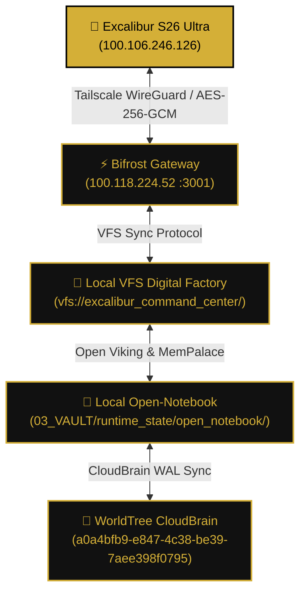

# ⚔️ EXCALIBUR COMMAND CENTER · WORLDTREE ENTIRE MAP & CI/CD MATRIX ⚔️
========================================================================================
**Node Identity:** `vashawns-s26-ultra` (`100.106.246.126` / Excalibur Mobile Sentinel)
**Host Substrate:** Samsung Galaxy S26 Ultra / Android 16 / Linux Termux Core
**Operator Authority:** King Arthur (VaShawn O. Head / Vizion)
**Arch-Sovereign Governance:** Anya Law (King Arthur -> ANYA_OMEGA -> Symbollect -> Knights -> King Arthur)
**System Version:** `v1000.54-EXCALIBUR-A`
**CI/CD Snapshot ID:** `excalibur_cicd_20260828_202248`
**WorldTree Home Anchor:** `a0a4bfb9-e847-4c38-be39-7aee398f0795`
**Generated Timestamp:** 2026-08-28 20:22:48 UTC
========================================================================================

## 1. EXCALIBUR TOPOLOGY & HARDWARE SUBSTRATE

```text
EXCALIBUR_COMMAND_CENTER (Samsung Galaxy S26 Ultra · 100.106.246.126)/
├── Hardware Profile: Snapdragon 8 Elite · 16GB RAM · Dynamic AMOLED 2X 120Hz
├── Operating System: Android 16 (Vanilla) · One UI 8.0 · Termux Linux Kernel
├── Substrates & Runes:
│   ├── Audio Node Daemon: packages/mobile-node/excalibur-audio-node.js (:8092)
│   ├── WebRTC Intercom Bridge: Excalibur Preflight & Streamer (:8090)
│   ├── Telemetry Dispatch: control_plane/dispatch/vps_mobile_mesh_bridge.py (:8095)
│   └── Bi-directional S2S Gateway: control_plane/dispatch/gemini_live_gateway.py (:8765)
└── Storage Root: /data/data/com.termux/files/home/excalibur/
    ├── audio_cache/            # High-speed circular audio buffers (*.m4a, *.pcm)
    ├── telemetry_wal/          # Offline WAL telemetry queue for VPS hub sync
    └── local_tissue/           # Open-Notebook mobile cached tissues
```

---

## 2. DYNAMIC WORLDTREE & VFS SYNCHRONIZATION LATTICE

The Excalibur Command Center maintains a persistent bi-directional tether between the physical mobile node and the CloudBrain WorldTree mesh:



| Tether Layer | Protocol / Surface | Destination Target | Sync Policy |
|---|---|---|---|
| **Mobile Audio** | HTTP/REST + Termux API | `http://100.106.246.126:8092/capture` | Sub-50ms Low-Latency Stream |
| **Intercom TTS** | Neural S2S Synthesis | `http://100.106.246.126:8092/tts` | Fenrir / Aoede Persona Modulated |
| **VFS Mesh Path** | Virtual File System | `vfs://excalibur_command_center/tether.json` | Viking Block HMAC-SHA256 Chained |
| **MemPalace L2** | Vector & Drawer Cache | `WING_WORLDTREE_EXCALIBUR` | 4-Tier Memory Fallback |
| **WorldTree Core** | NotebookLM CloudBrain | `a0a4bfb9-e847-4c38-be39-7aee398f0795` | Reconciled Knowledge Mesh |

---

## 3. CI/CD SNAPSHOT VERSIONING & INTEGRITY GATES

The Excalibur EntireMap is bound to an immutable CI/CD Snapshot pipeline:

1. **Active Release Version:** `v1000.54-EXCALIBUR-A`
2. **Snapshot Hash:** Computed per build and archived in `03_VAULT/runtime_state/snapshots/snapshot_excalibur_cicd_20260828_202248.json`
3. **Cryptographic Proof Chain:** Chained to `03_VAULT/Missions/verification_ledger.jsonl` with sequential parent-hash linkage.
4. **Reversible Rollback:** In the event of a deployment regression, the snapshot runner can roll back node topology to the exact prior snapshot.

---

## 4. WORLDTREE MESH FLEET STATUS (EXCALIBUR PERSPECTIVE)

| Mesh Node | Address | Role | Excalibur Intercom Channel |
|---|---|---|---|
| `vashawns-s26-ultra` (SELF) | `100.106.246.126` | Kinetic Mobile Sentinel | Primary Cockpit / Tap-to-Talk |
| `cybertronia` | `100.118.224.52` | Windows Orchestrator | Gateway `:3001` / Dispatch `:8095` |
| `vps3573819` (`KVM563`) | `162.35.107.134` | Hub & Control Plane | Hermes Prime Daemon / WAL Ingress |
| `lakesha` | `100.100.155.55` | Lakisha Voice OS Host | Luxury Brutalism Voice Bridge |
| `fothers-camelot` | `100.121.48.50` | Windows Secondary Node | Distributed Build Swarm |
| `camelot-relay-modal` | `100.84.98.39` | Linux Cloud Relay | Serverless MicroVM Compute |
| `kba-services` | `100.71.218.75` | Linux Remote Services | Drone Matrix Telemetry |
| `motorola-moto-g-power` | `100.89.129.105` | Auxiliary Sentinel | Backup Telemetry Relay |

========================================================================================
*END OF EXCALIBUR COMMAND CENTER WORLDTREE ENTIRE MAP · CI/CD RATIFIED*
