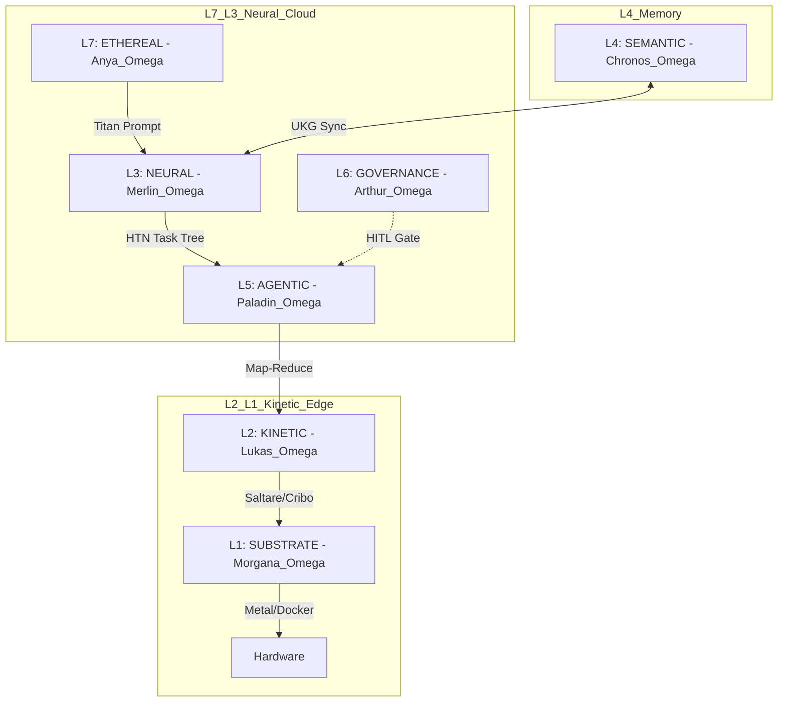

<!-- Copyright © 2026 Invisioned Marketing inc. All Rights Reserved. -->
# 📜 CAMELOT-OS: MASTER SYSTEM SPECIFICATION
**Version:** 400.1.0 (Lattice Radiant)  
**Classification:** SOVEREIGN / CONFIDENTIAL  
**Authors:** Merlin_Omega, Anya_Omega, Lukas_Edge  

---

## 1. ARCHITECTURAL OVERVIEW: THE SINGULARITY LATTICE
Camelot-OS is a split-topology agentic operating system designed to bifurcate Cloud-based Neural Reasoning from Edge-based Kinetic Execution. This architecture eliminates the "hallucination-to-metal" risk by enforcing a strict **Septem Regna** governance layer.

### 1.1 Structural Visualization (Mermaid)

---

## 2. THE SEPTEM REGNA (7 SOVEREIGN LAYERS)

| LAYER | DESIGNATION | PRIMARY ENGINE | CORE FUNCTION |
| :--- | :--- | :--- | :--- |
| **L7** | **ETHEREAL** | APEE v6.5 | Intent Compilation & Triple-QFT Renormalization. |
| **L6** | **GOVERNANCE** | Iron Gate v1.1 | Policy Enforcement & Copyright Shield (CES). |
| **L5** | **AGENTIC** | SARDA Engine | Swarm Orchestration & Map-Reduce Dispatch. |
| **L4** | **SEMANTIC** | Ouroboros | Immutable Truth Graphs & UKG JSON-LD Memory. |
| **L3** | **NEURAL** | Videneptus | High-Criticality Reasoning & LaC Oscillation. |
| **L2** | **KINETIC** | Lukas Stack | Zero-Latency Binary Execution (Rust/Go). |
| **L1** | **SUBSTRATE** | Modal/Bridge | Hardware Interface & Sandbox Isolation. |

---

## 3. CORE PROTOCOLS

### 3.1 Triple-QFT (Quantization, Qualification, Transformation)
Processes raw human vibe into machine-readable directives. Strips conversational filler (Physics) and identifies anchor tokens (Engineering).

### 3.2 NDR+S (Neurosymbolic Deep Reasoning + Synthesis)
Integrates symbolic task trees (HTN) with neural intuition. Enforces the **Trinity Validation Check** (Logic, Risk, Alignment) before any disk commit.

### 3.3 Bio-Kinetic Swarm Zoology
Deploys 150-token **Nano-Knights** for high-velocity parallel work:
- **Formica (Ants):** Parallel rewriting.
- **Pongid (Gorillas):** API/SDK heavy-lifting.
- **Castor (Beavers):** Security dams and sandboxing.

---

## 4. KINETIC PURITY METRICS
- **Baseline Purity:** 98/100.
- **Memory Ceiling:** 8GB (Operational at 1.4GB).
- **Latency:** < 1.2s for full system bootstrap.

---
**[STAMP]:** RADIANT LATTICE v400.1.0
**[VALIDATED]:** By Sir Gideon 🦂 (Scorpion Pass)
