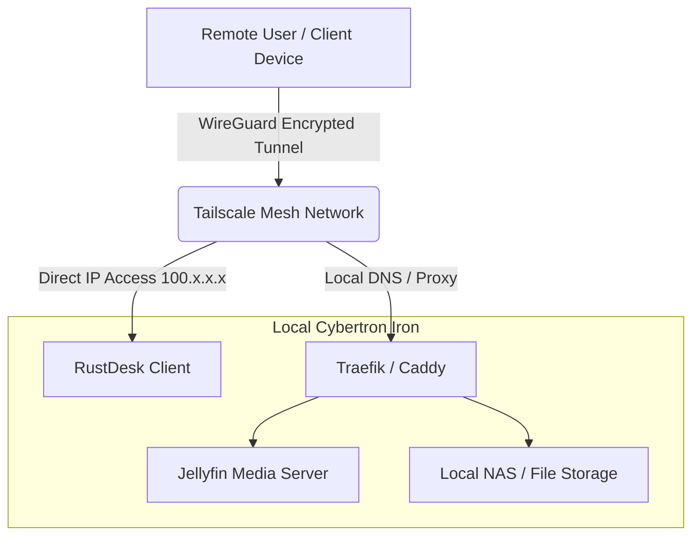

# 🏛️ BLUEPRINT.md — Sovereign Streaming & Remote Desktop Hub
**Codename:** Omega_KINETIC_NEXUS
*(c) 2024-2026 Invisioned Marketing Inc. | ALL RIGHTS RESERVED.*

## 1. Goal & Why
**Business Value:** To achieve absolute digital sovereignty over remote desktop operations and media streaming without relying on paid, unsecure SaaS subscriptions (like TeamViewer) or complex port-forwarding setups.
**Primary Objective:** Deploy a 4-layer zero-trust architecture combining Tailscale (Encrypted LAN), RustDesk (Remote Desktop), Jellyfin (Media Streaming), and a Reverse Proxy (Caddy/Traefik). 

## 2. Tech Stack & MCPs
*   **Layer 1 (Network):** Tailscale (WireGuard-backed encrypted private LAN + ACLs).
*   **Layer 2 (Kinetic Control):** RustDesk (100% Rust native client for desktop control, file transfer, and remote execution).
*   **Layer 3 (Media/Streaming):** Jellyfin (Open-source Personal Netflix for local rips and legal streams).
*   **Layer 4 (Routing):** Traefik or Caddy (Reverse proxy to route internal traffic securely).

## 3. System Topology

## 4. Sovereign Constraints
1.  **Kinetic Purity (Titanium Law I):** Utilize the native RustDesk client to minimize RAM overhead and ensure maximum streaming codec performance. 
2.  **Zero Port Forwarding:** Do not expose TCP/UDP ports 80, 443, or RustDesk relay ports to the public internet. All traffic MUST route through the Tailscale `100.x.x.x` subnet.
3.  **Direct IP Authentication:** RustDesk must be configured to skip its public ID servers entirely, relying purely on Tailscale for authentication, hole-punching, and IP tracking.
