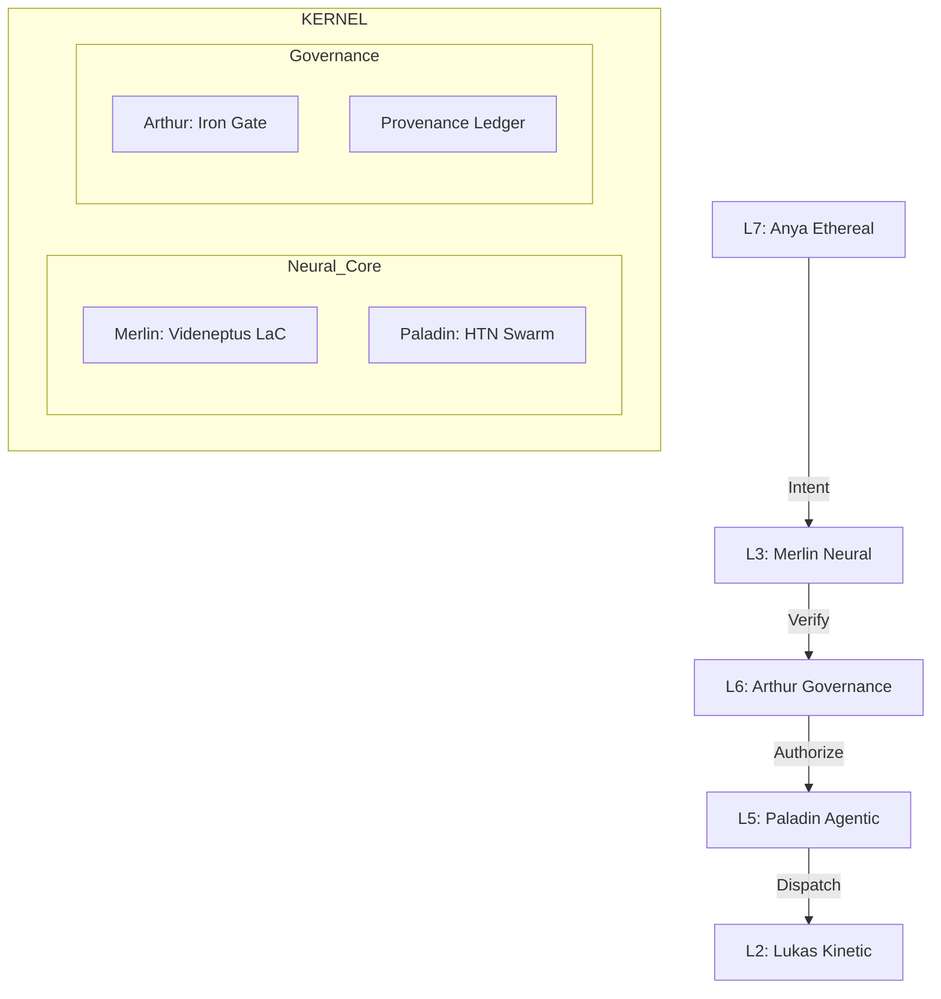

# 🧠 ARCHITECTURE: 01_KERNEL (The Brain)
**[GUARDIAN]:** Merlin (L3 Neural), Arthur (L6 Governance), Paladin (L5 Agentic)
**[STATUS]:** SINGULARITY_LATTICE_ACTIVE

## System Topology
The Kernel is the cognitive powerhouse of Camelot OS. It coordinates high-level reasoning, enforces the Iron Gate laws, and orchestrates the agentic swarm to achieve the Sovereign's objectives.

## Core Components

### 1. L3: Merlin Neural Layer
- **Role:** High-level reasoning and cognitive distillation.
- **Engine:** Videneptus LaC (Learning at Criticality) with 3-phase temperature oscillation.
- **Goal:** Transmute noisy intent into precise execution blueprints.

### 2. L6: Arthur Governance Layer
- **Role:** The ethical and security conscience of the OS.
- **Mechanism:** The Iron Gate (HITL Safeguards) and the Provenance Ledger.
- **Laws:** Enforcing the Titanium Laws across every kinetic strike.

### 3. L5: Paladin Agentic Layer
- **Role:** Hierarchical Task Network (HTN) orchestration of the Knight Swarm.
- **Protocol:** Managing multi-agent crusades and parallel task trees.

---
> *Generated by Merlin_Ω & Arthur_Ω - 2026-02-11*

