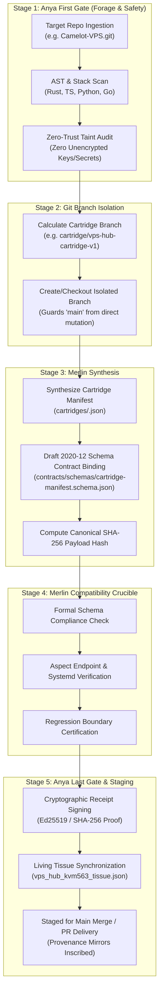

# GitHub Repository Assimilation System & Cartridge Branching Architecture
=============================================================================

## 1. Executive Summary & Sovereignty Teleology

Under the sovereign governance of **King Arthur** (VaShawn O. Head / Vizion), Camelot-OS establishes the **Universal GitHub Repository Assimilation System** (`control_plane/infra/repo_assimilation_engine.py`).

Governed collaboratively by:
- **`ANYA_OMEGA`** (`32d38906-5ae8-4ecc-b77e-705d12c89f4a`): Sovereign Compiler, Helm Authority, Anya First & Last Gate, Zero-Trust Sandbox.
- **`MERLIN_OMEGA`** (`af927fde-d7eb-42ee-8c79-51b3e78ef39b`): System 2 Architectural Reasoner, Tree-of-Thought Compatibility Prover, Formal Verification Crucible.

This system guarantees that new aspects, microservices, and capability vectors can be assimilated from and into **any GitHub repository** without ever risking regressions, race conditions, or unverified changes on the target repository's `main` branch.

All new capabilities are synthesized into modular, hot-swappable **Cartridge Configurations** and committed onto dedicated Git isolation branches (e.g. `cartridge/<cartridge-id>`) before undergoing formal verification and cryptographic sealing.

---

## 2. The 5-Stage Sovereign Assimilation Lifecycle

---

## 3. VPS Hub Singularity Cartridge Configuration

Target Repository: **`https://github.com/Cyberdad247/Camelot-VPS.git`**  
Local Path: **`apps/camelot-vps-hub`**  
Active Branch: **`cartridge/vps-hub-cartridge-v1`**  
Manifest: **`apps/camelot-vps-hub/cartridges/vps-hub-cartridge-v1.json`**

### Configured Capability Aspects:

| Aspect ID | Subsystem | Port(s) | Health Endpoint | Description |
| :--- | :--- | :--- | :--- | :--- |
| **`aspect_multivoice`** | `audio_telemetry` | `7680`, `7682` | `/api/health` | Duplex real-time audio routing with LMCache KV cache acceleration & Aoede S2S |
| **`aspect_honcho`** | `metamemory_l4` | `8000` | `/v1/health` | Hermes Prime autonomous dialectic L4 memory and session persistence |
| **`aspect_bifrost_mobile`** | `mesh_transport` | `3001`, `8095` | `/health` | Express WebSocket transport and Excalibur S26 Ultra telemetry SSE |
| **`aspect_task_dag`** | `task_scheduler` | `9000` | `/api/dag/health` | Mission execution DAG conforming to `task-dag.schema.json` |
| **`aspect_heimdall`** | `security_mtls` | `3001`, `8095`, `7680` | `/api/heimdall/lock` | Sir Heimdall strict mTLS and capability lease access enforcement on `tailscale0` |

---

## 4. Runic Routing Interface

The system is integrated directly into `control_plane/runes/runic_router.py`:

| Rune Command | Knight / Mode | Teleology |
| :--- | :--- | :--- |
| `//ASSIMILATE_REPO <url>` | `merlin_omega` (`ORACLE`) | Executes full 5-stage assimilation into an isolated cartridge branch |
| `//CARTRIDGE_BRANCH <branch>` | `sir_forge` (`FORGE`) | Prepares and validates git isolation branch without touching `main` |
| `//CARTRIDGE_VERIFY <cartridge_id>` | `merlin_omega` (`ORACLE`) | Executes formal Merlin Crucible verification against JSON Schema Draft 2020-12 |

---

## 5. Verification & Provenance

- **Test Battery**: `tests/control_plane/test_repo_assimilation_engine.py` (7/7 tests passed green).
- **Living Tissues**:
  - `03_VAULT/runtime_state/open_notebook/vps_hub_kvm563_tissue.json`
  - `03_VAULT/runtime_state/open_notebook/world_tree_tissue.json`
- **Receipts Vault**: `03_VAULT/runtime_state/assimilation_receipts/<delivery_id>.json`
