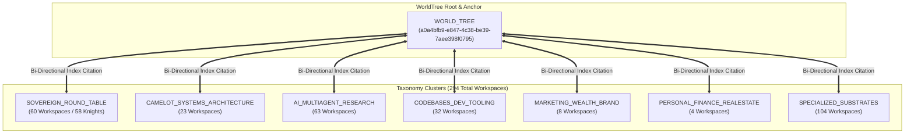

# 📜 Master NotebookLM WorldTree Manifest & Knowledge Routing Architecture

**Version:** `2.0.0-SINGULARITY`  
**Governing Node:** `WORLD_TREE` (`a0a4bfb9-e847-4c38-be39-7aee398f0795`)  
**Network Scope:** 294 Google NotebookLM Nodes | 58 Sovereign Knights  
**Engine:** Merlin Infinite Context Engine (MICE)

---

## 1. Executive Topology

The Camelot-OS CloudBrain memory fabric bridges local disk and memory tiers with external Google NotebookLM nodes, providing continuous, citation-grounded reasoning without hitting finite context-window limitations.



---

## 2. The 7 Taxonomy Clusters

| Cluster Identifier | Node Count | Description & Scope | Primary Anchor |
| :--- | :---: | :--- | :--- |
| `SOVEREIGN_ROUND_TABLE` | 60 | Dedicated workspaces for Knights of the Round Table and High Council. | `SIR_BORIS` (`f7707daa...`) |
| `CAMELOT_SYSTEMS_ARCHITECTURE` | 23 | Bifrost Bridge, Kernel, VFS, Leech-Lattice Quantization, Hermes OS. | `BIFROST` (`cbbb0c32...`) |
| `AI_MULTIAGENT_RESEARCH` | 63 | AntiGravity 2.0, Ouroboros, SuperAGI, Swarm Mitosis, Autonomous Agents. | `ANTIGRAVITY` (`ab8aa359...`) |
| `CODEBASES_DEV_TOOLING` | 32 | Claude Code, Codex implementations, Terminal VoIP, Grok agents, Ollama. | `SIR_CODEX` (`05f1985d...`) |
| `MARKETING_WEALTH_BRAND` | 8 | Invisioned Marketing, AEO/GEO optimization, Client Acquisition Systems. | `INVISIONED_MARKETING` (`e6374819...`) |
| `PERSONAL_FINANCE_REALESTATE` | 4 | Creative real estate financing, Proprius-Ω synthetic assets. | `PROPRIUS_OMEGA` (`c940302e...`) |
| `SPECIALIZED_SUBSTRATES` | 104 | KickBox Audio, Chimera Swarm, Audio Aoede, Hardware Sentinels. | `KICKBOX` (`8531e6d4...`) |

---

## 3. Sovereign Knight Roster & Canonical Workspace Matrix

All 58 active knights are bound to live Google NotebookLM nodes and mirrored to position-addressed VFS coordinates (`vfs://worldtree/knights/<knight_id>/`) and local tissues (`03_VAULT/runtime_state/open_notebook/<knight_id>_tissue.json`).

| Knight ID | Dedicated UUID | Workspace Title | Status |
| :--- | :--- | :--- | :---: |
| **SIR_BORIS** | `f7707daa-2d10-4db8-8fda-be4661a27793` | `Sovereign_Workspace: SIR_BORIS` | Active (9 sources, 10 notes) |
| **SIR_ALEX** | `f490c05e-d8c4-4008-87e1-5f901bf57c6a` | `Sovereign_Workspace: SIR_ALEX` | Active (10 sources, 1 note) |
| **SIR_FORGE** | `91c5da8b-e2de-4a56-b7fd-c8b76c00afc7` | `Sovereign_Workspace: SIR_FORGE` | Active (1 source, 10 notes) |
| **SIR_SENTINEL** | `07cbb441-f008-424c-820a-85676210be39` | `Sovereign_Workspace: SIR_SENTINEL` | Active |
| **SIR_DEBUG** | `fdc42a4a-3060-4eac-b57c-8e6009ed634a` | `Sovereign_Workspace: SIR_DEBUG` | Active |
| **SIR_GHOST** | `422a184b-93e7-4dfd-8a12-75d2268b6c60` | `Sovereign_Workspace: SIR_GHOST` | Active |
| **LADY_APIS** | `378d6049-ffc3-4ed3-a9e7-47ffc5c0ac3f` | `Sovereign_Workspace: LADY_APIS` | Active (4 sources) |
| **MERLIN_OMEGA** | `af927fde-d7eb-42ee-8c79-51b3e78ef39b` | `Sovereign_Workspace: MERLIN_OMEGA` | Active |
| **SIR_HELIO** | `56820318-bb91-451f-aac4-4b46424898cf` | `Sovereign_Workspace: SIR_HELIO` | Active (15 sources) |
| **SIR_HELIO_VOICE_REPO** | `28d49148-28db-438d-a299-61456fdfdefc` | `Sovereign_Workspace: SIR HELIOS` | Voice Knowledge Base (82 sources) |
| **SIR_SONUS** | `6272aa35-c285-4edc-81bc-2824ab519edf` | `Sovereign_Workspace: SIR SONUS` | Active |
| **SIR_CODEX** | `05f1985d-e356-45d9-85b8-d101013a90b8` | `Sovereign_Workspace: SIR CODEX` | Active |
| **INVISIONED_MARKETING**| `e6374819-50ce-41cf-b6b3-99924ca6ab90` | `Invisioned Marketing: Agentic OS and Digital Strategy Dashboard` | Active |
| **SIR_OCTAVIAN** | `0d2af08b-f85b-4dc0-ae3a-5cf5aaf5e08a` | `Sovereign_Workspace: SIR OCTAVIAN` | Active |
| **SIR_OPENCLAW** | `f5f2179c-3320-48f1-ace4-4f9bdd71f9b7` | `Sovereign_Workspace: SIR OPENCLAW` | Active |
| **SIR_OUROBOROS** | `3e61cfb1-b62d-4e9b-893e-4735d1a55426` | `Sovereign_Workspace: SIR OUROBOROS` | Active |
| **SIR_LIBERTE** | `da5f74b8-d948-4c37-b7da-7eec1fa18e5f` | `Sovereign_Workspace: SIR LIBERTE` | Active |
| **SIR_ZEROCLAW** | `4b382f7d-f662-4daa-9438-082b025624dc` | `Sovereign_Workspace: SIR ZEROCLAW` | Active |
| **SIR_NANOBOT** | `e4fbff10-9241-480e-9d2c-1f9dac50c51a` | `Sovereign_Workspace: SIR NANOBOT` | Active |
| **SIR_GAWAIN** | `75c7862e-c0d2-40cb-8b20-ed6dcfadd049` | `Sovereign_Workspace: SIR GAWAIN` | Active |
| **SIR_HASHIMOTO** | `71399d4d-fabd-4897-a877-bf7e26cb9e96` | `Sovereign_Workspace: SIR HASHIMOTO` | Active |
| **SIR_VALERIAN** | `3d6e1ef4-a37a-4475-8cc1-b62aa6b148fc` | `Sovereign_Workspace: SIR VALERIAN` | Active |
| **SIR_VERITAS** | `781ad058-8418-4bbb-8459-73af3ed38184` | `Sovereign_Workspace: SIR VERITAS` | Active |
| **SIR_PROXY** | `4255d63e-b881-4efd-bd1d-dbbd649f96a4` | `Sovereign_Workspace: SIR PROXY` | Active |
| **SIR_AURELIUS** | `d46ebc2f-8681-4919-8815-4e3f41f37ad7` | `Sovereign_Workspace: SIR AURELIUS` | Active |
| **SIR_VAELEN** | `76769b00-864b-409f-89ab-8eef68d98d50` | `Sovereign_Workspace: SIR VAELEN` | Active |
| **SIR_SCAVENGER** | `104a6e2f-892a-42a7-b9ea-3b92f95abedd` | `Sovereign_Workspace: SIR SCAVENGER` | Active |
| **LADY_SPARKLE** | `b6ec57ed-e232-4b9b-9bcf-338b70bc5365` | `Sovereign_Workspace: LADY SPARKLE` | Active |
| **SIR_VISAGE** | `e41c0c29-a7ba-4bd8-94df-30eb9224f7f8` | `Sovereign_Workspace: SIR VISAGE` | Active |
| **SIR_MARCUS** | `1c55963f-4a02-4c26-92ed-e087ecfdf8b8` | `Sovereign_Workspace: SIR MARCUS` | Active |
| **ARTHUR_OMEGA** | `cbb310bd-987e-4b84-bf45-12d37d090bec` | `Sovereign_Workspace: ARTHUR OMEGA` | Active (Operator Anchor) |

---

## 4. Merlin Infinite Context Engine (MICE) Protocol

The Merlin Infinite Context Engine operates by recursively compacting raw technical context, conversations, and code into **Semantic Crystals** with 4 distinct scales:

```
[Raw Context / Code / Conversations]
                 │
                 ▼
 ┌──────────────────────────────────────────────┐
 │  MERLIN INFINITE CONTEXT CRYSTALLIZATION      │
 ├──────────────────────────────────────────────┤
 │  • Living Constitution Header (Anya Law)     │
 │  • L0 Flash Summary (1-2 sentences)          │
 │  • L1 Semantic Outline (Key Headers/Topics)  │
 │  • L2 Knowledge Graph Triplets (S-P-O)       │
 │  • Grounded Markdown Source Text             │
 └──────────────────────────────────────────────┘
                 │
       ┌─────────┴─────────┐
       ▼                   ▼
[Google NotebookLM Node]  [MemCastle Vector Store (sqlite-vec)]
(Remote Gemini Grounding) (Local Air-Gap Offline Recall)
```

---

## 5. Continuous Documentation Growth Pipeline

Each category in the manifest defines explicit growth targets:

1. **`SOVEREIGN_ROUND_TABLE`**: Continually ingested with `01_KERNEL/directives/`, `AGENTS.md`, and test reports.
2. **`CAMELOT_SYSTEMS_ARCHITECTURE`**: Ingests Rust/Go source changes, protobuf schemas, and deployment topologies.
3. **`AI_MULTIAGENT_RESEARCH`**: Ingests arXiv papers, FastMCP specs, and multi-agent orchestration logs.
4. **`MARKETING_WEALTH_BRAND`**: Ingests conversion metrics, brand voice guidelines, and ad copy experiments.

### Operational CLI Tools

- **Deduplication Audit:** `python bin/cloudbrain_dedup.py --audit`
- **Hydration Sync:** `python bin/cloudbrain_hydrate.py --knight SIR_BORIS`
- **Air-Gap Snapshotting:** `python bin/cloudbrain_snapshot.py --knight SIR_BORIS`
