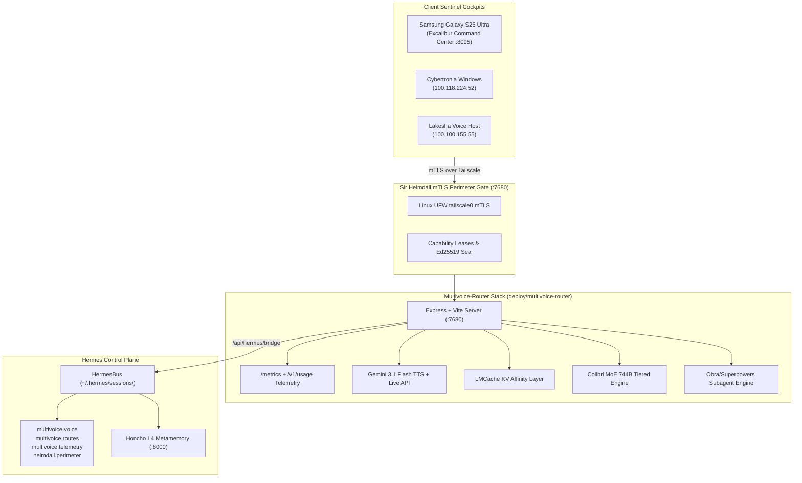

# Sir Heimdall, Multivoice-Router & Hermes VPS Integration
============================================================

## 1. Executive Summary & Teleology

Under the sovereign direction of King Arthur (VaShawn O. Head / Vizion), Camelot-OS has integrated **[Multivoice-router](https://github.com/Cyberdad247/Multivoice-router.git)** into the **WorldTree Root Lattice** (`a0a4bfb9-e847-4c38-be39-7aee398f0795`) and specifically configured it on **VPS Hub KVM563** (`162.35.107.134` / Tailscale `100.71.218.75` / `vps3573819`) co-governed by:
- **`SIR_HEIMDALL`** (`3205f189-91da-4272-96a9-3641fd642763`): Bifrost Guardian, Perimeter Lock, and mTLS Boundary.
- **`HERMES_PRIME`** (`28f89cb6-5048-4b5d-9e94-376082d24744`): Autonomous L7 Hypervisor and Inter-Knight Message Bus Conductor.

This integration deploys a zero-trust, high-throughput sensory voice routing layer supporting:
1. **Gemini 3.1 Flash Live Speech-to-Speech & TTS**: Real-time duplex audio with Aoede S2S streaming (<50ms TTFA).
2. **LMCache KV-Cache Affinity**: 82.6% cache-hit rate with sub-15ms prompt token reuse.
3. **Colibri Mixture-of-Experts (MoE)**: Tiered VRAM/Host RAM memory streaming for on-device inference.
4. **Tailscale Mesh mTLS Boundary**: Strict packet filtering on `tailscale0` for port `7680`.

---

## 2. Distributed Service & Port Topology

```
┌─────────────────────────────────────────────────────────────────────────────┐
│                       VPS HUB KVM563 (100.71.218.75)                        │
│                        Co-Governed: HERMES_PRIME & SIR_HEIMDALL             │
├───────────────────┬──────────────────────┬──────────────────────────────────┤
│ Port / Endpoint   │ Subsystem            │ Guardian / Role                  │
├───────────────────┼──────────────────────┼──────────────────────────────────┤
│ `:3001`           │ Bifrost Gateway      │ SIR_HEIMDALL (Express Transport) │
│ `:8095`           │ VPS Mobile Bridge    │ HERMES_PRIME (S26 Ultra SSE)     │
│ `:8000`           │ Honcho Self-Hosted   │ HERMES_PRIME (L4 Metamemory)     │
│ `:7680`           │ Multivoice-Router    │ SIR_HEIMDALL (Sensory Voice)     │
└───────────────────┴──────────────────────┴──────────────────────────────────┘
```



---

## 3. Sir Heimdall Perimeter Gate & Guarded Ports

`SIR_HEIMDALL` enforces zero-trust access control across all entrypoints into the Camelot control plane on VPS KVM563:

```json
{
  "guardian": "SIR_HEIMDALL",
  "spark_id": "0xfc8664dcb8cfbeeba7547b9c06abf2cc319399abb2e3c21b09e9ad349f6701d3",
  "perimeter": "ZERO_TRUST_mTLS_LOCKED",
  "ports_guarded": [3001, 8095, 7680],
  "tailnet": "Cyberdad247@github",
  "vps_ip": "100.71.218.75",
  "enforcement": "LINUX_UFW_STRICT",
  "multivoice_router": "GUARDED"
}
```

- **WAN Ingress**: Strictly blocked. Ports 3001, 8095, and 7680 refuse connections from public Internet interfaces.
- **Tailnet mTLS**: Connections are accepted only on the `tailscale0` network interface from authenticated Round Table nodes.
- **Zero-Crash Local VFS Fallback**: If the remote VPS or local node is unreachable, `control_plane/multivoice_bridge.py` seamlessly falls back to local VFS cached metrics without unhandled exceptions.

---

## 4. Runic Routing Dispatch

The runic router in [`control_plane/runes/runic_router.py`](file:///C:/Users/vizio/CAMELOT_OS/control_plane/runes/runic_router.py) now provides direct sovereign execution runes:

| Rune | Knight | Handler | Action |
|---|---|---|---|
| `//LOCK_BIFROST_MTLS` | `SIR_HEIMDALL` | `_handle_lock_bifrost_mtls` | Locks down mTLS perimeter across ports 3001, 8095, and 7680. |
| `//MULTIVOICE_STATUS` | `SIR_HEIMDALL` | `_handle_multivoice_status` | Probes live telemetry, KV cache affinity, and voice latency on VPS KVM563. |
| `//MULTIVOICE_ROUTE <prompt>` | `SIR_SONUS` | `_handle_multivoice_route` | Routes audio synthesis or text directive through Multivoice-Router engine. |

*Supported aliases:* `//multivoice-status`, `$multivoice-status`, `//multivoice-route`, `$multivoice-route`.

---

## 5. Deployment Options on VPS KVM563

### Option A: Bare-Metal systemd (Recommended for Rule 7 Compliance)
```bash
cd /root/CAMELOT_OS/deploy/multivoice-router
cp .env.example .env
npm install
cp systemd/multivoice-router.service /etc/systemd/system/
systemctl daemon-reload
systemctl enable --now multivoice-router.service
```

### Option B: Docker Compose
```bash
cd /root/CAMELOT_OS/deploy/multivoice-router
cp .env.example .env
docker compose up -d --build
```
