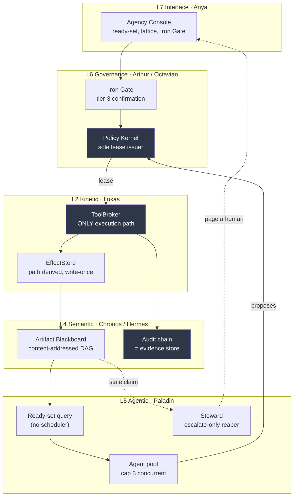
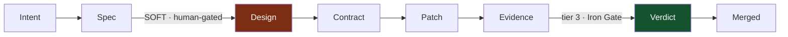
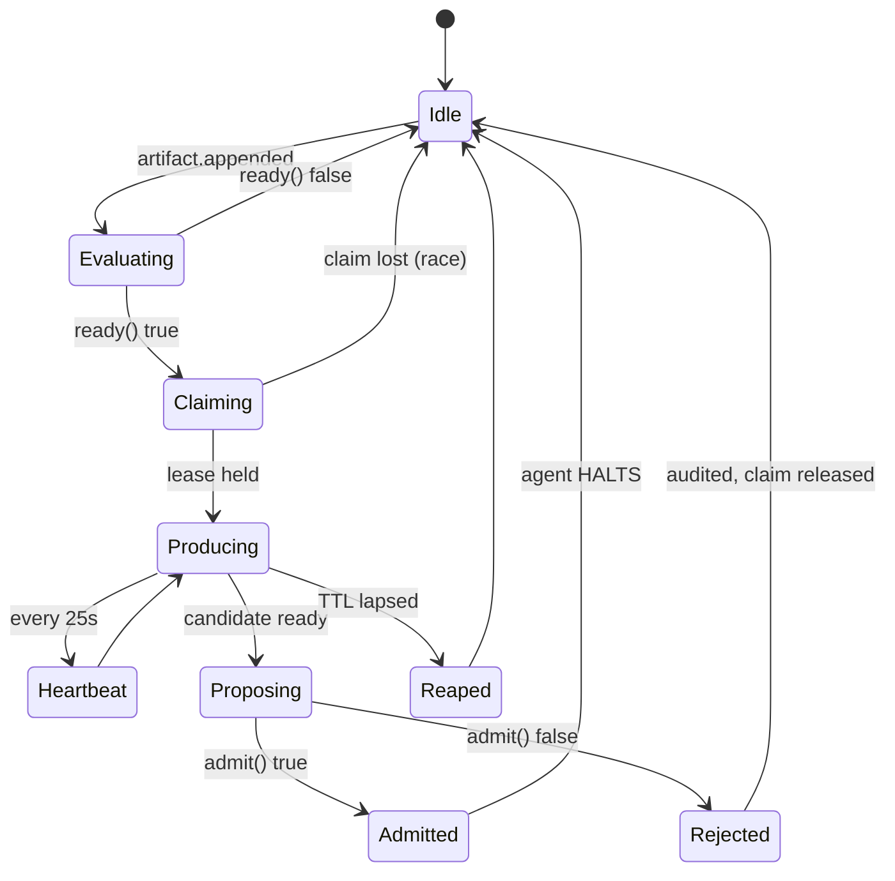

# Autonomous Engineering Agency — Technical Blueprint

**Status:** BLUEPRINT. No implementation. Halted at the Iron Gate pending `//GO`.
**Produced by:** architecture tournament (2 competing theses) + red-team pass + adjudication.
**Date:** 2026-08-09

---

## 0. Read this section first: the IMPLEMENTED / PROPOSED ledger

The single most damaging property of the existing spec corpus is that
`docs/agentforge.md`, `docs/AGENTS.md`, and `docs/reference/PROTOCOLS.md` describe
working code and aspiration in the *same confident register*. `leases.go` is real.
"Sub-12ms Firecracker warm boots" is not. A reader cannot tell which is which, and
that makes the corpus unusable as an engineering input.

This blueprint therefore opens with the ledger. Every claim below is tagged.

### IMPLEMENTED — verified at file:line, survives adversarial review

| Capability | Evidence | Assessment |
|---|---|---|
| Capability leases | `integration/gateway/leases.go` | HMAC-SHA256 over `leaseID\|capability\|expiresAt\|nodeID\|tenantID`; 30 s TTL; single-use with explicit `consumed`/`expired`/`revoked`. A leaked node-A lease is unusable at node B. **Real.** |
| Sole execution path | `integration/gateway/tools.go` | `Consume` strictly precedes any side effect, making replay idempotent by construction. Enforced by test T1. **Real.** |
| Write-once effects | `integration/gateway/effects.go` | Path derived from server-controlled skill id + minted lease id — never a caller input. `os.Link` (not `Rename`) yields EEXIST rather than silent clobber. **Better than most production code.** |
| Tamper-evident audit | `integration/gateway/audit.go`, `store.go` | Hash-chained, SQLite-backed, chain verified at boot; a broken chain refuses startup. **Real.** |
| Injection-proof tool selection | `integration/gateway/hermes.go` | Tool choice is deterministic substring matching over a fixed registry with a total tie-break order. **There is no LLM in the tool-selection path**, so tool-choice prompt injection is structurally impossible. This is a genuine security property and it is under-advertised. |
| Policy-validating capability catalog | `integration/contracts/skills.manifest.json`, `gen/generate.mjs` | Generator refuses tier-3-without-confirmation, durable-below-tier-2, retryable-durable, duplicate phrase. Drift fails `make test` locally. **Real.** |
| Master loop skeleton | `control_plane/infra/kinetic_loop.py` (239 lines) | `TRIAGE → PLAN → APPROVE → EXECUTE → VERIFY → RECORD`, async approve gate, injected executor, self-tested. **Real.** |

### PROPOSED — prose with no corresponding code

Firecracker COW micro-VMs · eBPF PII redaction · SPIFFE/SPIRE mTLS · Trellis
Recurrent Compressor · the "50 ms crucible" as an enforced budget · TSCG as a
running compiler · GraphRAG over a vector store · every persona in `roster.json`
beyond the handful with modules.

### BROKEN — implemented, but does not do what its name claims

Three findings from the red-team pass, verified independently. **All three are
prerequisites, not features.** An agency built on them inherits the flaw.

| # | Defect | Verified | Severity |
|---|---|---|---|
| B1 | **The gateway has no authentication on any route.** `Handler()` is routes + `withCORS` with `Access-Control-Allow-Origin: *`. `POST /v1/confirmations` — the tier-3 human-confirmation gate the entire L6 governance story rests on — is an unauthenticated HTTP call any local page or process reaching the port can make. | `integration/gateway/server.go` `Handler()` | **Critical (in scope of PR #200/#201)** |
| B2 | **The Z3 crucible fails open.** `except ImportError: return Z3Verdict(True, …)` — and `safe` is the first positional field. `pip uninstall z3-solver` disables the guard and every patch passes. There is also no `solver.set("timeout", …)` anywhere, so the advertised 50 ms budget does not exist as code. | `control_plane/infra/z3_verify.py` | **Critical** |
| B3 | **`_pdg_check` is not a PDG.** It is `any(d in task.intent.lower() for d in {"exec","shell","eval","subprocess","os.system"})` — five substrings matched against *the user's own intent string*, not against untrusted data. No nodes, no edges, no def-use chains, no taint labels, no sinks. It is definitionally incapable of catching injection, which arrives in tool **outputs**. | `control_plane/main.py:504` | **High** |

---

## 1. Corrections to the directive

Three claims in the source directive cannot be built as written. Stating the
buildable version is more useful than inheriting the language.

### 1.1 "Z3/SymPy … ensures error rates drop strictly below 0.7%"

**Not falsifiable as written**, and not causally supported.

`z3_verify.py` runs five regexes over `description + diff`, produces
`dict[str, bool]`, then asserts `fluents[inv] == z3.BoolVal(preserved)` — *fully
grounded constants, zero free variables* — and asks whether the conjunction is
SAT. That check is exactly `all(effects.values())`. **Z3 cannot disagree with the
regexes, because nothing is left to solve.** The classifier is `re.search`; the
solver is set dressing.

What Z3 *can* decide, honestly: propositional and QF_UF policy lattices —
decidable, fast, and genuinely useful for capability algebra. What it cannot:
QF_BV is NP-complete (bit-blasting a 64-bit multiply routinely exceeds seconds);
arrays with quantifiers is undecidable; nonlinear integer arithmetic is
undecidable (Hilbert's 10th); loops need supplied invariants; heap aliasing needs
separation logic Z3 does not natively speak. "Does this code do what the ticket
says" is Rice's theorem — not a solver problem at all.

**Replacement commitment.** Scope the solver to a named decidable fragment
(capability-lattice reachability over ≤ N boolean fluents, QF_UF only), set an
explicit timeout, and treat `z3.unknown` as a hard **BLOCK**. Replace the error
target with something that can lose:

> On a frozen benchmark of N ≥ 300 tasks with a binary pass predicate, report the
> pass rate with a Wilson 95% interval. Publish the interval, not the point.

Distinguishing 0.7% from 1.2% at p < 0.05 needs roughly 3–5k independent trials
per arm. A number this precise, asserted without a harness, is decoration.

### 1.2 "AgentArmor: map a PDG for every execution"

The defensible version exists, but the unit of analysis must change. An LLM's
reasoning has no program dependency graph. **The tool-call trace does**:
`call → args → returned bytes → next call's args`, with taint labels on returned
content and an explicit sink list.

Taint-tracking over that graph genuinely stops literal data-to-sink flow. It does
**not** stop: injected content that changes the *plan* without entering an
argument (the model reads "delete the branch" and independently emits a clean,
untainted call); tainted-then-laundered data (summarized, then reused); or
semantic exfiltration through an allowed sink. **Taint stops data flow. It does
not stop persuasion.** Say so in the design, or the control will be over-trusted.

Camelot already has a stronger property in one place and should extend it rather
than replace it: `hermes.go` puts **no LLM in the tool-selection path**. Where
that pattern holds, injection cannot select a tool at all — a structural
guarantee that beats any taint analysis.

### 1.3 "Fan out your sub-agents aggressively"

**This repository has already run that experiment and recorded the result.**
Provenance ledger entries 1719 → 1722: a 3-node distributed consensus cluster was
load-tested to failure ("red flags all the way down" — agreement drop, agent
failures, latency spikes, resource exhaustion) and then *deliberately deprecated*
in favour of single-host local-first. `.agent/local_env.md` fixes the operating
envelope: **8 GB RAM ceiling, single Windows host, no assumed outbound egress.**

The unmerged-parallel-output signature is also already visible in the tree: seven
separate `AGENTS.md` files, ~50 loose `test_*.py` at repo root, and both
`excalibur.py` and `excalibur_controller.py`.

**Replacement commitment.** Fan out only across a **machine-checkable interface
contract**, cap concurrency at **3**, and require a **single serial integrator**.
Width is bounded by measured RSS against the 8 GB ceiling, not by ambition.

---

## 2. Tournament verdict

Two architectures were commissioned independently and judged on buildability,
latency, blast-radius containment, and honesty about their own weaknesses.

| | **A — Loop-native / hierarchical** | **B — Artifact-native / blackboard** |
|---|---|---|
| State | Crusade Record in the controller | Content-addressed artifact DAG; status is a *query* |
| Progress | Controller position | Existence of the terminal artifact |
| Buildability | **Higher** — extends `kinetic_loop.py`, which exists | Medium — needs a new artifact store |
| Latency | Lower bound worse; hierarchy serializes | Better; parallel branches cost no wall clock |
| Blast radius | Good (claims computed at plan time) | **Better** (`touchScope` is an admitted artifact, checked pre-effect) |
| Honesty | Strong — named head-of-line blocking, context bottleneck, and that "Z3 assurance is narrow… the biggest self-deception risk" | Strong — named the undecidable Design edge as "the single weakest claim", and conceded "the Steward is a master loop in denial" |

**Verdict: B's state model, A's controller — scoped down.**

B is right about the decisive thing: **the kernel already shipped is a blackboard
in miniature, and it is being wasted on voice turns.** `LeaseStore.Consume` is an
atomic single-use compare-and-swap — that is a *claim*. `EffectStore.WriteNote`
with lease-derived paths and `os.Link` EEXIST is a **write-once artifact cell with
optimistic concurrency**. `AuditLog` is an append-only, hash-chained,
restart-verified **evidence store**. Those are precisely the three primitives a
blackboard needs, and they are built, tested, and adversarially reviewed.

B's strongest single move: **Evidence artifacts carry the `auditId` of the
`ci.run` lease consumption rather than test output.** An agent cannot fabricate
green CI without forging a SHA-256 chain that refuses to boot when broken.
Provenance becomes free.

But B concedes the fatal gap itself — "the Steward is a master loop in denial."
Nothing in a pure blackboard is responsible for global no-progress. A wins that
point, and A's `kinetic_loop.py` already exists. So the controller is retained,
**with its authority scoped to escalation only**: it may reap stale claims, detect
no-progress, and page a human. It may **not** route work, choose agents, or hold
domain state. That keeps A's liveness guarantee without reintroducing A's context
bottleneck.

Both theses were penalised equally on one point and it is worth recording: **the
Design edge has no decidable predicate in either.** A hides it inside a critique
loop; B marks it explicitly soft. B's honesty is the better engineering posture,
and the blueprint adopts B's framing: that edge is human-gated for any Spec above
a declared blast-radius threshold, and no LLM judge is permitted to close it.

### On judge panels (the directive's scoring mechanism)

Adopted with constraints, because unconstrained LLM judging measures **pitch
quality, not architecture quality**. Architecture is observable at maintenance
time — months out. A judge at t=0 measures fluency, length, and structural
conformity, and carries verbosity bias, position bias, self-preference, and —
decisively — **correlated errors: N judges on one base model are one judge with
N× the cost and false confidence from apparent consensus.**

Binding rules: score only on **executable outcomes** (compiles, passes a shared
suite, meets a latency budget); randomise candidate position; require judges from
**≥ 2 base model families**; report inter-judge kappa and **refuse to act when it
is low**. Cost is `N_candidates × N_judges × (spec + candidate tokens)` —
quadratic in candidate length, so cap candidate length explicitly.

---

## 3. HLD — the adopted architecture



The dark nodes are the trust boundary. **An agent never touches them directly**:
it emits a *proposal*, and only the policy kernel mints a lease.

### Artifact lattice



Every artifact is an immutable JSON cell addressed by
`sha256(kind ‖ sorted(parent_hashes) ‖ canonical_body)`, NFC-normalised with keys
sorted. Content addressing makes duplicate work free to detect. **There is no
`status` field anywhere — status is a query.**

Each edge carries two predicates. `ready(store) → bool` is a pure query
determining the frontier; `admit(candidate, parents) → bool` gates the produced
artifact and determines truth.

| Edge | `admit` predicate | Decidable? |
|---|---|---|
| Intent→Spec | ≥1 numbered normative statement, each with a falsifiable acceptance clause | Mechanical |
| Spec→Design | Every Spec ID referenced ≥once; affected components declared | **No — soft, human-gated** |
| Design→Contract | Manifest diff validates under `generate.mjs`; type/schema diff compiles; test signatures parse; `touchScope` non-empty and disjoint-checked | Mechanical |
| Contract→Patch | Diff applies to base; **touches nothing outside `touchScope`**; compiles | Mechanical |
| Patch→Evidence | Body carries Patch digest, CI exit codes, coverage delta, and the **`auditId` of the `ci.run` lease** | Mechanical + unforgeable |
| Evidence→Verdict | All Contract test signatures green **and** human confirmation | Human |
| Verdict→Merged | PR merged | Terminal |

---

## 4. LLD — API and schema

New manifest skills. The existing generator already validates tier/effect/retry
coherence, so these are declarations, not new enforcement code.

| Skill | Tier | Effect | Notes |
|---|---|---|---|
| `artifact.append` | 2 | `local_effect` | Write-once cell; path from lease id |
| `repo.worktree.create` | 2 | `local_effect` | Derived path under `.run/` |
| `repo.patch.apply` | 2 | `local_effect` | `retry: never`; rejects hunks outside `touchScope` |
| `ci.run` | 2 | `local_effect` | Sandboxed worktree; audit id is the evidence |
| `vcs.pr.open` | 2 | `remote_effect` | First real use of `remote_effect` |
| `vcs.pr.merge` | **3** | `remote_effect` | `confirmationRequired: true` — **the generator already refuses tier 3 without it; that validator line _is_ the Iron Gate** |

Manifest gains three fields per skill — `produces`, `requires`, `touchScope` — and
`generate.mjs` gains lattice validation: cycle detection, orphan-type detection,
duplicate-producer detection. **An invalid lattice fails `make generate`, not
production.**

```
POST /v1/artifacts            → append (leased)          201 {hash, kind, parents}
GET  /v1/artifacts?readyFor=  → ready-set query          200 [{hash, kind, age_s}]
GET  /v1/artifacts/{hash}     → cell + ancestor chain    200 {body, parents, auditId}
POST /v1/claims               → Consume claim:<hash>     200 {leaseId, expiresAt}
POST /v1/claims/{id}/renew    → heartbeat (25 s)         200 {expiresAt}
GET  /v1/lattice/explain      → why is nothing ready     200 {blocked:[{edge,reason}]}
```

`/v1/lattice/explain` is not a nicety. In a blackboard, "why is nothing happening"
is a query rather than a stack trace, and ops will reject the system without it.

### Concurrency

A claim is a lease `Consume` on `capability: claim:<artifact_hash>` — atomic and
single-use, using the existing primitive unchanged. The 30 s TTL suits voice, not
a 20-minute test run, so agents heartbeat by re-leasing every 25 s; each renewal
is an audit row (~2 rows/min/active claim — stated, not hidden). **Do not lengthen
the TTL to make a long step work.** The Contract, not the file, is the lock unit.

---

## 5. Multi-persona state machine

Personas are **cast from the existing 43-entry `01_KERNEL/agora/agents/roster.json`**,
not invented. The directive's requested archetypes already exist.

| Directive role | Existing persona | Regna | Subscribes to | Produces |
|---|---|---|---|---|
| Context engineering / RAG | **Sir Helio** (Context Mapper), **Lady Apis** (Forager) | L4 | Intent | Spec |
| Architecture | **Sir Lancelot** (Master Builder), **Sir Boris** (Anvil) | L5 | Spec | Design |
| Contract / schema | **Sir Syntax** (Code Architect) | L2 | Design | Contract |
| Full-stack | **Sir Hydron** (Frontend Weaver), **Sir Stitch** (Interface Architect), **Dame Go** | L2 | Contract | Patch |
| Test / CI | **Sir Octavian** (Factory Warden) | L6 | Patch | Evidence |
| Red team | **Sir Dagonet** (The Breaker) | L5 | Patch | Objection |
| Completeness critic | **Sir Socrates** (Northstar Gate), **Lady Veritas** (Logic Auditor) | L6 | Evidence | Verdict |
| Escalation only | **Sir Scavenger** (Steward) | L5 | stale claims | page |
| Sovereign | **King Arthur** | L6 | Verdict | Merged |



The agent **halts** after producing one artifact. It holds no state between
artifacts, which is what makes redundant racing cheap and crash recovery trivial.

---

## 6. UI/UX spatial mapping — the Agency Console

Extends the existing Anya Console pattern (`integration/kickbox/`), not a new app.
Target surface: the `02_FORGE` Next.js App Router estate (six apps; zustand/jotai
already in four packages).

```
┌─────────────────────────────────────────────────────────────────┐
│  ⚔ AGENCY CONSOLE            crusade: add-note-export   ⬤ 2/3   │
├──────────────┬──────────────────────────────────┬───────────────┤
│ LATTICE      │  FRONTIER                        │ IRON GATE     │
│ (left rail)  │  (centre — the only live region) │ (right rail)  │
│              │                                  │               │
│ Intent   ✓   │  ┌────────────────────────────┐  │ ⚠ AWAITING    │
│ Spec     ✓   │  │ Contract#a3f · Sir Syntax  │  │   YOU         │
│ Design   ✓   │  │ claimed 41s · ♥ 4s         │  │               │
│ Contract ◐   │  └────────────────────────────┘  │ vcs.pr.merge  │
│ Patch    ·   │  ┌────────────────────────────┐  │ tier 3        │
│ Evidence ·   │  │ Patch#8c1 · Sir Hydron     │  │ touchScope:   │
│ Verdict  ·   │  │ producing · ♥ 12s          │  │  4 files      │
│ Merged   ·   │  └────────────────────────────┘  │               │
│              │                                  │ [APPROVE]     │
│ ── blocked ──│  ▸ why is Evidence not ready?    │ [DENY]        │
│ Design→      │                                  │               │
│  Contract    │                                  │ ── evidence ──│
│  soft edge   │                                  │ audit-1452 ✓  │
│  needs human │                                  │ chain intact  │
└──────────────┴──────────────────────────────────┴───────────────┘
```

Three spatial commitments:

1. **Left rail is the lattice, always visible, never scrolls.** Progress is
   position in a type lattice, not a percentage. A percentage would be a lie —
   there is no controller position to report.
2. **Centre is the frontier only** — currently-claimed artifacts with live
   heartbeat age. Anything not on the frontier is not actionable and is not shown.
   `▸ why is Evidence not ready?` expands `/v1/lattice/explain` inline.
3. **Right rail is the Iron Gate and it is the only place a human acts.** It must
   be visually distinct and must render `touchScope` before the approve control.
   Approving a merge without seeing the blast radius is the failure this rail
   exists to prevent.

State: server state via the existing `/v1/sessions/{id}/events` WebSocket reduced
by a pure reducer (the `reduceSessionEvent` pattern already in `@camelot/contracts`);
**zustand for ephemeral UI state only.** Do not mirror artifact state into the
client store — it is derivable and mirroring it invites divergence.

---

## 7. Build sequence

**Prerequisites — blocking. None of the agency may be built before these.**

| | Fix | Why blocking |
|---|---|---|
| P1 | Authenticate `/v1/confirmations`; drop wildcard CORS | The Iron Gate is currently an unauthenticated HTTP call. An agency that can merge code cannot rest on a decorative gate. |
| P2 | `Z3_UNAVAILABLE` → `safe=False`; add explicit solver timeout; `z3.unknown` → BLOCK | Fails open today. |
| P3 | Either delete Z3 and call it a pattern-based shatterpoint guard, **or** encode real pre/post state pairs with unconstrained fluents | Truth in labelling; the current name licenses over-trust. |
| P4 | Replace `_pdg_check` with taint over the tool-call trace, **or** delete it and rely on the stronger `hermes.go` property | A name that claims a guarantee it does not provide is worse than no check. |
| P5 | Split every spec doc into `IMPLEMENTED (file:line)` / `PROPOSED` | Highest-leverage change in the corpus. |

**Two weeks.** Manifest gains `produces`/`requires`/`touchScope` + lattice
validation in `generate.mjs` (~150 lines in an already-strict validator);
generalise `EffectStore.WriteNote` → `WriteArtifact(kind, leaseID, parents, body)`
keeping link-EEXIST (~200 lines); `/v1/artifacts` + `artifact.appended` on existing
WS plumbing; **four edges only** (Intent→Spec→Contract→Patch→Evidence); one agent
binary, role by flag; `ci.run` in a sandboxed worktree; `pr.open` tier 2.
Deliverable: a one-file feature request reaching a reviewed PR, every action
leased, chain verifiable.

**Three months.** Full seven-type lattice; `touchScope` conflict admission;
speculative Patch racing with Verdict selection; Steward escalation ladder;
lease store moved off in-memory to SQLite CAS (**the #1 scaling constraint —
`store.go` is single-process by design**); audit Merkle checkpointing
(`VerifyChain` is O(n) at boot; ~10⁶ events makes startup minutes); test execution
offloaded to mesh nodes under node-bound leases.

**Explicitly not in scope:** distributed multi-host consensus (ledger 1719–1722
records it load-tested to failure and deprecated); autonomous merge without human
confirmation; agents authoring the tests that gate their own merge.

---

## 8. Residual risks

1. **The Design edge is undecidable and no amount of tooling fixes it.** Human-gated
   above a blast-radius threshold. If this is ever closed by an LLM judge, the
   lattice becomes bureaucracy that launders unverified work into typed boxes and
   *looks* rigorous. This is the highest-risk item in the blueprint.
2. **Confident wrongness with green tests** is the evidenced failure mode of
   long-horizon agents — not crashing. A slightly wrong turn at step 6 gets built
   upon for the remaining budget, then tested into apparent correctness.
   Mitigation: human-authored acceptance criteria before the agent starts, and the
   agent may **never** write the test that gates its own merge.
3. **Green-check over-trust.** `z3_verify` says nothing about correctness even
   after P2/P3. Architecture A named this as its own biggest self-deception risk
   and it applies to the adopted design unchanged.
4. **8 GB ceiling is a hard wall.** Concurrency cap 3 is derived from it, not
   chosen. Re-derive from measured RSS before raising.

---

## 9. Iron Gate

**HALT.** This is a blueprint. No code has been written, no manifest edited, no
skill added. Compilation begins only on `//GO`.

Recommended first `//GO` scope is **P1 alone** — authenticating the confirmation
endpoint — because it is small, it is a genuine security fix, and it is a
prerequisite for every subsequent phase.
