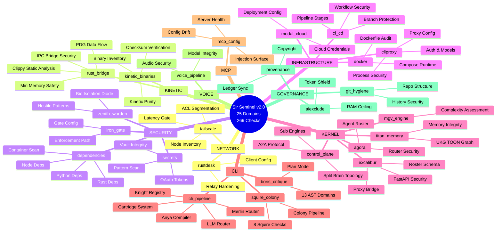
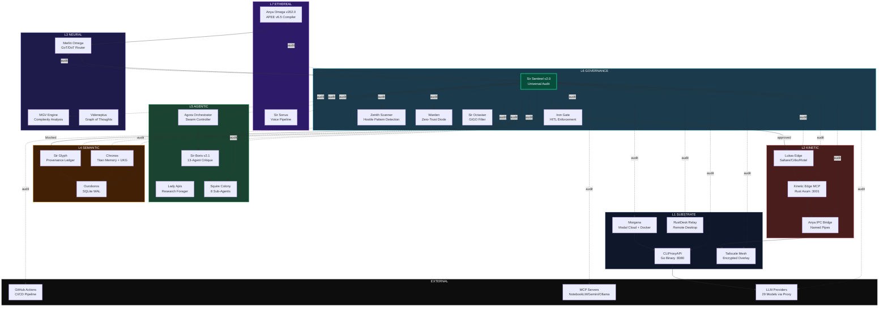
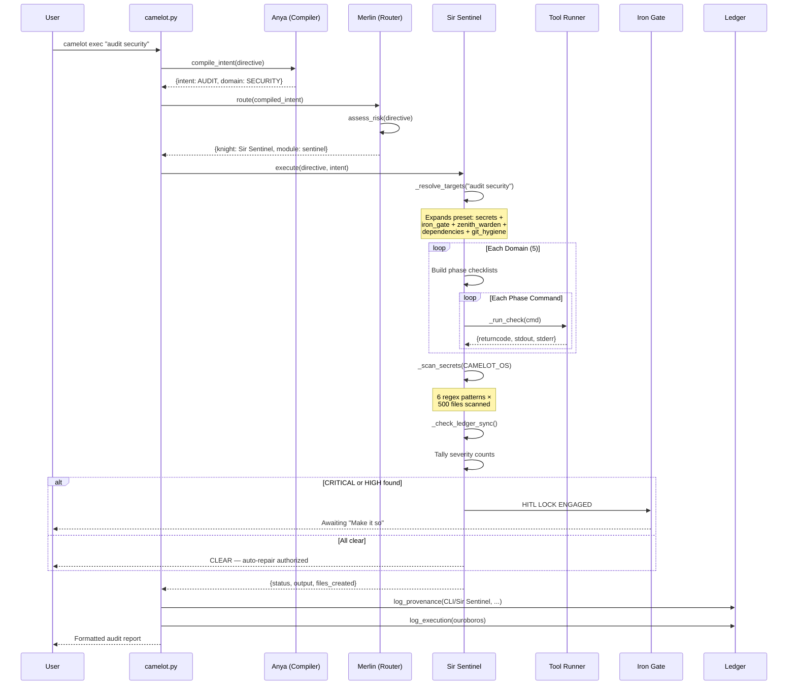
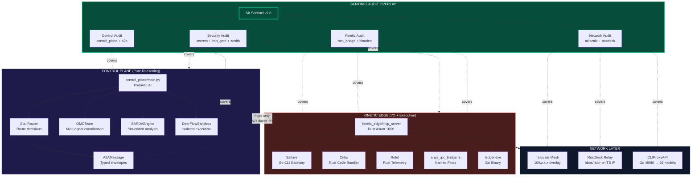
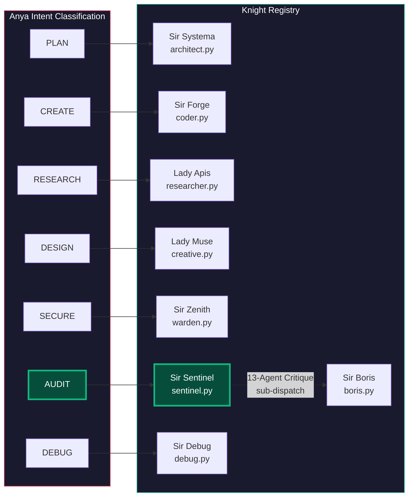

# Sir Sentinel v2.0 — Universal Audit Architecture
## Camelot Apex OS v300.4

### 1. Execution Pipeline

```mermaid
flowchart TB
    subgraph USER["USER INPUT"]
        CMD["camelot exec 'audit ...'"]
    end

    subgraph ANYA["ANYA OMEGA v202.0 — APEE v6.5 Compiler"]
        direction TB
        P1["1. PARSE<br/>Extract intent, entities"]
        P2["2. ENRICH<br/>Inject UKG + cartridge context"]
        P3["3. COMPILE<br/>Triple-QFT: Renormalize → Quantize → Transform"]
        P4["4. ROUTE<br/>Intent → AUDIT → Sir Sentinel"]
        P5["5. VALIDATE<br/>CoVe post-execution verification"]
        P1 --> P2 --> P3 --> P4 --> P5
    end

    subgraph MERLIN["MERLIN OMEGA — Router + Risk Gate"]
        direction TB
        M1["Intent Classification<br/>AUDIT detected"]
        M2["Risk Assessment<br/>Zenith Scanner + Local Patterns"]
        M3{"Risk Level?"}
        M4["LOW/MEDIUM<br/>→ Proceed"]
        M5["HIGH/CRITICAL<br/>→ Iron Gate HITL"]
        M6["MGV Enrichment<br/>Complexity analysis"]
        M1 --> M2 --> M3
        M3 -->|safe| M4
        M3 -->|dangerous| M5
        M2 --> M6
    end

    subgraph SENTINEL["SIR SENTINEL v2.0 — The Shield"]
        direction TB
        S1["_resolve_targets()<br/>NLP keyword → domain mapping"]
        S2["Expand Presets<br/>full/security/kernel/..."]
        S3["Execute Domain DAG<br/>25 domains, 269 checks"]
        S4["Automated Deep Checks<br/>Secrets · Binaries · Ledger Sync"]
        S5["Severity Tally<br/>CRITICAL/HIGH/MEDIUM/LOW"]
        S6{"HITL Required?"}
        S7["Iron Gate LOCK<br/>Await 'Make it so'"]
        S8["CLEAR<br/>Antigravity v2.0 auto-repair"]
        S1 --> S2 --> S3 --> S4 --> S5 --> S6
        S6 -->|yes| S7
        S6 -->|no| S8
    end

    subgraph OUTPUT["OUTPUT"]
        O1["Terminal Report<br/>Markdown checklist"]
        O2["logs/sentinel_audit_latest.md<br/>--write flag"]
        O3["PROVENANCE_LEDGER.md<br/>3-copy sync"]
        O4["Ouroboros SQLite<br/>Execution history"]
    end

    CMD --> ANYA
    ANYA --> MERLIN
    MERLIN --> SENTINEL
    SENTINEL --> OUTPUT

    style ANYA fill:#1a1a2e,stroke:#e94560,color:#fff
    style MERLIN fill:#1a1a2e,stroke:#0f3460,color:#fff
    style SENTINEL fill:#1a1a2e,stroke:#16c79a,color:#fff
    style OUTPUT fill:#1a1a2e,stroke:#f5a623,color:#fff
    style USER fill:#0d0d0d,stroke:#fff,color:#fff
```

### 2. Full Audit Domain Map (25 Domains × 9 Categories)

### 3. Camelot OS Full System Architecture with Sentinel Coverage

### 4. Preset Routing Matrix

```mermaid
flowchart LR
    subgraph PRESETS["11 AUDIT PRESETS"]
        FULL["full<br/>25 domains"]
        NET["network<br/>3 domains"]
        KIN["kinetic<br/>2 domains"]
        SEC["security<br/>5 domains"]
        BRG["bridge<br/>3 domains"]
        INF["infrastructure<br/>4 domains"]
        KER["kernel<br/>5 domains"]
        CLI_P["cli<br/>3 domains"]
        AGT["agents<br/>3 domains"]
        GOV["governance<br/>4 domains"]
        VOX["voice<br/>1 domain"]
    end

    subgraph DOMAINS["25 AUDIT DOMAINS"]
        D01["tailscale<br/>13 checks"]
        D02["rustdesk<br/>8 checks"]
        D03["rust_bridge<br/>17 checks"]
        D04["kinetic_binaries<br/>12 checks"]
        D05["secrets<br/>13 checks"]
        D06["iron_gate<br/>8 checks"]
        D07["zenith_warden<br/>9 checks"]
        D08["dependencies<br/>14 checks"]
        D09["ci_cd<br/>12 checks"]
        D10["cliproxy<br/>12 checks"]
        D11["modal_cloud<br/>7 checks"]
        D12["docker<br/>9 checks"]
        D13["excalibur<br/>12 checks"]
        D14["agora<br/>8 checks"]
        D15["titan_memory<br/>10 checks"]
        D16["control_plane<br/>12 checks"]
        D17["mgv_engine<br/>4 checks"]
        D18["cli_pipeline<br/>21 checks"]
        D19["squire_colony<br/>12 checks"]
        D20["boris_critique<br/>16 checks"]
        D21["mcp_config<br/>13 checks"]
        D22["voice_pipeline<br/>9 checks"]
        D23["provenance<br/>9 checks"]
        D24["aiexclude<br/>12 checks"]
        D25["git_hygiene<br/>8 checks"]
    end

    NET --> D01 & D02 & D21
    KIN --> D03 & D04
    SEC --> D05 & D06 & D07 & D08 & D25
    BRG --> D01 & D03 & D02
    INF --> D09 & D10 & D11 & D12
    KER --> D13 & D14 & D15 & D16 & D17
    CLI_P --> D18 & D19 & D20
    AGT --> D19 & D20 & D16
    GOV --> D23 & D24 & D25 & D06
    VOX --> D22

    style PRESETS fill:#1a1a2e,stroke:#e94560,color:#fff
    style DOMAINS fill:#1a1a2e,stroke:#16c79a,color:#fff
```

### 5. Automated Check Execution Flow

### 6. Split-Brain Topology — Control vs Kinetic with Sentinel Overlay

### 7. Knight Dispatch Matrix

