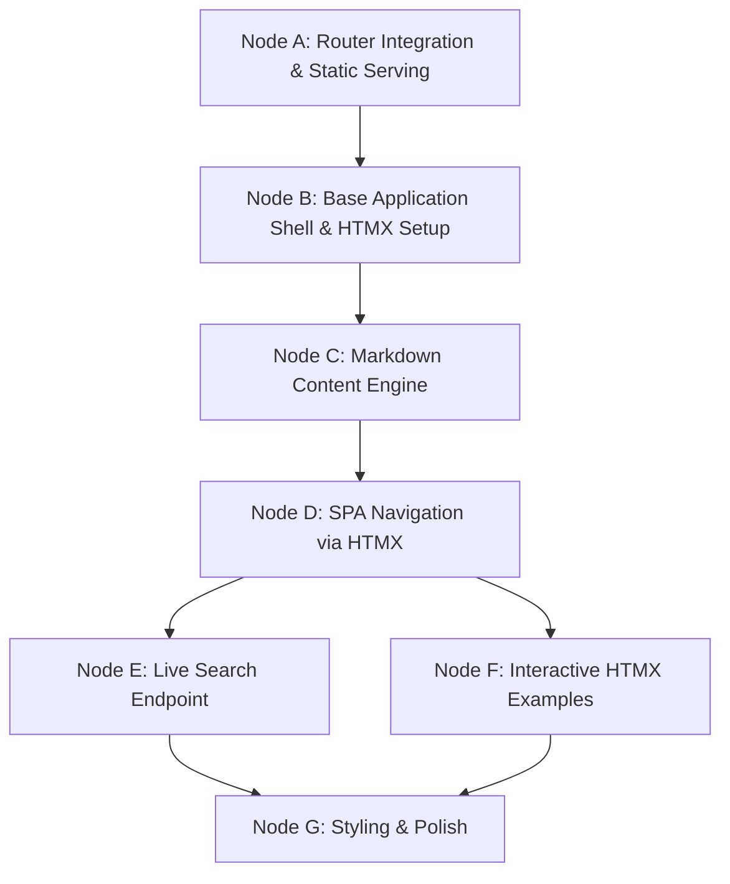

# Kinetic Development DAG: HTMX Documentation Site

## Architecture Overview
This Directed Acyclic Graph (DAG) outlines the dependency-driven development plan for building an HTMX-powered documentation site. We will leverage the existing TypeScript router workspace (`src/router`) to serve hypermedia (HTML fragments) instead of standard JSON REST responses, fully embracing the HATEOAS (Hypermedia as the Engine of Application State) architectural constraint.

## Directed Acyclic Graph (DAG) Visual

## Topological Execution Phases

### Phase 0: Foundation
**Node A: Router Integration & Static Serving**
- *Dependencies:* None
- *Tasks:* Configure `src/router` to serve static assets (CSS, images) and establish a base HTML response format. 

**Node B: Base Application Shell & HTMX Setup**
- *Dependencies:* Node A
- *Tasks:* Create the `index.html` shell. Inject the HTMX library via CDN or local vendor script. Define the main structure (`<aside>` for navigation, `<main id="content">` for dynamic loading).

### Phase 1: Content & Navigation
**Node C: Markdown Content Engine**
- *Dependencies:* Node B
- *Tasks:* Integrate a markdown parser (e.g., `marked` or `markdown-it`) into the TS router. Create an endpoint `GET /api/docs/:slug` that reads a markdown file, parses it to HTML, and returns the *HTML fragment* (not a full page).

**Node D: SPA Navigation via HTMX**
- *Dependencies:* Node C
- *Tasks:* Populate the sidebar with links using HTMX attributes:
  `hx-get="/api/docs/intro" hx-target="#content" hx-swap="innerHTML" hx-push-url="true"`
- *Result:* Clicking links swaps out the `<main>` content instantly without a full browser refresh, updating the URL history automatically.

### Phase 2: Interactive Features
**Node E: Live Search Endpoint**
- *Dependencies:* Node D
- *Tasks:* Add a search input with `hx-post="/api/search" hx-trigger="keyup changed delay:500ms" hx-target="#search-results"`. Build the corresponding TS router endpoint to filter docs and return list item HTML fragments.

**Node F: Interactive HTMX Examples**
- *Dependencies:* Node D
- *Tasks:* Build custom endpoints in `src/router` to handle interactive components documented on the site (e.g., inline validation, progress bars, infinite scroll) so the documentation is completely self-hosting its own interactive examples.

### Phase 3: Finalization
**Node G: Styling & Polish**
- *Dependencies:* Node E, Node F
- *Tasks:* Apply final CSS (e.g., Tailwind or scoped CSS) to ensure transitions and swaps look seamless. Add loading indicators using `htmx-indicator` classes.
