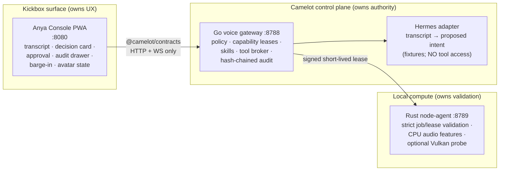
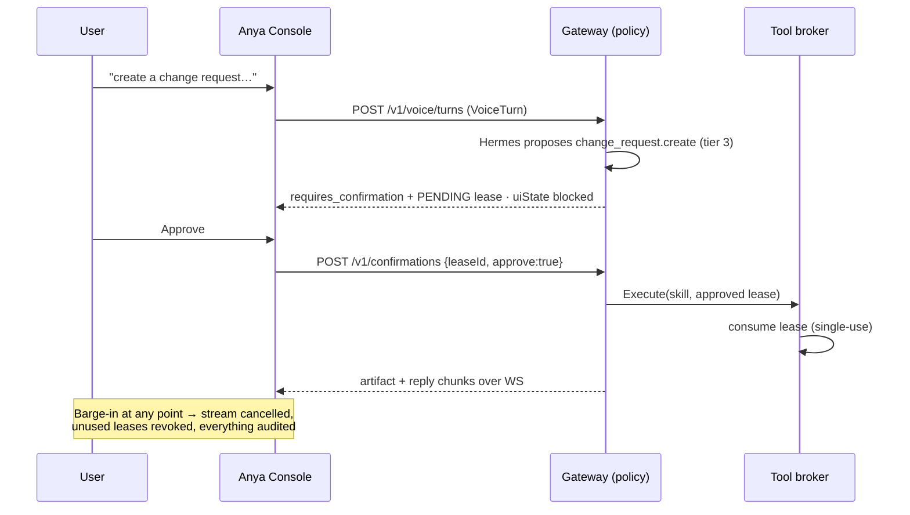

# Camelot × Kickbox — Governed Voice Vertical Slice

Status: **live** (text + push-to-talk voice). Companion documents:
[current-state](../architecture/current-state.md) ·
[bootstrap-plan](../architecture/bootstrap-plan.md) ·
[ADR-001 boundaries](../adr/001-kickbox-camelot-boundaries.md)

Everything described here lives under [`integration/`](../../integration/) and
runs **without any API key** — all intents, replies, and compute jobs are
deterministic fixtures.

## Architecture





### Ownership (normative — ADR-001)

| Component | Owns | Never does |
|---|---|---|
| Camelot gateway (`integration/gateway`) | identity, policy, leases, skills, tool execution, audit, node authorization | render UX, capture audio |
| Kickbox console (`integration/kickbox`) | capture/VAD (voice phase), barge-in UX, transcript display, playback, avatar state | call a tool or node-agent directly |
| Hermes adapter (`gateway/hermes.go`) | transcript → proposed intent | touch broker, leases, or audit |
| Node-agent (`integration/node-agent`) | job/lease validation, batching, health, CPU fallback, optional Vulkan | accept an unsigned/expired/mismatched lease |

### Governance mechanics

- **Leases**: 30 s TTL, single-use, HMAC-signed, `pending → approved →
  consumed | revoked | expired`. Every effectful action needs one; tier-1
  reads do not.
- **Bootstrap skills**: `ops.staging.read` (tier 1, allow),
  `deployment.review.prepare` (tier 2, auto-approved lease),
  `change_request.create` (tier 3, human confirmation).
- **Barge-in** (`POST /v1/voice/barge-in`, mock event in the console):
  cancels the streaming reply and revokes all unused leases for the turn.
- **Audit**: hash-chained (`prevHash`/`hash`), redacted — tier ≥ 2 records
  carry `transcriptSha256`, never raw text. Raw audio never crosses the
  contract at all (`audioSha256` only). The chain is **persisted to a local
  SQLite file** (`.run/camelot-voice.db`, pure-Go driver, no CGO, no
  remote DB): it survives gateway restarts, new events continue the chain,
  and a tampered store is refused at startup. Leases are deliberately NOT
  persisted — 30 s single-use grants die with the process.

## Running the demo (native runtime — no Docker)

The slice is a **native-process** deployment: three local processes, PID and
log files under `integration/.run/`, health-gated startup. Docker and
Kubernetes are unsupported; the old compose artifacts are archived under
`integration/archive/docker/`.

Prereqs: Node ≥ 20, Go ≥ 1.24, Rust 1.85 (repo pin), Python 3 (dev static
server + smoke helpers). Fits comfortably in an 8 GB RAM envelope; no local
model is booted.

```bash
cd integration
make dev-up       # build + start gateway :8788, node-agent :8789, console :8080 (ordered, health-gated)
make smoke        # 11-check end-to-end proof
make status       # per-service pid + health + audit db size
make logs         # tail logs (scripts/logs.sh gateway -f to follow one)
make benchmark    # RSS/CPU, cold-start, and request-latency report
make dev-down     # stop everything (guarded; graceful SIGTERM first)
```

Each Make target is a thin wrapper over
`scripts/{build,dev-up,dev-down,status,logs,smoke,benchmark}.sh` — the
scripts are the canonical interface. Hardening guarantees:

- **Ordered startup**: gateway → node-agent → console, each `/healthz`
  verified before the dependent service starts; per-service cold-start time
  is printed.
- **Foreign-listener refusal**: `dev-up` aborts if a slice port already
  answers but was not started by these scripts, and refuses to double-start.
- **Guarded teardown**: `dev-down` signals only PIDs whose `.run/` metadata
  matches the live `/proc` cmdline — a recycled PID is never touched.
  SIGTERM first (both services drain gracefully and log
  `graceful shutdown complete`), SIGKILL only after 5 s.

Optional supervision: example systemd **user** units live in
`integration/deploy/systemd/` (examples only — never required for
development); a tmux session or Termux job works just as well. Tailscale is
only relevant if you want the console reachable across a private mesh;
nothing in the slice depends on it.

### Hardware budget (8 GB machine)

`make benchmark` measures the running stack. Reference figures from a 4-vCPU
x86_64 dev container (run it on the target hardware for real numbers):

| Process | Budget | Measured |
|---|---:|---:|
| Kickbox PWA dev server | ≤ 250 MB | ~19 MB (python stand-in) |
| Go gateway | ≤ 100 MB | ~13 MB |
| Rust node-agent | ≤ 100 MB | ~3 MB |
| SQLite + logs | ≤ 100 MB | < 1 MB |
| **Control stack total (no model)** | **≤ 750 MB** | **~35 MB** |

Cold starts: gateway ~13 ms, node-agent ~56 ms, console-ready ~330 ms.
Tier-1 turn latency ~2 ms avg; 1024-sample compute job ~20 ms avg. A local
LLM/TTS engine is **never** booted by the control stack — start one
explicitly and cap it separately when Phase 3 arrives.

**Demo URL:** `http://localhost:8080/kickbox/` — console UI with quick
buttons for the three governed utterances, a free-text input, the barge-in
control (enabled while Anya streams), the policy decision card, the approval
control (tier 3), and the audit drawer.

Service endpoints: gateway `http://localhost:8788` (healthz, turns, barge-in,
confirmations, audit, WS `/v1/sessions/{id}/events`), node-agent
`http://localhost:8789` (healthz, compute).

## Tests

```bash
cd integration && make test   # TS (vitest) + Go (go test -count=1) + Rust (both feature sets)
```

| Proof (bootstrap-plan) | Where |
|---|---|
| T1 no tool without lease | `gateway/broker_test.go`, `contracts/tests/client-guard.test.ts` |
| T2 tier-2 draft works | `gateway/turns_test.go` `TestTier2DraftCreation` |
| T3 change request needs confirmation | `gateway/turns_test.go` `TestChangeRequestRequiresConfirmation` |
| T4 barge-in cancels stream + revokes lease | `gateway/bargein_test.go`, `contracts/tests/barge-in.test.ts` |
| T5 CPU when Vulkan unavailable | `node-agent/tests/fallback.rs` (run with and without `--features vulkan`) |
| T6 audit redaction + chain | `gateway/audit_test.go` |
| Audit persistence across restart + tamper refusal | `gateway/store_test.go` |
| T7 end-to-end smoke | `scripts/smoke.sh` (11 checks) |

## Phase 2 — push-to-talk voice (Hermes adapter)

Voice is **off by default**. Enable the Hermes adapter process:

```bash
cd integration
ENABLE_HERMES_VOICE=true make dev-up   # adds hermes on :8790 (gateway -> node-agent -> hermes -> console)
ENABLE_HERMES_VOICE=true make smoke    # 15 checks (11 base + 4 voice)
```

The console then shows the voice bar: mic permission status, device
selector, **hold-to-talk** button, stop-speaking control, and a voice-state
chip (`listening / transcribing / review / error / text-only`). Flow:

```
mic (hold PTT) -> PCM16 in memory -> Hermes /v1/stt -> confidence gate
  -> existing POST /v1/voice/turns (modality "voice" + audioSha256)
  -> existing policy/lease/audit chain, unchanged
  -> reply text -> browser speechSynthesis (or Hermes /v1/tts WAV)
```

### Environment variables

| Variable | Default | Meaning |
|---|---|---|
| `ENABLE_HERMES_VOICE` | `false` | Start the Hermes adapter process |
| `HERMES_PORT` | `8790` | Adapter port |
| `HERMES_STT_ENGINE` / `HERMES_TTS_ENGINE` | `fixture` | `fixture` (deterministic, model-free) or `command` |
| `HERMES_STT_CMD` / `HERMES_TTS_CMD` | — | External binary for `command` engines (e.g. whisper.cpp, piper). User-configured; **never auto-started or downloaded** |
| `HERMES_STT_SCRIPT` | 3 demo utterances | `"a\|b\|c"` fixture transcript rotation |

The fixture STT gates on real audio energy: silence or sub-220 ms blips
yield **no transcript** (nothing submittable); quiet audio yields **low
confidence**, which forces the review gate.

### Guardrails (all unit-tested)

- **Confidence gate**: no/failed transcript → nothing reaches the gateway;
  confidence < 0.75 → transcript is prefilled for review, the user must
  press Send; accepted → submitted only through `POST /v1/voice/turns`.
- **Barge-in**: stop-speaking (or pressing PTT while Anya talks) halts
  playback *immediately*, then fires the existing barge-in event — stream
  cancelled, unused leases revoked. Committed actions are untouched.
- **Fallback**: mic denied, Hermes unreachable, or STT/TTS failure →
  visible notice, text mode stays fully functional. TTS failure never
  hides the text reply.
- **Tier semantics unchanged**: a spoken tier-2 request drafts under an
  auto-lease; a spoken tier-3 request blocks until the visible approval
  control is used. Policy never knows or cares that the turn was spoken.

### Audio privacy model

Raw PCM exists only in browser memory and (for `command` engines) a temp
WAV that is unlinked in a `finally` block. What persists: the audio's
SHA-256 (`audioSha256` on the turn), transcript hash, timing, provider
status, and the redacted policy/audit records — never raw audio, and never
raw transcripts for tier ≥ 2. `MockVoiceProvider` remains the default test
provider; Hermes runs only behind the flag.

### Release gate: hardware run (Phase 3 prerequisite)

Phase 3 (model routing) must not start until Phase 2 has been validated on
the target hardware and recorded. One command does the recording:

```bash
cd integration
ENABLE_HERMES_VOICE=true ENABLE_TAILSCALE_MESH=true ./scripts/record-hardware-run.sh
```

It writes `docs/benchmarks/<date>-<host>.md` and automates six of the nine
gate checks:

| # | Check | How |
|---|---|---|
| 1 | Local-only startup unaffected **regardless of `CAMELOT_NODE_ID`** | automated — `scripts/verify-local-only.sh` forces the mesh off and sets a non-default node id, then asserts an empty agent `nodeId`, an empty registry, and a full smoke pass |
| 3 | Pending node reachable but cannot receive a job | automated — `scripts/mesh-gate-probes.sh` |
| 4 | Wrong tenant / node / capability / expired / replayed lease all fail | automated |
| 5 | Remote read-only failure falls back locally | automated (synthetic node with a dead dispatch URL) |
| 6 | Effectful remote failure: no retry, no local re-run | automated |
| 7 | Revocation cuts new work immediately | automated |
| 2 | A real remote node enrols, is promoted, and serves | **manual** — needs a second machine on your tailnet |
| 8 | `tailscale down` degrades to local-only | **manual** — needs your tailnet |
| 9 | PTT, policy, streaming, TTS, barge-in in the browser | **manual** — needs your ears |

The record also captures CPU/RAM/GPU, idle **and** active RSS per process,
cold starts, turn/compute/STT/TTS latency, model first-token/completion, and
provider failure-to-fallback latency. Fill in the three manual sections and
the verdict, then commit the file to clear the gate. Reference runs from the
dev container are already in that directory for comparison.

The mesh probes also run standalone against a live stack:

```bash
ENABLE_TAILSCALE_MESH=true ./scripts/mesh-gate-probes.sh   # items 3-7
make verify-local-only                                      # item 1 + invariant
```

`verify-local-only` deliberately *forces* the mesh off rather than trusting
the caller's shell: an exported `ENABLE_TAILSCALE_MESH=true` cannot produce a
false PASS. A transport variable must never switch on node-bound
authorization — that is the invariant, and this is how it is proven.

### Phase 2 test map

| Guardrail | Test |
|---|---|
| Mic denied → text mode usable | `kickbox/tests/voice-session.test.ts` #1 |
| STT failure → no policy/tool request | #2, #2b |
| Low confidence → review before submit | #3 |
| Accepted transcript → turn path only, audio hashed | #4 |
| Spoken tier-2 draft / tier-3 confirmation | #4/5 (with gateway T2/T3) |
| Barge-in stops TTS, cancels stream, revokes lease | #6, #6b (with gateway T4) |
| TTS failure keeps text visible | #7 |
| Silence/quiet gating, WAV determinism | `hermes/tests/engines.test.ts` |
| Live STT/TTS + silence rejection | `scripts/smoke.sh` step 8 |

## Phase 3 — model routing behind the gateway

Replies are narrated through a **model router** inside the gateway. Default:
the `deterministic` provider (byte-identical to the fixture replies, zero
config, zero processes). One configured provider can be enabled explicitly:

```
voice/text turn -> policy -> (skill executes under lease) -> model router
  -> deterministic | configured provider (OpenAI-compatible SSE)
  -> reply.chunk stream over the existing WebSocket -> Hermes TTS/console
```

```bash
# Example: llama.cpp / ollama serving an OpenAI-compatible endpoint you
# started yourself (the gateway NEVER starts or downloads a model):
ENABLE_MODEL_PROVIDER=true \
MODEL_PROVIDER_ALLOW=deterministic,local-llm \
MODEL_PROVIDER_NAME=local-llm \
MODEL_PROVIDER_URL=http://localhost:11434/v1/chat/completions \
MODEL_PROVIDER_MODEL=llama3.2:1b \
make dev-up
```

| Variable | Default | Meaning |
|---|---|---|
| `ENABLE_MODEL_PROVIDER` | `false` | Allow a configured provider at all |
| `MODEL_PROVIDER_ALLOW` | `deterministic` | Explicit provider allow-list |
| `MODEL_PROVIDER_NAME` / `MODEL_PROVIDER_URL` / `MODEL_PROVIDER_MODEL` | — | The one configured provider |
| `MODEL_PROVIDER_API_KEY` | — | Credential via env/keystore only; never source control, never audited |
| `MODEL_TIMEOUT` | `10s` | Per-request generation timeout |

Router rules (all enforced in `gateway/models.go`): allow-list, per-request
timeout, request-context cap (session-local, memory-only, 8 turns / 4000
chars), response cap (2000 chars), typed failure codes
(`timeout | malformed_stream | provider_error | …`), **deterministic
fallback on any provider failure — never a silent failure** — and zero
retries (narration runs after skill execution, so no generation path can
ever re-run a tool).

**Security boundary.** The model may propose text and a bounded skill plan
(a trailing `PLAN {"skillId": …}` line, stripped from the rendered/spoken
reply). Proposals are validated against the skill registry: unknown skills
are denied and audited (`model.plan.denied`); known skills are recorded as
proposals only (`model.plan.proposed`) — **execution still requires the
standard turn/confirmation flow, and only the policy kernel issues leases.**
Tier-3 confirmation is unaffected by model routing. Audit records the route
and fallback (`model.route`) without prompts or credentials.

**Observability.** `GET /v1/models/stats` reports provider, request count,
fallback count, plan proposals/denials, avg first-token and completion
times; the model route also streams as a `model.route` session event and
shows on the console's decision card. `make benchmark` includes the stats.

Reference figures (dev container, live local SSE provider):
first-token 33 ms · completion 820 ms · deterministic path avg first-token
60 ms. RSS unchanged (the router is an HTTP client — no new process).

### Phase 3 test map

| Behavior | Test |
|---|---|
| Deterministic default, no config | `gateway/models_test.go` `TestDeterministicProviderIsDefault` |
| Disabled/non-allow-listed provider never selected | `TestDisabledConfiguredProviderNotSelected` |
| Timeout → typed failure → deterministic fallback | `TestProviderTimeoutFallsBack` |
| Malformed stream fails safely + audited | `TestMalformedStreamFallsBack` |
| Barge-in cancels active generation | `TestBargeInCancelsActiveGeneration` |
| Unknown plan denied / known plan recorded-not-executed | `TestModelPlanProposals` |
| Tier-3 still requires confirmation | `TestTier3StillRequiresConfirmationWithModel` |
| Audit has route+fallback, no secrets | `TestAuditRecordsRouteWithoutSecrets` |
| model.route events in the view | `contracts/tests/model-route.test.ts` |
| Live deterministic routing | `scripts/smoke.sh` step 8 |

### Phase 4 deferrals (explicit)

Tailscale/WebRTC remote mesh (4A) · real local STT/TTS engines beyond the
command hooks (4B) · multi-provider marketplace · executing model-proposed
plans · long-term memory/RAG · wake word/VAD · voice cloning · GPU
inference · Mojo kernels · autonomous Knight loops · production deploys.

## Phase 4A — private mesh: node enrolment, trust, and leased remote jobs

**The rule: Tailscale makes a node reachable; it does not make it trusted or
authorized.** Reachability is transport. Trust is a band the gateway assigns.
Authorization is a short-lived lease the gateway mints *per node, per tenant,
per capability, single-use* — and that the Rust agent re-validates from
scratch before doing any work.

### Offline / online operating model

```
Offline (default)
  Kickbox -> Gateway -> deterministic or configured local provider
                     -> local node agent (CPU compute)

Online private mode (ENABLE_TAILSCALE_MESH=true)
  Kickbox -> Gateway -> trust + lease -> your tailnet -> remote Rust node
                     -> falls back to local the moment the mesh degrades
```

Nothing changes for offline users: mesh is opt-in, adds **no new process**
(the existing node agent simply also enrols and heartbeats), and every voice,
policy, and model path behaves identically when Tailscale is absent.

### Manual prerequisite — you install and log in to Tailscale

Camelot **never** touches your network. It does not install Tailscale, log
in, run `tailscale up`, change ACLs, advertise routes, or enable exit nodes.
The only command the agent may ever run is `tailscale status --json`, purely
to observe. To connect two machines:

```bash
# On BOTH machines, once, by you:
#   1. Install Tailscale (https://tailscale.com/download)
#   2. tailscale up          # log in to your tailnet
#   3. tailscale status      # note each machine's tailnet name/IP

# Machine A — the gateway host:
cd integration
ENABLE_TAILSCALE_MESH=true make dev-up

# Machine B — a remote compute node (agent only):
CAMELOT_NODE_LEASE_KEY=<same key as machine A>   \
ENABLE_TAILSCALE_MESH=true                       \
CAMELOT_GATEWAY_URL=http://<machine-A-tailnet-name>:8788 \
CAMELOT_NODE_ID=workshop-box                     \
CAMELOT_TENANT_ID=<your tenant>                  \
CAMELOT_NODE_ENROL_SECRET=<a secret you choose>  \
CAMELOT_NODE_DISPATCH_URL=http://<machine-B-tailnet-name>:8789 \
./.run/bin/camelot-node-agent

# Back on machine A: the node appears as "pending" — approve it yourself.
curl -X POST localhost:8788/v1/nodes/workshop-box/trust -d '{"band":"trusted"}'
```

`CAMELOT_NODE_LEASE_KEY` must match on the gateway and every agent: the
gateway signs node leases with it and each agent verifies them. Keep it in
your environment or OS key store, never in source control.

### Trust-band state machine

```
           register                operator                operator
   (none) ──────────▶ pending ──────────▶ limited ──────────▶ trusted
                         │                   │                   │
                         │  heartbeat stale (>45s)               │
                         ▼                   ▼                   ▼
                      degraded ◀─────────────┴───────────────────┘
                         │  heartbeat resumes → limited (re-earn trust)
                         ▼
                      revoked   (terminal — re-enrolment required)
```

- **pending** — enrolled and nothing more. May do no work at all. Every
  remote node starts here; only the operator-declared local node
  (`CAMELOT_LOCAL_NODE_ID`, reachable over loopback) is auto-trusted.
- **limited** — may serve **read-only** capabilities only.
- **trusted** — may serve any capability it registered.
- **degraded** — heartbeat stale; receives no new jobs until health returns.
- **revoked** — terminal; cannot be re-trusted without re-enrolling.

Identity is pinned at first registration by a SHA-256 fingerprint of the
node's enrolment secret; a different key on the same node id is refused.

### Node-job lease semantics

Every remote job carries a lease that is **node-scoped, tenant-scoped,
capability-scoped, ~30 s, single-use**, and HMAC-signed over
`leaseId|capability|expiresAt|nodeId|tenantId`. Because node and tenant are
inside the signature, a leaked lease is useless anywhere but its intended
node, and rewriting those fields breaks the signature. The agent enforces
single use itself (the gateway never sees the redemption).

### Routing policy

Local first, always. A remote node is considered only when the caller
explicitly asks (`preferRemote`, or names a `nodeId`). Naming a node is a
**requirement**, not a hint: if that node may not serve the job, the job
fails rather than silently running elsewhere. A read-only job whose remote
attempt fails falls back to the local node; an **effectful job is never
retried and never re-run locally**, because the remote side may already have
applied it — and the audit says exactly that.

### Endpoints

`POST /v1/nodes/register` · `POST /v1/nodes/{id}/heartbeat` ·
`GET /v1/nodes` · `POST /v1/nodes/{id}/trust` · `POST /v1/nodes/{id}/revoke` ·
`POST /v1/nodes/jobs`

### What the UI and audit never see

`GET /v1/nodes` and the Node Status panel return trust, health, capabilities,
version, last-seen, and a 12-hex `addressHash` — never a dispatch address,
key fingerprint, enrolment secret, or lease key. Audit records the same way:
route decisions, dispatches, results, rejections, degradations, and
revocations, addressed by node id and address hash only.

### Phase 4A test map

| Behavior | Test |
|---|---|
| Unregistered node rejected | `gateway/nodes_test.go` `TestUnregisteredNodeRejected` |
| Pending / degraded / revoked cannot receive jobs | `TestNonTrustedBandsCannotReceiveJobs` |
| Wrong tenant / wrong capability rejected | `TestWrongTenantAndCapabilityRejected` |
| Limited trust is read-only | `TestLimitedTrustIsReadOnly` |
| Lease expiry + reuse rejected | `TestNodeLeaseBindingAndReuse` |
| Trusted healthy remote serves a read-only job | `TestTrustedRemoteNodeServesReadOnlyJob` |
| Remote failure falls back safely | `TestRemoteFailureFallsBackToLocal` |
| Effectful remote job not retried, not re-run locally | `TestEffectfulRemoteJobIsNotRetried` |
| Mesh absence/outage preserves local operation | `TestLocalFirstAndMeshAbsenceIsHarmless` |
| Audit has no addresses, keys, or secrets | `TestNodeAuditHasNoAddressesOrSecrets` |
| Identity pinning | `TestIdentityPinning` |
| Wrong-node / wrong-tenant lease refused at the agent | `node-agent/tests/mesh.rs` |
| Node-side single-use redemption | `mesh.rs` `leases_are_single_use_at_the_node` |
| Tailscale observer is total and read-only | `mesh.rs` `tailscale_observer_never_fails_and_never_operates` |
| Panel shows standing/route, leaks nothing | `kickbox/tests/node-panel.test.ts` |
| Live enrolment, local-first dispatch, refusals | `scripts/smoke.sh` step 10 |

### Operational rollback

Mesh is a flag. To disable it: drop `ENABLE_TAILSCALE_MESH=true` and
`make dev-up` — the agent stops enrolling, the panel hides, and the slice is
byte-for-byte the Phase 3 system. To cut off one node immediately without
restarting anything: `POST /v1/nodes/{id}/revoke`. To cut off the mesh at the
transport layer, `tailscale down` on your machines; Camelot degrades to local
and keeps working.

### Phase 4B deferrals (explicit)

Real local STT/TTS engines (whisper.cpp, Piper) via the existing Hermes
command hooks · remote desktop · WebRTC media · exit nodes / subnet routers ·
public ingress · cross-tenant node sharing · autonomous repair · full Bifrost
media bridge · multi-provider marketplace · executing model-proposed plans ·
long-term memory/RAG · wake word · GPU inference · Mojo kernels.

## Adopting the contracts in the real Kickbox-audio repo

`@camelot/contracts` is dependency-free ESM, so the Kickbox monorepo can
adopt it additively: copy `integration/contracts` in as
`packages/camelot-client` (or publish and depend on it), then have
`apps/pwa` drive a session page through `CamelotClient` +
`reduceSessionEvent`. Wire `useVad`'s voiced-gate to `POST /v1/voice/barge-in`
and the transcript path to `submitTurn({modality:'voice', …})` — no changes
to any existing Kickbox route or hook are required (ADR-001).

## Out of scope (by design)

Production deployment, unrestricted agents, global memory, custom LLM
kernels, Docker/Kubernetes, payments/secrets handling. The gateway's CORS is
demo-permissive; the default lease key (`camelot-demo-key`) is for local
demos only.
