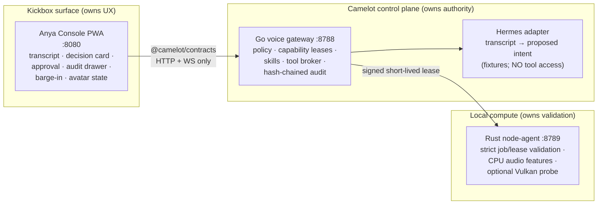
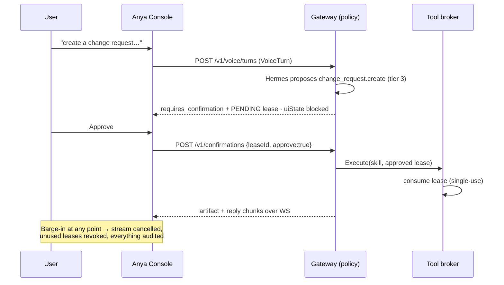

# Camelot × Kickbox — Governed Voice Vertical Slice

Status: **live** (text-first). Companion documents:
[current-state](../architecture/current-state.md) ·
[bootstrap-plan](../architecture/bootstrap-plan.md) ·
[ADR-001 boundaries](../adr/001-kickbox-camelot-boundaries.md)

Everything described here lives under [`integration/`](../../integration/) and
runs **without any API key** — all intents, replies, and compute jobs are
deterministic fixtures.

## Architecture





### Ownership (normative — ADR-001)

| Component | Owns | Never does |
|---|---|---|
| Camelot gateway (`integration/gateway`) | identity, policy, leases, skills, tool execution, audit, node authorization | render UX, capture audio |
| Kickbox console (`integration/kickbox`) | capture/VAD (voice phase), barge-in UX, transcript display, playback, avatar state | call a tool or node-agent directly |
| Hermes adapter (`gateway/hermes.go`) | transcript → proposed intent | touch broker, leases, or audit |
| Node-agent (`integration/node-agent`) | job/lease validation, batching, health, CPU fallback, optional Vulkan | accept an unsigned/expired/mismatched lease |

### Governance mechanics

- **Leases**: 30 s TTL, single-use, HMAC-signed, `pending → approved →
  consumed | revoked | expired`. Every effectful action needs one; tier-1
  reads do not.
- **Bootstrap skills**: `ops.staging.read` (tier 1, allow),
  `deployment.review.prepare` (tier 2, auto-approved lease),
  `change_request.create` (tier 3, human confirmation).
- **Barge-in** (`POST /v1/voice/barge-in`, mock event in the console):
  cancels the streaming reply and revokes all unused leases for the turn.
- **Audit**: hash-chained (`prevHash`/`hash`), redacted — tier ≥ 2 records
  carry `transcriptSha256`, never raw text. Raw audio never crosses the
  contract at all (`audioSha256` only). The chain is **persisted to a local
  SQLite file** (`.runtime/camelot-voice.db`, pure-Go driver, no CGO, no
  remote DB): it survives gateway restarts, new events continue the chain,
  and a tampered store is refused at startup. Leases are deliberately NOT
  persisted — 30 s single-use grants die with the process.

## Running the demo (native runtime — no Docker)

The slice is a **native-process** deployment: three local processes, PID and
log files under `integration/.runtime/`, health-gated startup. Docker and
Kubernetes are unsupported; the old compose artifacts are archived under
`integration/archive/docker/`.

Prereqs: Node ≥ 20, Go ≥ 1.24, Rust 1.85 (repo pin), Python 3 (dev static
server + smoke helpers). Fits comfortably in an 8 GB RAM envelope; no local
model is booted.

```bash
cd integration
make dev-up       # build + start gateway :8788, node-agent :8789, console :8080 (health-gated)
make smoke        # 11-check end-to-end proof
make status       # per-service pid + health + audit db size
make logs         # tail logs (scripts/logs.sh gateway -f to follow one)
make dev-down     # stop everything
```

Each Make target is a thin wrapper over
`scripts/{build,dev-up,dev-down,status,logs,smoke}.sh` — the scripts are the
canonical interface. `dev-up` refuses to double-start, waits for all three
health checks, and tears everything down again if any service fails its gate.

Optional supervision: wrap `scripts/dev-up.sh` in a systemd **user** unit,
tmux session, or Termux job as you prefer — the PID files make any of them
trivial. Tailscale is only relevant if you want the console reachable across
a private mesh; nothing in the slice depends on it.

**Demo URL:** `http://localhost:8080/kickbox/` — console UI with quick
buttons for the three governed utterances, a free-text input, the barge-in
control (enabled while Anya streams), the policy decision card, the approval
control (tier 3), and the audit drawer.

Service endpoints: gateway `http://localhost:8788` (healthz, turns, barge-in,
confirmations, audit, WS `/v1/sessions/{id}/events`), node-agent
`http://localhost:8789` (healthz, compute).

## Tests

```bash
cd integration && make test   # TS (vitest) + Go (go test -count=1) + Rust (both feature sets)
```

| Proof (bootstrap-plan) | Where |
|---|---|
| T1 no tool without lease | `gateway/broker_test.go`, `contracts/tests/client-guard.test.ts` |
| T2 tier-2 draft works | `gateway/turns_test.go` `TestTier2DraftCreation` |
| T3 change request needs confirmation | `gateway/turns_test.go` `TestChangeRequestRequiresConfirmation` |
| T4 barge-in cancels stream + revokes lease | `gateway/bargein_test.go`, `contracts/tests/barge-in.test.ts` |
| T5 CPU when Vulkan unavailable | `node-agent/tests/fallback.rs` (run with and without `--features vulkan`) |
| T6 audit redaction + chain | `gateway/audit_test.go` |
| Audit persistence across restart + tamper refusal | `gateway/store_test.go` |
| T7 end-to-end smoke | `scripts/smoke.sh` (11 checks) |

## Adopting the contracts in the real Kickbox-audio repo

`@camelot/contracts` is dependency-free ESM, so the Kickbox monorepo can
adopt it additively: copy `integration/contracts` in as
`packages/camelot-client` (or publish and depend on it), then have
`apps/pwa` drive a session page through `CamelotClient` +
`reduceSessionEvent`. Wire `useVad`'s voiced-gate to `POST /v1/voice/barge-in`
and the transcript path to `submitTurn({modality:'voice', …})` — no changes
to any existing Kickbox route or hook are required (ADR-001).

## Out of scope (by design)

Production deployment, unrestricted agents, global memory, custom LLM
kernels, Docker/Kubernetes, payments/secrets handling. The gateway's CORS is
demo-permissive; the default lease key (`camelot-demo-key`) is for local
demos only.
