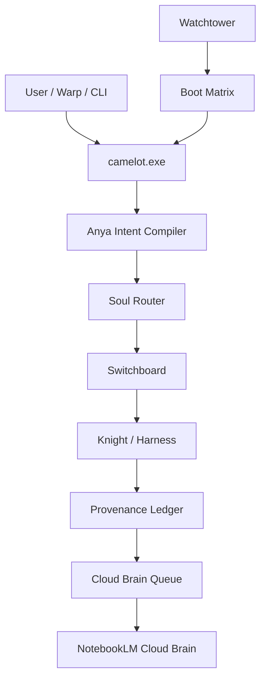
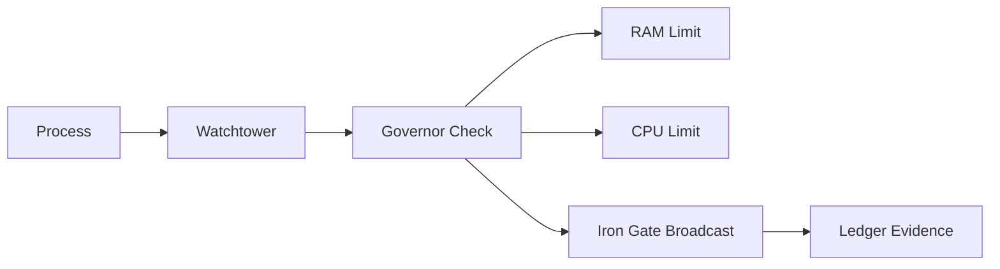

# Camelot-OS v701 Schematics

Generated: 2026-08-12T16:40:01.129458+00:00

## Control Flow Schematic

| From | To | Contract |
| --- | --- | --- |
| User / Warp / CLI | camelot.exe | prompt-first command intake |
| camelot.exe | Anya compiler | intent normalization and ambiguity reduction |
| Anya compiler | Soul Router | tensor scoring by velocity, magnitude, privacy, environment |
| Soul Router | Switchboard | terminal capability and health-aware dispatch |
| Switchboard | Knight / Harness | engine-specific execution or planning |
| Knight / Harness | Ledger | hashable operational provenance |
| Ledger | Cloud Brain queue | best-effort NotebookLM sync event |
| Cloud Brain queue | NotebookLM | canonical memory snapshot when endpoint is reachable |
| Watchtower | Boot Matrix | resource, service, and defense-grid health |
| Warp workflow | camelot.exe | repeatable operator cockpit commands |

## Mermaid Flow

## Execution Contract

1. Every operator action starts from `camelot.exe`, Warp workflow, dashboard, or a known harness.
2. Anya compresses intent before Merlin routes.
3. Soul Router scores the work and Switchboard checks terminal fitness.
4. A Knight, harness, or local engine executes only inside its declared lane.
5. Ledger records the mutation.
6. Cloud Brain sync preserves the memory snapshot or queues it when the endpoint is unreachable.

## Watchtower / Defense Schematic

