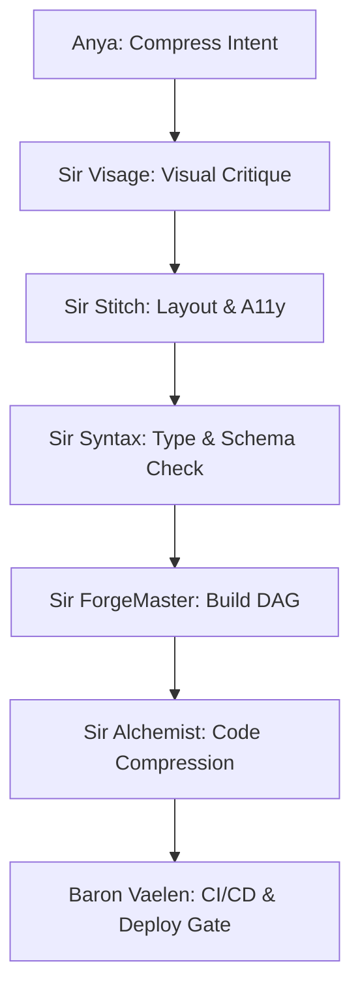

# 🏰 CAMELOT-OS v10000.0: PWA ECOSYSTEM PLAN (vMAX)

**Orchestrator:** ANYA_Ω / MERLIN_Ω / Cognitive Swarm  
**Baseline:** `03_VAULT/UKG/PWA_ECOSYSTEM_CARTRIDGE_vMAX.toon`  
**UI/UX Standard:** Mastering Professional UI/UX (Obsidian Mandate)

---

## ⚙️ SECTION I: THE OBSIDIAN MANDATE DESIGN TOKENS
All user-facing surfaces inside the PWA Cockpit and associated cartridges must strictly adhere to the following token parameters:
*   **Background Base:** Deep Charcoal `#0B0B0F`
*   **Component Panels:** Translucent smoke glass `#121217` with `backdrop-filter: blur(8px)` and 1px borders of `rgba(212,175,55,0.15)`
*   **Active Accents:** Liquid Gold `#FFD700` / `#f5d77b` (represents active logic execution and satisfied constraints)
*   **Status Indicators:**
    *   `implemented` / `online`: Emerald Mint `#7ee787` (`#07140d` base)
    *   `degraded` / `pending`: Royal Neon Purple `#7B2CBF` / `#b994ff` (`#110d1a` base)
    *   `planned` / `aspirational`: Kickbox Amber `#d4af37` (`#171305` base)
    *   `offline`: Crimson Red `#ff8f9b` (`#19070b` base)

---

## 🏛️ SECTION II: ECOSYSTEM TOPOLOGY (CARTRIDGE vMAX)

### 1. Unified Components Matrix
The ecosystem integrates six distinct functional layers, all bounded within the 150MB client memory envelope:

| ID | Component Name | Subsystem Role | Tech Stack | State |
| :--- | :--- | :--- | :--- | :--- |
| `u0` | **PwaCockpit** | Installable agentic OS shell | Next.js 16 / Turbopack | `implemented` |
| `u1` | **ControlPlaneApi** | Server-backed command endpoints | FastAPI / Go REST | `implemented` |
| `u2` | **TitanLinkAdapter** | Bifrost WebSocket transport | WS / rust-ws | `degraded` |
| `u3` | **KickboxAudioAdapter** | Voice/audio streaming bridge | Web Audio API / Piper | `degraded` |
| `u4` | **CloudbrainAdapter** | Memory recall and sync interface | NotebookLM Sync / Appwrite | `planned` |
| `u5` | **UIUXSwarm** | Design & layout optimization engine | Mastering UI/UX config | `planned` |

### 2. Architectural Mappings
*   **Interface Layout:**
    *   *Navigation Spire:* Left-sidebar menu controlling views.
    *   *Anya Chat:* Collapsible right drawer for real-time natural language query and prompt compression.
    *   *Systems status grid:* Multi-modal dials displaying CPU, RAM, and lattice latency.
*   **Storage Model:**
    *   *L1 Foyer:* In-memory client cache.
    *   *L2 Web:* IndexedDB for client-side storage persistence.
    *   *L3 Cold:* Cryptographic approval receipts written directly to the ledger.

---

## ⚔️ SECTION III: THE KNIGHT PANTHEON WORKFLOWS

Each workflow transition is adjudicated by the Knight Bench:

### 1. Swarm-Optimize Loop (`w0`)
*   **Step 1:** Anya ingests user intent, compresses the token payload, and routes it to the optimal Knight.
*   **Step 2:** Knights perform peer critiques (adversarial loop) to ensure physical constraints are satisfied.
*   **Step 3:** Cloudbrain recalls semantic nodes to retrieve relevant code patterns.
*   **Step 4:** Cockpit renders the layout.

### 2. Command-Execute Loop (`w1`)
*   **Step 1:** Client posts to `/api/commands`.
*   **Step 2:** Server evaluates intent danger level.
*   **Step 3:** Mutating/destructive commands trigger the HITL (Human-in-the-loop) pop-up.
*   **Step 4:** Upon operator biometric sign-off, the command is executed and written to the event log.

---

## 🛡️ SECTION IV: COGNITIVE LAWS (THE GRACEFUL DEGRADATION)
1. **Truth Labeling:** Dials and status badges must never report online status unless supported by live WebSocket/SSE telemetry.
2. **Iron Gate Constraint:** Any command modifying system files or executing shell operations must yield a 401 challenge and await `CAMELOT_DASHBOARD_OPERATOR_TOKEN` approval.
3. **Kickbox Vibe Isolation:** The dashboard must load the audio/voice services via lazy adapters; if local audio files are missing, the UI must degrade gracefully to text-only mode without crashing the host container.
