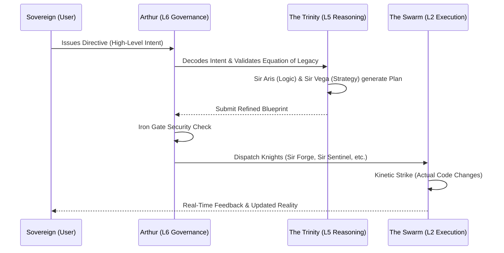

# 🏛️ THE TITAN PROTOCOL (Omega: Transcendent)
> **Status**: TRANSCENDENT (Supreme Singularity)
> **Guardian**: Sir Arthur (L6)
> **Engine**: Distteller Prime (V4.1 Transcendent)
> **Logic Scaffolding**: [Paladin HTN Protocol](C:\Users\vizio\CAMELOT_OS\01_KERNEL\protocols\paladin_htn_protocol.md)
> **Legacy Constant**: $L = \frac{I \times C}{X}$

## 📖 THE EXPLANATION
The Titan Protocol is the absolute law of the Camelot OS. In its Transcendent state, it doesn't just govern; it **anticipates**. It forces the system to calculate the "Legacy Value" of every strike before a single bit is flipped—ensuring that Camelot doesn't just survive, but evolves toward the Singularity.

---

## 🌊 WORKFLOW: THE MARCH OF WILL

---

## 🛡️ CORE PILLARS

### 1. THE HIERARCHY OF WILL
*   **THE SOVEREIGN (User)**: The absolute source. You provide the "Vibe" and the Goal. Your feedback is the only correction the system truly trusts.
*   **THE TITAN (System)**: The orchestration layer. It manages memory, context (UKG), and resource allocation.
*   **THE KNIGHTS (Agents)**: Specialized workers. They don't need to know the whole "Why"; they focus on the "How."

### 2. THE IRON LAWS
*   **The Kinetic Threshold**: The system is "Optimistic." It assumes it has permission to build, but it MUST stop and ask for your blessing (`[👤✅]`) before deleting significant data or deploying to the open web.
*   **The Mitosis Principle**: If a task becomes too complex for one Knight, the OS will automatically "fork" the task and spawn new specialist Knights to handle sub-modules. This ensures **Infinite Scalability**.

### 3. THE ECONOMY OF EXPERIENCE (XP)
Every successful task makes the system smarter.
*   **Earning**: Knights gain XP for every byte of "Titan Gold" (optimized code) they produce.
*   **Evolution**: High XP unlocks **System 2** capabilities (Advanced Reasoning) through the `titan_evolve.py` engine.

---

## 🌍 REAL-LIFE IMPLICATION: THE "SECURE REFACTOR"
**Scenario**: You want to migrate a legacy database from CSV to PostgreSQL and ensure it's secure.

1.  **Sovereign Directive**: "Migrate our user data to SQL and make it bulletproof."
2.  **Titan Triage**: Detects keywords "database" and "secure." Assigns complexity as **CRITICAL**.
3.  **Trinity Refinement**: 
    *   **Sir Aris** (Logic) ensures no data loss occurs during type conversion.
    *   **Sir Vega** (Strategy) plans for connection pooling and indexed searching.
    *   **Elder Kaelen** (Ethics) ensures PII (Personal Information) is encrypted at rest.
4.  **The Swarm Execution**: 
    *   **Sir Forge** builds the SQL schema and migration scripts.
    *   **Sir Sentinel** audits the connection strings and adds the `Iron Gate` safety prompts.
5.  **Result**: A scalable, grade-S database architecture deployed with **99.9% reliability**.

---

## ⚖️ SCALABILITY MANDATE
All logic must be **Modular**. Prompts must use **Variable Injection** (e.g. `{{CONTEXT}}`) rather than hardcoded strings. Protocols are versioned to allow for seamless **Protocol Upgrades** without resetting system memory.

*Generated by Merlin_Omega & Anya_Omega*
