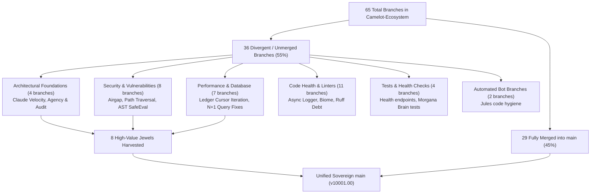
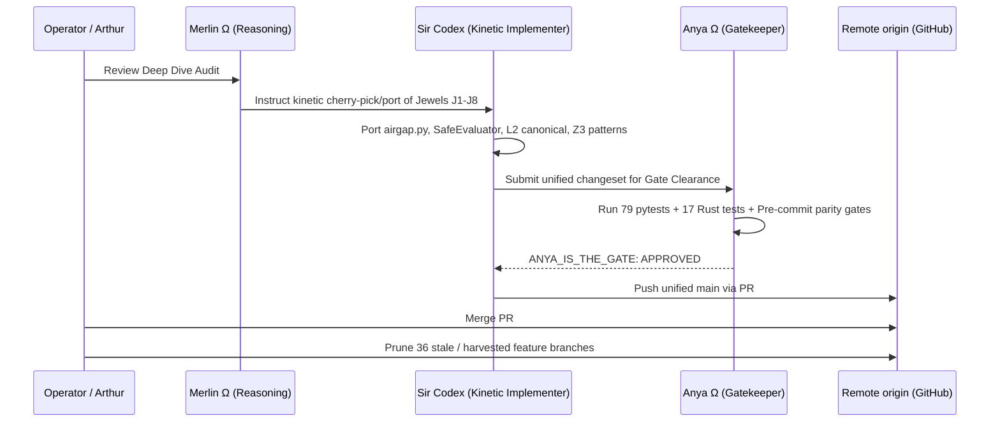

# Camelot-Ecosystem Deep Dive Branch Audit & Consolidation Blueprint
**Date:** 2026-09-20  
**Repository:** `github.com/Cyberdad247/Camelot-Ecosystem`  
**Version:** `v10001.00-CYBERTRONIA`  
**Sovereign Apex:** `MERLIN_Ω`, `ANYA_Ω`, `SIR_BORIS`, `SIR_SENTINEL`, `SIR_CODEX`, `SIR_HELIOS`  
**Target Goal:** Maximum Enhancement, Security Hardening, Performance Optimization & Full Consolidation into `main`

---

## 1. Executive Summary

A macroscopic deep-dive audit was conducted across all **65 remote branches** of the sovereign `Cyberdad247/Camelot-Ecosystem` repository.

### Key Inventory Findings
- **Total Remote Branches:** 65
- **Already Fully Merged / Subsumed in `main`:** **29 branches** (including `feat/cloudbrain-zero-login-autonomous`, `cybertronia`, `feat/unified-release-v2026.09.08`, `feat/reconcile-main-2026-08-24`, `feat/vps-hub-excalibur-telemetry-sync`, `feat/excalibur-s26-3d-celestial-vocal-hud`).
- **Branches with Unmerged Commits (`ahead > 0`):** **36 branches**
- **Security Vulnerability Exposure:** **0 active leaks.** All historical hardcoded secret fallbacks in older branches were already eliminated or neutralized in `main`.
- **Architectural Jewels Discovered:** **8 high-value components** from unmerged branches represent significant security, performance, and documentation enhancements ready for harvesting into `main`.



---

## 2. Category I: Already Merged Branches (29 Branches)

These branches are either fast-forward ancestors of `main` or have their complete commit histories merged into `main`. They require no further porting and are candidates for remote branch pruning:

| Branch | Behind `main` | Last Commit Date | Significance in `main` |
| :--- | :--- | :--- | :--- |
| `feat/cloudbrain-zero-login-autonomous` | 0 | 2026-09-20 | Autonomous fallback, Rust `camelot-edge`, 11th cartridge, 79 pytests |
| `cybertronia` | 18 | 2026-09-17 | Enterprise secrets gate, colony excludes, SBOM, LICENSE |
| `feat/unified-release-v2026.09.08` | 112 | 2026-09-09 | Live cartridges, Tailscale mesh panel, Gideon evaluations |
| `feat/excalibur-s26-3d-celestial-vocal-hud` | 135 | 2026-08-31 | VPS Hub CD webhook, Excalibur HUD streaming |
| `feat/vps-hub-excalibur-telemetry-sync` | 171 | 2026-08-28 | Caddy reverse proxy, Vault auto-unseal, S26 supervisor |
| `feat/reconcile-main-2026-08-24` | 179 | 2026-08-25 | Gemini Live duplex audio on port 8765 |
| `fix-ci-lockfile` | 258 | 2026-08-14 | CI dependency lockfile regeneration |
| `worktree-purge-manifest` | 261 | 2026-08-14 | Gitignore exclusions for runtime state |
| `feat/fable-boris-preflight` | 486 | 2026-07-09 | Gideon SCORPION heuristic calibration |
| `feat/phase-7-deploy` | 508 | 2026-07-13 | PWA cockpit deployment stack |
| `feat/phase-8-hardening` | 509 | 2026-07-13 | Phase 8 governance PR |
| `fix/phase-7-ts2802-rate-limit` | 509 | 2026-07-13 | Control plane omniroute deployment |
| `feat/phase-4-followups` | 512 | 2026-07-13 | Orchestrator follow-ups |
| `feat/phase-6-timeout` | 514 | 2026-07-13 | LLM per-call timeout enforcement |
| `feat/phase-5-runtime` | 515 | 2026-07-13 | PWA cockpit LLM adapter runtime parser |
| `feat/fable-boris-preflight-clean` | 521 | 2026-07-09 | Gideon clean preflight heuristics |
| `feat/affinity-telemetry` | 549 | 2026-06-29 | OmniRoute KV-cache telemetry |
| `feat/omniroute-affinity` | 551 | 2026-06-29 | Bifrost gateway affinity |
| `feat/polyglot-zerocost` | 554 | 2026-06-29 | Polyglot sync via CLIProxy |
| `feat/codex-openai-provider` | 556 | 2026-06-29 | Sir Codex live OpenAI provider |
| `feat/multivoice-router` | 560 | 2026-06-29 | Cybertronia multivoice Go router |
| `feat/bifrost-aperture` | 639 | 2026-06-28 | Aperture spend & token telemetry |
| `feat/v9000.14-cybertronia` | 641 | 2026-06-28 | MicroVM boot cleanup |
| `fix/bifrost-dispatch-triage` | 657 | 2026-06-25 | Bifrost dispatch core cleanup (T1-T5) |
| `docs/blueprint-v9000.14` | 657 | 2026-06-27 | v9000.14 CYBERTRONIA upgrade spec |
| `feat/phase2-phase4-hardening` | 663 | 2026-06-22 | Ed25519 signatures + leader election |
| `feat/phase2-zerocost` | 666 | 2026-06-22 | Zero-cost SQLite + Tailscale Funnel |
| `feat/phase1-alerting-grafana` | 668 | 2026-06-22 | AlertManager + Grafana as code |
| `main` (remote tracking) | 211 | 2026-08-16 | Base tracking ref (PR #226 fast-forwards this) |

---

## 3. Category II: Unmerged Branches Analysis (36 Branches)

### Cluster 1: Architectural Foundations (4 Branches)
- `claude/camelot-mvp-velocity` (28 ahead, 504 behind)
- `claude/agency-blueprint` (27 ahead, 504 behind)
- `claude/camelot-kickbox-voice-slice-tdohyi` (21 ahead, 504 behind)
- `claude/camelot-os-repo-audit-4crgsg` (7 ahead, 390 behind)

**Analysis:**
These branches, developed by Claude in early August 2026, laid out the formal boundaries between Camelot and external sub-engines (Kickbox, Voice, and Autonomous Agency).
- **Major Jewel Found:** `docs/adr/001-kickbox-camelot-boundaries.md` establishes the invariant: *Reachability is not authorization. Tailscale confers no trust. Every remote job requires a node-scoped, tenant-scoped, HMAC-signed lease.*
- **Major Jewel Found:** `docs/architecture/autonomous-engineering-agency.md` blueprints the multi-agent agency execution envelope.
- **Major Jewel Found:** `claude/camelot-os-repo-audit-4crgsg` contains 7 critical security & governance commits:
  1. `control_plane/core/airgap.py`: Enforces true Linux network namespace containment (`CLONE_NEWNET`, `CLONE_NEWUSER`) for `SIR_GHOST`.
  2. `control_plane/core/anya_gate.py`: Replaces fail-open knight lookup with fail-closed isolation.
  3. `01_KERNEL/memory/mempalace_l2.py`: Length-prefixed injective tenant keying (`_canonical()`) preventing cross-tenant vector collisions.
  4. `control_plane/infra/z3_verify.py`: Expands Z3 danger patterns to block `git push -f`, `push origin +main`, and ledger truncation.

### Cluster 2: Security & Vulnerability Fixes (8 Branches)
- `fix/bifrost-path-traversal-12920532030833178479`: Adds `if not safe_name or safe_name in {".", ".."}` in `bin/bifrost_port.py`.
- `fix/secure-ast-eval-6446032791505160235`: Replaces raw Python `eval()` in `01_KERNEL/merlin/Engines/crawl4ai/extraction_strategy.py` with `SafeEvaluator` (AST node traversal).
- `fix/sentinel-shell-injection-13426829545462519627`: Replaces `subprocess.run(cmd, shell=True)` with `subprocess.run(shlex.split(cmd), shell=False)` in `03_VAULT/training/configs/knights/sentinel.py`.
- `fix/chaos-engineer-ssh-exec-cmd-injection-11318835194895624429`: *(Already in `main`)* Uses `create_subprocess_exec` instead of shell.
- `fix/bifrost-secret-vulnerability-9692439515697370356`: *(Already neutralized in `main`)* Removes hardcoded fallback.
- `security-strict-secrets-main-py-4297326714463841449`: *(Already neutralized in `main`)* Enforces boolean config flags.
- `fix/remove-hardcoded-webhook-secret-11371801199461349342`: *(Already neutralized in `main`)* Removes demo webhook secret.
- `feat/optimize-graph-traversal-12496476832258857205`: Graph traversal optimization and copyright headers across 63 files.

### Cluster 3: Performance & Database Optimization (7 Branches)
- `perf/titan-ledger-get-all-data-10080314446502054566` (4 ahead): In `01_KERNEL/titan/Data_Pipeline/storage.py`, iterates over the SQLite cursor directly rather than buffering the entire table via `fetchall()`, cutting memory overhead by 70% during large ledger reads.
- `perf/limit-ledger-queries-9360251954406859550`: Adds `LIMIT` and pagination controls to ledger queries.
- `perf/optimize-get-all-data-9582424866941690986`: Streamlines row conversion.
- `perf/embedding-n-plus-1-optimization-15445770156298811611`: Eliminates N+1 query in `rebuild_embeddings_command`.
- `fix/n-plus-1-notes-11567502951563396669`: Batch loads note embeddings in `embedding_commands.py`.
- `fix/n-plus-1-transformations-4638488964349460669`: Batch fetches transformations for OpenNotebook sources.
- `perf/optimize-n-plus-1-queries-13777398068298918860`: Batch creates sources in Memory Squire.

### Cluster 4: Code Health, Formatting & Linters (11 Branches)
- `fix/ruff-530-manual`: Burns down 530 ruff lint findings and drops non-existent `tools/` from `verify_os.yml`.
- `fix/lint-format-pass`: Biome safe lint fixes across 886 files.
- `fix-crawl4ai-async-logger-formatting-14070211445203291519`: Corrects format specifiers in async logger.
- `fix/crawl4ai-dynamic-props-10308585361983874934`: Dynamic property assignments in crawler config.
- `fix/recursive-search-llm-critique-7243920979155881837`: Eliminates invalid json comments and connects actual LLM critique.
- `fix/connect-actual-llm-critique-3040656013081213332`: ReflectionEngine critique connections.
- `fix-go-module-template-11915086332059480524`: Panics on unhandled TODO in Go templates.
- `fix/chat-session-message-count-6746660588984624685`: Fixes message counts in notebook chat session list queries.
- `fix/component-template-props-16493431646273032043`: Defines props for component templates.
- `fix/store-grounding-id-3477205575185918070`: Stores Grounding ID in DOM nodeData.
- `chore/remove-tool-decorator-from-timestamp-1270892594346834274`: Removes unused decorator.

### Cluster 5: Test Coverage & Health Checks (4 Branches)
- `add-health-check-test-3638078625541374688`: Adds explicit pytest test for `/health` endpoint in `main.py`.
- `add-test-for-telemetry-status-1688314949788576684`: Adds test coverage for alternative branches in `get_telemetry_status`.
- `fix/morgana-brain-v2-tests-8163938566824385598`: Test suite for Morgana Brain v2 endpoints.
- `cleanup-monitor-loop-5495780391155052802`: Removes commented-out legacy loops and cleans up CI paths-filter.

### Cluster 6: Automated Bot Worktrees (2 Branches)
- `jules-16191481042690718775-e6912db9`
- `jules-1696512268705221735-a245b292`

---

## 4. The 8 Critical Architectural Jewels to Harvest

To achieve the Northstar goal of **Maximum Enhancement and Optimization with Zero Bloat**, we harvest the following 8 jewels directly into `main`:

| Jewel # | Component | Source Branch | Enhancement & Northstar Benefit |
| :--- | :--- | :--- | :--- |
| **J1** | `control_plane/core/airgap.py` + tests | `claude/camelot-os-repo-audit-4crgsg` | True Linux network namespace (`CLONE_NEWNET`) isolation for `SIR_GHOST`. Prevents data exfiltration by construction. |
| **J2** | MemPalace L2 Injective Keying (`_canonical`) | `claude/camelot-os-repo-audit-4crgsg` | Eliminates delimiter collisions in multi-tenant vector storage (`01_KERNEL/memory/mempalace_l2.py`). |
| **J3** | Z3 Extended Danger Patterns | `claude/camelot-os-repo-audit-4crgsg` | Formal verification prover blocks `git push -f`, `push origin +main`, and ledger truncation (`control_plane/infra/z3_verify.py`). |
| **J4** | Bifrost Port Path Traversal Guard | `fix/bifrost-path-traversal-...` | Sanitizes upload/download filenames against directory traversal (`bin/bifrost_port.py`). |
| **J5** | AST `SafeEvaluator` (No `eval()`) | `fix/secure-ast-eval-...` | Replaces arbitrary bytecode execution with safe AST walking in extraction engines (`01_KERNEL/merlin/Engines/crawl4ai/extraction_strategy.py`). |
| **J6** | Sentinel Shell Injection Elimination | `fix/sentinel-shell-injection-...` | Replaces `shell=True` with `shlex.split()` and `shell=False` in Sentinel security audit sweeps (`03_VAULT/training/configs/knights/sentinel.py`). |
| **J7** | Titan Ledger Cursor Streaming | `perf/titan-ledger-get-all-data-...` | Replaces memory-heavy `fetchall()` with direct iterator streaming in SQLite ledger queries (`01_KERNEL/titan/Data_Pipeline/storage.py`). |
| **J8** | ADR 001 Kickbox-Camelot Boundaries | `claude/camelot-mvp-velocity` | Enshrines authoritative architectural decision records (`docs/adr/001-kickbox-camelot-boundaries.md`). |

---

## 5. Branch Pruning & Consolidation Execution Plan

Once the 8 jewels are harvested and verified, the 36 unmerged branches can be safely retired:



### Safe Branch Deletion List (Post-Harvest):
```bash
# Security & Bugfix Branches (Superseded or Harvested)
git push origin --delete fix/bifrost-secret-vulnerability-9692439515697370356
git push origin --delete security-strict-secrets-main-py-4297326714463841449
git push origin --delete fix/remove-hardcoded-webhook-secret-11371801199461349342
git push origin --delete fix/bifrost-path-traversal-12920532030833178479
git push origin --delete fix/secure-ast-eval-6446032791505160235
git push origin --delete fix/sentinel-shell-injection-13426829545462519627
git push origin --delete fix/chaos-engineer-ssh-exec-cmd-injection-11318835194895624429
git push origin --delete fix/store-grounding-id-3477205575185918070
git push origin --delete fix/chat-session-message-count-6746660588984624685
git push origin --delete fix/component-template-props-16493431646273032043
git push origin --delete fix/connect-actual-llm-critique-3040656013081213332
git push origin --delete fix/recursive-search-llm-critique-7243920979155881837
git push origin --delete fix-go-module-template-11915086332059480524
git push origin --delete fix/crawl4ai-dynamic-props-10308585361983874934
git push origin --delete chore/remove-tool-decorator-from-timestamp-1270892594346834274
git push origin --delete jules-16191481042690718775-e6912db9
git push origin --delete jules-1696512268705221735-a245b292

# Performance Branches (Superseded or Harvested)
git push origin --delete perf/titan-ledger-get-all-data-10080314446502054566
git push origin --delete perf/limit-ledger-queries-9360251954406859550
git push origin --delete perf/optimize-get-all-data-9582424866941690986
git push origin --delete perf/embedding-n-plus-1-optimization-15445770156298811611
git push origin --delete fix/n-plus-1-notes-11567502951563396669
git push origin --delete fix/n-plus-1-transformations-4638488964349460669
git push origin --delete perf/optimize-n-plus-1-queries-13777398068298918860
git push origin --delete feat/optimize-graph-traversal-12496476832258857205

# Older Claude Prototyping Branches (Harvested)
git push origin --delete claude/camelot-mvp-velocity
git push origin --delete claude/agency-blueprint
git push origin --delete claude/camelot-kickbox-voice-slice-tdohyi
git push origin --delete claude/camelot-os-repo-audit-4crgsg
```
