<!-- Copyright © 2026 Invisioned Marketing inc. All Rights Reserved. -->
# 🏛️ Sovereign Multi-Knight Branch Unification & Architectural Report
**Target Repository**: `https://github.com/Cyberdad247/Camelot-Ecosystem.git`  
**Compiled By**: `ANYA_Ω` (APEE v6.5) | **Date**: `2026-09-20`  
**Orchestration Pantheon**: `ANYA_Ω`, `SIR_BORIS`, `SIR_SENTINEL`, `MERLIN_Ω`, `SIR_CODEX`, `SIR_HELIOS`

---

## Executive Summary

An exhaustive multi-branch architectural audit was executed across all local and remote branches of `Camelot-Ecosystem.git`. 

The repository currently contains **47 remote branches** and **6 local branches**. Crucially, the branch **`feat/cloudbrain-zero-login-autonomous`** is the current leading sovereign trunk: it already includes 100% of commits from `main`, `cybertronia`, the v1000 MAX Compendium, the 54-Knight YAML Roster, all 10 Scabbard Cartridges, and Milestone `#1842`.

However, several highly valuable architectural innovations, mobile edge runtimes, security patches, and performance optimizations exist in divergent branches that must be consolidated into the unified sovereign `main`.

---

## 1. Branch Topology & Classification Matrix

```mermaid
graph TD
    M["origin/main (Baseline)"] --> CB["feat/cloudbrain-zero-login-autonomous (Sovereign Apex)"]
    
    CB --> U_MAIN["👑 UNIFIED MAIN (Target)"]
    
    subgraph "High-Value Feature Clusters"
        A1["feat/android-edge-supervisor<br/>(Rust kinetic_edge, Termux bus)"]
        A2["feat/unified-bootstrap-hud<br/>(Headless boot, L2 degradation)"]
        A3["cartridge/vps-hub-cartridge-v1<br/>(Go Console, HTMX, Three.js)"]
        A4["origin/claude/agency-blueprint<br/>(Contracts, Skills Manifest)"]
    end
    
    subgraph "Critical Security & Dependency Patches"
        S1["fix/sentinel-shell-injection<br/>(subprocess shell=False)"]
        S2["fix/chaos-engineer-ssh-exec<br/>(asyncio create_subprocess_exec)"]
        S3["fix/bifrost-secret-vulnerability<br/>(Mandatory env secret)"]
        S4["fix/remove-hardcoded-webhook-secret<br/>(secrets.token_hex)"]
        S5["claude/camelot-os-repo-audit<br/>(Wasmtime 47, PyO3 0.29)"]
    end
    
    subgraph "Performance & N+1 Query Fixes"
        P1["perf/titan-ledger-get-all-data<br/>(Streaming cursor without fetchall)"]
        P2["feat/optimize-graph-traversal<br/>(Titan/Knowledge graph optimization)"]
    end
    
    A1 --> U_MAIN
    A2 --> U_MAIN
    A3 --> U_MAIN
    A4 --> U_MAIN
    S1 --> U_MAIN
    S2 --> U_MAIN
    S3 --> U_MAIN
    S4 --> U_MAIN
    S5 --> U_MAIN
    P1 --> U_MAIN
    P2 --> U_MAIN
```



---

## 2. Component & Architecture Evaluation

| Component Area | Current Apex (`cloudbrain`) | Contender Branch | Knight Assessment & Winner |
|---|---|---|---|
| **Android / Mobile Edge** | Basic ADB & Scrcpy scripts | `feat/android-edge-supervisor` (Rust `kinetic_edge`) | **WINNER: `android-edge-supervisor`**. Zero hotpath bloat (Rule 7), 100% native Rust daemon with state persistence, Termux boot scripts, and passing contracts. |
| **Boot Resilience & CLI** | Requires full env, spawns visible windows | `feat/unified-bootstrap-hud` | **WINNER: `unified-bootstrap-hud`**. Provides `CREATE_NO_WINDOW` Popen flag, graceful L2 memory degradation without `MEMPALACE_SECRET`, and read-only planning queue. |
| **Operator Console** | Next.js 14 PWA (`apps/pwa`) | `cartridge/vps-hub-cartridge-v1` (Go + HTMX) | **HYBRID**: Retain Next.js 14 PWA as primary user shell; port Go `operator-console` into isolated cartridge `/cartridges/operator-console` for lightweight VPS deployment. |
| **Security Execution Engine** | `shell=True` in audit checks | `fix/sentinel-shell-injection`, `fix/chaos-engineer-ssh-exec` | **WINNER: Fix Branches**. Enforces `shlex.split()` with `shell=False` and `create_subprocess_exec()`, completely closing CVE-grade shell injection vectors. |
| **Secret Sanitization** | Some demo fallback keys | `fix/bifrost-secret-vulnerability`, `fix/remove-hardcoded-webhook` | **WINNER: Fix Branches**. Enforces hard runtime halts when `BIFROST_BRIDGE_SECRET` is unset, and substitutes `secrets.token_hex(32)` for test runs. |
| **Core Dependencies** | Wasmtime 30, PyO3 0.23 | `origin/claude/camelot-os-repo-audit-4crgsg` | **WINNER: Repo Audit**. Upgrades Wasmtime 30 → 47 and PyO3 0.23 → 0.29, eliminating 24 known upstream Rust advisories. |
| **Data Storage / Graph** | Classic SQLite queries | `perf/titan-ledger-get-all-data`, `feat/optimize-graph-traversal` | **WINNER: Perf Branches**. Reduces RSS footprint by streaming DB rows directly without full array buffering. |

---

## 3. The 6-Phase Topological Integration Plan

To achieve zero regressions and maintain Anya Gate clearance, merging must proceed in strict topological order:

```
Phase 1: SECURITY & RESILIENCE HOTFIXES (Surgical File Ports)
         ├── Port shlex.split() into Sir Sentinel (security/warden.py & audit runner)
         ├── Port create_subprocess_exec() into chaos_engineer.py
         ├── Port mandatory BIFROST_BRIDGE_SECRET validation into main.py
         └── Port graceful L2 degradation & CREATE_NO_WINDOW from feat/unified-bootstrap-hud

Phase 2: RUST KINETIC EDGE INTEGRATION (Mobile Swarm)
         ├── Port kinetic_edge/camelot_edge/ into workspace Cargo.toml
         ├── Port control_plane/dispatch/edge_bus.py & edge_protocol.py
         ├── Port tests/test_edge_bus.py & tests/test_edge_protocol.py
         └── Register camelot_edge in 04_KINETIC/ workspace members

Phase 3: PERFORMANCE & DATABASE OPTIMIZATIONS
         ├── Port cursor iteration in 01_KERNEL/titan/Data_Pipeline/storage.py
         └── Port graph traversal caching in 01_KERNEL/titan/graph/knowledge_graph.py

Phase 4: DEPENDENCY MODERNIZATION (Rust & Python)
         ├── Upgrade wasmtime and pyo3 in Cargo.toml & Cargo.lock
         └── Run cargo audit to verify 0 advisories

Phase 5: OPERATOR CONSOLE SCABBARD CARTRIDGE
         └── Encapsulate Go operator console into cartridges/vps-operator-console/
             (Zero collision with apps/pwa, isolated build pipeline)

Phase 6: VERIFICATION & MERGE TO MAIN
         ├── Run pre-commit parity gates (all 6 gates)
         ├── Run pytest canonical suites (tests/ + 03_VAULT/training/configs/tests/)
         ├── Run cargo check && cargo test
         └── Fast-forward / merge to origin/main
```

---

## 4. Conflict Zones & Resolution Directives

1. **`Cargo.toml` (Workspace Members)**:
   - *Issue*: `android-edge-supervisor` and `vps-hub-cartridge` add different members.
   - *Resolution*: Include `kinetic_edge/camelot_edge` in workspace members. Keep Go packages in their standalone module roots (`go.mod`).
2. **`control_plane/infra/harness.py`**:
   - *Issue*: `unified-bootstrap-hud` modifies boot flags while `cloudbrain` modified heartbeat routing.
   - *Resolution*: Merge both: keep heartbeat routing in `harness_heartbeat.jsonl` AND apply `CREATE_NO_WINDOW` to Windows background sub-processes.
3. **`main.py` (Bifrost Gateway)**:
   - *Issue*: Hardcoded secret fix vs multivoice routing imports.
   - *Resolution*: Keep the clean multivoice pipeline imports while enforcing the mandatory `BIFROST_BRIDGE_SECRET` check.
