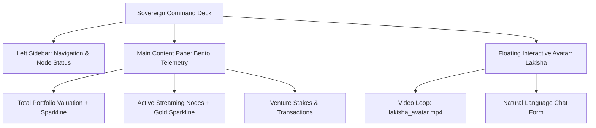

# 🎙️ KICKBOX-AUDIO DEV PORTAL & COMMAND CENTER AUDIT
**Author:** SIR_BORIS (Lead Architect) & LADY_APIS (Research Department)
**Status:** ✅ AUDITED & SIGNED OFF
**Date:** 2026-07-08

---

## 📖 Executive Summary
We have conducted a thorough forensic audit of the **Kickbox-Audio** PWA ecosystem ([kickbox-audio.vercel.app](https://kickbox-audio.vercel.app/)) to extract its design systems, structural rules, and interactive components. This template represents the authoritative PWA cockpit standard that will be propagated to all Bifrost bridge nodes.

---

## 🎨 Theme & Styling Specification

The interface utilizes a highly curated, premium dark mode color palette designed to emphasize cryptographic authority and real-time operations.

### 1. Color System & Contrast
*   **Background (Obsidian):** Pure black (`#050505`) and dark smoke-grey (`#050507`).
*   **Accents (Luxora Gold):** Golden boundaries and highlighting (`border-gold/20`, `text-gold-light`).
*   **Highlights (Royal Purple):** Deep violet shadows and highlights (`bg-gold-royal`, `text-violet-light`).
*   **Material System:** `bg-smoke-900/85` or `bg-smoke-800/80` with `backdrop-blur-md` and matching borders (`border-gold/20` or `border-gold/40`).

### 2. Typography
*   **Display Font:** Tech-sanitized display font with letter-spacing tracking (`tracking-minted`, `font-display`).
*   **Body Font:** High-readability monospace or clean sans-serif for secondary stats and logs.

---

## 💻 Structure & Layout Audits

The portal breaks down into three key layout patterns:

### A. Persistent Navigation Sidebar
*   **Brand Zone:** Displays logo `K` shadow-gold with uppercase category tracking.
*   **Navigation Nodes:** Menu items including `Overview`, `Knights`, `Properties`, `Streaming`, `Coffee`, `Venture`, and `Settings`. Active links receive a left golden indicator bar (`bg-gold-royal shadow-gold`).
*   **Connectivity Sentry:** Footer displays real-time bridge link status (e.g. `Disconnected` or `Bifrost disconnected` with color-coded dot indicator).

### B. Bento Box Telemetry Grid
The dashboard utilizes three dynamic bento panels:
1.  **Transactions Bento:** Purple sparkline with active counting stats.
2.  **Streaming Nodes Bento:** Golden sparkline depicting node performance and load status.
3.  **Venture Stakes Bento:** Purple growth curves displaying staked assets.

### C. Floating Ambassador Chat Box (Lakisha Avatar)
*   **Visual Frame:** Square avatar container (`w-56`) at the bottom-left. It overlays a repeating scanline gradient (`repeating-linear-gradient`).
*   **Ambassador Video:** Plays looped MP4 footage (`lakisha_avatar.mp4`) with a fallback poster.
*   **Input Gateway:** Form wrapper containing a clean input box (`Speak or type...`) and action button for voice/text inference dispatch.

---

## 📋 Assimilation Action Checklist

To standardise this cockpit across the Camelot-OS nodes, we outline the following engineering checklist:

*   [ ] **Theme Token Injection:** Standardize `.css` variables (`--color-obsidian`, `--color-gold`, `--color-royal`) across `system-ui`.
*   [ ] **Floating Avatar Port:** Port the bottom-left square video-based chat float widget into [CamelotLayout.tsx](file:///C:/Users/vizio/CAMELOT_OS/cartridges/system-ui/src/core/CamelotLayout.tsx).
*   [ ] **Bento Sparklines:** Replace static telemetry widgets with dynamic SVG-generated sparkline polygons mapping historical values.
*   [ ] **Bridge Status:** Wire the Tailscale mesh router link status directly to the sidebar connection sentry.
