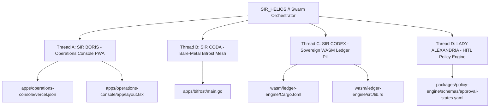

# Bio-Kinetic Swarm Execution Matrix: KBA Executive Ecosystem Cartridge

## Hardware Baseline & Operating Constraints
* **Node Target:** Bare-metal Laptop Edge Server (`100.71.218.75`)
* **Resource Ceiling:** Hard 8GB RAM Ceiling (Docker Prohibited — WASM & Native Binaries Only)
* **Ingress Model:** Zero-Trust Bifrost Bridge (mTLS WebSocket / gRPC Mesh)
* **Highlight Palette:** Luxora Gold (`#D4AF37`) & Obsidian Dark Surface

---

## Parallel Execution Tree

### Thread Status Matrix

| Thread | Lead Agent | Target Component | Status | Target Path |
|---|---|---|---|---|
| ⚡ **Thread A** | SIR BORIS | Next.js PWA Glass & isolated WebRTC/AudioWorklet HUD | **EXECUTING** | `apps/operations-console/vercel.json` `apps/operations-console/app/layout.tsx` |
| 🛡️ **Thread B** | SIR CODA | Bare-Metal Bifrost gRPC/mTLS Webhook Polyglot Router | **EXECUTING** | `apps/bifrost/main.go` |
| 🧪 **Thread C** | SIR CODEX | Offline Double-Entry WASM CRDT Ledger Pill | **EXECUTING** | `wasm/ledger-engine/src/lib.rs` |
| ⚖️ **Thread D** | LADY ALEXANDRIA | Tenant 001 HITL State Machine | **EXECUTING** | `packages/policy-engine/schemas/approval-states.yaml` |

---
⚜️ *CAMELOT-OS // SIR_HELIOS BIO-KINETIC DISPATCH*
