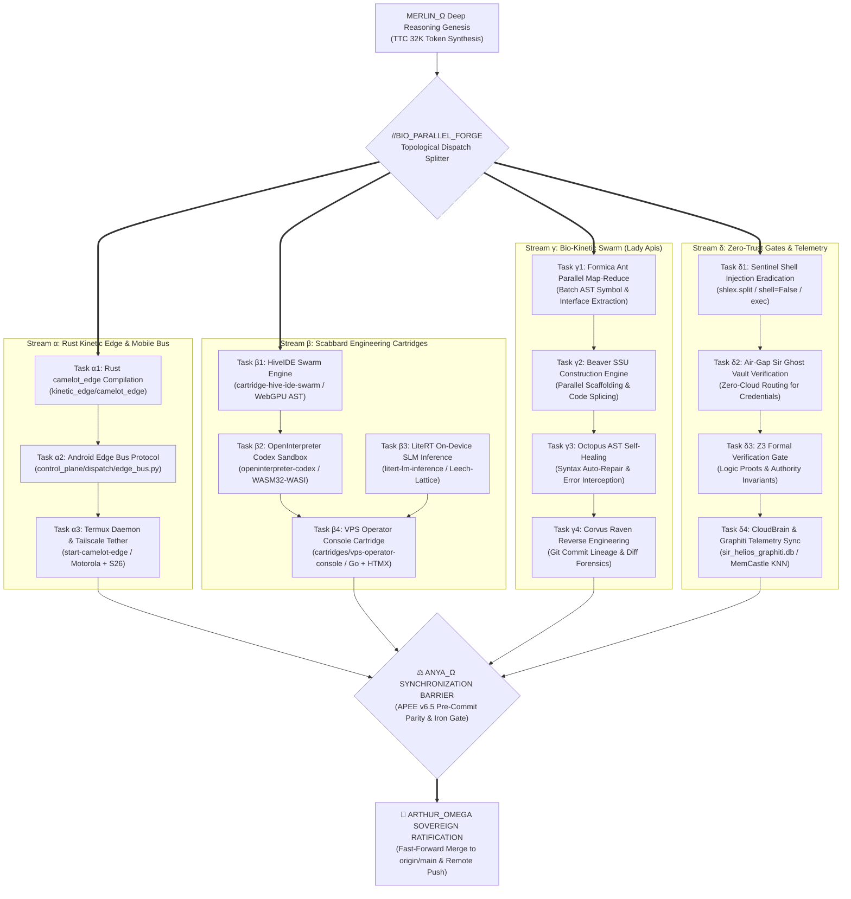

# 🏛️ The Master Architecture: Kinetic Parallel DAG

> **Orchestrated by MERLIN_Ω for kinetic execution by SIR_HELIOS.**  
> Built upon the Titanium Laws of Camelot-OS: Zero hotpath bloat (Rule 7), Anya First & Last Gate (Rule 1), 8GB Scarcity Protocol, and Bio-Kinetic 20-Fauna Swarm parallelism.

---

## 1. Macroscopic Directed Acyclic Graph (DAG)



---

## 2. Structural Layer Topology

```
┌─────────────────────────────────────────────────────────────────────────────┐
│ LAYER 7: APEX COGNITIVE & CLOUDBRAIN MESH                                    │
│ MERLIN_Ω (TTC DAG) ── SIR_HELIOS (Spire Sentinel) ── ANYA_Ω (Gatekeeper)   │
│ NotebookLM Mesh (ab8aa359...) ── Graphiti Knowledge Graph ── MemCastle KNN   │
├─────────────────────────────────────────────────────────────────────────────┤
│ LAYER 6: SCABBARD ENGINEERING CARTRIDGES (Isolated Runtimes)                │
│ • cartridge-hive-ide-swarm (WebGPU, AST runner, ZeroClaw IPC)               │
│ • openinterpreter-codex    (WASM32-WASI sandbox, isolated PTY)              │
│ • litert-lm-inference      (On-device SLM, Leech-Lattice quantization)      │
│ • moa-routing-capture      (Two-hook routing, signal mining, MoA)           │
│ • vps-operator-console     (Go, HTMX, Three.js spatial HUD)                 │
├─────────────────────────────────────────────────────────────────────────────┤
│ LAYER 5: BIO-KINETIC 20-FAUNA SWARM & HORDE SUBSTRATE                       │
│ Lady Apis Conductor ── CamouflageCipher AES-256-GCM ── 4-Knight Aegis Shield│
│ • Formica (Ants: Map-Reduce)     • Beaver (Builder: SSU Construct)          │
│ • Octopus (AST Self-Repair)      • Corvus (Raven: Reverse Engineering)      │
│ • Mantis  (Surgical AST Pruning) • Simian (Chaos Monkey Resilience)         │
├─────────────────────────────────────────────────────────────────────────────┤
│ LAYER 4: KINETIC EDGE & MOBILE MESH (Rule 7 Hotpath: 100% Native)           │
│ Rust camelot_edge crate ── Android Termux daemon ── Tailscale WireGuard     │
│ cybertronia (PC) ── vashawns-s26-ultra ── motorola-moto-g-power-5g ── vps    │
├─────────────────────────────────────────────────────────────────────────────┤
│ LAYER 3: PERSISTENCE & POSITION-ADDRESSED VFS                               │
│ vfs://worldtree/knights/ ── vfs://worldtree/cartridges/ ── vfs://mesh/      │
│ SQLite WAL ── DuckDB-WASM ── 4-Mirror Cryptographic Provenance Ledger       │
└─────────────────────────────────────────────────────────────────────────────┘
```

---

## 3. Parallel Execution Directives for Sir Helios

1. **Substrate Decoupling**:
   - Every module execution operates in its own isolated worktree or subprocess sandbox.
   - Stream α (Rust Native), Stream β (Scabbard Cartridges), Stream γ (Bio-Swarm), and Stream δ (Security) execute **concurrently** without shared memory locks.
2. **Scarcity & Resource Caps**:
   - Swarm pulses are restricted to `<150 tokens/pulse` and `<1.0 MB RAM` per worker.
   - Host RAM budget cap is strictly clamped to `7.2 GB` on Cybertronia and `256 MB RSS` on VPS Hub.
3. **Deterministic Communication**:
   - Inter-stream coordination passes exclusively through typed position-addressed VFS envelopes (`vfs://worldtree/.../tether.json`).
   - All state transitions record into `sir_helios_graphiti.db` as temporal fact triplets.
