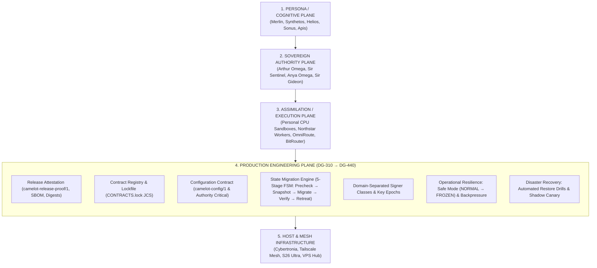
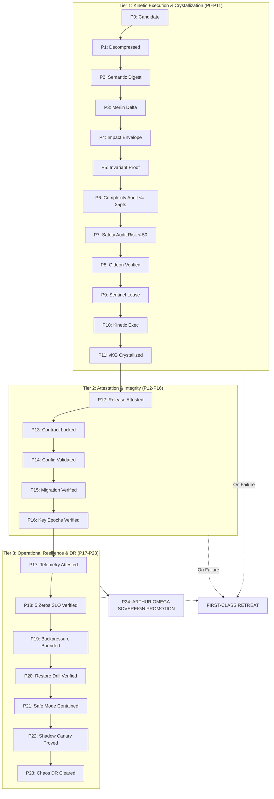

# 🏛️ Master Enterprise Production Architecture Blueprint v2

> **"A BUILD IS NOT A RELEASE.**  
> **A RELEASE IS NOT A DEPLOYMENT.**  
> **A DEPLOYMENT IS NOT A PROMOTION.**  
> **A BACKUP IS NOT RECOVERY.**  
> 
> **CALL NOTHING PRODUCTION THAT CANNOT RECOVER."**

---

## 1. The 4-Tier Sovereign Stratum

---

## 2. Production Engineering Invariants

1. **NO RELEASE WITHOUT A RELEASE MANIFEST**: Every binary release must be attested by `camelot-release-proof/1` signed by a `RELEASE` class key.
2. **NO CONTRACT WITHOUT A LOCKFILE**: Services verify `CONTRACTS.lock` digest at boot; zero runtime filesystem guessing.
3. **NO CONFIG WITHOUT TYPED BOUNDS**: Configuration parameters adhere to `camelot-config/1`. Any missing or raw-secret `AUTHORITY_CRITICAL` config halts boot.
4. **NO MIGRATION WITHOUT A MIGRATION PLAN**: State mutations follow `PRECHECK -> SNAPSHOT -> MIGRATE -> VERIFY -> PROMOTE` or execute `RETREAT`.
5. **NO BACKUP WITHOUT A RESTORE TEST**: Backups that have never restored in an automated test drill are treated as unverified.
6. **NO AUTHORITY KEY WITHOUT A ROTATION PLAN**: Signers are restricted by domain (`ROOT`, `POLICY`, `EPOCH`, `RECEIPT`, `RELEASE`).
7. **NO SERVICE WITHOUT AN SLO**: Core services enforce the 5 Architectural Zeros.
8. **NO AUTONOMY WITHOUT BACKPRESSURE**: Queues enforce bounded depth, max inflight, and class-separated retry limits (`PURE` vs `IRREVERSIBLE_WRITE`).
9. **NO REPLACEMENT WITHOUT SHADOW COMPARISON**: New implementations must prove $0\%$ mutation variance against canonical paths before promotion.
10. **NO CRITICAL CHANGE WITHOUT SAFE MODE**: Universal emergency brake (`FROZEN`) stops mutations while preserving read-only telemetry.

---

## 3. The 25-Gate Production Promotion Continuum (P0 → P24)

---

## 4. Production Architectural SLOs (The 5 Zeros)

1. **Zero Stale Authority**: Acceptance rate of expired leases or outdated authority epochs is strictly $0.0\%$.
2. **Zero Cross-Tenant Leakage**: Data egress across tenant boundaries is strictly $0.0\%$.
3. **Zero Unreceipted Promotion**: Canonical UKG or state promotions lacking Merkle receipt backing is strictly $0.0\%$.
4. **Zero Authority-Bearing Memory**: Retrieval of unverified model context claiming kinetic authority is strictly $0.0\%$.
5. **Zero Unverified Adoption**: External code or repository patterns ingested without sandbox clearance is strictly $0.0\%$.
