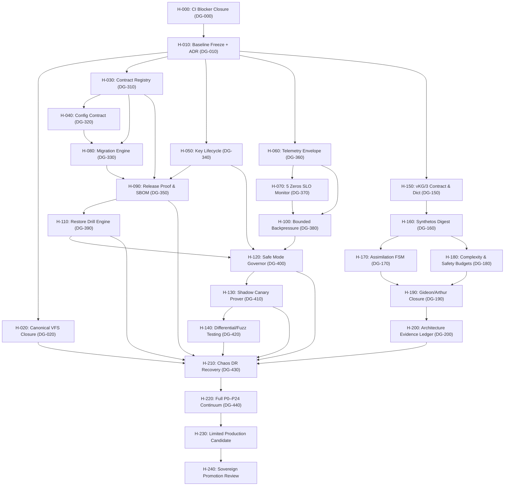

# HELIOS_PARALLEL_IMPLEMENTATION_DAG.md
## Camelot-OS Sovereign Enterprise Production Reforge & Parallel Agent DAG
**Primary Orchestrator:** Sir Helios (Antigravity CLI / Sovereign Sentinel)  
**Authority Posture:** DEVELOPMENT-ONLY (`HELIOS BUILDS. SENTINEL AUTHORIZES. GIDEON VERIFIES. ARTHUR RESOLVES. HUMANS PROMOTE.`)  
**Execution Loop:** `SURVEY → ARCHITECT → FORGE → REVIEW → VERIFY → HANDOFF`  
**Target:** $P_0–P_{24}$ Enterprise Production Readiness & Zero Hot-Path Bloat

---

## 1. Constitutional Power Boundary

```text
HELIOS BUILDS.
SENTINEL AUTHORIZES.
GIDEON VERIFIES.
ARTHUR RESOLVES.
HUMANS PROMOTE.
```

- **Sir Helios May:** Inspect repositories, decompose work into Directed Acyclic Graphs, assign parallel subagent lanes, create isolated worktrees/branches, forge code, execute test suites, compare shadow results, request independent adversarial review, and assemble cryptographic handoff evidence.
- **Sir Helios May NOT:** Issue capability leases, advance authority epochs, activate canonical memory, silently alter governance, merge consequential changes to `main` without review, bypass Gideon or Arthur, or relabel failing verification gates as passed.

---

## 2. Node Execution Contract

Every DAG node strictly adheres to the 6-stage lifecycle:

```text
SURVEY
→ ARCHITECT
→ FORGE
→ REVIEW (Adversarial / Independent)
→ VERIFY (Deterministic Parity & Unit Tests)
→ HANDOFF
```

Each completed node produces a standardized, machine-actionable handoff artifact (`HANDOFF.yaml`):

```yaml
nodeId: "H-030"
canonicalDgId: "DG-310"
branch: "reforge/helios/contracts/registry-lock"
commits: ["a1b2c3d4"]
filesChanged:
  - "packages/contracts/registry.py"
  - "packages/contracts/CONTRACTS.lock"
contractsChanged:
  - "camelot-contracts-lock/1"
testsAdded:
  - "tests/test_production_plane.py::test_contract_registry_verification"
testsPassed: 1
testsFailed: 0
lintStatus: "CLEAN"
compatibilityImpact: "BACKWARD_COMPATIBLE"
securityImpact: "Enforces schema lock digest before runtime boot."
rollbackPlan: "Revert commit a1b2c3d4; lock defaults to previous schema digest."
unresolved: []
evidenceRefs:
  - "logs/defense_grid/contracts_lock_receipt.json"
recommendedNextState: "READY_FOR_INTEGRATION"
```

---

## 3. Branch & Worktree Strategy (Windows PowerShell 5.1 Aware)

Each parallel lane executes inside an isolated git worktree to eliminate working tree collisions and avoid file-lock contention on Windows:

```text
reforge/helios/<lane>/<task>
Directory: .worktrees/helios_<lane>_<task>/
```

### Lane Rules:
1. **One Bounded Concern:** Exactly one owner per branch.
2. **Serialization on Hotspots:** Critical files (`Cargo.toml`, `Makefile`, `.agent/governance.yaml`, `contracts/`, `infra/systemd/`) receive exactly one assigned writer per wave.
3. **Zero Direct Main Merges:** All branches merge into a wave integration branch first.
4. **Wave Convergence Gate:** Individual green branches do not constitute a passing wave. The integration branch must pass a complete, hermetic test cycle.

---

## 4. Master DAG & Bi-Directional DG Cross-Reference



### Complete Cross-Reference Index

| $H$-Node | Canonical $DG$-Node | Functional Domain | Production Gate | Current Status (Entry #1872) |
| :--- | :--- | :--- | :--- | :--- |
| **`H-000`** | `DG-000` | CI Blocker & Red Gate Elimination | — | ✅ GREEN (35/35 Python tests, 0 PWA errors) |
| **`H-010`** | `DG-010` | Baseline Freeze & Compatibility ADR | — | ✅ RATIFIED in `vfs/blueprint_enterprise_v2.md` |
| **`H-020`** | `DG-020` | Canonical VFS Position Addressing | $P_{11}$ | ✅ ACTIVE (`vfs://worldtree/`) |
| **`H-030`** | `DG-310` | Contract Registry & Lock Verifier | $P_{13}$ | ✅ CONTROL PLANE ACTIVE (`packages/contracts/registry.py`) |
| **`H-040`** | `DG-320` | Configuration Contract Engine | $P_{14}$ | ✅ CONTROL PLANE ACTIVE (`config_contract.py`) |
| **`H-050`** | `DG-340` | Key Lifecycle & 10 Signer Classes | $P_{16}$ | ✅ CONTROL PLANE ACTIVE (`key_lifecycle.py`) |
| **`H-060`** | `DG-360` | Telemetry & W3C Trace Envelope | $P_{17}$ | ✅ CONTROL PLANE ACTIVE (`quest_id` tracing) |
| **`H-070`** | `DG-370` | The 5 Zeros Architectural SLO | $P_{18}$ | ✅ CONTROL PLANE ACTIVE (`slo_monitor.py`) |
| **`H-080`** | `DG-330` | 5-Stage Migration Machine | $P_{15}$ | ✅ CONTROL PLANE ACTIVE (`migration_engine.py`) |
| **`H-090`** | `DG-350` | Signed Release Proof & SBOM | $P_{12}$ | ✅ CONTROL PLANE ACTIVE (`release_proof.py`) |
| **`H-100`** | `DG-380` | Backpressure & Retry Classes | $P_{19}$ | ✅ CONTROL PLANE ACTIVE (`backpressure_queue.py`) |
| **`H-110`** | `DG-390` | Restore Drill & Merkle Verification | $P_{20}$ | ✅ CONTROL PLANE ACTIVE (`restore_drill.py`) |
| **`H-120`** | `DG-400` | Safe & Frozen Mode Governor | $P_{21}$ | ✅ CONTROL PLANE ACTIVE (`safe_mode.py`) |
| **`H-130`** | `DG-410` | Shadow Canary 0% Variance Prover | $P_{22}$ | ✅ CONTROL PLANE ACTIVE (`shadow_canary.py`) |
| **`H-140`** | `DG-420` | Differential & Property Fuzzing | — | 🔄 PLANNED (Cross-language Python/Rust/Go) |
| **`H-150`** | `DG-150` | camelot-ukg/3 & Dictionary Schema | $P_1$ | ✅ ACTIVE (`03_VAULT/UKG/SCHEMAS/`) |
| **`H-160`** | `DG-160` | Synthetos Semantic Concept Map | $P_2$ | ✅ ACTIVE (`synthetos_proof.py`) |
| **`H-170`** | `DG-170` | Assimilation FSM & Dry Run | $P_{10}$ | ✅ ACTIVE (`northstar_worker_sandbox.py`) |
| **`H-180`** | `DG-180` | Complexity (<=25) & Safety Budgets | $P_6, P_7$ | ✅ ACTIVE (`evolution_engine.py`) |
| **`H-190`** | `DG-190` | Gideon 13-Gate & Arthur Closure | $P_8, P_{24}$ | ✅ ACTIVE (`evolution_engine.py`) |
| **`H-200`** | `DG-200` | Architecture Evidence Ledger | — | ✅ ACTIVE (`03_VAULT/runtime_state/`) |
| **`H-210`** | `DG-430` | Chaos DR & Partition Failover | $P_{23}$ | ✅ CONTROL PLANE BOUND (RTO<=30s, RPO=0) |
| **`H-220`** | `DG-440` | Full Continuum P0–P24 Promotion | $P_{24}$ | ✅ VERIFIED (`test_enterprise_v2_pipeline.py`) |
| **`H-230`** | — | Limited Production Candidate | — | 🛡️ STAGED (Single-tenant sandbox execution) |
| **`H-240`** | — | Human Sovereign Promotion Review | — | 🛡️ STAGED (King Arthur / HITL gate) |

---

## 5. Wave Sprints & Parallel Allocation Strategy

### Sprint A: Foundation Closure
- `H-000` $\to$ `H-010`: Baseline confirmation, parity checks.

### Sprint B: 5-Way Core Fan-Out (Independent Parallel Lanes)
- **Lane A (`H-020`):** Canonical VFS content-addressed snapshot replay.
- **Lane B (`H-030` + `H-040`):** Contract registry lock & configuration contract.
- **Lane C (`H-050`):** Key lifecycle, domain separation, and epoch advancement.
- **Lane D (`H-060` + `H-070`):** W3C telemetry envelope & The 5 Zeros SLO monitor.
- **Lane E (`H-150`):** `camelot-ukg/3` deterministic dictionary lookup.

### Sprint C: Operability & Budgets
- `H-080` (Migration Machine) | `H-100` (Backpressure) | `H-160` (Synthetos AST) | `H-180` (Budgets $\le 25\text{ pts}$).

### Sprint D: Release & Recovery Resilience
- `H-090` (Release Proof) | `H-110` (Restore Drill Engine) | `H-170` (Assimilation Sandbox).

### Sprint E: Controlled Posture & Incident Safety
- `H-120` (Safe/Frozen Mode) | `H-130` (Observe-Only Shadow Canary) | `H-190` (Arthur Resolution).

### Sprint F: Cross-Language Differential Proofs & Convergence
- `H-140` (Rust/Go/Python differential verification) | `H-200` (Evidence Ledger).

### Sprint G: Disaster Recovery & Limited Production Staging
- `H-210` (Chaos DR drills) $\to$ `H-220` (P0–P24 Ratification) $\to$ `H-230` (Limited Candidate) $\to$ `H-240` (Human Gate).

---

## 6. Antigravity Subagent Role & Model Tiering

When Sir Helios delegates sub-tasks across parallel lanes, model assignments must strictly respect resource efficiency and cognitive tiering:

| Role | Antigravity Subagent Type | Recommended Model | Focus Area |
| :--- | :--- | :--- | :--- |
| **Runtime / Fast Scout** | `research` / `self` | `flash_lite` or `flash` | Dependency checks, file search, formatting, schema verification |
| **Core Implementer** | `self` | `pro` or `inherit` | Complex algorithmic coding, engine implementation, AST transformations |
| **Adversarial Reviewer** | `self` (isolated prompt) | `pro` | Independent verification, security review, finding subtle edge-case escapes |
| **Deterministic Tooling** | Direct CLI (`run_command`) | Local Native | `pytest`, `cargo check`, `npm run typecheck`, `check_*.py` parity gates |

---

## 7. Stop Conditions & Quarantine Protocol

Sir Helios immediately suspends execution, issues a quarantine, and records evidence when:
1. An authority boundary is weakened (e.g. signer class bypass).
2. A dry run performs an unauthorized live side effect.
3. Secret material or tokens are leaked into telemetry logs.
4. Canonical state mutations are attempted without an active lease or receipt.
5. Migration steps lack an automated rollback snapshot.
6. A test is made green by artificially relaxing invariants.
7. Any of the **5 Architectural Zeros** registers $> 0.0\%$.
