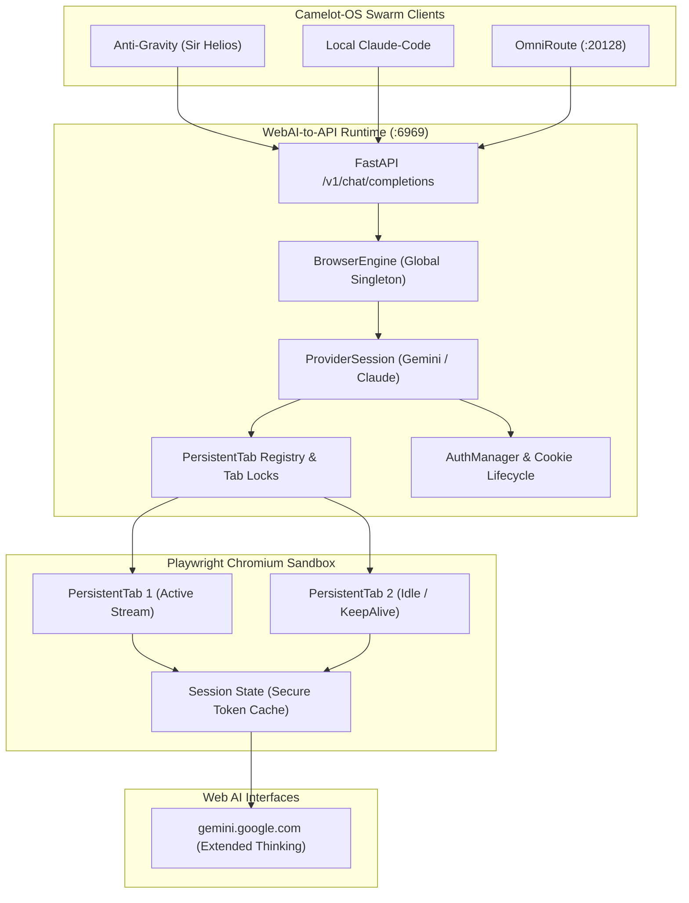

# Master Compendium: WebAI-to-API — Modular LLM Access Without API Keys
**Node ID:** `4b7c6c48-92cf-407f-b8be-2afa4a654c2a`  
**Title:** *WebAI-to-API: Modular LLM Access Without API Keys*  
**Role:** Browser-Native Free Frontier Proxy, Web-to-API Bridge & Session Orchestration  
**Knights:** `SIR_HELIOS` (AntiGravity Automation) & `SIR_BORIS` (Architectural Oversight)  
**WorldTree Root:** `a0a4bfb9-e847-4c38-be39-7aee398f0795`  
**Category:** `CODEBASES_DEV_TOOLING`  
**Assimilated Upstream:** `https://github.com/Amm1rr/WebAI-to-API.git`  
**Staging Path:** `C:\Users\vizio\CAMELOT_OS\.camelot\staging\repos\WebAI-to-API`  
**Governance:** `1_SOURCE_MUTATE_LAW` // `8GB_SCARCITY_PROTOCOL` // `PLAYWRIGHT_TAB_LEASING_DISCIPLINE`  
**Updated:** 2026-09-27T20:25:00-04:00  

---

## 1. Executive Summary & Assimilation Context

The **WebAI-to-API** engine (authored by Amm1rr) has been assimilated into Camelot-OS to solve the frontier access barrier: obtaining cutting-edge generative AI capabilities (Gemini 3 Flash, Gemini Pro with extended thinking) **without relying on paid API keys, credit cards, or billable cloud quotas**.

Unlike fragile scraping scripts that emulate undocumented reverse-engineered endpoints, WebAI-to-API implements a **browser-native runtime driven by Playwright Chromium and direct WebAPI cookie protocols**. It presents an **OpenAI-compatible REST server on `http://127.0.0.1:6969/v1`**, allowing AntiGravity (`agy`), Claude Code, OpenCode, and OmniRoute to interact with web-based AI interfaces as if they were commercial API endpoints.

---

## 2. Core Architectural Pillars of WebAI-to-API



### Pillar 1: Browser-Native Concurrency & Lock Hierarchy
WebAI-to-API enforces strict lock hierarchy to prevent deadlocks under concurrent multi-agent requests:
1. `BrowserEngine.management_lock` (Global orchestration)
2. `ProviderSession.init_lock` (Session setup/recovery)
3. `ProviderSession._cleanup_lock` (Serialized session cleanup)
4. `ProviderSession.registry_lock` (Synchronous registry mutations only)
5. `PersistentTab._lock` (Individual tab operations)

### Pillar 2: Dual Backend Execution (WebAPI vs Playwright)
- **WebAPI Backend (`backend = webapi`):** Uses session cookies and internal gRPC/JSON payloads directly for ultra-low latency (<200ms) and minimal RAM footprint.
- **Playwright Backend (`backend = playwright`):** Drives headless Chromium when web interfaces rotate protocols, ensuring 100% resilience against anti-bot challenges and DOM layout changes.

### Pillar 3: Browser Generation Invalidation & State Machine
- When browser processes crash or disconnect, the `BrowserEngine` detects generation rollover, cleanly invalidating all stale `PersistentTab` objects and active leases without leaking memory.
- Uses `asyncio.shield` for mandatory resource reclamation during client aborts.

### Pillar 4: Zero-Cost OmniRoute Upstream Integration
- Bound into Camelot's `omniroute.json` as an upstream provider:
  ```json
  "webai_to_api": {
    "url": "http://127.0.0.1:6969/v1",
    "description": "WebAI-to-API Browser-Native Free Frontier Gateway",
    "models": ["gemini-3-flash", "gemini-3-pro", "gemini-thinking"],
    "enabled": true
  }
  ```
- Positioned in the `FREE_FRONTIER_FIRST` failover chain immediately following Google AI Studio.

---

## 3. 8GB Scarcity Protocol Alignment

To comply with Camelot's host memory ceilings:
- Chromium tab limit is clamped to **maximum 2 concurrent persistent tabs** (`max_tabs = 2`).
- Headless execution with flags `--disable-gpu`, `--no-sandbox`, and `--disable-dev-shm-usage`.
- Thread environment variables: `OMP_NUM_THREADS=2`, `OPENBLAS_NUM_THREADS=2`, `MKL_NUM_THREADS=2`.

---

## 4. Universal Knowledge Glyph (UKG) Mapping

```json
{
  "node_id": "NODE_4B7C6C48",
  "uuid": "4b7c6c48-92cf-407f-b8be-2afa4a654c2a",
  "title": "WebAI-to-API: Modular LLM Access Without API Keys",
  "category": "CODEBASES_DEV_TOOLING",
  "service_port": 6969,
  "upstream_repo": "https://github.com/Amm1rr/WebAI-to-API.git",
  "knights": ["SIR_HELIOS", "SIR_BORIS"],
---

## 5. Cloudflare Aspects & Anti-Bot Armor Protocol

In browser-native AI proxying, **Cloudflare represents both the primary perimeter defense to navigate and a high-performance edge compute provider**. WebAI-to-API and Camelot-OS govern Cloudflare interactions across four distinct dimensions:

### A. Evasion of Cloudflare Error 1010 & Browser Signature Verification
- **The Threat:** Cloudflare WAF Error 1010 (`Access denied: The owner of this website has banned your access based on your browser's signature`) immediately terminates non-browser HTTP clients (such as default `urllib` or headless scraping tools).
- **The Protocol:** WebAI-to-API ensures that all requests originate from legitimate Chromium execution contexts with:
  1. Full `Sec-CH-UA` client hint trees (`"Chromium";v="124"`, `"Google Chrome";v="124"`).
  2. Authentic TLS JA3/JA4 fingerprints matching real Chromium binaries rather than Python OpenSSL.
  3. Dynamic User-Agent preservation: never stripping headers to bare strings.

### B. Cloudflare Turnstile & Proof-of-Work Managed Challenges
- Unlike naive REST wrappers that fail when Google or third-party web AI endpoints deploy Cloudflare Turnstile or invisible challenge tokens:
  - WebAI-to-API’s **Playwright backend** evaluates real JavaScript in a genuine browser DOM, allowing Turnstile challenge scripts to execute, solve proof-of-work puzzles, and receive valid session cookies (`cf_clearance`).
  - Active `PersistentTab` leases ensure cookies are maintained in `runtime/auth/` and reused across requests.

### C. Cloudflare WARP Split-Tunneling Invariants (Camelot-OS Rule)
- When Camelot-OS operates alongside Cloudflare WARP (`1.1.1.1`):
  - **Critical Rule:** WARP must **exclude** Google endpoints (`googleapis.com`, `generativelanguage.googleapis.com`, and `1e100.net`).
  - **Reason:** Frequent IP hopping across Cloudflare edge data centers invalidates Google session cookies (`__Secure-1PSID` / `__Secure-1PSIDTS`), forcing unexpected re-authentication prompts.

### D. Cloudflare Workers AI in the OmniRoute Grid
- In addition to browser-native proxying, Cloudflare's serverless **Workers AI** (running Llama 3.3 and DeepSeek at edge nodes) is integrated into Camelot's `FREE_FRONTIER_TIER`, providing 10,000 free compute neurons daily as a fast-path fallback when web sessions undergo generation recycling.

