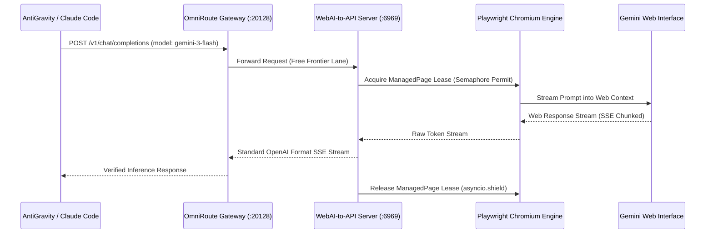

# Phial Engine: WebAI-to-API — Modular LLM Access Without API Keys
**Node ID:** `4b7c6c48-92cf-407f-b8be-2afa4a654c2a`  
**Engine Loop:** Browser-Assisted MGV (Model-Gateway-Verification) Loop  
**Execution Port:** `http://127.0.0.1:6969`  

---

## 1. MGV Browser-to-API Bridge Sequence

---

## 2. Runtime Diagnostic & Health Endpoints

- **Health Probe:** `GET http://127.0.0.1:6969/health`
- **Readiness Probe:** `GET http://127.0.0.1:6969/ready`
- **Diagnostics:** `GET http://127.0.0.1:6969/diagnostics`
- **Interactive UI Dashboard:** `http://127.0.0.1:6969/ui`
- **OpenAPI Swagger:** `http://127.0.0.1:6969/docs`

---

## 3. Runic Engine Directives

- `//WEBAI_BOOT`: Starts the WebAI-to-API server in background mode with headless Chromium.
- `//WEBAI_DIAG`: Queries `/diagnostics` and verifies cookie freshness.
- `//WEBAI_REAUTH`: Triggers the browser login verification workflow (`verify_login.py`).
