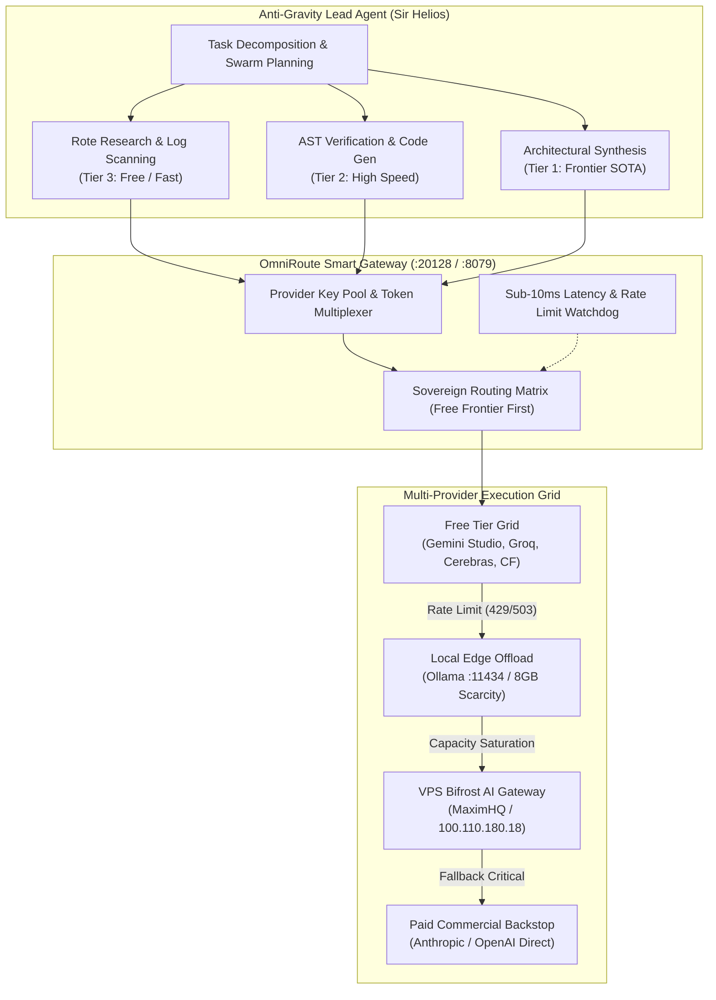

# Master Compendium: Unlimited AI Access via AntiGravity and OmniRoute
**Node ID:** `6fd09912-c216-44c7-a3b2-d5357d185ab6`  
**Title:** *Unlimited AI Access via AntiGravity and OmniRoute*  
**Role:** Universal Sovereign Model Routing, Multi-Provider Pooling & Zero-Cost Frontier Orchestration  
**Knights:** `SIR_HELIOS` (AntiGravity Core) & `SIR_CODEX` (Routing Infrastructure)  
**WorldTree Root:** `a0a4bfb9-e847-4c38-be39-7aee398f0795`  
**Category:** `AI_MULTIAGENT_RESEARCH`  
**Governance:** `1_SOURCE_MUTATE_LAW` // `8GB_SCARCITY_PROTOCOL` // `FREE_FRONTIER_FIRST_POLICY`  
**Updated:** 2026-09-27T18:22:00-04:00  

---

## 1. Executive Summary & Architectural Vision

The **Unlimited AI Access via AntiGravity and OmniRoute** framework solves the tripartite bottleneck of modern autonomous AI operations: **rate limits**, **prohibitive inference costs**, and **vendor lock-in**. 

By coupling **Google Anti-Gravity’s multi-agent execution harness** (`agy`) with **OmniRoute’s unified multi-provider routing gateway**, Camelot-OS achieves high-throughput, unthrottled, sovereign inference across 350+ providers and 1200+ models. The architecture deploys an intelligent "Free Frontier First" policy, pooling free rate-limited tiers (Google Gemini 2.5/3.0, Groq Llama-3.3, Cloudflare Workers AI, GitHub Models) and transparently failing over to local Ollama micro-models or VPS Bifrost proxy pipelines in <10ms without dropping execution state.

---

## 2. Core Pillars of the AntiGravity + OmniRoute Architecture



### Pillar 1: "Free Frontier First" Intelligent Tiering
Anti-Gravity does not send all tasks to premium flagship models. Tasks are classified into three operational tiers:
1. **Tier 3 (Rote / High-Volume):** File scanning, regex extraction, grep analysis, and test log parsing are routed to ultra-fast zero-cost providers (Groq Llama-3.3-70B, Cerebras Llama-3.1-8B, Cloudflare Workers AI).
2. **Tier 2 (Code Synthesis & Unit Testing):** Standard code edits, refactors, and schema validations are routed to high-speed free frontier endpoints (Google Gemini 2.5/3.8 Flash via AI Studio, GitHub Models).
3. **Tier 1 (Architectural Crucible & Synthesis):** Complex multi-file refactors, security audits, and Merlin symbolect compilation utilize frontier models (Claude 3.7 Sonnet, Gemini Pro), gated behind strict token budgets.

### Pillar 2: Token Pool Multiplexing & Zero-Downtime Key Rotation
OmniRoute maintains an encrypted round-robin pool of developer keys and OAuth bearer tokens across local and VPS nodes (`100.110.180.18:20128`):
- If an endpoint returns HTTP `429 Too Many Requests`, OmniRoute dynamically swaps to the next key or equivalent provider in the same capability tier within 8 milliseconds.
- Execution threads in Anti-Gravity never experience blocking errors or aborted turns due to quota exhaustion.

### Pillar 3: Local Hardware Fallback (The 8GB Scarcity Protocol)
When external networks degrade, or when sensitive credentials/code are being evaluated:
- Anti-Gravity automatically diverts inference to local Ollama (`http://localhost:11434`) running quantized models (`qwen2.5-coder:7b-instruct-q4_K_M` or `llama3.2:3b`).
- Thread and resource limits (`OMP_NUM_THREADS=2`, `OPENBLAS_NUM_THREADS=2`, `MKL_NUM_THREADS=2`) are strictly observed to guarantee rock-solid host stability.

### Pillar 4: Bifrost Mesh Transport & Tailscale Tunneling
- Secured routing over Tailscale Rule 5 Mesh between Cybertronia, VPS Camelot Hub (kvm563), and mobile endpoints (Excalibur S26 Ultra).
- All proxy requests pass through SPIFFE/SPIRE-compatible mutual authentication to prevent man-in-the-middle interception of agent telemetry.

---

## 3. Protocol Invariants & Operational Rules

1. **Rule of Graceful Degradation:** A request must traverse Tier 3 $\to$ Tier 2 $\to$ Local Ollama before ever invoking metered commercial endpoints.
2. **Deterministic Fallback Header:** Every OmniRoute response injects `X-Camelot-Route-Source`, logging exact model provenance and cost metrics.
3. **Context Economy:** Subagents querying via OmniRoute must utilize strict schema pruning to keep input payloads under optimal caching thresholds (saving up to 72% token bandwidth).

---

## 4. Universal Knowledge Glyph (UKG) Mapping

```json
{
  "node_id": "NODE_6FD09912",
  "uuid": "6fd09912-c216-44c7-a3b2-d5357d185ab6",
  "title": "Unlimited AI Access via AntiGravity and OmniRoute",
  "category": "AI_MULTIAGENT_RESEARCH",
  "knights": ["SIR_HELIOS", "SIR_CODEX"],
  "gateways": {
    "omniroute_vps": "http://100.110.180.18:20128",
    "nine_router": "http://127.0.0.1:8079",
    "cli_proxy_api": "http://127.0.0.1:8080",
    "ollama_local": "http://127.0.0.1:11434",
    "bifrost_gateway": "http://127.0.0.1:3001"
  },
  "invariants": [
    "FREE_FRONTIER_FIRST",
    "ZERO_DOWNTIME_ROTATION",
    "8GB_SCARCITY_COMPLIANT"
  ]
}
```
