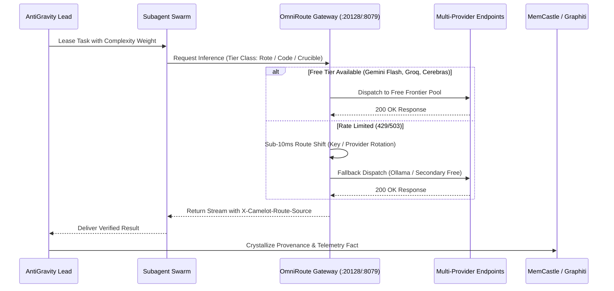

# Phial Engine: Unlimited AI Access via AntiGravity and OmniRoute
**Node ID:** `6fd09912-c216-44c7-a3b2-d5357d185ab6`  
**Engine Loop:** MGV (Model-Gateway-Verification) Adaptive Routing Loop  
**Execution Horizon:** High-Throughput Concurrent Inference  

---

## 1. MGV Adaptive Routing Loop

---

## 2. Dynamic Route Configuration & Policies

| Policy Identifier | Routing Priority Hierarchy | Typical Latency SLA | Target Workload |
| :--- | :--- | :--- | :--- |
| `FREE_FRONTIER_FIRST` | 1. Google Gemini Flash (Free) 2. Groq Llama-3.3 3. Cloudflare Workers AI 4. Ollama Local | < 250ms | Worker subagents, log scanning, code test iterations |
| `LOCAL_EDGE_AIRGAP` | 1. Local Ollama (qwen2.5-coder) 2. Ollama (llama3.2) | < 80ms (zero network) | Sensitive data, offline execution, secret scanning |
| `FRONTIER_CRUCIBLE` | 1. Claude 3.7 Sonnet 2. Gemini Pro 2.5/3.0 3. DeepSeek-R1 / V3 | Balanced | Architectural design, Merlin crucible, security audits |

---

## 3. Runic Engine Directives

- `//ROUTE_SWARM`: Broadcast parallel prompts across multiple free-tier models simultaneously and take the consensus output.
- `//FAILOVER_TEST`: Simulate a 429 response to verify sub-10ms automatic reroute to secondary providers.
- `//EDGE_SHUTTLE`: Evacuate running inference tasks from cloud APIs to local Ollama under network instability.
