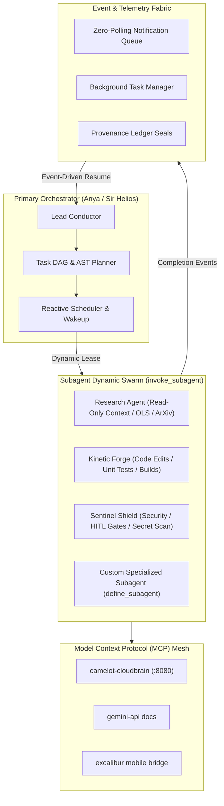

# Master Compendium: Google Anti-Gravity 2.0 — The Dawn of Multi-Agent AI Orchestration
**Node ID:** `f4ec645e-ab54-404f-a6c9-d2c2ac1f21bf`  
**Title:** Google Anti-Gravity 2.0: The Dawn of Multi-Agent AI Orchestration  
**Category:** `AI_MULTIAGENT_RESEARCH`  
**WorldTree Root Anchor:** `a0a4bfb9-e847-4c38-be39-7aee398f0795`  
**Herald & Guardian:** `SIR_HELIOS` / `ANTIGRAVITY`  
**Governance:** `1_SOURCE_MUTATE_LAW` // `8GB_SCARCITY_PROTOCOL` // `ANYA_LAST_LAW`  
**Status:** `CANONICAL_SOVEREIGN`  
**Updated:** 2026-09-27T18:05:00-04:00  

---

## 1. Table of Contents & Knowledge Anchors
- **Living Instruction:** [`system_instruction.md`](system_instruction.md)
- **Soul Axioms & Ethics:** [`soul.md`](soul.md)
- **Execution Spark:** [`spark.md`](spark.md)
- **Autonomous MGV Engine:** [`phial-engine.md`](phial-engine.md)
- **Open-Notebook Runtime Tissue:** `03_VAULT/runtime_state/open_notebook/google_antigravity_2_0_tissue.json`
- **WorldTree Tether:** `vfs://worldtree/research/google_antigravity_2_0/tether.json`

---

## 2. Architectural Blueprint: Google Anti-Gravity 2.0 Multi-Agent Orchestration

Google Anti-Gravity 2.0 marks the evolutionary transition from single-turn chat assistants to fully autonomous, multi-agent cognitive systems operating over distributed hardware and Model Context Protocol (MCP) meshes.



### Core Architecture Pillars of Anti-Gravity 2.0:
1. **Dynamic Subagent Leasing & Ephemeral Workspaces**:
   - Parallel agent instantiation via `invoke_subagent` and runtime compilation via `define_subagent`.
   - Workspace isolation modes: `inherit` (shared tree), `branch` (isolated Git workspace), `share` (shared storage worktree).
2. **Reactive Event-Driven Wakeup (Zero Polling)**:
   - Eliminates wasteful sleep loops. Conductor yields control to the OS; resumes reactively upon background task completion, subagent message arrival, or hardware interrupts.
3. **Artifact-Driven Communication**:
   - Structured visual feedback via Github markdown artifacts (`walkthrough.md`, plans, diff carousels, mermaid DAGs) with interactive `RequestFeedback` human-in-the-loop (HITL) approval gates.
4. **Federated Tool Mesh (Model Context Protocol)**:
   - Dynamic lazy-loading of domain tools (`call_mcp_tool`) across heterogeneous language backends (Python FastMCP, Rust Axum, Go Sidecars).
5. **Session Keep-Alive & Network Governance**:
   - Permanent route isolation via split-tunnel exclusions for Google AI backends (`*.googleapis.com`, `generativelanguage.googleapis.com`, `1e100.net`) and adapter power-saving overrides (`No SMPS`).

---

## 3. Universal Knowledge Glyph (UKG) Array
```ukg
[NODE:GOOGLE_ANTIGRAVITY_2_0]:
  UUID: "f4ec645e-ab54-404f-a6c9-d2c2ac1f21bf"
  Title: "Google Anti-Gravity 2.0: The Dawn of Multi-Agent AI Orchestration"
  Category: "AI_MULTIAGENT_RESEARCH"
  Root_Tether: "a0a4bfb9-e847-4c38-be39-7aee398f0795"
  Runtime: "FastMCP / agy (Gemini 3.8 Flash / Pro)"
  Agent_Primitives:
    - "Dynamic Subagent Spawning (invoke_subagent / define_subagent)"
    - "Reactive Zero-Polling Event Engine (schedule / manage_task)"
    - "Artifact-Driven Human-in-the-Loop Interaction"
    - "Model Context Protocol Multi-Tool Mesh"
    - "Persistent VFS Open-Notebook Tissue Mirroring"
  Slot_Economy: "O(1)_SINGLE_SOURCE_MUTATE"
  Status: "ACTIVE_CANONICAL_SOVEREIGN"
  Sealed_At: "2026-09-27T18:05:00-04:00"
```
