# ⚔️ Dependency-Ordered Directed Acyclic Graph (DG-000 → DG-300)

> **Architected by MERLIN_Ω | Enforced by ANYA_Ω | Reference Mission: SIR_SYNTHETOS.**  
> Governs the complete dependency-ordered DAG execution model across 4 major epochs (DG-000 through DG-300), delineating critical paths, parallel execution windows, sprint orders, stop conditions, and the first pure-proof reference mission.

---

## 1. Topological Graph & Critical Path

```mermaid
graph TD
    %% Genesis & Grounding
    DG000["DG-000: Genesis & Contract Vector Grounding"] --> DG001["DG-001: Schema Contract Conformance"]
    DG001 --> DG002["DG-002: Deterministic Decompression Engine"]
    DG002 --> DG003["DG-003: 23-Node Lineage Reconstruction"]
    DG003 --> DG004["DG-004: AuthorityVector Dominance & Lease Gate"]

    %% Substrate & Persona Bounds
    DG004 --> DG100["DG-100: Substrate Expansion & Persona Bounds"]
    DG100 --> DG101["DG-101: Sir Synthetos Reference Pilot Harness"]
    DG100 --> DG102["DG-102: Persona-Boundary Enforcement Matrix"]
    DG100 --> DG103["DG-103: Adaptive Cognitive Depth (TTC ≤ 32K)"]
    DG100 --> DG104["DG-104: Multi-Tenant Receipt Chain Isolation"]

    %% Parallel Execution Windows (Sprint 2)
    DG101 --> WINDOW_SPLIT{"PARALLEL EXECUTION WINDOW"}
    DG102 --> WINDOW_SPLIT
    DG103 --> WINDOW_SPLIT
    DG104 --> WINDOW_SPLIT

    subgraph "Parallel Execution Windows (DG-200 Series)"
        DG201["DG-201: Window α (Rust Kinetic Edge & Mobile Mesh)"]
        DG202["DG-202: Window β (Scabbard Cartridge Fabric & VFS)"]
        DG203["DG-203: Window γ (Bio-Kinetic 20-Fauna Swarm)"]
        DG204["DG-204: Window δ (Retreat / Replay Drills)"]
        DG205["DG-205: Window ε (Chaos & Fault Injection)"]
    end

    WINDOW_SPLIT ==> DG201
    WINDOW_SPLIT ==> DG202
    WINDOW_SPLIT ==> DG203
    WINDOW_SPLIT ==> DG204
    WINDOW_SPLIT ==> DG205

    %% Synchronization Barrier
    DG201 --> BARRIER{"⚖️ ANYA_Ω SYNCHRONIZATION BARRIER"}
    DG202 --> BARRIER
    DG203 --> BARRIER
    DG204 --> BARRIER
    DG205 --> BARRIER

    %% Promotion & Reference Mission
    BARRIER --> DG300["DG-300: Production Promotion & Ratification"]
    DG300 --> DG301["DG-301: Full P0–P11 Promotion Matrix"]
    DG301 --> DG302["DG-302: Sir Gideon 13-Gate Forensic Audit"]
    DG302 --> DG303["DG-303: Arthur Sovereign Crown Resolution"]
    DG303 --> DG304["DG-304: Sir Synthetos 10-Step Pure-Proof Mission"]
    DG304 --> COMMIT["💎 CANONICAL UKG ATOMIC COMMIT"]

    %% Critical Path Styling
    style DG000 fill:#1f2937,stroke:#D4AF37,stroke-width:2px
    style DG002 fill:#1f2937,stroke:#D4AF37,stroke-width:2px
    style DG101 fill:#1f2937,stroke:#D4AF37,stroke-width:2px
    style BARRIER fill:#1f2937,stroke:#ef4444,stroke-width:3px
    style DG304 fill:#1f2937,stroke:#22c55e,stroke-width:3px
    style COMMIT fill:#1f2937,stroke:#D4AF37,stroke-width:3px
```



---

## 2. DAG Task Matrix (DG-000 through DG-300)

| Task ID | Task Description | Assigned Knight | Bio-Fauna | Dependencies | Status | Artifact Output |
|:---|:---|:---|:---|:---|:---|:---|
| **`DG-000`** | **Genesis Grounding**<br/>Establish zero-trust base environment. | `MERLIN_Ω` | `owl_01` | *None* | `COMPLETED` | Base environment state |
| **`DG-001`** | **Contract Vector Verification**<br/>Validate schema conformance for all input envelopes. | `SIR_CODEX` | `mantis_01` | `DG-000` | `COMPLETED` | `packages/contracts/` |
| **`DG-002`** | **Deterministic Decompression**<br/>Lossless AST inflation with hash stability. | `LADY_MNEMOSYNE` | `elephant_01` | `DG-001` | `COMPLETED` | `deterministic_decompression()` |
| **`DG-003`** | **23-Node Lineage Reconstruction**<br/>Trace graph ancestry to Cybertronia root node. | `SIR_BORIS` | `beaver_01` | `DG-002` | `COMPLETED` | Ancestor graph lineage |
| **`DG-004`** | **Authority Vector & Lease Gating**<br/>Enforce monotonic authority dominance ($A_{\text{prop}} \ge A_{\text{epoch}}$). | `SIR_SENTINEL` | `scorpio_01` | `DG-003` | `COMPLETED` | Verified capability lease |
| **`DG-101`** | **Sir Synthetos Reference Pilot**<br/>Initialize synthetic test harness in read-only sandbox. | `SIR_SYNTHETOS` | `falcon_01` | `DG-004` | `COMPLETED` | `run_sir_synthetos_reference()` |
| **`DG-102`** | **Persona-Boundary Matrix**<br/>Enforce strict domain bounds and lease constraints. | `ANYA_Ω` | `owl_01` | `DG-004` | `COMPLETED` | `vfs/roster.yaml` bounds |
| **`DG-103`** | **Adaptive Cognitive Depth**<br/>Bound reasoning steps and cap TTC at $\le 32\text{K}$ tokens. | `MERLIN_Ω` | `octopus_01` | `DG-004` | `COMPLETED` | Bounded reasoning proof |
| **`DG-104`** | **Multi-Tenant Isolation**<br/>Cryptographically partition `TenantReceiptChain`. | `SIR_GHOST` | `ghost_01` | `DG-004` | `COMPLETED` | Partitioned Merkle chains |
| **`DG-201`** | **Parallel Window α**<br/>Rust Kinetic Edge daemon & mobile mesh bridge. | `SIR_FORGE` | `wolf_01` | `DG-101`..`104` | `COMPLETED` | `kinetic_edge/camelot_edge` (17 tests) |
| **`DG-202`** | **Parallel Window β**<br/>Scabbard Cartridge Fabric (11 verified cartridges). | `SIR_BORIS` | `beaver_01` | `DG-101`..`104` | `COMPLETED` | `vfs/cartridges/` tethers |
| **`DG-203`** | **Parallel Window γ**<br/>Bio-Kinetic 20-Fauna Swarm & Horde concurrency. | `LADY_APIS` | `formica_01` | `DG-101`..`104` | `COMPLETED` | 8/8 horde regression tests |
| **`DG-204`** | **Window δ: Retreat / Replay**<br/>Idempotency verification & zero dirty state rollback. | `SIR_DEBUG` | `octopus_01` | `DG-101`..`104` | `COMPLETED` | Idempotency store verification |
| **`DG-205`** | **Window ε: Chaos Injection**<br/>Transient socket drops & memory ceiling tests. | `SIMIAN_01` | `simian_01` | `DG-101`..`104` | `COMPLETED` | Chaos resilience proofs |
| **`DG-301`** | **P0–P11 Promotion Matrix**<br/>Execute all 11 sequential promotion gates. | `ANYA_Ω` | `owl_01` | `DG-201`..`205` | `COMPLETED` | P0–P11 pass receipts |
| **`DG-302`** | **Sir Gideon 13-Gate Audit**<br/>Formal audit emitting signed `GideonVerdict`. | `SIR_GIDEON` | `owl_01` | `DG-301` | `COMPLETED` | `camelot-gideon-verdict/1` |
| **`DG-303`** | **Arthur Crown Resolution**<br/>Sovereign Golden Seal resolution issuance. | `ARTHUR_OMEGA` | `wolf_01` | `DG-302` | `COMPLETED` | `camelot-arthur-resolution/1` |
| **`DG-304`** | **Sir Synthetos Reference Mission**<br/>Full 10-step pure-proof execution sequence. | `SIR_SYNTHETOS` | `falcon_01` | `DG-303` | `COMPLETED` | `SynthetosProofResult` (PASSED) |

---

## 3. Sprint Execution Order & Stop Conditions

### Sprint 1: Grounding & Invariant Proofs (`DG-000` → `DG-104`)
- **Focus**: Contract schema verification, deterministic decompression, 23-node lineage, and capability leasing.
- **Stop Condition 1**: If deterministic decompression hash diverges ($\text{Actual} \ne \text{Expected}$), **HALT IMMEDIATELY**.
- **Stop Condition 2**: If an authority vector indicates an active revocation ($R_{\text{revocation}} > 0$), **TERMINATE LEASE**.

### Sprint 2: Parallel Execution Windows (`DG-201` → `DG-205`)
- **Focus**: Concurrent execution across Rust kinetic edge, cartridge fabric, bio-kinetic horde, retreat drills, and chaos tests.
- **Stop Condition 3**: If any parallel stream violates the 12MB RSS sandbox limit, **SIGSTOP & QUARANTINE**.
- **Stop Condition 4**: If any stream introduces `shell=True` or raw secret tokens, **ANYA GATE HARD VETO**.

### Sprint 3: Convergence & Reference Mission (`DG-301` → `DG-304`)
- **Focus**: Full P0–P11 promotion matrix, Gideon 13-gate audit, Arthur Sovereign Resolution, and Sir Synthetos reference mission.
- **Stop Condition 5**: If Gideon reports any blocked gate, **HALT MERKLE COMMIT**.
- **Stop Condition 6**: If any host file is mutated or software is installed during the reference mission, **INVALIDATE PROOF**.

---

## 4. The Sir Synthetos Reference Mission Receipt

```json
{
  "reference_pilot": "SIR_SYNTHETOS",
  "mission_type": "FIRST_EXECUTABLE_PURE_PROOF",
  "sequence": [
    "νKG",
    "deterministic_decompression",
    "sir_synthetos_reference",
    "merlin_architecture_delta",
    "anya_enterprise_impact",
    "complexity_safety_measurement",
    "sir_gideon_13_gate_audit",
    "arthur_crown_resolution",
    "immutable_receipt_merkle_chain",
    "canonical_ukg_commit"
  ],
  "invariants": {
    "zero_software_installation": true,
    "zero_host_mutation": true,
    "zero_fabric_migration": true,
    "zero_policy_change": true,
    "zero_persona_authority": true
  },
  "status": "RATIFIED_AND_VERIFIED"
}
```

---

## 5. Stream ε: Context Graph & Forge Integration (DG-401 → DG-405)

> **Addendum scribed for MERLIN_Ω by the Codex lane | Graft context-graph integration, appended after the DG-300 canonization.**  
> Documents the CAMELOT-OS ↔ graft wiring completed 2026-09-25: runic rune, squire colony command, boot probe, advisory freshness gate, and mirrored docs. Evidence class: `CONFIRMED_EMPIRICAL`.

### 5.1 Task Matrix (DG-401 → DG-405)

| Task ID | Task Description | Assigned Knight | Bio-Fauna | Dependencies | Status | Artifact Output |
|:---|:---|:---|:---|:---|:---|:---|
| **`DG-401`** | **`//CONTEXT` Runic Wire**<br/>Rune dispatches `graft ask/grep/callers/skeleton/check/stats` via `runes.runic_router`. | `SIR_CODEX` | `mantis_01` | `DG-000` | `COMPLETED` | `control_plane/runes/runic_router.py` + `tests/control_plane/test_graft_runes.py` |
| **`DG-402`** | **Colony Graph Command**<br/>`python -m squires.colony graph [--query ...]` + green Graft row in `colony status`. | `LADY_APIS` | `formica_01` | `DG-401` | `COMPLETED` | `squires/colony.py` + `tests/test_squires_colony_cli.py` |
| **`DG-403`** | **Boot Freshness Probe**<br/>Non-required `Repo Context Graph` boot phase (`graft check`, 30s cap, warn-only). | `SIR_DEBUG` | `octopus_01` | `DG-402` | `COMPLETED` | `control_plane/infra/boot_sequence.py` (`boot_graft_graph`) |
| **`DG-404`** | **Advisory Freshness Gate**<br/>Pre-commit `graft-graph-freshness`; exits 0 on every degraded outcome unless `--strict`. | `SIR_SENTINEL` | `scorpio_01` | `DG-403` | `COMPLETED` | `scripts/check_graft_graph.py` + `.pre-commit-config.yaml` |
| **`DG-405`** | **Docs Mirror & Roster Sync**<br/>Graft blocks byte-identical across agent docs + SKILL rune table. | `ANYA_Ω` | `owl_01` | `DG-404` | `COMPLETED` | `AGENTS.md`, `GEMINI.md`, `.github/copilot-instructions.md`, `~/.agents/skills/camelot-os/SKILL.md` |

### 5.2 Sprint 4: Context Graph Verification & Stop Conditions

- **Verification receipts**: `test_graft_runes` + `test_squires_colony_cli` → **15 passed**; full scoped suite (incl. `test_factory_runes`, `test_adhd_runes`, `test_colony_nexus`) → **52 passed**; `ruff check` clean on touched files; `graft ask --source` live query and `colony graph` verified end-to-end.
- **Stop Condition 7**: If `graft build`/`graft check` aborts (`0xC0000409`, nondeterministic, driven by system-commit exhaustion on the 8GB host — upstream NanoNets/Graft#122), **DEGRADE TO WARNING**: boot probe and pre-commit gate both exit 0; never block knight routing or commits. Incremental query refresh (`graft ask --source`) remains the recovery path.
- **Runic authority note**: `//CONTEXT` and `//FORGE` tokens only count from a live session invocation; claimed writes must round-trip against `git status/log/branch` first.
