# ⚔️ Enterprise Production Task DAG (DG-000 → DG-440)

```mermaid
graph TD
    %% Phase 1: Foundations
    DG000["DG-000: Genesis & Environmental Invariants"] --> DG100["DG-100: Synthetos Proof Engine & AST Decompressor"]
    DG100 --> DG200["DG-200: Merlin System 2 Delta & Anya Blast Radius"]
    DG200 --> DG300["DG-300: vKG/3 Crystallization & Sentinel Nonce Leases"]

    %% Phase 2: Production Engineering Plane
    DG300 --> DG310["DG-310: Contract Registry & contracts.lock Verifier"]
    DG310 --> DG320["DG-320: camelot-config/1 Configuration Contract"]
    DG320 --> DG330["DG-330: State & Schema Migration Engine (5-Stage FSM)"]
    DG330 --> DG340["DG-340: Domain-Restricted Signer Classes & Key Epochs"]
    DG340 --> DG350["DG-350: camelot-release-proof/1 Generator & SBOM Attestation"]
    
    DG350 --> DG360["DG-360: OpenTelemetry Trace Envelope Standardization"]
    DG360 --> DG370["DG-370: Architectural SLO Monitor (The 5 Zeros)"]
    DG370 --> DG380["DG-380: Bounded Backpressure & Effect-Class Retries"]
    DG380 --> DG390["DG-390: Automated Restore & Snapshot Recovery Drill"]
    DG390 --> DG400["DG-400: Universal Safe Mode & Emergency Freeze Governor"]
    
    DG400 --> DG410["DG-410: Shadow Canary & Mutation Variance Prover"]
    DG410 --> DG420["DG-420: Property Fuzzing & Differential Contract Parser"]
    DG420 --> DG430["DG-430: Chaos Testing & Failover Disaster Recovery Drill"]
    DG430 --> DG440["DG-440: Sovereign Arthur Omega Production Promotion"]
```

---

## Task Breakdown & Deliverable Ledger

### DG-310: Contract Registry & Lockfile Integrity
- **Target**: [`packages/contracts/registry.py`](file:///C:/Users/vizio/CAMELOT_OS/packages/contracts/registry.py) & `CONTRACTS.lock`.
- **Requirements**: Boot-time verification of all registered schemas (`camelot-ukg/3`, `ukg-dictionary/1`, `camelot-config/1`, `camelot-release-proof/1`).
- **Stop Condition**: Startup fails if any schema hash differs from the lockfile digest.

### DG-320: Configuration as a Contract
- **Target**: [`control_plane/production/config_contract.py`](file:///C:/Users/vizio/CAMELOT_OS/control_plane/production/config_contract.py) & `config.schema.json`.
- **Requirements**: Strict classification into `STATIC`, `RELOADABLE`, `SECRET_REFERENCE`, `BOOTSTRAP_ONLY`, `AUTHORITY_CRITICAL`.
- **Stop Condition**: Startup fails if an `AUTHORITY_CRITICAL` key is missing or a raw secret is found.

### DG-330: State & Schema Migration Engine
- **Target**: [`control_plane/production/migration_engine.py`](file:///C:/Users/vizio/CAMELOT_OS/control_plane/production/migration_engine.py).
- **Requirements**: 5-stage lifecycle (`PRECHECK` $\to$ `SNAPSHOT` $\to$ `MIGRATE` $\to$ `VERIFY` $\to$ `PROMOTE` or `RETREAT`).
- **Stop Condition**: Zero unverified state migrations; automatic rollback to snapshot on semantic failure.

### DG-340: Domain-Restricted Signer Classes & Key Epochs
- **Target**: [`control_plane/production/key_lifecycle.py`](file:///C:/Users/vizio/CAMELOT_OS/control_plane/production/key_lifecycle.py).
- **Requirements**: Segregation of signers (`ROOT`, `POLICY`, `EPOCH`, `RECEIPT`, `RELEASE`, `HOST`, `ADAPTER`).
- **Stop Condition**: Reject any signature where the key's signer class is not authorized for the signature domain.

### DG-350: Release Proof & SBOM Attestation
- **Target**: [`control_plane/production/release_proof.py`](file:///C:/Users/vizio/CAMELOT_OS/control_plane/production/release_proof.py).
- **Requirements**: Construct `camelot-release-proof/1` binding commit, tree digest, SBOM, contract digest, and release signature.
- **Stop Condition**: Release fails if minimum state version requirements are violated.

### DG-360 to DG-400: Observability, SLOs, Backpressure, Restore & Safe Mode
- **DG-360**: Standardized OpenTelemetry trace envelopes linking `questId`, `taskId`, `leaseId`, `receiptId`.
- **DG-370**: Monitor enforcing the 5 Zeros (stale authority, cross-tenant leak, unreceipted promotion, authority memory, unverified adoption).
- **DG-380**: Queue bounding with effect-class retry limits (`PURE`=10, `READ_ONLY`=5, `IDEMPOTENT_WRITE`=3, `REVERSIBLE_WRITE`=1, `IRREVERSIBLE_WRITE`=0).
- **DG-390**: Disposable sandbox restore drill proving that backups can restore state bit-identically.
- **DG-400**: Universal Safe Mode governor (`NORMAL` $\to$ `DEGRADED` $\to$ `SAFE` $\to$ `FROZEN` $\to$ `RECOVERY`).

### DG-410 to DG-440: Shadowing, Fuzzing, Disaster Recovery & Promotion
- **DG-410**: Shadow Canary testing proving $0\%$ mutation variance against canonical engines.
- **DG-420**: Property-based contract testing and differential parsing across runtimes.
- **DG-430**: Chaos kill-testing of Bifrost and Sentinel nodes (RTO $\le 30$s, RPO $= 0$ lost receipts).
- **DG-440**: Final sovereign ratification by Arthur Omega (`P24`).
